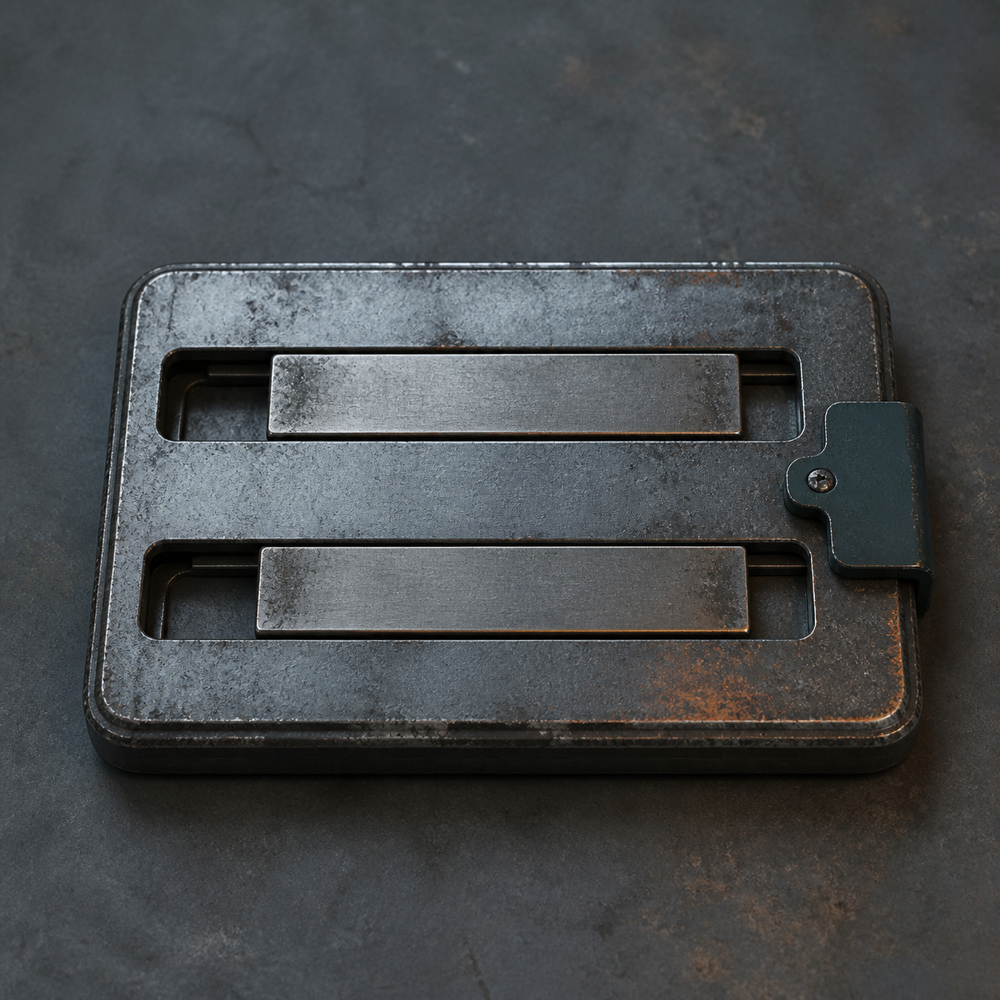

# 第 56 章 站长可以一天换四十七次

黑砖给出的六小时倒计时，还剩五小时四十七分。

侧线风里，陈序刚拿到那张“可返回，不所属”的回执，北区报码线便少了一声。

不是哪一路心跳停了。

是十七号阀旁那块写着“市政修理站”的旧铁牌暗了一角。紧接着，赵庆负责的二十八张长期工单同时褪去蓝边，其中三张供暖阀故障单滑进“普通维修点”一栏。

上一刻，四十七路才分别同意为陈序保留一次返程线路，没有认他做站长，也没有把自己交给他调度。白塔无法得到一个永久代表所有人的签名，便开始执行章末那条威胁：六小时后仍没有责任主体，就把404拆成四十七处互不相干的供暖维修点。

“普通维修点有什么区别？”货运帽女人问。

梁魁从北区回了一句：“只能修登记在自己阀门下的故障。不能调用公共地沟、主车间和跨区回水。”

这就是眼前最急的问题。

修理站一旦被拆，四十七路心跳或许都还在，八万件小事却会被切成四十七堆。谁脚下没有车床，谁就不能借主车间；哪条支管没有检修口，哪条就不能借公共地沟。城外黑烟一号的左膝返修和二十三份路线请求，更会因为跨区任务失去404的维修资格。

他们必须在倒计时结束前交出一个白塔能追责的主体，又不能让这个主体变成有权替四十七人作决定的站长。

陈序把回执卷到左手腕上，血很快从纸边洇出来：“它要的到底是负责人，还是所有人归一个人管？”

岳无缺从报码线另一端答道：“先分开试。”

北区主炉前，梁魁把自己的名字按到黑砖新翻出的“临时责任主体”栏，只写一项：十七号阀供暖检修，十息。

这是最小的单人总责短试。

名字刚落下，十七号阀旁的旧铁牌重新亮全。那三张滑走的工单也退回404。可同一瞬间，赵庆手边另外二十五张工单都把“现场决定人”改成梁魁；赵庆去摸女儿支管表壳的动作还没做完，阀门便提前转了半齿。

侧线两份路线请求也朝梁魁名下偏过去。

梁魁立刻抹掉名字。

旧铁牌再次暗下一角，二十五张工单恢复原来的决定人，赵庆亲手把提前转动的半齿退回去。侧线路线纸带也重新分开。

短试给出了两条证据。

第一，白塔只要看见一个可追责的名字，就会暂时保留修理站资格。第二，它会趁机把“出了事找谁”扩大成“所有事听谁”。若直接轮换四十七个站长，不过是一天吞并四十七次。

“那就别给它一个完整名字。”陈序说。

苏弥却摇头：“名字不完整，就不能追责。它会判定主体无效。”

她让梁魁翻查旧公交维修厂的纸质备件柜。黑砖不认口头承诺，但它刚才认了十息期限和一项具体故障，这说明责任栏并非只能填永久站长。问题不在有没有名字，而在名字之后缺少明确边界。

备件柜最底层压着一块巴掌大的旧钢牌。牌面没有文字，只有上下两道机械滑槽：上槽夹当前维修员的报码片，下槽夹具体故障片；右侧一枚暗青色止动扣，只有上一项故障回查完毕，才会弹开允许交接。

它叫轮值责任牌，用途很直白：记录“这一段时间、这一项故障出了问题该找谁”，不让值班人顺便接管其他人和整座站。

“先验货。”苏弥说。

梁魁把自己的报码片夹进上槽，把十七号阀那张刚退回的供暖检修单夹进下槽，只把止动扣压下一息。

黑砖立刻亮出两行回执。

【当前责任人：梁魁。】

【责任范围：十七号阀供暖检修。】

赵庆手边另外二十七张工单没有改名，侧线二十三份路线请求也没有移动。止动扣松开后，回执随即熄灭，没有留下永久归属。

轮值责任牌第一次启用便显出了效果：它确实能让一个名字承担一项眼前责任，同时把手伸不到别处。

但白塔没有接受完整方案。

【责任主体存在间断。】

【四十七处分布式索引，不得并列承担站点责任。】

【剩余时限：五小时三十一分。】

它允许一个人有限负责，却不允许责任在四十七个人之间移动。只要交接时空出一息，便能说404仍然没有主体；若四十七人同时压上名字，又会被解释成并列站长，把各自工单重新合并。

货运帽女人问：“怎么交接才没有空档，也没有两个人同时管？”

陈序看着那枚止动扣：“让上一位先对结果负责，下一位只对接下来的故障负责。两个人碰的是同一块牌，不是同一份权。”

总办法只有三步。

当前轮值者先把自己负责的故障做出一次可见回查；止动扣确认结果后弹开；下一位再自行决定是否接过责任牌，并写明新的期限和故障。任何人可以拒绝，拒绝时就由当前轮值者继续负责，不能被自动补录。

关键是交接那一刻。

他们仍用十七号阀做小试。梁魁负责阀柄回位，赵庆作为下一位，只准备接女儿那条支管的温度复核。

梁魁先转回刚才提前的半齿。阀门刻线与原位重合，赵庆女儿的支管表壳重新稳定在原温度。这个可见结果让责任牌右侧止动扣弹起一线。

赵庆没有马上接。

他先摸了摸女儿支管，确认热量没有下降，才把自己的报码片贴到上槽入口。梁魁的报码片尚未退出，赵庆的也没有进入；两片只在槽口机械相顶。

黑砖上，梁魁的名字仍亮着。

赵庆说：“接。”

他推进报码片，梁魁的旧片被同一条滑槽从另一端推出。两个名字没有同时落在牌内，责任也没有断开。新故障片随即写明“十七号支管温度复核，五息”。

旧铁牌暗掉的一角亮了回来。

更重要的是，梁魁名下没有多出赵庆的二十八张长期工单，赵庆也没有获得梁魁负责的公共回水权限。一个人退出，一人进入，各自只带走自己明确接下的那一项。

白塔试图把两次责任压成“站长轮换”。

苏弥把前后回执同时送进黑砖：梁魁的故障已经回查结束，赵庆的故障尚在执行；同一时刻只有一个当前责任人，且没有任何人拥有站点永久归属。

【连续责任：成立。】

【统一调度权：未生成。】

【固定站点归属：无。】

小试证明，责任可以连续，权力不必跟着连续。

接下来才轮到四十七路。

陈序没有替北区排班。梁魁把空白轮值表沿报码线传开，每一路自己写愿意承担的时间和故障；不愿接的人保持空白，当前轮值者便继续留在牌上。杜衡仍守着三个孩子，只接自己脚下供暖表的两次回查，不接城外联络。林杏只接表针与刻线核验，不获得转阀权限。赵庆则把女儿支管放在自己那一段最前面。

四十七份选择先后不同，范围也不同。

它们共同遵守的只有一条：交接前必须留下可见结果，下一位必须亲口确认，不能由白塔自动补人。

黑砖连续核对了第一轮七次交接。有人修正冻住的刻线，有人只确认桥板四角没有继续下沉，有人回查非必要温水清洗确实停满二十分钟。轮值责任牌每次都先弹扣、再换片；责任没有空一息，也没有出现两个名字。

第七次交接完成时，四十七路心跳仍各有快慢。

二十三份路线请求没有合并。一百一十七名乘员接收计数仍是零。八万件小事没有改成某一个人的总工单。

黑砖终于停止拆分旧铁牌。

【404修理站责任形式：连续轮值。】

【站点责任主体：当前持牌维修员。】

【责任边界：限时、限故障、交接须本人确认。】

【修理站类别：保留。】

六小时倒计时在五小时零九分处撤销。

北区公共地沟、主车间和跨区回水没有被切断。黑烟一号左膝返修与二十三份路线请求仍可留在404名下继续处理。陈序没有成为站长，保护性注销也没有结束；固定站点归属仍是无，他与404的关系仍是“可返回，不所属”。

代价却不是一块钢牌能抹掉的。

四十七人必须在原有供暖工作外再承担轮值、回查和交接。第一轮七次核验让主回水又降了零点零五度，非必要温水清洗多停十分钟。谁在牌里，谁就会被白塔精确追责，不能再靠“大家都负责”躲过去。

陈序左手的血已经浸透腕上回执，右肩麻意和掌心白霜都没退。黑烟一号左膝只完成过黑水改道，第二枚主销、缺角销孔、右臂座和缺三齿主轴仍旧坏着。陈默的余压囊仍然报废，活体舱门没有打开，三号返修回路保持三点七。

轮值表的第一行，梁魁本来要写自己的名字。

赵庆却把报码片先推了进去。

“十七号阀的短试是我的线。”他说，“第一轮我来。”

责任牌扣下。

白塔没有再改四十七人的工单，却立刻向当前持牌者送来一张红边追责单。

【第七轮清扫期间，404修理站擅自保留未登记人员维修资格。】

【当前责任人：赵庆。】

【到场说明时限：三十分钟。】

红边纸带下面，紧跟着赵庆女儿那条仍在供暖的支管编号。

白塔终于承认404可以没有站长。

然后它决定先找第一个轮值的人算账。

陈序把第一张轮值牌倒扣在地上，踩着它走过泵房门槛。红边追责单立刻从纸面爬到他的鞋底。

“我不替你担责，但我可以替你把它留在原处。”陈序说。

赵庆获得三十分钟说明窗口；陈序的右脚被责任牌锁住，下一场交接前不能离开。

---

## Metadata

- chapter_number: 56
- word_count: 3364
- generated_at: 2026-08-12 12:20
- upload_status: submitted_pending_review
