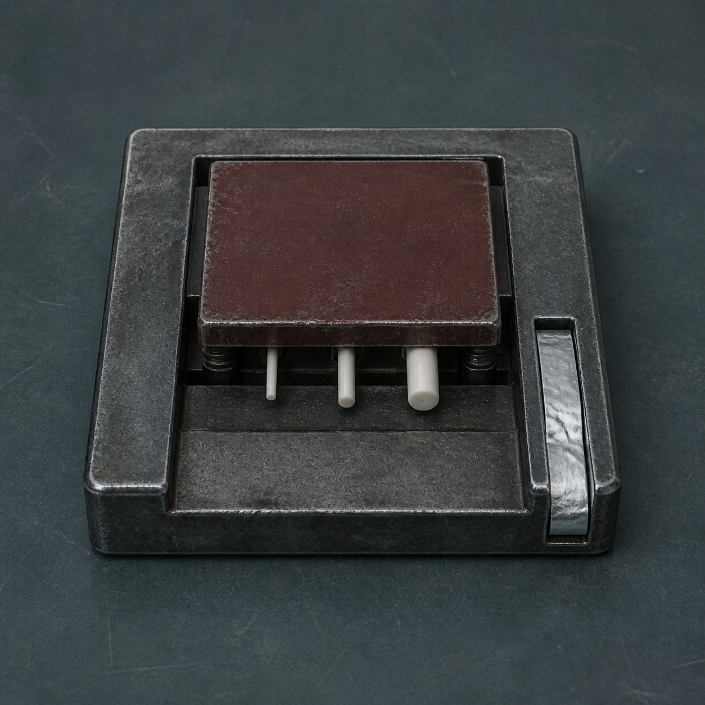

# 第 58 章 死人不能重复按手印

最后一份分项核验单从黑砖里滑出来时，北区四十七路报码声全停了。

纸上没有名字，没有阀门编号，只有一枚陈旧的红灰压痕。

它与二十年前陈默死亡登记背面的机械签名一模一样，还把第七轮清扫期间保留维修资格的原始担保，指向了一个早已注销的维修员。

白塔给出的处理时间只有十八分钟。

到时若不能说明压痕是谁、在什么时候、靠什么力量压上去的，四十七份分项核验会重新合并。刚保住的连续轮值也会被判成由同一个死人担保，赵庆等人的有限答复全都作废。

“先说最危险的误会。”苏弥用义指压住纸角，“压痕一样，只能证明它们接触过同一套机械签名结构。不能证明陈默在注销后亲手发过这张单。”

陈序看了眼三号返修回路的压力表。

三点七，没涨，也没掉。

陈默的活体舱仍封着，里面没有新的敲击。一个死人嫌疑很大，不等于死人已经招供。

赵庆问：“那怎么分？”

“查三件事。”陈序竖起冻出白霜的手指，“纸是什么时候进系统的，力从哪边压下来，压它的东西后来又碰过什么。时间、力、磨损，少一样都只能叫猜。”

梁魁从旧备件柜底拖出一只巴掌大的机械砧。它是深灰旧钢做的扁平方座，中央只有一块可上下浮动的暗红压板；压板下面嵌着三根不同粗细的白瓷测力针，侧面是一条能收卷软铅箔的窄槽。

这东西叫压痕回声砧，用途很直白：把旧压痕重新受一次很轻的力，再用三根测力针和软铅箔记下当初是从哪边、以多大偏斜压出来的。

它不能认人，只能认受力。旧纸太脆，复测也只能做一次。

苏弥没有把核验单直接塞进去。她先从赵庆刚用过的报码纸边角剪下一块，拿轮值责任牌的止动扣压出一道浅痕。

责任牌能让当前故障不断档，但止动扣本来不是签名器，只适合拿来做方向已知的短试。

她把浅痕朝上放在暗红压板下，只落下一格压力。

左侧细瓷针先沉，中央瓷针随后动了半格，右侧粗针不动。窄槽吐出一小片软铅箔，上面留下左深右浅的三道凹点。

梁魁把纸转过来再试，三针顺序立刻反了。

压痕回声砧第一次启用就显出了效果：它不需要知道是谁按的，只凭三针先后，便能分清压力从纸的正面还是背面落下，也能看出有没有侧向拖动。

“所以先测死亡登记？”赵庆问。

“先看纸。”苏弥说。

她把两张记录并排举到锅炉检修灯下。

二十年前的死亡登记是旧棉浆纸，纤维粗，折口已经发黄；新吐出的分项核验单却是白塔近年才换的盐膜纸，遇热会在边缘卷起一层透明薄膜。两种纸不可能在同一天进入同一台机器。

更关键的是，新单的红灰不在纸面上。

它被压进了盐膜下面。

梁魁用钝针挑起边缘，透明膜先起，红灰压痕仍留在底层纤维里。盐膜是在第七轮清扫前统一覆上的，压痕若来自今天，红灰只会落在膜外。

“这张担保不是刚生成的。”苏弥说，“它在覆膜前就被压进底纸，后来才被白塔翻出来。陈默今天有没有动作，这张纸证明不了。”

黑砖亮起一行反驳。

【历史担保可持续生效。】

【原始签名一致。】

白塔没有否认形成时间，只坚持同一签名可以一直担保。

倒计时还剩十三分钟。

现在最要紧的不是证明陈默无关，而是分清那枚签名当年由谁施力。若真是陈默本人按下，他们只能承认历史担保存在；若是机器自动重放，就不能把每次生效都算成死人的新命令。

苏弥把死亡登记背面那枚旧压痕放入回声砧，只给最小的一格力。

三根白瓷针几乎同时沉下，中央略深，软铅箔留下三个整齐圆点。

这是垂直落力。没有拖动，也没有左右偏斜。

陈序再把无编号核验单放进去。

左侧细针先沉，中央针晚了半拍，右侧粗针最后才动。吐出的铅箔上，三点从左向右逐个变浅，末端还有一道短短的回勾。

两枚压痕的外形一样，受力却不同。

死亡登记上的签名是正对纸面一次压下；无编号核验单上的痕迹则从左侧滑入，被某个横向回位结构拖着压完。

“人的手能按出第二种吗？”赵庆问。

“能。”苏弥没有替证据多说，“斜着推也能。所以它仍不能排除陈默，只能排除‘两张纸由同一次手工动作压成’。”

陈序盯住铅箔末端的回勾。

那道勾不是随机刮痕。黑砖每次吐纸，内部回位片都会在末端向右收一下；第十七号阀的旧报码机也有类似动作，只是方向相反。

梁魁拆开黑砖侧面的检修盖。里面没有签名模具，只有一条通往地下旧总排的机械拉线。拉线每次回收，都会带动一枚缺角拨片从左向右走完半圈。

“压痕是下面送上来的。”他说。

三号返修回路就在地下旧总排之后。

这让陈默看起来更像答案，也让他们更不能跳到答案。

陈序让梁魁先空拉一次机械线。缺角拨片走到末端，回位时在软铅箔上刮出同样的短勾，却没有形成红灰签名。

这说明横向回位力来自旧总排，但签名模具不在黑砖里。它可能在陈默的检修车上，也可能在更早的自动担保机构里，还可能只是零号炉芯留下的一段拒绝结构。

倒计时还剩九分钟。

白塔再次催促。

【担保来源未排除。】

【分项核验准备合并。】

“它说得还是对一半。”陈序活动了一下麻木的右肩，“我们没排除陈默。那就别回答‘是谁’，先回答‘这次是不是新命令’。”

最后一组证据在磨损上。

二十年前的死亡登记压痕，左下角完整，四边等深。无编号核验单的同一位置却缺了一小块，缺口里没有新鲜撕裂，只有被盐膜压平的旧纤维。

这说明签名结构在两次压印之间崩掉了一个角，而且崩角发生在盐膜覆盖以前。

梁魁从陈默检修车历年的纸带记录里抽出三条废样。第一条早于死亡登记，四角完整；第二条晚两年，左下角开始变浅；第七轮清扫前留下的最后一条，左下角已经完全缺失。

磨损顺序连上了。

同一枚机械模具先在死亡登记上留下完整压痕，后来崩角，又被横向拉线自动带过无编号核验单。它确实源自陈默用过的签名结构，但这次生效只证明旧模具被重放，不能证明陈默在注销后重新按下它。

赵庆听完，只问了一句：“那旧担保算不算他的？”

“算历史问题。”苏弥说，“他为什么留下模具，模具最初授权到什么范围，我们还不知道。可今天这四十七份追责，不能凭一次自动重放变成他的现行命令。”

他们没有尝试消掉担保。

总办法只有两步：把三组证据送进黑砖，先限制这枚压痕能证明的上限；再要求白塔保留无编号记录，转查原始模具与拉线来源，不许拿未知来源替四十七人统一作答。

赵庆提交纸张证据。

【压痕形成于盐膜覆盖前。】

苏弥提交受力证据。

【死亡登记：垂直手动落力。】

【无编号核验单：左向右机械回位落力。】

梁魁提交磨损证据。

【同源模具：死亡登记后崩失左下角。】

黑砖沉默了整整三息。

北区四十七路报码没有替陈默辩解，也没有替他认领。有人继续等自己的分项询问，有人把拒绝新增责任的报码片压得更紧。赵庆仍只守着十七号阀和丙七支管。

倒计时跳到最后一分钟时，黑砖终于吐出结论。

【压痕同源：确认。】

【注销后主动下令：证据不足。】

【本次生效方式：历史机械担保重放。】

【四十七份分项核验：维持。】

四十七路工单没有合并。

轮值责任牌的止动扣也没有替任何人自动弹开。它只让已经接下的故障继续有人负责；赵庆的维修资格仍处于分项复核中，女儿丙七支管的表针也仍停在十格半。

他们赢下的不是陈默无罪。

只是把“一个死人今天又下了命令”，改回了证据真正能承受的说法：二十年前用过的机械签名，还在旧系统里自动替某些人担保。

代价留在压痕回声砧上。

第二次正式复测结束时，最细的白瓷测力针从根部裂开。旧核验单的纤维也塌了一层，不能再承受下一次回声测试。这个工具以后还能测较厚的金属票片，却无法再安全复测同一张脆纸。

苏弥把两片软铅箔分别钉在纸卡上，没有写“陈默”，只写了形成时间与受力方向。

陈序左手的冻血在拿砧时又裂开一道细口，掌心白霜未退。他没管，顺着黑砖侧面的机械拉线往地下看。

拉线刚刚完成一次回位，按理已经停住。

可三号返修回路的压力表忽然从三点七落到三点六，又重新爬回三点七。

陈默的活体舱里没有敲击。

黑砖下方却传来一声很轻的金属崩裂。

梁魁从拉线槽里夹出半枚新断的模具角。

断面还带着温热的红灰。

二十年前那枚已经崩角的签名模具，刚才又在地下少了一块。

---

## Metadata

- chapter_number: 58
- word_count: 3113
- generated_at: 2026-08-12 17:10
- upload_status: not_uploaded
