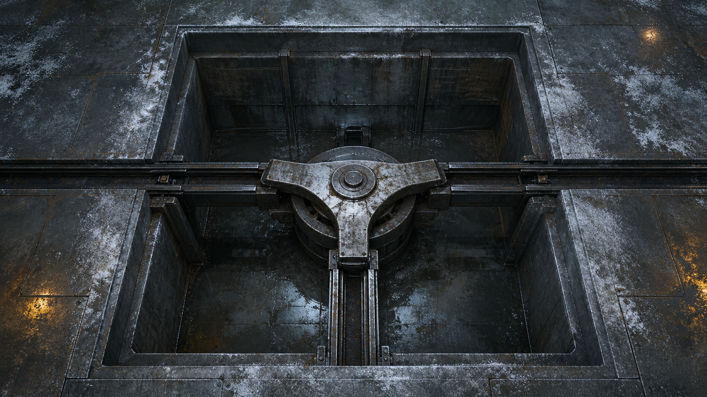

# 第 59 章 死人的担保也要分线路

半枚模具角还在梁魁的钳口里冒热气，三号返修回路的压力已经从三点六爬回三点七。

这一次，谁都没有去敲陈默的活体舱。

舱里没有回应，地下却刚有一股力量拉动旧签名模具。若把这股力直接算到陈默头上，白塔就能把四十七份分项核验重新挂回一个死人名下；若什么也不做，下一次拉动很可能把剩下的模具继续压进别的旧工单。

黑砖很快印出了后果。

【历史机械担保：持续可调用。】

【当前驱动力：待确认。】

【下一次回位预计：十一分钟。】

陈序把冻裂的左手藏进袖口：“它连谁在拉都不知道，先替人家预约了下一次按手印。服务挺周到，就是容易把死人服务活。”

苏弥没接他的笑。她用义指碰了碰断角，指腹上的薄霜立刻化成一粒水珠。

“热不是模具自己生的。”她说，“压力短降，断面发热，说明刚才有机械功从三号回路旁边经过。我们要找的不是谁，而是哪条结构拿走了这零点一的压力。”

这就是眼前的判断依据。

陈默没有敲击，只能说明没有可见的主动回答；压力变化与热断口却说明地下确实发生了受力。两件事不能互相替代。他们可以追一股力走过的线路，不能拿线路替幕后的人认罪。

梁魁沿黑砖下方的机械拉线掀开旧总排盖板。盖板下面不是一根直线，而是一口两人深的方井。井壁三面各伸出一道旧钢导轨：左路接黑砖吐纸机构，右路通向三号返修回路，向下的一路埋进二十年前的旧市政管网。中央是一只没有刻字的三叉拨盘，哪一路受力，拨盘就把那股力送往另一条已经挂着担保的线路。

旧图纸把这里叫地下担保分配井。用途很直白：它不产生命令，只负责把某条线路已有的机械担保，按拨盘位置转送给另一张待处理工单。

“也就是说，陈默以前留下的签名可能只是井里的一张通行证。”赵庆从报码线另一端问，“谁推拨盘，通行证就替谁开门？”

“只能先说到这里。”苏弥答，“井能转送旧担保，不等于它知道谁在推。拨盘后面也可能还有自动回位、积压压力或者别的线路。”

倒计时还剩九分钟。

直接拆井最快，却会让三条线路同时失去机械回位。黑砖会卡纸，三号返修回路可能掉压，埋在旧市政管网里的那一路更没人知道连着什么。陈序看了一圈，只从梁魁工具袋里抽出三根熔点不同的旧焊锡丝。

它们不是新设备，只是普通耗材：受热越多，表面越早发软，贴在导轨外侧就能标出哪一路先传来摩擦热。

“先验一小格。”陈序说，“不拦它，只看它从哪边进、往哪边出。”

梁魁在三条导轨外侧各压一根同样长的锡丝，又在三叉拨盘边缘撒上一圈冷红灰。红灰一受摩擦就会被拖出方向，作用也只有一个——把拨盘转动的先后留在井壁上。

苏弥追问：“失败会怎样？”

“锡丝全软，说明三路一起受力，我们来不及分。”陈序指向右侧压力表，“右路先软而压力低于三点五，就立刻松开测试扣，保陈默的供压。向下那路先动，谁也不伸手拦，先让它走完。”

他们不是在抓控制者，只做一次不阻断线路的方向短试。这样即使判断错，最坏也只是少掉一组温度标记，不会把活体舱的供压拿来换答案。

梁魁扣下井口测试杆，只压一格。

中央拨盘先向下沉了半齿。

向下导轨旁的低熔点锡丝立刻发暗，却没有软。紧接着，右路传来一下很轻的震动，三号返修回路从三点七降到三点六五。最后才是左路，黑砖吐出一截空白纸尾，纸上没有压痕。

梁魁松杆。

三条线路全部回位，压力恢复三点七。冷红灰却在拨盘边缘留下了一道清楚的折线：力从井下进入，先借右路压力越过卡点，再被送往左路吐纸机构。

地下担保分配井第一次被看清了作用。它确实没有凭空制造签名；井下某条旧线路先推拨盘，拨盘临时借走三号回路的一小段压力，最后才让黑砖重放历史担保。

“所以不是陈默在拉。”赵庆说。

“不。”陈序立即截住他，“只能说力先从井下进来。陈默的车在右路，不是这次的起点；可井下是谁、是不是自动机构、有没有借用他以前的授权，仍然不知道。”

白塔随即亮出新的核验栏。

【驱动力入口：旧市政下行线。】

【压力借用：三号返修回路。】

【担保输出：黑砖分项核验机构。】

【控制主体：未确认。】

第一轮短试把当前驱动力与陈默活体舱分开了，却也暴露出更急的问题。

向下导轨旁那根锡丝正在继续变暗。

测试杆已经松开，井下的力却没有停。拨盘下方传来第二次顶压，幅度比刚才大了一倍。三号返修回路随之跌到三点五八，又慢慢回升。

这不是短试留下的余动。下一次正式回位提前了。

黑砖把预计时间从十一分钟改成了三分钟。

若让它按原路径走完，四十七份分项核验里至少会再多一张无编号担保；若硬卡拨盘，右路压力可能被持续抽走，陈默活体舱没有余压囊，连十一息缓冲都没有。

“不能堵。”苏弥盯着压力表，“也不能让它落到任何人的工单上。”

陈序看向赵庆仍在轮值责任牌里的故障片。

那块旧钢牌能让一项故障始终有人负责，但只能管当前时间、当前故障，不能替谁接下历史总责。这次再用之前，陈序先把它的限制说清：止动扣只有在当前故障完成可见回查后才允许交接，任何人也不能被自动补录。

“那就给这股力一张只到井口的维修单。”陈序说。

总办法很简单：不伪造新的责任人，也不消除旧担保；只把即将被压印的目标，从四十七个人的历史工单换成分配井自身的机械故障。谁愿意接这三分钟的井口观察，谁只对“拨盘为什么提前回位”负责，旧签名就没有机会替他扩张责任范围。

赵庆没有退出当前轮值。他的资格仍在分项复核中，只能处理十七号阀与丙七支管。

梁魁也没有替别人决定。他把一张空白故障片塞进责任牌下槽，写明“地下担保分配井异常回位，三分钟，只观察，不拆除”，然后把自己的报码片抵在上槽入口。

“我接。”他说。

上一位轮值者完成十七号阀刻线回查，止动扣弹开。报码片同槽相顶，旧片从另一端退出，梁魁的片子才完全进入。责任没有空档，范围也没有碰到四十七份旧账。

拨盘第三次顶起。

井下力量推向右路时，三号返修回路降到三点五二。陈默活体舱的维持线抖了一下，苏弥的义指已经按住松脱扣，只要再掉零点零二，她就会终止方案。

陈序把新故障片接到黑砖吐纸口。

“现成的担保想找活干，是吧？”他说，“这里正好有一口坏井。先担保它别乱给死人加班。”

他说的不是让白塔相信一个凭空的谎言。分配井确实正在异常回位，梁魁也确实自愿承担三分钟观察；旧签名本来只能沿机械线路转送，眼前这张故障片正是最近、最具体的可用目标。

拨盘越过卡点。

温热红灰从井下被拖上来，在故障片背面压出一枚又缺了一角的旧签名。黑砖震了两次，没有把它送进任何人的分项核验，而是把回执落在井口。

【历史机械担保：用于地下担保分配井故障。】

【责任观察人：梁魁。】

【范围：三分钟，不含历史授权确认。】

四十七份工单没有合并。

三号返修回路也从三点五二回到三点七，活体舱维持线恢复原来的微弱间隔。陈默没有因此被证明无关，更没有被证明在主动配合。

梁魁付出的三分钟却不能抹掉。他必须守在井口完成回查，北区主车间少了一个能搬动重件的人；十七号阀下一次交接延后，非必要温水清洗又暂停十分钟，丙七支管仍只停在十格半。

那三根锡丝也全废了。向下的一根软成弯钩，右路的一根表面起皱，左路的一根被吐纸齿割断。它们只证明了这一次受力顺序，不能当成永久监测器。

更重要的是，井下入口终于有了可追的方向。

梁魁把软成弯钩的锡丝贴到旧市政管网图上。下行线没有通往零号炉芯，而是折向旧公交维修厂更深处，终点标着一间早已封死的档案泵房。

苏弥从井底红灰里夹出一小片不属于签名模具的东西。

那是一块被油浸黑的纸标签，只剩半行尚能辨认的字。

“担保调用上限：四十……”

后面的数字被整齐剪掉了。

四十七份分项核验还在原位。

可他们直到这时才知道，二十年前留下的旧担保也许从来不是无限重放。有人把它的上限剪走，又把剩余次数藏进了封死的档案泵房。

---

## Metadata

- chapter_number: 59
- word_count: 3045
- generated_at: 2026-08-12 18:20
- upload_status: submitted_pending_review