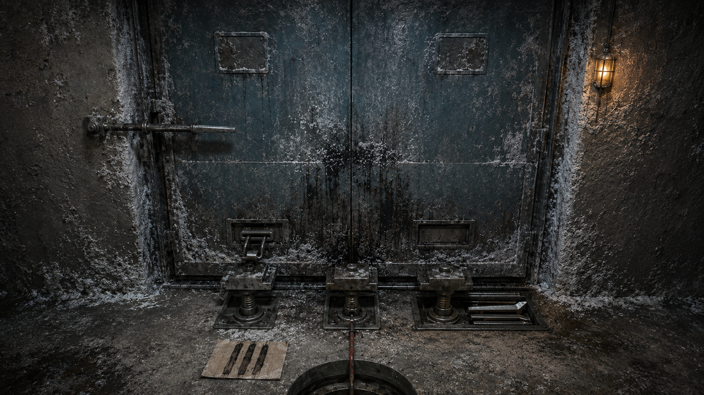

# 第 60 章 四十后面不能替死人补数

油浸标签上的“担保调用上限：四十……”还没干，档案泵房那扇封死的铁门里先响了一声。

咔。

像有一枚看不见的棘爪，往前走了一格。

地下担保分配井随即轻轻顶动。三号返修回路仍是三点七，黑砖也没有吐纸，可井下那道旧市政下行线已经绷紧。

梁魁的三分钟观察还剩四十七秒。他守在井口，没有伸手去拦，只把轮值责任牌上的故障片按牢。

这块牌只能让眼前一项故障始终有人回查，不能替他接下二十年前的授权。倒计时结束前若泵房再推一次拨盘，他必须先报告现象，不能把未知动作算成自己的责任。

“门里在计数。”苏弥说。

眼前最急的不是把铁门砸开。

标签只剩“担保调用上限：四十……”，后半截被人整齐剪走。若白塔先把四十七份分项核验与这半行字拼在一起，就可能把残缺上限自动补成四十七，再把每一份旧工单都算作一次有效调用。那样一来，他们刚保住的分项边界会反过来成为白塔补数的依据。

黑砖果然亮起灰字。

【待补全字段：担保调用上限。】

【关联记录数量：四十七。】

【建议回填：四十七。】

陈序用冻裂的左手盖住确认槽：“建议得很好。下次死人缺个年龄，你是不是准备按墓碑数量给他续寿？”

苏弥没有让任何人否认“四十七”。否认也需要证据，而他们现在只有半张标签和门里的一声棘响。

“先分清两件事。”她把纸卡立在检修灯下，“完整上限是多少，已经用掉多少次。上限写在被剪掉的纸上；剩余次数只能从机器当前的位置找。两者谁也不能替谁。”

梁魁的观察倒计时归零。

井下没有第二次推力。轮值责任牌右侧止动扣弹开，黑砖回执只确认了三分钟内一次空行程预备，没有新增担保输出。梁魁完成回查后才退出上槽，主车间仍少掉的那三分钟和延后的十七号阀交接都没有因此补回来。

他们沿下行线走到旧公交维修厂最深处。

档案泵房夹在地下油库和废弃回水墙之间，过去用机械压力把纸质维修记录送往各区档案柜。用途并不神秘：哪一份旧授权被调用，泵房就推动对应纸卷走一格，同时在机械计数结构上留下位置。它只能记录调用动作，不能证明是谁下令。

门是双层旧钢，外层焊缝已经结满盐霜。门轴侧没有锁孔，只有一根从墙里伸出的扁平拉杆。拉杆被锯断一半，断口与油浸标签的剪口一样平直。

陈序没有立刻碰它。

门下积尘里有四种痕迹：向外喷出的黑油点，反复被纸边扫过的半月形浅槽，三枚不同深度的方形压脚印，以及一条刚出现不久的红灰细线。

红灰线从门内穿出，接向地下担保分配井。

“泵房最近动过。”梁魁说。

“只能证明里面有东西动。”苏弥纠正，“先看它怎么动。”

直接拉断杆可能开门，也可能让里面的计数结构跳到下一格。白塔正在等一个可回填的数字，他们不能为了看清账本，亲手制造一次新的调用记录。

总办法只有三步。

先在门外复现一次不带授权的纸张输送，看断杆控制的是开门还是计数；再用门下积尘与压脚磨损判断计数结构有没有回零；最后才决定是否进门。任何一步触发下行线受力，就立即松开，不拿三号返修回路和陈默的活体舱冒险。

梁魁找来一截普通废报码纸，从墙边还活着的手摇送纸槽塞进去。

这不是新道具，只是泵房原有的维护入口。摇柄转一圈，能把测试纸送过门缝，却不会给纸附上签名或担保。

他只摇了半圈。

废纸从门下露出两指，门内传来纸卷摩擦声。三枚方形压脚中，最左边那枚抬起一线，扁平拉杆却没有动；地下下行线也没有绷紧。

这说明送纸与担保调用不是同一套动作。

再摇半圈，废纸完整吐出。纸上只有三道平行油痕，没有红灰压印。最左压脚落回原坑，另外两枚始终没动。

梁魁把纸翻过来：“左脚管送纸，不管调用。”

门内随即又响了一声咔哒。

这次中间压脚自行抬起。红灰细线绷直，分配井方向传来半齿预动，三号回路从三点七降到三点六八。

苏弥立刻压下墙边泄力片。

中间压脚落回，红灰线松开，压力恢复三点七。黑砖没有吐出新工单。

第二次现象把区别摆得更清楚：左脚只送纸，中间压脚才连接担保调用；它可以在无人摇柄时自行预动。控制它的主体仍不知道，但至少不能把刚才那张废纸算成一次调用。

“第三只脚呢？”陈序问。

梁魁刮开右侧压脚边缘的盐垢。

三只压脚本应沿同一条直线起落，右脚却比另外两只低了半指。它下面不是新压出的方坑，而是一圈圈套叠的旧磨痕，最深处有一道横向卡口。卡口里嵌着四片薄钢垫，每片厚度不同，最上面一片边缘刚断。

苏弥用纸卡量过四片垫片的高度，又对照中间压脚刚才抬起的距离。

右脚不是第三种动力。

它是调用余量的机械挡位：每完成若干次担保输出，薄钢垫就被横向推出一片，压脚随之下沉；所有垫片退完，右脚会落进最深卡口，机械线路便无法继续推送旧签名。

这个基础作用必须先说清。它只能显示机器还剩几段可走，不能从现有四片垫片反推出最初总上限，也不能证明每片对应多少次。

陈序蹲下看了看：“换句话说，我们找到了油箱表，没找到油箱出厂多大。白塔拿路上见过四十七辆车来补容量，属于很有管理精神的猜。”

黑砖的建议回填仍停在四十七，却没有落定。

他们还需要证明右脚从未回零。若有人后来更换过垫片，眼前位置就不能代表二十年前那套上限的剩余量。

证据在磨损顺序上。

最底层钢垫表面已经被盐油磨成暗黑色，第二片只有靠卡口一侧发亮，第三片边缘保留旧红灰，最上层断片的断口则是新鲜银白。四片由下到上的老化程度连续，没有哪一片比下面更新；压脚侧面的竖向划痕也从最高位一路连到当前高度，中间没有突然抬高后重新下落的断层。

“至少这四片不是后来塞回去的。”苏弥说，“当前结构从更高位置一路磨到这里，没有回零证据。”

“那还剩多少次？”赵庆从报码线问。

“不能报次数。”苏弥答，“一片可能挡一次，也可能挡十次。我们只知道机器还有四段机械余量，且最上面一段已经断裂。完整上限仍在被剪掉的标签上。”

白塔立刻抓住了这点。

【单段调用次数：未知。】

【建议以关联记录数量补全。】

【建议回填倒计时：六分钟。】

它准备绕过总上限，直接把四十七份分项记录当成已调用次数。

这一次，陈序没有跟它争数字。

“你要补四十七，可以。”他把废报码纸重新压到黑砖前，“先告诉我哪一份对应哪一道磨痕。”

四十七份分项核验各有不同的阀门与时间。机械压脚却只留下连续下沉，没有四十七道独立落点。白塔若坚持一份等于一次，就必须把每份记录与一次可见机械位移对应起来；对应不上，四十七只能说明现在有四十七份问题，不能说明机器历史上调用了四十七次。

岳无缺从北区接入审判报码：“缺失字段可以暂缓，不得用关联对象数量替代机械计数。二者不是同一证据。”

白塔没有接受结论，先启动了一次强制复核。

中间压脚再次抬起。

这次右脚最上层那片断垫同时向外滑。只要它完全退出，未知担保就会真正走完一段余量。红灰线迅速绷直，三号返修回路从三点七落到三点六一，陈默活体舱的维持线开始发抖。

硬卡中间压脚，会让压力继续抽向断垫；拉开右脚，则可能替机器完成一次换挡。

陈序看向刚才吐出的废报码纸。

它已经证明自己只走送纸线路，不带授权。

“让它记一次没担保的维护空转。”他说。

梁魁听懂了。他把废纸重新送入左脚通道，却不摇送纸柄，只让纸头停在中间压脚与红灰签名之间。这样做不是伪造调用：泵房确实正在复核自身计数故障，纸也确实没有任何人的签名。若机械结构一定要落下一次，它最近的真实对象只能是“余量压脚异常下沉”，不能是四十七份历史工单。

苏弥追问：“限制？”

“只许记录这次空转，不许补总上限，不许对应任何人。”陈序说，“压力低到三点五九就泄掉，宁可让门继续封着。”

梁魁松开半格泄力片。

中间压脚落下。

红灰印没有穿过废纸，只在背面留下半枚空心方框。右脚断垫向外滑了半寸，随即被废纸边缘顶住。黑砖连续震动，最终吐出一张窄回执。

【调用对象：档案泵房余量计数故障。】

【担保输出：未完成。】

【机械余量：四段，其中一段损坏。】

【完整调用上限：不得由关联记录数量补全。】

三号返修回路在三点六停住两息，随后恢复三点七。陈默活体舱没有敲击，维持线也回到原来的微弱间隔。

四十七份分项核验仍各自独立。

他们没有得到一个漂亮的完整数字，却把错误答案挡住了：标签上的“四十”不能自动补成四十七，眼前四片垫片也只能证明四段机械余量，不能证明还剩四次。

代价同样落在机器上。

最上层断垫被废纸顶弯，已经无法再承受完整行程；下一次强制调用若仍落在这一段，右脚可能直接越过卡口。梁魁拆下墙边泄力片后，发现片簧也裂了一道口，泵房最多只能再安全中止一次同等级预动。

陈序左手的冻血浸透袖口，右肩麻意没有退。北区非必要温水清洗仍暂停，十七号阀交接仍在延后，丙七支管仍是十格半。报废的三根焊锡丝没有恢复，陈默的余压囊也依旧不能提供十一息缓冲。

铁门仍没开。

可那张被夹在压脚间的废纸，被门内的旧纸卷慢慢拖进去一截。纸边带出一小块黏在卷轴上的黑色背衬。

背衬上没有上限数字。

只有一行比二十年前更早的维护刻记：

【每次调用，须有一名在册维修员留在泵房。】

陈默的名字没有出现。

泵房深处，却有一只已经停了二十年的机械报码器，在这行字露出来后，轻轻敲了两下。

---

## Metadata

- chapter_number: 60
- word_count: 3180
- generated_at: 2026-08-13 23:00
- upload_status: submitted_pending_review