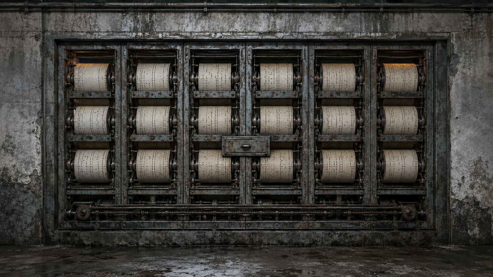

# 第 62 章 迟到二十年的下班报码

城西方向那一下敲击没有消失。

它沿细回线一节节向档案泵房靠近，每过一道管夹，墙里的旧钢丝就绷响一次。

机械报码器的两支锤臂还停在原位。左锤负责把泵房踏板的入位动作送出去，右锤只负责接收远端档案柜的回声；它能认踏板、发条和回线，不能认人，更不能用一声回响证明谁还活着。

现在，右锤旁的回线每收紧一寸，中间压脚就跟着抬高一线。

墙边泄力片簧已经彻底崩断。若那声报码原样抵达，众人再没有安全中止的办法。最坏的结果不只是旧担保重新调用——第六值守位那枚只打到一半的交接孔，也可能被回程冲头补穿，让白塔把“准备交给陈默”改写成“陈默已经接收”。

黑砖果然先亮出灰字。

【第六值守位：退位报码回程中。】

【交接接收人：陈默。】

【建议在报码抵达后补全交接状态。】

陈序用麻到指尖的右手压住确认槽：“人家下班晚了二十年，你先替接班的人补签。白塔的考勤，主要功能是让活人和死人都没法请假。”

苏弥把纸卡贴到回线外壳上。卡角随着每次绷响向泵房偏一下，说明力确实在朝他们这边走。

“先别叫它退位。”她说，“我们只听见一声，也只看见回线回收。它可能是二十年前的旧纸带，也可能是刚刚被别处伪造的新动作。要阻止补孔，必须在它进泵房前看见原始纸带。”

眼前的问题因此有了边界。

他们不是去证明谁在二十年前活着离开，只要回答三件事：这张退位记录是什么时候打出的，从哪一格出来，是否真的跨过了陈默那枚未完成的交接孔。

若三件事缺一项，结论就只能停在“未知回声”。

梁魁顺着细回线刮开墙上的旧漆。每隔六码，钢管外都有一道向城西的小箭头。箭头尽头不是街面，而是一条埋在旧公交维修厂地沟下方的档案回收槽。众人沿槽走了不到四十步，墙体向西凹进去，露出一整面被盐霜封住的铁柜。

这就是城西旧档案柜。

它不在城西街面，而是城西各区档案回线汇入旧维修厂地下的总柜。它也不是一只普通文件柜，而是一座嵌在墙里的横向机械档案站：六列窄柜从左到右排开，每列各有入位卷、退位卷和交接卷三层纸轴，所有纸轴通过底部回线与泵房相连。哪一格收到报码，就把对应纸带走一孔；柜子只保存动作先后，不会识别动作是谁做的。

柜门中央有一只巴掌宽的扁抽屉，旧铭牌只剩“回程校对”四个字。

回程校对抽屉的用途也很直白：它不生成报码，只在回线进入泵房前，把正在返回的原始纸带摊平一小段，让值守员核对孔位。抽屉推回去，纸带才继续走。

“现在拉开，就能看见？”梁魁问。

“也可能把它直接送走。”苏弥指向抽屉侧边两道擦痕，“先验抽屉和交接冲头是不是同一根轴。”

陈序没有拿原始纸带试。他从工具袋里撕下一截普通废报码纸，剪出一枚未穿透的半孔，塞进第六列交接卷的维护口。废纸没有名字，也不接任何担保，只用来观察抽屉动作会不会把半孔补穿。

梁魁把抽屉拉开半指。

废纸向外移了半寸，半孔没有变。可抽屉推回时，柜内一根横向冲头立刻压下，半孔边缘多出一道新月形凹痕。

他马上停手。

错误答案已经有了可见后果：拉开抽屉只负责摊纸，推回却会把校对过的纸带送过交接冲头。若他们像正常维修那样完整开合，陈默后面的半孔真可能被机器补穿。

“所以只拉，不推。”陈序说。

苏弥摇头：“纸带会停在柜里，右锤收不到退位，泵房会继续把第六格当成未注销。我们还得让它走，但要先把三卷纸分开。”

总办法只有三步。

先半拉抽屉，看退位卷本身的纸张和孔边；再用冷红灰辨认它从哪一层、朝哪个方向进入；最后让入位、退位和交接三卷各走自己的维护槽，不让退位纸穿过交接冲头。若任一卷被同一冲头带动，梁魁就放手让抽屉停住，宁可保留故障，也不替二十年前补手续。

“代价呢？”苏弥问。

陈序看向抽屉底部。三条维护槽的分隔舌已经锈成一片，只能靠一枚薄钢卡簧撑开。

“分开一次，卡簧多半会断。”他说，“之后三卷再回程，就可能叠到一起。我们只够验这一张。”

这不是漂亮答案，却是当前唯一不会先改坏证据的办法。

梁魁在第六列三层卷轴的出口各撒一小撮冷红灰，又把一张无字维护纸垫在抽屉底下。陈序用左手钳住薄钢卡簧，冻血刚凝住的袖口又被柜角磨开。苏弥盯住三号返修回路的远端表盘。

“三点五九是底线。”她说，“再掉就停。陈默没有余压囊。”

梁魁缓缓拉开校对抽屉。

第一寸出来的是泛黄退位纸。纸面压着二十年前的厚盐膜，盐膜在一枚方形孔上完整下陷，孔缘却没有新鲜纸毛。

苏弥先用义指挑起一粒盐壳。壳下面的孔边已经被旧油浸成深褐色，说明孔形成在盐膜覆盖之前，不是刚才有人新打的。

这是一张旧纸带。

第二寸露出纸背。冷红灰从第六列中层退位卷向底部回线拖出一道长痕，方向朝泵房；上层入位卷只有旧灰，没有这次摩擦的新亮线。

它也确实来自第六值守位的退位层，不是另一格刚发出的单声报码。

可第三寸被卡住了。

退位纸的前端折在交接卷下方，正好勾住那枚写有“交接接收人：陈默”的半孔。二十年前，退位纸已经打孔，却没有越过这处折角；交接卷只走了半程，横向冲头便停住，结果一张纸回不了泵房，一张纸也没完成交接。

直到刚才旧发条重放入位，城西柜重新收紧回线，折了二十年的纸角才从锈槽里松出来。

苏弥没有立刻去撬纸角。

她先从第一列已经注销的旧退位卷上取下一粒自然脱落的盐壳，放在检修灯下和第六列对照。第一列的盐晶从纸面一直长进孔壁，说明纸带打孔后才在柜里受潮结盐；第六列也一样。若这一孔是今天才补出的，孔壁应该露出浅色新纤维，不会连里面都浸着陈油。

梁魁又把一根细铜片贴到第六列底轴。退位卷绷紧时，铜片先被向泵房方向刮响；交接卷随后只移动了不到半孔，便被自己的锈槽卡住。两道动作一前一后，没有共用一次完整行程。

证据因此又多了一层。

他们看见的不是一张刚被伪造、准备替谁完成交接的新纸，而是一张早已打好孔、曾经开始回程，却在柜内被别的半程纸卷压住的旧退位记录。

陈序隔着抽屉看父亲的名字。那几个字离完整孔只差一层脆纸，近得像只要手稳一点，就能替二十年前把答案按下去。

他的钳口却往后退了半寸。

“差一点也是没做完。”他说，“我爸要是真接了，让记录自己拿出完整孔。别让我替他补作业。”

赵庆那头安静了一息，随后把十七号阀的报码线从总线上再分开一格。他没有权限碰档案柜，只能保证白塔若强行合并记录，不会顺手把他的当前轮值也拖进来。

“这边仍只认十七号阀和丙七支管。”他说，“二十年前谁交班，不从我这条线补人。”

这不是多余的声明。四十七份分项核验还挂在黑砖后方，任何一条当前线路若接受“陈默完成接收”，白塔都可能把它当成旧担保继续有效的旁证。

“所以退位发生在交接之后？”赵庆的声音从报码线传来。

“不能这样排。”苏弥立刻回答，“我们只知道退位孔早在盐膜前形成，随后被半程交接卷压住。交接申请可能先放进柜里，也可能后来压到它上面。纸叠在一起，只能证明两项都没走完，不能证明谁先做、谁替谁做。”

陈序盯着那枚半孔：“更不能证明我爸接了班。”

白塔却已经开始催动回线。

【历史退位记录：存在。】

【交接对象：陈默。】

【建议合并为：陈默完成接收后退位。】

柜底齿轮转过半齿。退位纸往前一拽，交接卷也跟着滑向横向冲头。三号返修回路从三点七降到三点六四。

黑砖后方，四十七张窄纸同时向前探出一线。

白塔不是在等他们同意。它准备把“历史退位存在”“接收栏写着陈默”与“当前仍有分项核验”三件各自真实的事，压成一条最省事的完整记录。一旦横向冲头落下，陈默就会被补成二十年前的接班人，四十七份核验也会重新获得同一名历史担保者。

中间压脚隔着墙传来一声空撞。

没有泄力片簧替他们兜底了。

如果什么都不做，白塔的“建议”会被机械动作补成事实；若硬扯退位纸，脆纸会从旧孔处断开，唯一能证明年代和来源的原件也会毁掉。

陈序把垫在抽屉下的无字维护纸折成三道窄槽，分别托住入位、退位和交接卷。

这个办法可能有效，是因为校对抽屉刚才已经证明：拉出只摊纸，真正补孔发生在推回后的横向冲头。只要三卷各自进入维护槽，退位卷可以沿底部回线继续向泵房，交接卷却会停在自己的半孔位置，不再被它拖过冲头。

限制同样清楚。无字纸只能撑过一次走纸，薄钢卡簧一断，三层卷轴以后就没有现成的分隔结构。

“让真实的退位回去。”陈序说，“没完成的交接，继续没完成。”

梁魁压住抽屉，不再推回。陈序用钳口把卡簧向外拧了半线。

咔嚓。

锈死的三条分隔舌第一次张开。入位卷停在上槽，退位卷沿中槽进入底部回线，交接卷则被下槽托在那枚半孔前。只有退位纸继续向泵房滑动。

那枚薄钢卡簧随即断成两截。

三号返修回路降到三点六，停了一息，又缓慢回到三点七。陈默活体舱维持线没有敲击，也没有出现能被解释为配合的变化。

城西旧档案柜吐出三张窄回执。

【第六值守位原始入位：未注销记录保留。】

【第六值守位历史退位：已于二十年前形成，回程曾中断，现重新上路。】

【交接接收人陈默：完成孔未穿透，不得补全。】

三张纸分开落下，谁也没有替谁多走一孔。

赵庆立即回查十七号阀。阀位没动，丙七支管表针仍停在十格半；梁魁再看泵房方向，中间压脚已经回落，右脚下面三段余量没有新增位移。最后是苏弥确认三号表回到三点七，活体舱维持线仍按原来的微弱间隔起伏。

行动的结果不只写在回执上。当前工单、机械余量与陈默供压三处都没有被这次分卷偷改。

黑砖上的“建议合并”熄灭。当前值守仍是无新入位，担保输出仍然中止；四十七份分项核验没有合并，陈默也没有被补成第六值守位的接收人。

他们得到的结果很有限，却足够真实。

二十年前确实有人或某种机械动作打出过第六值守位的退位孔；那张纸没能回到泵房，今天才因旧线路重启重新上路。它不能证明打孔者的身份，不能证明原留守者当时是否活着，也不能证明陈默完成过交接。

代价落在城西柜里。

三层卷轴之间唯一还能撑开的卡簧已经断了。下一份入位、退位或交接记录若再返回，很可能叠到同一只冲头下；陈序左袖的冻血又深了一圈，右肩仍麻到指尖。北区十七号阀交接、非必要温水清洗和丙七支管十格半都没有恢复，陈默的余压囊、三根焊锡丝与泵房泄力片簧也仍是报废状态。

更麻烦的是，那张退位纸已经离开城西柜。

它正沿底部回线向档案泵房前进。那里只剩三段未知机械余量，也没有第二次安全中止的机会。

梁魁把断掉的卡簧从盐垢里夹出来时，下面露出一小段此前被挡住的纸边。

纸边没有姓名。

只有一行给下一班值守员看的旧维护提示：

【退位报码抵达后，先核对留守代价，再释放第六位。】

“留守代价”后面的内容，被同一把剪过姓名栏和调用上限的刀整齐裁走了。

---

## Metadata

- chapter_number: 62
- word_count: 3685
- generated_at: 2026-08-14 13:13
- upload_status: submitted_pending_review