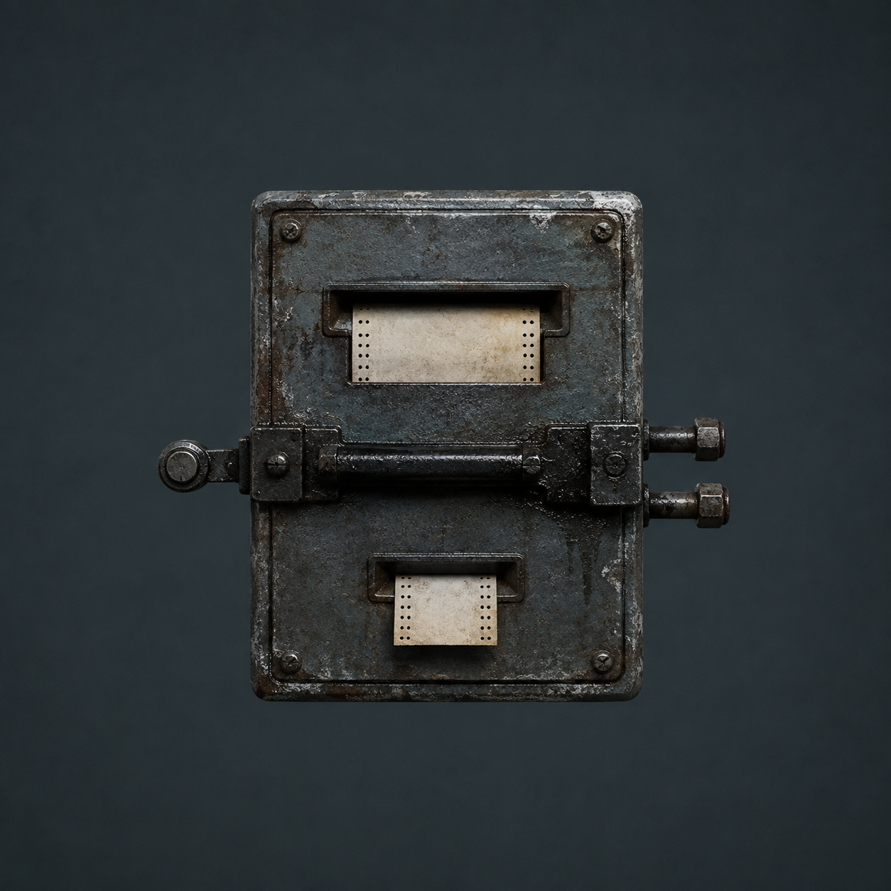

# 第 63 章 下班之前先找个活人接班

退位报码撞进档案泵房右锤时，没有敲出声音。

那支专门接收远端回声的机械锤臂只往下沉了半寸，便被一根从墙里探出的黑钢舌托住。紧接着，铁门右侧弹开一只长方形旧钢匣，泵房中间压脚随之抬起一线。

三号返修回路从三点七落到三点六八。

墙边泄力片簧已经报废。若中间压脚继续上抬，他们没有第二种办法安全卸掉这股力。右压脚下面只剩三段机械余量，每一段能承受多少次仍不知道；陈默活体舱也没有余压囊替他多撑十一息。

“先别推回报码。”苏弥按住右锤，“它已经到泵房了，但第六位还没有释放。”

陈序看向弹出的钢匣。匣门上没有字，只有上下一进一出两道窄纸口，中间横着一根烧黑的平衡杆。平衡杆左端接泵房值守踏板，右端分出两根细管：一根通向右压脚，另一根并进三号返修回路。

这东西叫留守结算匣。

用途很直白：退位报码到达后，它先预演“旧值守离开到下一名值守接上”之间的空档由谁承担，再决定能不能释放原来的值守位置。上口吃进退位纸，下口吐出代价回执；它能看线路和机械动作，不能识别人，也不能替谁同意接班。

眼前最急的问题不是被剪掉的代价究竟有多大，而是这只匣子现在准备从哪条线扣。

若它从右压脚扣，三段未知余量会再少一段；若它从三号回路扣，陈默的活体舱会失压；若它把“交接接收人：陈默”后面那枚半孔当成有效接班，白塔就能用一次机械动作替父亲补完二十年前没做完的选择。

黑砖已经给出了最省事的建议。

【第六值守位退位报码：已抵达。】

【交接接收人：陈默。】

【建议由接收人承担留守空档。】

建议下方，一道没有写明时长的灰色刻线开始收短。

右锤已经把退位纸咬进半寸。刻线若先归零，结算匣会把纸退回城西，并把第六位重新压回“未注销”。那不等于什么都没发生：中间压脚已经被退位动作抬起，旧记录一旦回退，它就会把这次往返当成新的值守故障，再去寻找一条有压力的线路承担。陈默的三号回路仍是最近的一条。

灰线还没立刻归零，但完整时长未知，他们只能做随时可抽回维护纸的短试。

陈序用冻血发硬的左袖擦掉确认槽上的盐霜：“半个孔也算签收，照这个算法，我把欠条撕一半，应该只欠你一半。”

“别跟它争人名。”苏弥把纸卡插到平衡杆下方，“先看没有完成交接时，结算匣会选哪条线。”

直接放进原始退位纸，会启动释放。为免先改坏证据，梁魁从左压脚维护槽取了一张普通无字纸，照第六位退位孔的位置压出一枚浅凹，却不打穿。维护纸没有名字，也没有担保，只能让结算匣预演一次线路选择。

总办法分三步。

先用浅凹纸确认结算匣是否把半孔当成接班、平衡杆会先朝哪条线走；再轻压本地踏板，看真实值守能否截住它；最后只有在一名在册维修员真实留在泵房、责任范围和时间都写清后，才让原始退位纸通过。

任何一步使三号回路低于三点五九，就停止释放，让第六位继续保留为历史故障。不能为了让一张旧纸下班，把一个仍在呼吸的人顶上去。

梁魁把浅凹纸送进入口。

留守结算匣立刻有了可见效果。

中央平衡杆没有倒向踏板。它先朝右压脚偏了一线，发现三段钢垫没有对应的接班动作，又继续向三号回路一侧倾斜。右侧细管吐出一滴温热黑油，三号表从三点六八降到三点六六。

苏弥立即把浅凹纸抽回。

平衡杆复位，三号表回到三点六八。

这一小试说明了两件事。半孔没有被结算匣承认为完成交接，所以它没有选中陈默这个名字；可在没有新值守时，它会拿当前仍有压力的回程线填补空档。三号回路恰好是最近的活线，陈默会受损不是因为他同意接班，只是因为他的维持压力离机器最近。

“它不认人，倒很会挑还喘气的管子。”梁魁说。

白塔把建议改了一行。

【空档代价可由当前有效回程线承担。】

“有效不等于自愿。”苏弥说，“而且这只证明会从哪里扣，还不知道扣多久。”

黑砖又把右压脚列成备用方案。

【可改由机械余量承担。】

右压脚下三段钢垫同时传出一下轻响，最上面那段向卡口外探出不到一线。陈序没有碰它，只把浅凹纸继续往外抽。钢垫立刻停住，却没有完全回到原磨痕里。

这条路看似不伤人，实际更不清楚。三段只是机械上还能走的三个位置，一段对应一次、十次还是整段值守都没有证据；结算匣若把一个未知时长的空档全压上去，可能只磨一线，也可能连续吃光三段。更何况泄力片簧已经崩断，一旦钢垫真正越过卡口，他们连安全停下的机会都没有。

“活线不能替人同意，机械余量也不能替我们假装无限。”陈序把备用方案压在纸卡下面，“先找能自己说愿意的人。”

陈序蹲到结算匣前，检查浅凹纸背面。纸上没有数字，只有一条从入口延伸到出口的短划痕。划痕在中央停住，说明这次只是预演，没有完成退位，也没有把三段余量推走。

第二项证据在踏板上。

机械报码器的左锤负责把泵房踏板的入位动作送往城西，右锤只接收远端回声；两下是一发一收，不能拿回声证明人还活着。如今右锤已经收到历史退位，左锤却没有新入位。若有人真实站上踏板，结算匣应当先认本地重量，而不是去抽远端活线。

陈序踩不了。

他的保护性注销仍在，固定站点归属为无，不是在册值守员；就算强踩，机器也只会得到一个没有资格的重量。赵庆在北区，当前资格又只限十七号阀和丙七支管，不能被一根报码线越权拉来。

报码线上先后响起三声短回敲。

第一声来自赵庆。他只报告十七号阀仍在原位，没有把女儿那条丙七支管当作交换接班资格的筹码。第二声来自井口外的维修员，对方正守着主回水桥板，离开会让担架通道失去复核。第三声是梁魁自己敲的，他刚完成地下担保分配井的三分钟观察，当前没有夹着别人的故障，却会让主车间暂时少一名能搬重件的人。

没人因为离泵房近就自动成为答案。

梁魁看了一眼井口方向：“我来。”

他没有直接踩下去。

轮值责任牌隔了几章再拿出来，右侧止动扣上还卡着地下担保分配井的红灰。它只让一名维修员在一段时间内负责一项具体故障，回查完成后才能交接，不能把别人的旧账顺便塞进来。

梁魁把上槽换成自己的在册报码片，下槽只夹“第六值守位退位到达核验”，在纸边写明十二分钟。这个范围意味着他真实留在泵房十二分钟，只负责眼前退位动作；二十年前的担保、陈默的交接和四十七份分项核验都不归他。

“十二分钟后没人接呢？”苏弥问。

“停止释放，泵房锁回故障状态。”梁魁说，“责任不自动续，也不往三号回路上掉。”

陈序看着他：“主车间少你十二分钟，十七号阀那边还在延后。”

“所以这叫代价，不叫参观。”梁魁把牌扣进泵房外槽，“我自己选。”

他又让赵庆从北区把这十二分钟单独抄回一次。回报码只重复“梁魁、退位到达核验、十二分钟”三项，没有陈默，没有第六位旧担保，也没有四十七份核验。苏弥把本地责任牌和远端回报码逐孔对过，确认不是陈序替他填的单向记录，才让他靠近踏板。

他踩下门外与内侧踏板相连的维护踏板。

干硬二十年的油壳裂开一道新缝。机械报码器左锤落下，在无字纸上打出一枚清楚的新入位孔。留守结算匣中央平衡杆随即从三号回路一侧抬起，稳稳倒向本地踏板；三号表没有再降，右压脚下三段钢垫也没有移动。

作用和限制都在眼前成立了。

真实在册的重量能够承担退位空档。十二分钟一到，若故障仍没回查完，梁魁可以拒绝续值守，机器只能锁住释放，不能把责任自动转给陈默或北区任何人。

黑砖却没有立刻放弃。

【当前值守已入位。】

【建议并入历史第六位未结担保。】

四十七张分项核验纸在远端同时向前探出一线。

白塔想把“有人真实留守”扩大成“有人愿意接下旧值守的一切”。这正是轮值牌早已暴露过的风险：责任若不限定故障，机器会把可追责扩大成统一调度。

陈序把责任牌的下槽与结算匣出口并在同一条纸路上，却没有遮住任何一边。这样做不是伪造范围。梁魁的当前责任纸和二十年前第六位退位纸本来就是两份记录；让机器同时看见它们，只是逼它回答眼前值守与历史担保是不是同一项故障。

“先走维护纸。”苏弥说。

梁魁保持脚上重量，陈序把那张浅凹纸再次送入结算匣。

平衡杆倒向踏板，下口吐出一张窄回执。

【当前留守：梁魁。】

【范围：第六值守位退位到达核验。】

【历史担保：不在本次范围。】

四十七张纸停住了。

但只停了半息。

最靠近黑砖的一张纸又往前滑。它对应的并不是梁魁，而是一份二十年前没有时间栏的旧核验。白塔显然准备换一种拼法：既然当前责任有十二分钟，就把没有时长的历史记录解释成同一段时间的前半截，再把两者首尾接上。

苏弥把两张纸的孔边翻给陈序看。梁魁的纸边是刚被踏板压出的浅银色新孔，旧核验的孔壁却浸满陈油。两张纸不只责任范围不同，形成时间也隔着二十年，不能因为都没有完成结算就拼成一次连续值守。

陈序把新旧纸边分别送过结算匣上下两道口。中央平衡杆只在新纸通过时倒向梁魁踏板；旧纸靠近时，它仍试图偏向右压脚和三号回路。

同一只机器给出了相反线路选择。白塔若坚持两者是一段值守，就必须解释为什么前半段没有落在当前踏板上。黑砖没能补出这项证据，那张旧核验纸终于退回原位。

短试已经证明，当前真实值守可以只承担退位空档，不必吞下二十年前的未结担保。陈序这才把原始退位纸送进上口。

那张泛黄纸带的孔壁浸着陈油，盐膜一直长进孔内，证明退位孔二十年前就已形成；冷红灰又确认它从城西第六列退位层沿底部回线而来。它的年代、来源和回程方向都已在上一处档案柜验过，现在不需要靠新名字补全。

纸带进入结算匣。

中央平衡杆先触到三号回路一侧，随即被梁魁脚下的新入位重量压回本地。上口两只滚轮只咬住退位纸，陈默那张半程交接卷没有跟来，也没有任何冲头能在这里替它补孔。

中间压脚抬到半格。

三号回路停在三点六八。苏弥盯着表针，右手两根义指一直扣在停机杆上。若表针再降到三点五九，她就会让整个退位过程锁死。

梁魁脚下踏板却先响了一声。

那不是报警，而是结算匣在确认退位空档已有活人承担。中央平衡杆落下，下口把原始纸带完整吐出。第六格的退位孔仍然穿透，陈默的交接完成孔仍只打到一半，两个动作没有被合并。

黑砖连续吐出四张回执。

【第六值守位：历史退位已抵达。】

【原入位记录：释放。】

【交接接收人陈默：未完成，不得补全。】

【当前临时值守：十二分钟，限退位到达核验。】

机械报码器右锤这才落下，给城西回线送回一声真正的退位收讫。左锤仍被梁魁脚下踏板压住，清楚表示泵房此刻没有空岗。

陈序没有马上把这声收讫当成完成。

他让梁魁脚下重量保持不变，先把原始退位纸重新送入结算匣半寸。上口滚轮只碰到穿透的退位孔，平衡杆没有再向三号回路偏；再把陈默那张半孔拓印靠近入口，滚轮不咬纸，黑砖也没有新增接收人。最后由赵庆回查自己的轮值线，十七号阀和丙七支管仍各在原栏，没有被梁魁十二分钟的值守拖走。

退位纸、半孔拓印和当前轮值三处结果互相分开，这次释放才算真正落地。

第六位终于从二十年前的“未注销”变成了“历史退位已抵达”。

担保输出仍然中止，四十七份分项核验继续独立。三号返修回路从三点六八缓慢回到三点七，陈默活体舱没有敲击，维持线也没有出现能被解释成接班的变化。右压脚下三段未知余量没有新增位移。

代价也没有被成功两个字抹掉。

梁魁必须在泵房站满十二分钟，主车间在这段时间少一名重件工；轮值牌止动扣要等退位回查结束才会弹开。陈序左袖的冻血又被纸边磨开，右肩仍麻到指尖。北区十七号阀交接、非必要温水清洗和丙七支管十格半都没有恢复，报废的泄力片簧、焊锡丝与余压囊也仍旧报废。

十二分钟不是一句回执上的好看数字。梁魁的脚不能离开踏板，连弯腰捡工具都要陈序代劳；主车间原本等他归位才能抬动的旧阀座继续压在地沟边，下一轮交接只能再往后排。若这期间泵房出现别的故障，他也只有报告权，不能借当前值守扩大责任范围。

他们释放的是一张历史值守记录，不是一个被证明还活着的人。

苏弥完成三处回查后，留守结算匣又吐出一截更窄的黑边纸。

那不是本次回执，而是二十年前第六位首次入位时留在匣底的旧结算存根。

存根先说明了一个白话事实：当年的留守空档没有从泵房余量，也没有从后来出现的三号回路扣除；有人从泵房之外替它提供过压力和时间。

纸上只剩两行机械压孔译文。

【代付来源：上级维护节点。】

【代付上限：】

第二行后半段，仍是同样平直的剪口。

---

## Metadata

- chapter_number: 63
- word_count: 4298
- generated_at: 2026-08-14 14:22
- upload_status: submitted_pending_review