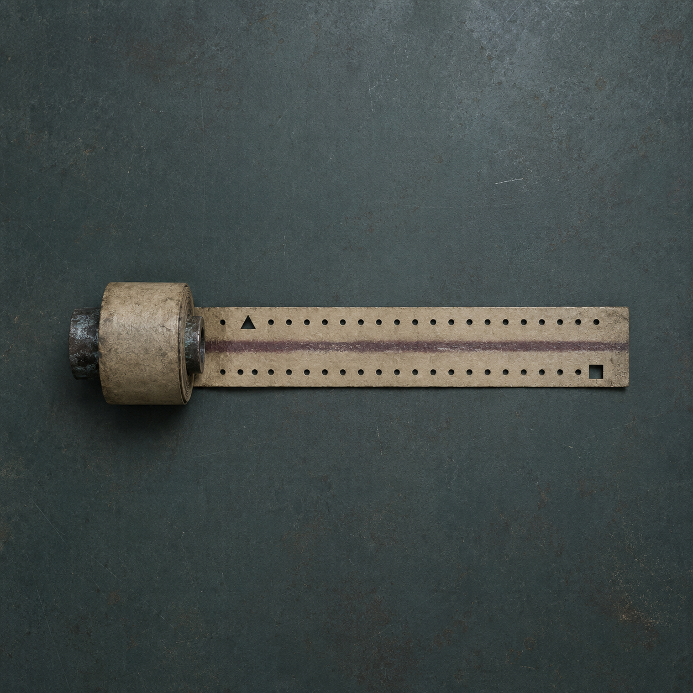

# 第 67 章 丢了二十年的四十七分钟

城西总柜那声纸卷落轴刚传进泵房，四十七条报码线就同时冒出一句话。

【原始时长副本正在回程。】

【抵达代付来源后，缺失数额自动补全。】

赵庆的责任纸尾，那道刚退下去的淡白痕又亮了。

存续扣时尺还横在黑砖前。它上一章已经验明用途：把身份、责任和存活三类当前有效记录分进三个方窗，从记录末端往前量出准备抹掉的时间；它只能显示从哪类记录下刀、要扣多长，不能认归还对象。如今尺上三个方窗仍暗着，最右赤铜止扣却在轻轻发颤。

只要完整时长被补上，尺子就会先得到终点。归还对象虽然还空着，可白塔已经试过拿赵庆的当前责任当起点；下一次再落尺，那枚崩角止扣最多只能拦一次。

“先扣后算刚被我们退回去，它现在决定先把价签抢回来。”陈序抓起外套，“这售后挺讲信用，挨过的骂一句没忘。”

主车间的报码线立刻乱了。

有人问能不能把城西纸卷直接烧掉，有人建议给总柜灌水，还有人已经开始翻自己丢过的时间：少睡的夜班、排错的工时、被白塔罚站的半个早晨，全想去认领那卷二十年前的纸。

梁魁膝盖还没伸直，扶着墙骂：“刚才捐工龄没捐成，现在改抢失物了？谁敢说那卷是他的，先把二十年前的值守鞋拿出来对脚。”

“都别认。”苏弥把纸卷落轴的间隔记在卡片上，“那是时长副本，不是丢失时间招领处。它记录的是外线替第六值守位连续承担了多久，不记录谁欠，也不记录谁有资格拿走。”

眼前最急的问题很清楚。

他们必须在纸卷抵达代付来源前截住它，并读出完整时长；若只截不读，白塔还会继续追卷。若直接毁掉，二十年前确实发生过的代付就永远只剩一张残缺欠条，反而给“按最大时长估算”留下口子。

更不能硬拉。

城西旧档案柜上次已经验过：它是一整面六列三层的机械总柜，只保存入位、退位和交接动作先后，不认人。回程校对抽屉推回时会经过交接冲头，而分隔三层纸卷的唯一卡簧已经断了。任何一卷被猛拽，旁边两层都可能叠进同一个冲头，把退位、交接和代付时长压成一份假记录。

陈序、苏弥和两名城西维修员沿地下回线赶到总柜时，纸卷已经升到第二列中层。

六列旧钢柜全在震。底部共同回线槽像一排咬住纸的牙，正把一卷灰黄纸带从校对抽屉后方往上送。纸卷外沿没有名字，只有两道平行机械孔，一道从起点连续向前，一道在终点闭合。

这就是原时副本卷。

用途很直白：外线代付开始时，它在第一道孔线上留下起点，随后由城西总柜的恒速回程齿每过一分钟推进一格；代付结束，第二道孔线闭合。两道孔之间有多少完整格，就有多少分钟。它只保存原始持续时间，不能说明归还对象、授权人或是谁把它推上回程线。

卷芯只有一根烧黑的短钢轴，灰黄厚纸绕成单卷；纸面准确两道平行孔线，中间压着一条暗红灰的连续受力痕，首端有一枚三角起孔，尾端是一枚闭合方孔。没有人名，没有数字，也没有盖章。

它也立刻显出了效果。

第二列中层每响一次，副本卷便向上走一格；起点三角孔越过一枚固定铜齿后，下一格完整露出。总柜侧面的无字维护窗同时翻下一片一分钟薄牌。

“一分钟一格？”城西维修员问。

“先别信牌。”苏弥说，“看它是不是同一套恒速齿。”

她让维修员取一张不接任何历史记录的无字试纸，只搭在总柜底部回线槽最外侧。固定铜齿走完一轮，试纸上只多出一格孔距，维护窗也只落下一片薄牌。第二轮结果相同。轴边旧油壳连续，没有拆换断层；铜齿每轮都由同一枚重锤摆片释放，不受纸卷厚薄影响。

看见的是固定铜齿一轮只送一格，维护窗一轮只落一片一分钟牌；这说明副本卷的格数能直接按分钟读，不需要再拿磨损严重的代付分时盘齿距硬换算。

可他们刚确认读法，一名维修员伸手去按第二列制动柄，纸卷忽然快了一倍。

六列柜底同时传出补偿齿响。

第二列被按住，第一列和第三列的回程轮立刻加速，共同回线槽把空出的拉力全推给副本卷。那卷纸连跳两格，尾端方孔离上行出口只剩不到一掌。

【检测到回程阻塞。】

【其余档案列补偿送达。】

城西维修员脸色发白，立刻松手。纸卷恢复原速，却没有退回刚才多走的两格。

“单列刹车没用。”苏弥说，“六列共用底槽，按住一处，只会让另外五处替它送。”

如果同时锁死六列，失去回程余量的纸会全部绷断；若只抓副本卷，断卡簧会让上下两层叠进交接冲头。现在他们能动的，不是某一列，而是六列各自愿意让出多少回程力。

陈序把报码杆接上主车间：“各位，失物招领改规则了。不是谁先抢到归谁，是六列柜子谁都别多送一口。城西六条维护线，各找一个还在现场的人，只管自己那一列，听见同一声齿响就压半格，多一分不许。”

主车间有人问：“为什么只压半格？”

“全压会断，单压会补。”陈序说，“六处同一轮各吃掉半格，共同底槽就没有空位把整格压力推给别人。我们只把纸卷停在两齿之间，不改已经打出的孔。”

“代价呢？”

苏弥替他回答：“六只旧制动舌都要用边角受力。它们本来只负责校对抽屉回位，磨坏后，城西以后每送一卷都得有人看着。还有，我们只有一次机会。不同步，纸卷会直接越过出口。”

总办法被压成三步。

六列在同一声齿响里各压半格，让共同回程槽失去补偿空间；两名维修员只托住校对抽屉，不碰纸卷和断卡簧；苏弥按起点、终点孔逐格计数，陈序盯住三号回路与黑砖回执。任何一列早响或晚响，所有人立即松手，不做第二次强锁。

六名城西维修员分别到位。

第一列的人手上还沾着十七号阀的黑油，只同意负责第一列这一轮制动。第二列的人是刚才误按手柄的维修员，他把责任写得更窄：只补偿自己刚造成的两格加速，不替历史副本归属作证。其余四人也分别打出自己的范围孔。

第六列的人来得最慢，是个抱着保温壶的矮个维修员。她先把壶塞给旁边的人，确认自己这半格制动不会离开本地回水值守，才把手按上柄尾。主车间有人催，她隔着管线回了一句：“纸卷赶着投胎，我女儿那杯热水不赶。谁再催，来替我把壶送到人手里。”

没人再催。两名年轻维修员接过壶，一路报了三个阀口的位置，直到那边传回孩子喝到水的敲杯声。第六列这才打出到位孔。陈序没有笑她慢，只把扳手继续举着——六个人各自把眼前的事交代清楚，比一声整齐命令多花了半分钟，却没有谁被纸卷顺便吞成统一责任人。

没有统一站长命令，也没有谁替六个人接受磨损。

陈序抬起扳手。

第一声齿响落下。

六只制动舌同时压住半格。

底部共同回线槽猛地一沉，六列柜体各自晃了半寸，却没有任何一列加速。副本卷停在两枚铜齿之间，纸面绷紧但没有撕裂，上下两层纸轴仍留在各自槽内，交接冲头没有落下。

“托抽屉。”苏弥说。

两名维修员把回程校对抽屉托平。断卡簧无法分隔三层，他们便只用抽屉原本的平面托住副本卷下方，不向前推，不让纸带经过冲头。

苏弥从三角起孔开始数。

主车间安静得过分。刚才抢认丢失时间的人全闭了嘴，只剩每数一格，报码线上就有一只空饭盒轻轻响一下。

不是统一节拍。有人早半息，有人晚半息，像四十七条线各自在证明自己听见了，却谁也没替别人报数。

十格。

二十格。

三十格。

数到第四十格时，第二列制动舌开始冒出银白金属屑。那名维修员没有加力，只报出自己的边角还剩多少。第五列的人把手掌换到柄尾，仍保持原来的半格，不替第二列多压。

“还剩七格。”苏弥说。

纸卷尾端的闭合方孔完整露了出来。

她逐格复数一遍，又让两名维修员从尾端倒数。正数和倒数都在同一处闭合，起点三角孔之前没有前置格，终点方孔之后也没有续段。暗红灰受力痕从第一格连续到最后一格，中间没有断口、接纸或重压痕。

完整持续时间只有一个答案。

四十七分钟。

不是四十七次，不是四十七个人，也不是右压脚下三段机械余量推出来的上限。二十年前，第六值守位空档由那条上级维护外线连续代付了四十七分钟。

黑砖隔着回线亮起新字。

【历史代付持续时间：四十七分钟。】

【原始副本：完整。】

【归还对象：仍缺失。】

存续扣时尺的三扇方窗没有亮。时长补全只给了尺子终点，没有给出该从谁的记录末端起算。赵庆责任纸尾的淡白痕停在原处，十七号阀仍由他负责，丙七支管仍是十格半。

众人没有赢到结案，只赢到一笔账终于不能再随口报价。

主车间却先把这四十七分钟吵成了一场失物认领会。有人说这叫“白塔丢了四十七分钟，全城替它找”；有人坚持是“二十年超时件”；梁魁把空饭盒从头上摘下来，认定正式名字应该叫“过期四十七分钟还想按原价扣”。

陈序没替他们选。

“这次留给读者老爷们预测回旋镖。”他对报码线说，“完整时长回来了，归还对象还空着。下一刀最可能先追谁——当前责任、现存身份，还是那条仍在维持的存活记录？三种都说得通，维修站先不替白塔选受害者。”

结果落地后，六人按相反顺序同时松开制动舌。

副本卷没有继续上行。苏弥用校对抽屉原有的保留槽托住卷芯，把它留在总柜内，不带走、不归轴，也不改变原始孔位。四十七分钟已经由正数、倒数和连续受力痕三项互证，黑砖也确认副本完整；谁把纸卷推上回程、当年谁启动外线，仍没有答案。

代价在松手后一起显出来。

六只制动舌边角都被共同回程槽啃出缺口，其中第二列最深。以后城西总柜每送一份记录，都必须六列各有人看守同步回位，不能再靠自动补偿。回程校对抽屉底板也被绷弯一线，下一次若再托同样厚的卷，可能无法保持三层纸轴分离。

陈序左袖的冻血蹭在抽屉边，右肩麻到连扳手都差点握不住。泵房泄力片簧、三根焊锡丝和陈默余压囊依旧报废，三号返修回路仍是三点七。没有一项旧损耗因为找回四十七分钟而恢复。

苏弥正要封住保留槽，副本卷芯里忽然吐出一截比指甲还窄的上行纸舌。

那不是时长记录。

纸舌只打出三行机械孔。

【数额已补全。】

【请求归还对象副签。】

【回程窗口：四十七分钟。】

所谓归还对象副签，就是上级线路另存的“谁来还”那一栏；它只补对象，不改已经确认的四十七分钟。

更高处的旧维护线里，传来一声远得几乎听不见的落轴。

完整时长没有告诉他们该扣谁。

却让那条沉睡了二十年的线路，开始把“谁来还”往回送。

---

## Metadata

- chapter_number: 67
- word_count: 3976
- generated_at: 2026-08-17 18:10
- upload_status: not_uploaded
