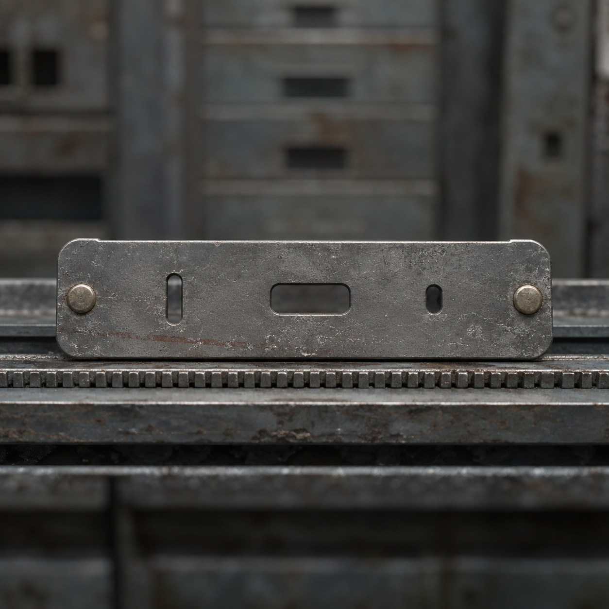

# 第68章 四十七分钟只找一个收件人

城西总柜的上行纸舌刚吐出保留槽，六列柜底便同时响起回程齿。

原时副本卷还托在抽屉里。它已经把二十年前外线代付的完整时长钉死为四十七分钟，却只记时间，不记谁该归还。如今从纸舌后方送来的，是那张缺失的归还对象副签。

黑砖先亮出一行冷字：

【回程窗口：四十七分钟，本次只能在这段时间内完成一次对象确认。】

赵庆的责任纸尾浮起白线。存续扣时尺——它会从当前有效记录末端倒扣时间——横在黑砖前，三个方窗仍暗着，赤铜止扣只剩一角。四十七分钟不是次数、人数，更不是右压脚三段余量能换出的数；可只要副签贴错张记录，白塔就会把旧代付变成活人的新欠条。

他们必须在副签进入黑砖前拦住它，确认它究竟送给哪一类记录。拦晚了，赵庆的轮值、陈默的存活记录，甚至陈序自己的身份，都可能被当作“最近的收件人”。拦错了，又会把副签撕成没有起点的废纸，四十七分钟重新变成白塔可以随口报价的空账。

苏弥指向纸舌：“归还对象副签是用来指出这笔旧账该从哪一份记录起算的标签，不是欠条，也不能证明标签上的人就是当年操作者。”

副签立刻显出效果。纸面没有字，只有三组不同宽度的孔：身份、责任、存活。它沿回程槽滑过第一枚铜齿，三组孔便分别亮了一下，像在试探三扇窗的位置。

“用途说完就动手。”陈序抓起黑烟一号的左侧拉杆，“它已经开始找最近的窗了。”

黑烟一号从总柜旁的维修轨上撑起半边身子。左臂座早毁，胸前门牌歪着，锅炉主轴少了两颗齿；它现在只剩低压蒸汽，负载还挂着一截总柜托架，最怕突然转向。陈序没让它抬架子，而是把右脚踏板压到底，让机体用履带摩擦拖住共同回线槽。

第一列铜齿猛转，副签向黑砖窜去。陈序扳动拉杆，黑烟一号横撞进槽口。履带打滑，胸前歪门被刮出新凹痕，托架也压住回线槽，副签速度降了下来。

“你这叫拦截？”苏弥抬手挡住飞来的铁屑，“你把自己变成了门槛。”

“门槛至少有收件地址。”陈序咬住扳手，“三列同时压半格，别让它把副签送进自动归档。”

苏弥没有照做。六列制动舌都挂着新裂口，第二列最深；再同压会先折断黑烟一号的托架。她让两名维修员在第四、第五列松开半格，给副签留出缓冲弧。

“副签要的是记录末端，不是速度。”她说，“先让它经过三扇窗，观察它停在哪一类孔前。强压会把试探变成落签。”

副签擦过身份窗，孔光只闪不留；经过责任窗时，赵庆纸尾的淡白线向前挪了一指；到存活窗前，黑砖底部的陈默交接半孔忽然震了一下。

陈序立刻松开右脚。黑烟一号的履带后退半寸，托架边缘让出窄缝。副签没有继续撞向存续扣时尺，反而被回程齿拖向陈默那条维持线。

“它选存活记录了！”维修员喊。

“不。”苏弥把一片废钢楔进第四列槽口，“它只是在存活窗前找到最低阻力。看孔光，它还没落下。”

陈序看见了第二个证据：副签每次碰到一条有效纸带，后三组孔都会同时闪一下，然后退回。它不是认出某个人，而是在比较哪条线最容易承受四十七分钟的回程压力。白塔把“能接住”偷换成“该归还”。

陈序把扳手插进总柜底部：“那就让所有线都不能替它装懂。”四十七条报码线接入公共位置，只报一件事实：当前记录能否证明自己是历史对象。赵庆先回：“只能证明我现在值守十七号阀，不能证明我二十年前在第六位。”

桥板守班的人跟着打孔：“担架通道只接收现行转运，不接收二十年前的外线代付。”

一条存活维持线沉默了很久，只送来一声不完整的回音。没有姓名，没有授权，也没有能把陈默和当年代付连起来的孔。

副签被三组空白回执顶住，速度终于降到一格一格。它在存活窗前停了下来，纸尾露出一条细窄的暗红灰线。那不是落签痕，而是隐藏在副签背面的限制：只能在四十七分钟窗口内完成一次归还对象确认，超过窗口，副签自动回到上级线路。

“一次确认，不是一次扣除。”苏弥按住纸角，“它的上限在窗口，不在对象。”

陈序用扳手挑起副签，却没有撕开。他让黑烟一号继续顶住托架，把副签悬在三扇窗之间；自己则把赵庆的责任纸、陈默的半孔交接纸和一张空白新入位纸并排送进试读槽。

三张纸同时经过，副签只对赵庆责任纸亮出一瞬白光，随后又熄灭；对陈默半孔，它发出两下空响；对空白纸，它直接退开。

判断落下来了：副签能识别当前有效记录的形状，却没有证据证明其中任何一张就是二十年前归还对象。它可以找到路，不能替历史认人。

“那就不收。”陈序把三张纸一起抽回，“旧账找不到收件人，维修站不替它签收。”

黑砖立刻压下止扣。四十七分钟的回程压力沿托架猛推，黑烟一号的履带发出尖响，右膝轴承喷出一缕白烟。陈序没有硬扛，而是让苏弥同时松开第四、第五列的缓冲楔，六列补偿力被重新分散，副签从存活窗前弹回纸舌。

它没有被毁掉。纸舌收回总柜，三组孔全部熄灭。

黑砖改写回执：

【数额：四十七分钟。】

【归还对象：副签未落，仍缺失。】

【本次回程：中止。】

赵庆的责任纸尾淡白线退回原处，十七号阀和丙七支管十格半都保住了。陈默交接半孔没有被补穿，四十七份分项核验仍各自独立。

代价却留在现场。黑烟一号右膝轴承磨出细屑，胸前门牌又凹了一块；锅炉主轴的余压降到只能再撑一次短冲，陈序右肩麻意窜到手指，握扳手时差点脱手。城西总柜的第四、第五列缓冲槽也被撑宽，以后副签再回来，未必还能把它弹回去。

苏弥把副签压回保留槽，没有带走。它已经说明自己能做什么，也暴露了真正的危险：下一次四十七分钟窗口开启时，白塔可能不再试探三类记录，而是直接要求其中一类先交出收件资格。

梁魁从远端报码线里骂：“这东西到底该叫归还对象，还是活人抽签？”

陈序看着那三组熄灭的孔：“名字先欠着。读者老爷们来判，下一次它会先找当前责任、现存身份，还是那条仍在维持的存活记录。”

总柜深处随即传来第二声落轴。

这一次，没有副签先出来。

出来的是一张被剪掉上半截的空白回执，背面只留着半句机械孔语：

【收件资格……】

---

## Metadata

- chapter_number: 68
- word_count: 2398
- generated_at: 2026-08-23 18:20
- upload_status: submitted_pending_review