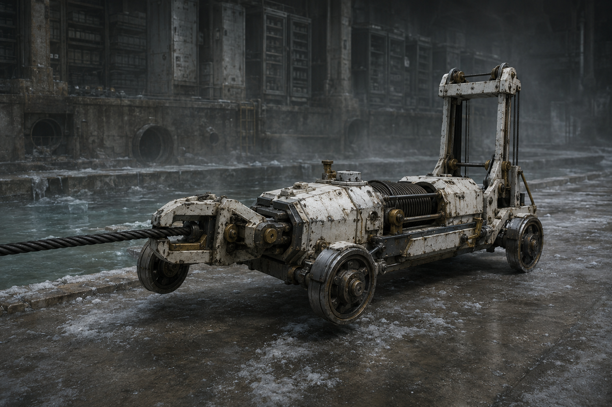

# 第69章 收件资格先压在谁身上

城西总柜第二声落轴还没传完，六列柜体外便响起了尖利的钢索摩擦声。

一台白塔牵引机从地下检修弯撞出来。它没有履带，只有四只窄轮和一根黑色回收索，车头夹着总柜的上行槽，像有人拿扳手拽住了整座档案泵房。

“它来收件了。”梁魁看着那张只剩半句的空白回执，“收件资格先压谁？”

空白回执没有回答。纸背的半句孔语沿着黑索一格格亮起，最前端朝陈序脚下的责任纸滑来。

“先说清楚。”苏弥一把按住纸角，“收件资格不是归还对象。它只决定谁有资格把副签送进下一道槽，不能证明谁是二十年前的收件人。”

话音刚落，白塔牵引机猛地收索。总柜底槽被拖得离地一寸，回程校对抽屉向外蹿，原时副本卷在保留槽里滚出半圈。

陈序扳下黑烟一号的右脚踏板。锅炉主轴余压只够一次短冲，右膝轴承刚磨出细屑，机体还挂着总柜托架；这不是能硬撞的重量。

他先撞了。

黑烟一号斜着顶进牵引索，胸前门牌发出一声闷响。钢索没有断，牵引机反而借着四只窄轮转正，车头把黑烟一号推向泵房外壁。陈序右肩的麻意立刻窜到指尖，扳手差点脱手。

“恭喜。”梁魁喊，“你把门槛撞成了门上的挂件！”

牵引机继续收索。黑砖上的三扇方窗一起亮起，身份、责任、存活三类当前记录被它当成了三条候选接收线。白塔没有选出历史收件人，只是在谁先被拖近的问题上制造答案。

陈序看见牵引机的四只轮子：前轮贴着结冰地面，后轮压在泵房排水沟盖上；它收索时车身不后退，力量全落在总柜上。苏弥也看见了。

“它不是在拉我们。”她说，“它把泵房当锚点。只要总柜先动，资格就会顺着最近的记录落下去。”

“那就让它先拉一个假的。”陈序抓起一块废弃的钢配重腿。配重腿是给失去支撑的机体临时压住地面的，不能修复关节，也不能增加动力；他把它横塞进黑烟一号左侧履带下，立刻压住一只窄轮。

黑烟一号的重量落上配重腿，左侧接地面从一条变成两条。牵引机再收索，钢腿先滑出一寸，黑烟一号没有被推向外墙。

“有效！”苏弥报出结果，“但只能吃一次横向冲力，再压就会折。”

牵引机像听见了这句话，车头突然抬起，黑索从总柜槽口改向泵房门框。门框承受不了整座柜子的重量，固定铆钉接连弹出。空白回执被气流卷起，贴向陈默那条微弱的存活维持线。

陈序伸手去抓，左袖冻血蹭开一道口子。回执擦过他的指缝，三组孔同时亮起，存活窗里那一下不完整的回音又传了出来。

不是“收件人”。

那声回音只说了两个可辨的音节：“别……替。”

陈序停了半拍。陈默拒绝过责任转移，陈默交接半孔也从未穿透；这次回音仍只能证明维持线在拒绝代收，不能证明它拥有收件资格。

“它要的是被迫伸手的人。”苏弥把记录卡折成硬角，“资格不是谁最像收件人，而是谁被牵引机先压进接收槽。”

“那就别让它压人。”

陈序解下泵房墙上的手摇绞盘。手摇绞盘能把钢索慢慢收回或放长，作用是改变牵引方向，不是凭空增加拉力；摇柄每转一圈，钢索只退半格。

他把绞盘扣进排水沟旁的旧固定环，让黑烟一号的备用钢索绕过牵引机后轮，再接回自己的底架。第一圈摇下去，钢索绷直；第二圈，牵引机的后轮被迫向侧面偏了半寸。

“你在给它拴狗？”梁魁问。

“不，给它安排一个不想去的收件地址。”陈序咬住摇柄，“它要把谁拖近，就先把自己拖离总柜。”

牵引机车身一歪，黑索的力不再正对总柜。总柜底槽停止上浮，原时副本卷滚回保留槽。可白塔立刻切换了孔路，空白回执沿责任窗滑向赵庆的纸尾。

赵庆在远端报码线里吼：“我现在只负责十七号阀！别把我二十年前的鞋也算进去！”

四十七条线路同时亮起。有人报现行责任，有人报现存身份，有人报存活维持；没有一条线路承认自己能证明历史收件。回执被三类拒绝顶住，速度慢了，却没有退回。

“窗口还在走。”苏弥盯着黑砖，“资格确认只有一次，拖到归零，它会把最近的拒绝也算成接收。”

陈序看向牵引机。它的前轮被绞盘拽偏，后轮仍压着排水沟盖；只要他继续收，车架会先扭裂，可黑索也会松开半格。可抛弃配重腿已经弯出白痕，黑烟一号的余压只够这一轮。

他松开绞盘一圈。

牵引机猛然回正，黑索重新绷紧。陈序等的就是这一刻，脚下踏板一沉，黑烟一号用最后的短冲撞向牵引机侧面。冲力没有正面砸上车头，而是沿绞盘改变后的侧向角度，把牵引机的前轮掀离地面。

牵引机翻了半圈，黑索脱出总柜槽，车尾砸进旧排水沟。白塔收索声断了。

空白回执没有落在任何一张纸上。它被回程风卷回总柜，三组孔全灭，只留下新的机械回执：

【收件资格：本次未确认。】

【归还对象：仍缺失。】

【牵引来源：上级线路。】

黑砖没有给出操作者，也没有告诉他们资格的完整上限。泵房保住了，总柜却被拖歪一格，钢配重腿彻底报废，手摇绞盘的固定环裂开，黑烟一号右膝又落下一片细屑。

陈序喘着气，看见翻倒的牵引机腹部露出一枚未接上的白色插销。插销旁贴着半张新纸，只有一行孔语：

【下一次，先验收拒绝。】

梁魁沉默片刻：“它这是要我们先签字，还是先挨打？”

苏弥把纸片夹进记录卡：“两者都不是答案。下一次它可能把拒绝本身变成收件资格。”

陈序望着那枚白色插销，没有去拔。

“这东西的正式工单名还没定。”他对报码线说，“读者老爷们先替它起个比‘活人抽签’更损的名字，维修站下次按名字骂它。”

---

## Metadata

- chapter_number: 69
- word_count: 2149
- generated_at: 2026-08-23 19:00
- upload_status: not_uploaded
