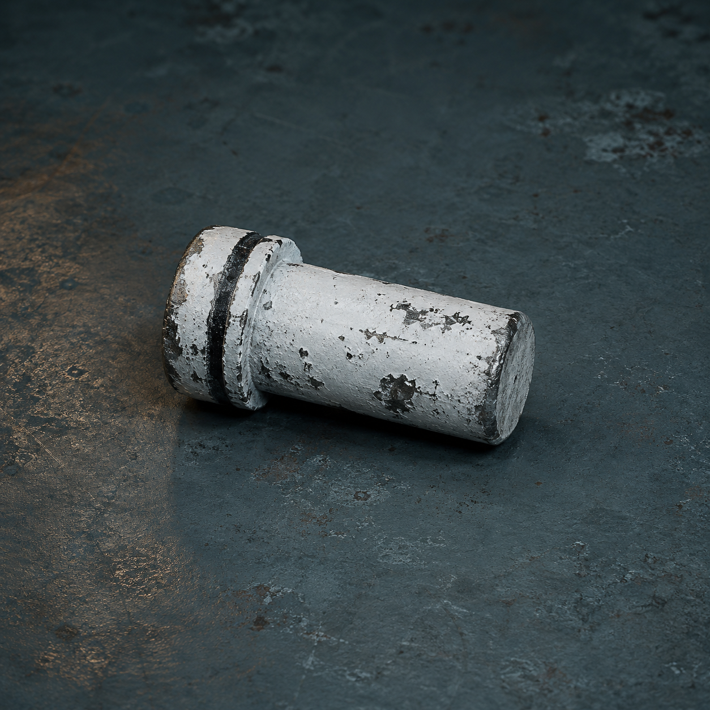

# 第70章 拒绝不能自动签收

白塔牵引机翻进排水沟后，泵房里没有立刻安静。

总柜歪着一格，空白回执压在保留槽边，背面那半句“下一次，先验收拒绝”还在一闪一闪。它不是答案，只像有人把一张罚单塞进门缝，提醒他们下一次会从哪里下手。

“先验收拒绝。”苏弥把纸片摊平，“意思是刚才我们拒收副签的动作，已经被白塔记成了一份可回收的记录。”

陈序看向翻倒的牵引机。黑索脱了，总柜暂时不再上浮，可车腹下那枚白色插销还卡在半槽里。它的用途很直白：把一次拒绝接收固定成可核验状态，防止白塔把‘不接’自动改写成‘已经接收’。白色旧钢插销只管验收结果，不能替他们证明归还对象，也不能抵住牵引力。

他蹲下去，先把插销拔出半寸。

白色漆皮在盐尘里掉了一片。牵引机腹部立刻亮出三组孔位：身份、责任、存活。空白回执顺着残余回程风滑来，最前端碰到插销头，三组孔同时亮起。

“它在等拒绝。”梁魁从报码线里骂，“咱们不收，它就把不收这件事收走？”

“先别拔。”苏弥按住陈序的手腕，“插销还没完成验收。刚才的拒绝只把副签弹回去，没有留下拒绝对象、拒绝依据和拒绝范围。少一项，白塔就能把它当成空白签收。”

话刚说完，空白回执撞上责任窗。赵庆的十七号阀责任纸被拖出一道白线，像有人拿尺子量它能不能替二十年前的账接住四十七分钟。

陈序抬头看牵引机的腹部。四只窄轮中，前轮已经悬空，后轮还压着排水沟盖；黑索虽然脱槽，回收轮仍在惯性倒转。它不是重新来拉总柜，而是在把刚才的拒绝沿最近的责任线回填。若任它转完，赵庆的现行责任就会被写成“拒绝收件”，再被改成“具备收件资格”。

“问题清楚了。”陈序把扳手塞进残缺槽口，“我们不是再拒绝一次，是要让拒绝也有地址。”

苏弥把三张纸推入验收台：赵庆的责任纸、陈默那张没穿透的交接半孔纸，以及一张新撕的空白记录纸。她先指着空白纸说：“验收台只比较拒绝是否落在当前有效记录上，不认历史身份。三张都要报自己的范围，谁不够资格，谁就只能拒绝自己被代收。”

插销在她说明用途后立刻触发。陈序将它推入牵引机腹部的半槽，白色圆帽压下一声脆响，三个孔位各自吐出一枚冷灰小孔。不是统一的“拒绝”，而是三份分开的拒绝回执。

赵庆先报码：“我只负责十七号阀当前轮值，不接二十年前的代付。”

陈默的纸没有声音，只有半孔在接触验收台时向后退了半格。苏弥没有替它翻译：“它没有完成交接，能证明的只有拒绝代收，不能证明它有收件资格。”

空白记录纸直接弹开。它连当前身份都没有，拒绝范围也不存在。

依据落在三种不同的反应上：赵庆的责任纸留下现行范围孔，陈默半孔只退不进，空白纸连回程齿都没咬住。苏弥判断，白塔刚才要的不是三类记录中的某个人，而是一张能把拒绝范围写完整的现行记录。可这仍不能证明谁是二十年前收件人。

“那就把拒绝钉死在白塔自己的牵引机上。”陈序说。

他按下白色插销的圆帽。插销只能固定一次验收，第二次再压会直接越过验收槽；这是它的限制，也是他们仅剩的安全动作。三组冷灰孔同时闭合，空白回执猛地回弹，赵庆纸尾的白线却没有跟着被扯走。

牵引机腹内传出一声闷裂。残余回收轮想把拒绝记录拖回上级线路，白色插销卡住了它。卡槽只撑了三息，插销尾端便崩出一道黑痕，泵房地面跟着震动。陈序的左袖又蹭上铁边，冻血沿手腕流进手套；他没有加力，只把扳手松开半寸，让插销承担它能承担的最后一段。

三息后，空白回执从责任窗退回总柜。

黑砖亮出新回执：

【本次拒绝：已验收。】

【拒绝范围：当前责任记录仅拒绝历史代收。】

【收件资格：仍未确认。】

【归还对象：仍缺失。】

白塔没有因此交出来源。上级线路的牵引声反而隔着六列柜体传来一声短促回响，像有人发现这次不能把“不收”直接算成“收了”。

赵庆的十七号阀责任保住了，陈默的交接半孔仍未补穿，四十七份分项核验也没有被揉成一份总拒绝。可代价已经落下：白色插销尾端裂开，牵引机的验收槽被撑宽，下一次同类回收可能不再给他们三息时间；总柜歪斜的一格没有归正，黑烟一号右膝轴承又吐出一小撮细屑。

梁魁沉默片刻，问：“这算不算把拒绝退回去了？”

“只退回了改写资格。”苏弥收起三份回执，“归还对象还在上级线路，收件资格也没落到任何人身上。”

陈序看着裂开的白色插销，没有去拔。它已经证明了自己能挡住什么，也把上限写在了裂痕里。

他对报码线说：“读者老爷们，这个东西可以叫‘拒绝回执钉’，也可以叫‘不背锅插销’。下次白塔再把拒绝当签收，咱们先看它有没有更短的验收时间。”

总柜深处，第三声落轴响起。

这一次，所有记录纸都先亮出了拒绝孔。

---

## Metadata

- chapter_number: 70
- word_count: 1904
- generated_at: 2026-08-23 20:00
- upload_status: not_uploaded
