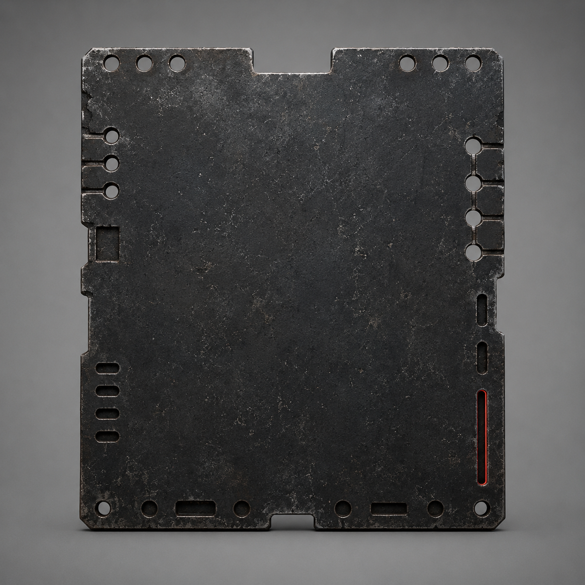

# 第72章 空位不能先填活人

第四声落在黑色空位上。

总柜没有继续吐纸，反而把六列回程槽同时吸紧。赵庆的责任纸、陈默的交接半孔和废纸槽里的空白纸被三股力量拽成一条线，线头全朝那片黑色薄片聚过去。

陈序一把按住总柜边缘。右肩麻意冲到手腕，扳手在掌心转了半圈。

“别碰它。”苏弥喊，“空位已经在找人了。”

黑色薄片从记录卡里滑出来，贴在柜面上。它的用途很直白：给白塔预留一个尚未存在的收件资格位置，等下一次回收时把某类当前记录塞进去。它不是第四类记录，也不是现成资格；没有人填，它就只是一个空槽。

“空槽也会咬人？”梁魁的声音从报码线里传来，“这破地方连没盖的章都能追责？”

薄片边缘立刻亮起一圈冷红。空槽旁的三道孔位依次对准身份、责任、存活，最先亮的是责任孔。赵庆的纸尾被拖出十七号阀，像一根被公文夹住的手指。

“它先找最容易填满的。”苏弥将旧钢片插进柜缝，“责任纸有完整范围，身份和存活都还差口子。它不是认定赵庆，只是想先拿一张能写字的纸垫进去。”

赵庆立刻报码：“我负责十七号阀，不负责给黑洞填表！”

“听见没？”陈序抬脚踩住责任列，“人家拒绝得很完整。”

他话音未落，柜底猛地一沉。黑烟一号只剩最后一次短冲，右膝轴承的裂纹还在吐细屑，锅炉余压不够再硬顶。陈序没让机体撞柜，而是扳动左侧履带，让履带压进结冰排水沟，利用摩擦把责任列的拉力分到地面。

赵庆的纸尾停了半寸。

存活列却突然发出一声短促的回音。陈默那张交接半孔纸被黑索勾起，半孔边缘擦过空槽。陈序右肩一麻，手臂险些从拉杆上滑开。

“它换目标了！”苏弥抓住纸角，“空位不是固定咬责任，它只要谁先被拖到槽边！”

陈序看见三件事：责任纸被履带压住后暂时停了，陈默半孔正在往空槽靠，空白纸却被风卷成了筒。白塔不需要判断谁是谁，只需要一张能被当前记录承认的纸先碰上空位。

“那就不给它一张完整的。”

陈序从总柜旁抽出三根磨损维修缆。每根缆头只能压住一条记录列，不能替记录作答；他把三根分别扣在身份、责任、存活的边框上，再把另一端绕到黑烟一号的底架。

“你又想拿机甲当绳结？”梁魁问。

“这次是三个人各管自己，谁都别替谁成年。”

苏弥听懂了。她把空白纸撕成三条，分别塞进三道窄槽，又对所有报码线说：“总办法只有一个：三类记录同时报告自己的有效范围，让空位没有一张完整的纸可填。赵庆只报十七号阀；存活线只报正在维持的那一段；身份线如果没有当前身份，就保持空白。谁也不能替别的类别补资格。”

“那空白怎么办？”梁魁问。

“空白就空着，空着不是欠它。”

三道报码同时落下。赵庆的纸亮出十七号阀，存活线吐出微弱的“不替”，身份槽只剩一片没有孔的纸边。黑色空位片震了一下，三道冷红却没有合成一格。

它没有填上。

白塔的回收力立刻加重，三根维修缆绷成直线。黑烟一号的右膝发出闷响，机体向总柜侧滑；陈序眼前一黑，左手扳手掉进排水沟。

“撑不住了！”苏弥喊，“再拖三息，三根缆会把柜底掀开！”

陈序盯住黑色空位片。它不是在找最合适的人，而是在等他们为了保住现有记录，主动把某一类记录补完整。只要有人替身份线填一个名字，空槽就有了第一块可咬的肉。

“锈钉，敲柜。”

远端传来两长一短的沉闷回声。总柜歪成两格，第四声留下的空位片被震得向门框滑去。陈序没有去抢，而是突然松开左侧履带。

履带一松，三根缆同时向外弹。白塔牵引机残余的黑索顺着三股力冲过门槛，四只窄轮被拽得离地。黑烟一号借总柜歪斜形成的坡面，侧身让开，牵引机自己撞上泵房门框。

门框掉下一块冰壳，黑索断成两截。

黑色空位片没有被带走。它贴在门槛旁，三道孔熄灭，只留下中间一格极细的红线。

黑砖亮出回执：

【空位来源：上级线路。】

【本次补入：未成立。】

【可补入类别：最多一类。】

【补入代价：未显示。】

赵庆的责任纸回到十七号阀，陈默交接半孔仍旧没有穿透，空白纸也没有被强行变成身份。维修站保住了三类当前记录，却没能把空位摧毁。

代价落在黑烟一号身上。右膝轴承裂口扩大，余压彻底见底，机体靠总柜才能站住；三根维修缆一根外皮磨穿，陈序右肩麻到握不住扳手。总柜门框则被撞出一道新凹口，泵房外的冷风灌了进来。

梁魁小声问：“最多一类，是说下次只会咬一个？”

“也可能是一次只能填一个。”苏弥收起三份分开的回执，“但它没说谁来填，也没说填进去之后会丢什么。”

陈序把黑色空位片夹回记录卡，没有碰那条红线。

“这东西的工单名，维修站还是没定。”他对报码线说，“读者老爷们这次站队：空位该由谁来填，还是谁都不该填？别只骂它，给它留一条能把自己骂回去的规矩。”

门外，白塔牵引机的残轮忽然又转了一下。

黑色空位片随之亮起一枚新的小孔，孔里传出一个尚未属于任何人的报码声。

---

## Metadata

- chapter_number: 72
- word_count: 2140
- generated_at: 2026-08-24 19:00
- upload_status: submitted_pending_review