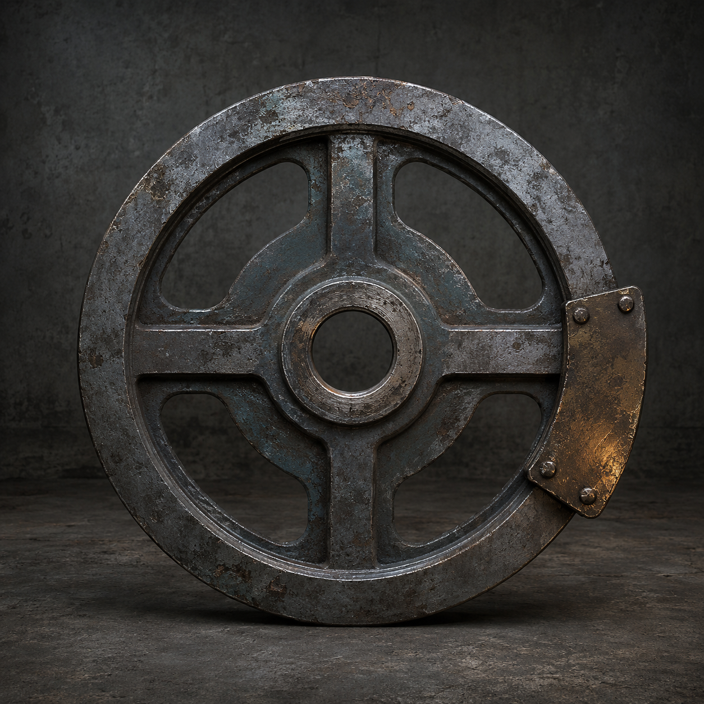

# 第76章 让猎犬先学会打滑

同动作猎犬卡在牵引机窄缝里，胸口那条冷白动作线却已经爬上黑烟一号的右膝。

它每重复一次陈序的歪斜姿势，右膝轴承就落下一粒细屑。苏弥把维修缆收回半寸，机甲的重量终于不再往门外拖，可她的右手义指也被缆皮勒出一道红痕。再拖下去，猎犬会把“右膝向外塌”学成下一条标准路线；黑烟一号若倒，泵房门槛后的总柜和报码线也会一起被压断。

“我去拆它。”苏弥抄起纸卡，盯着牵引机底盘，“校正环还在，它就会继续回放。”

“你一进去，它会先学你怎么拆。”陈序按住她的肩，“这次别给它一个完整动作。”

猎犬忽然抬爪。冷白光沿着右膝裂口一闪，黑烟一号的履带跟着向外偏了半寸。陈序猛拉操纵杆，错误的反应让机体回正，右膝却又落下一声脆响。

苏弥看见他的手停了一拍：“它不是在复制你刚才的姿势，它在复制姿势造成的偏差。”

“所以它要是学会偏差，我们就让偏差先把它自己绊住。”

陈序钻到翻倒牵引机旁，没去碰猎犬背后的黑索，而是踢开一块变形盖板。盖板下面露出一只旧钢飞轮，圆盘边缘铆着一块比拳头还厚的暗黄铜配重，中心轴孔已经磨出毛刺。

苏弥一把拉住他：“那是牵引机的调速轮。”

“现在不是了。”陈序拔出轴销，把飞轮抱到黑烟一号脚边，“偏心飞轮不是新动力，它只把本来匀整的转动变成每圈一次的故意偏摆。机器要的是标准，我偏要给它一条每次都差一点的路。”

他把飞轮卡进右履带外侧的废轴座，又用断门牌压住锁片。飞轮刚接上，黑烟一号便像喝醉似的向右晃了一下。右膝的裂口没有合拢，履带却多出一记不稳定的回摆。

“先说好。”苏弥看着那块铆接配重，“它会让机体更难操纵。偏摆过大，履带会打滑，咱们连门槛都守不住。”

“守门槛是昨天的目标。”陈序扭动拉杆，“今天目标是让猎犬别把咱们的坏腿登记成标准件。”

猎犬先动了。

它模仿黑烟一号向右塌的动作，前爪按下，后爪同时蹬地。黑烟一号的偏心飞轮转过半圈，配重把履带向外甩开；机体差点侧翻，陈序的左肩撞上舱壁，伤口在冻硬的布料里重新裂开。

“你的办法把自己摔了！”苏弥吼。

“摔得不够像。”陈序咬着牙把拉杆压到底。飞轮又转一圈，履带这次提前打滑，黑烟一号没有沿着猎犬预演的角度塌下，反而把右侧重量甩进牵引机轮槽。

猎犬照着前一记偏差扑来。它的前爪落在原本应该存在的硬点上，那里却只剩半圈滑动。胸腹被自己的冲力拧住，四足一齐蹬直，动作线顿时分成两截。

苏弥看见机会，抓起维修缆往牵引机的断轴上绕：“它找不到同一个落点！”

她没有把缆收紧，而是故意只绕半圈。猎犬复制她的动作，黑索随之松开，下一瞬又被偏心飞轮甩回。松、紧、再松不是一套完整轨迹，猎犬的校正环发出刺耳的短鸣。

“别急着高兴。”苏弥忽然说，“飞轮的偏摆正在把误差传回黑索。再转三圈，先坏的可能是它，也可能是右膝。”

陈序看见了飞轮外缘的磨痕。每次甩动，磨损都在向锁片逼近；这东西不是白捡的胜利，它会把不标准的动作连同损耗一起放大。可猎犬已经从窄缝里挤出半个身子，若现在停下，校正环就会抓住最后一条完整回摆。

“梁魁，东侧废管，连续敲两下！”

“你上次还说一声就够。”

“上次它只学声音，这次让它学忙不过来。”

梁魁在报码线那头重重敲下。两声一前一后，猎犬的头部先转左，再按黑烟一号的偏摆向右压。它试图把两个动作拼成一条路线，前爪却踩进自己刚刚撞开的冰缝。

陈序借着这一歪，把拉杆猛地往回扳。偏心飞轮的配重甩过最低点，履带突然向内收，黑烟一号不再挡门，而是用右侧肩甲撞上牵引机底盘。翻倒机器被撞得横移半尺，轮槽像合上的铁牙，把猎犬重新夹回去。

猎犬没有死。它的四足还在动，只是每次起爪前都会先向错误方向偏一下，再被残轮挡住。冷白动作线不再指向右膝，而是缩在它自己胸口，反复重播那半步打滑。

黑砖亮出一行回执：

【偏差来源：最近一次可见动作。】

【当前结果：重复轨迹无法闭合。】

【附带记录：偏差损耗已写入校正线。】

苏弥蹲下检查飞轮锁片：“它没有学会停止。它只是暂时找不到能把偏差抹平的落点。”

“暂时也算维修。”陈序伸手去摸右膝，指尖刚碰到外壳，黑烟一号便向右倾了一线。他立刻收手，“而且这东西不能再转。”

苏弥抬头：“你知道会坏，还装上去？”

“知道。”陈序把断门牌压回锁片，“但要是不用，坏的是你、我和门后的所有人。”

她盯了他两秒，把维修缆重新绕回总柜，却没有替他把飞轮拆下：“下一次别把‘我知道’当成免责单。”

“那你给它开一张共同损耗单。”

“先写你的名字。”

陈序咧了一下嘴，笑意碰到右肩的麻痛便收住。他在黑砖上按下自己的指印，飞轮外缘随之又颤了一下。

门外的猎犬忽然停住。

它胸口那条被打散的动作线没有再扑向黑烟一号，而是沿着地面爬向泵房更深处。线头停在一截无人触碰的旧钢缆上，缆端的结扣竟自己收紧，像有人隔着门外学会了偏摆。

苏弥把纸卡翻到背面：“这不是猎犬在动。”

陈序看着那截越收越紧的旧钢缆，没再开玩笑。

黑色空位片报出新的一句：【偏差已找到下一条可复制线路。】

这一次，线路不在猎犬身上。

“把飞轮锁死。”陈序说，“门里面还有东西在学。”

读者老爷们先替这只打滑猎犬判个外号：是“偏差学徒”，还是“自己绊自己”；也可以继续给它起第三个更损的名字。下一次被它学走的，可能不是谁的招式，而是谁先把责任写到自己名下。

---

## Metadata

- chapter_number: 76
- word_count: 2187
- generated_at: 2026-08-25 15:00
- upload_status: submitted_pending_review