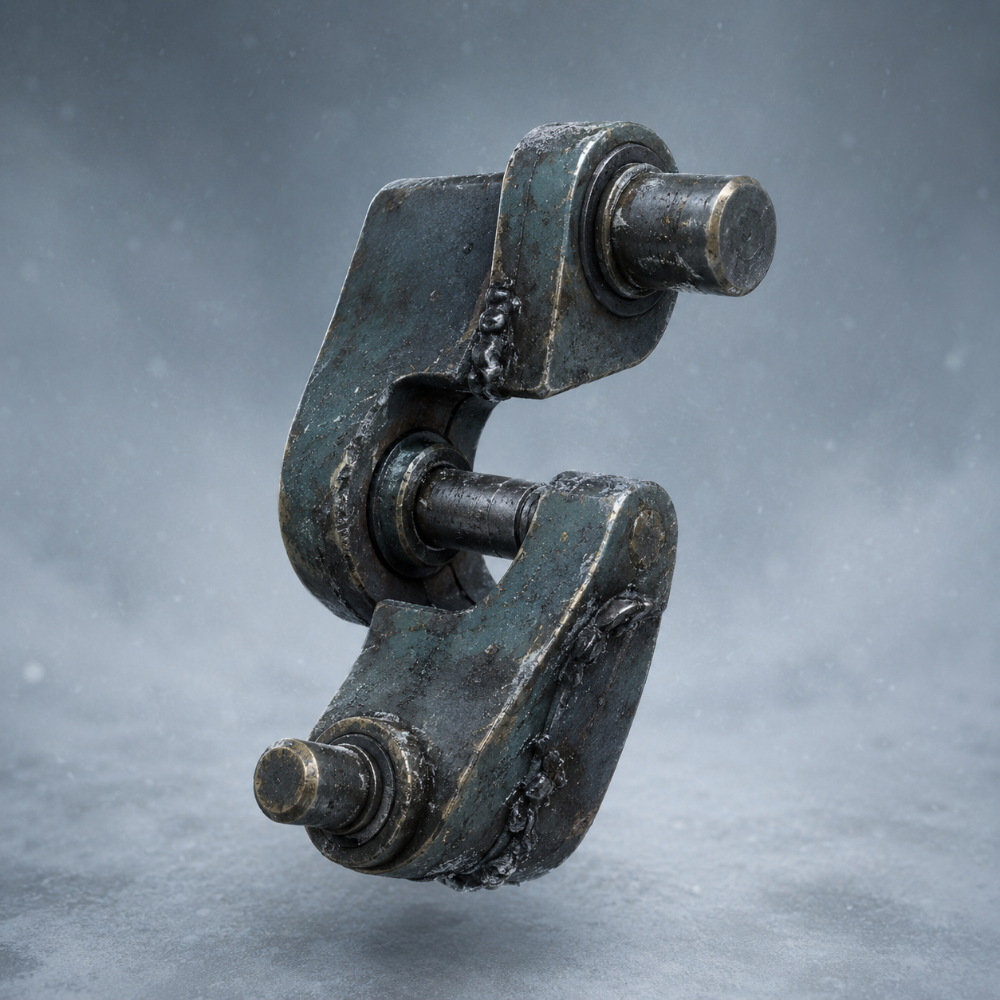

# 第77章 机甲近身先别讲道理

泵房深处那截旧钢缆收紧时，昨晚装上的偏心飞轮——它把匀整转动变成每圈一次的故意偏摆，却不能当动力源——正好在黑烟一号右履带上转过半圈。

履带向外甩，钢缆便向里绞。两股力隔着结冰的地面一碰，黑烟一号像被两只互相嫌弃的手同时推了一把，右膝险些跪下。

同动作猎犬还卡在翻倒牵引机底下。这是校正光催生的机械追杀体，会复制刚看见的标准动作，却不会读心或判断责任。它没有扑，也没有叫，只把胸口那条冷白动作线贴到钢缆上。缆端每收紧一次，猎犬四足就跟着偏一下；偏心飞轮每摆一次，钢缆便学着提前收力。

“它在门里面找到了新老师。”苏弥捏紧纸卡，“再让它学三次，泵房里的东西就能隔着钢缆拖动黑烟一号。”

陈序看了一眼右膝落下的细屑，又看见苏弥被缆皮勒红的义指：“那就把老师请出来。”

“你准备怎么请？”

“近身。它学的是完整动作，咱们不给它完整动作。”

话刚说完，钢缆猛地向后一缩。黑烟一号被拖出门槛半尺，猎犬借着这一下从轮槽里挤出胸口。陈序扳动拉杆，偏心飞轮把履带甩向另一边，机甲横着撞上泵房门框。

这一撞救了他们，也把左侧肩甲撞出一道新凹口。

猎犬已经扑到门内。它复制黑烟一号撞门的动作，前爪却沿钢缆方向提前收拢。陈序没有后退，反而把拉杆推到底。偏心飞轮让右履带故意打滑，猎犬的前爪落在一块空冰上，身体顺着自己的标准冲势横滑出去。

苏弥抓住机会，把维修缆在总柜把手上绕了半圈：“它不是认出钢缆里的东西，它只是抓住了最近能重复的受力方向。三号回路就是把泵房压力送回维修站的返修管线，它一掉压，总柜就会跟着歪。”

“所以咱们要让受力方向每次都不一样。”

“飞轮已经快磨到锁片了。你再靠它打滑，先断的是右履带。”

陈序的手摸进黑烟一号左臂的废轴盒。里面只有一块弯掉的铰接板、两枚不同大小的销钉，还有一截短轴。

“苏弥，给我三十秒。”

“你每次说三十秒，最后都会多一笔损耗。”

“那就把这笔损耗写成新零件。”

他把弯铰接板扣在黑烟一号左腕外侧。那是反标准关节——它用两枚错开的销钉承力，让同一个拉杆动作在不同受力下走不同的转角，专门把重复动作变成不重复的落点。

“先说清用途。”陈序一边拧销钉一边喊，“反标准关节不是加力，它只负责让同一个动作每次偏一点；偏得太大，左腕会自己甩脱。”

苏弥盯着他：“你确定它能撑住？”

“不确定。”

“那你装它干什么？”

“因为确定的东西已经被它学会了。”

陈序扣下最后一枚销钉，黑烟一号左腕立刻向内折了一角。偏心飞轮还在右履带外侧打滑，右边偏一次，左腕便迟半拍回一次。机甲的动作丑得像刚学会走路的人抱着一扇门。

猎犬扑了上来。

它先复制黑烟一号抬左腕的动作。冷白动作线刚亮，反标准关节在钢缆拉力下换了另一枚销钉承力，左腕没有抬到原来的高度，而是向下沉了两寸。

猎犬照着第一条轨迹落爪，前爪砸在空处。

陈序抓住这半拍，操纵黑烟一号用肩甲撞向猎犬侧腹。不是硬撞，他让右履带先打滑，再让左腕迟到的下沉动作勾住猎犬胸口的校正环。猎犬身体被勾得横转，四足仍在复制冲刺，脑袋却先撞上自己刚才踩出的冰缝。

“成了！”苏弥喊。

“别急，成的是它摔，不是咱们赢。”

钢缆突然从泵房深处弹出，缆端没有去收黑烟一号，反而绕过猎犬，直奔苏弥的右手。苏弥松开总柜把手，维修缆立刻回弹；总柜向外一歪，三号回路的压力表同时掉了一格。

陈序没有喊她别动。他知道那截钢缆正在复制苏弥收缆的结果，越稳定的动作越容易被它接管。

“苏弥，松手！”

“我松了，黑烟一号会压垮总柜！”

“那就别按原来的方向松。”

苏弥咬住纸卡，右手义指突然向上挑。她没有照平时那样直线回收，而是先把维修缆压进总柜侧面的缺口，再借缺口让缆身向下折。这个动作没有拉开距离，却把回弹力分进了冰面。

钢缆学着收紧，缆端却卡在缺口里。

陈序立刻推拉杆。偏心飞轮让右履带打滑，反标准关节让左腕下沉，黑烟一号没有撞向猎犬，而是斜着贴近。肩甲擦过牵引机，左腕再次勾住校正环，机甲整具身体把猎犬压回轮槽。

猎犬四足同时蹬动。它想复制黑烟一号这次近身动作，可黑烟一号已经在半步里换了三种落点：右履带向外滑，左腕向下沉，肩甲沿翻倒牵引机的圆弧擦过。猎犬的冷白动作线被扯成三段，最后一段撞回自己胸口。

钢缆也停了。

泵房深处传来一声很轻的金属回响，像有人隔着厚门把刚学会的动作咽了回去。

黑砖亮出回执：

【近身结果：复制轨迹未闭合。】

【当前限制：反标准关节左腕偏角不稳定。】

【损耗：偏心飞轮外缘逼近锁片，右履带不得连续强转。】

苏弥喘着气看向陈序：“你把猎犬压回去了，可那截钢缆没有断。”

“它没断，说明里面的东西还想继续学。”

“下一次呢？”

陈序看着被压住的猎犬。它胸口的校正环已暗下去，四足却慢慢摆成一个新的姿势：不是扑击，也不是收缆，而是黑烟一号刚才贴近时留下的三种落点。

他把手按在左腕的反标准关节上。错开的销钉正在发热，左腕每抖一下，便把不同角度的震动传回驾驶舱。

“下一次先拆它。”陈序说，“不是拆猎犬，是拆掉门里面那位老师的第一节课。”

苏弥抬头：“你知道它是什么了？”

“不知道。”陈序咧嘴，“但它既然想当老师，就得先交学费。”

门里的旧钢缆忽然又收紧了一寸。

黑色空位片没有报码，只在边缘多出一个像半张嘴的缺口。缺口里，传出一声与陈序刚才完全不同、却能让三号回路同时响应的敲击。

这一次，门里面学会的不是动作。

是叫人开门。

读者老爷们，下一步该先拆“老师”的钢缆、校正光，还是这只还没学会停的猎犬？三种答案都能救门，也都可能把门里的东西请出来。

---

## Metadata

- chapter_number: 77
- word_count: 2191
- generated_at: 2026-08-25 20:10
- upload_status: not_uploaded
