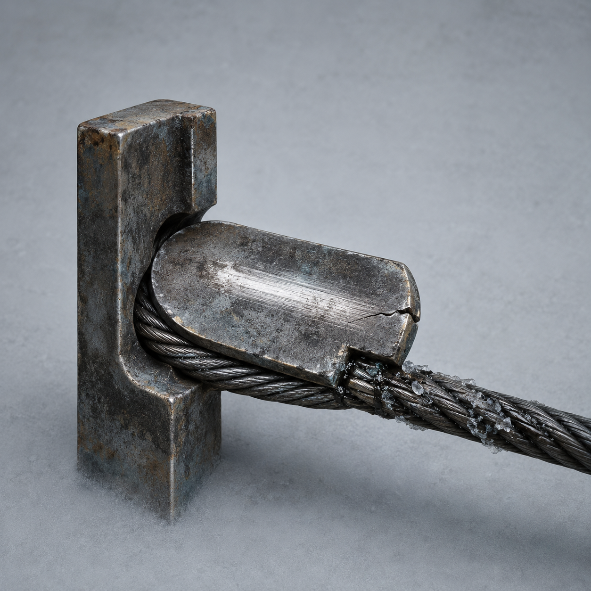

# 第79章 回声不能替人签收

总柜里面那一下回声，比门里的敲击轻，却让六列纸带同时往回缩了半孔。

陈序的手还按在旧钢缆回收端上。上一章他们已经知道，这个扁平的旧钢件只负责把门内敲击的压力接进三号回路，再把收到的压力送回去；它不能认人，不能替门里东西决定开门。同一回声它最多回收一次，再来一次，三号回路就可能先垮。

现在回声从总柜里面传出来，等于有人把门铃的另一头塞进了他们自己的账本。

“你刚才说，先拆它的第一节。”苏弥盯着总柜，“拆哪一节？”

“最响的那一节。”

“这是废话。”

“废话也是线索，说明我还没被它学会。”陈序咧嘴，把扳手塞给她，“你看住三号表。它再掉一格，先砸我的手，不要砸总柜。”

苏弥接过扳手，却没有站到三号回路旁边。她把纸质记录卡压在胸前，退到总柜侧面：“我看表，也看你。你要是把回声引进自己脑子，我会先断你的手。”

“这就叫售后态度。”

总柜又响了一下。

这一次，声音从第六列底下钻出来，像一枚小石子在铁管里滚了三圈。黑烟一号右履带跟着往前蹭，卡在轮槽里的同动作猎犬立刻抬头，胸口的冷白动作线重新亮起。

它复制的不是敲击，而是黑烟一号被回声牵动的那一下。

陈序猛拉左侧杆。反标准关节的两枚错开销钉发出细响，左腕向下折，黑烟一号却没有前进，肩甲先撞在翻倒牵引机的侧板上。履带在冰面上空转半圈，猎犬扑了个空，脑袋撞进自己的前爪。

“你在教它怎么摔？”梁魁从远处报码线里喊。

“我在教它别替我签收。”陈序回头，“梁魁，把东侧废管敲三下，第三下提前半拍！”

“标准节拍会把它引过来。”

“所以才让你提前。它学的是结果，不是道理。”

梁魁骂了一句，还是照做。前两声落在门框，第三声抢在回音前撞进排水沟。三道声音没有合成一条线，反而把总柜里刚冒出的那一下回声夹在中间。

回收端猛然一沉。

陈序看见缆身上那道磨亮受力痕，立刻明白过来：门里的东西没有把回声送出来，它只是借总柜的纸带回放了一个已经收到的压力。总柜里面的回声比门外慢半拍，说明它先经过了三号回路，再从第六列的退孔处反弹。只要让三号回路听见一个不完整的回弹，回收端就会把错误的一半送回去。

“苏弥，别稳住三号表。”

“你要让它掉？”

“只让它掉半格。稳住，回声就有完整结果；掉半格，它只能学到断句。”

苏弥看着指针，又看了陈序一眼。她明显不想答应，却把两根义指压在泄力片上，慢慢松开一点。

三号回路从三点六九降到三点六四。

陈序趁回声再次冒头，把旧钢缆回收端从总柜缺口里往外撬了半寸。这个动作不是把它拆掉，而是让缆端离开原来的受力槽。旧钢件只传压力，不能增加动力；离槽之后，它接到的回弹会先擦过裂口，再从斜面滑回钢缆。

门里敲了一声。

总柜里也敲了一声。

两声本来会叠在一起，回收端却先被裂口咬住，后半截压力沿斜面滑脱。黑砖亮了一行小字：

【回声接收：半段。】

门里面那东西像被人抢走了半句话，突然没了动静。

同动作猎犬却动了。它复制到“回声半段”这个不完整结果，四肢同时发力，身体只抬起一半，随后被牵引机轮槽弹回。它没有被拆毁，只把自己的胸甲撞出一圈白霜，冷白动作线缩成一根短针。

陈序刚要笑，回收端下方的总柜纸带忽然全部亮起。

六列纸带没有继续倒退，而是各自空出一个孔。空孔里没有身份、责任或存活记录，只有一枚刚刚形成的半圆压痕，像有人隔着纸面按了一下门把手。

苏弥的声音低了：“它没学会回声，但它知道哪里能接着学。”

陈序伸手去堵那枚半圆压痕，黑砖却先弹出回执：

【当前回收：一次半段。】

【可重复：未知。】

【缺失：来源。】

回收端的裂口又扩大了一线。陈序的左腕疼得发麻，右肩那股旧麻意顺着手臂往下爬。苏弥抓住他的衣领，把他从总柜前拖开。

“够了。”她说，“你想拆第一节，它已经给你一半。再撬，先把你自己的腕骨送进去。”

“可它还在总柜里。”

“它在总柜里，不等于我们现在就得把自己也放进去。”

陈序看着那半圆压痕。苏弥说得对。刚才的办法只让门里的东西吃到一段断掉的回声，也让他们确定了一件事：回声能从三号回路回到总柜，但这条路最多能被他们截断一次。第二次再拿三号回路做诱饵，掉的就不一定是压力，可能是某个人的有效记录。

他把回收端重新压回缺口，却故意留下那半寸斜缝。

“先不让它学完整。”陈序说，“以后每次它敲门，都只给半句。它想叫人开门，就先学会自己把话说完。”

苏弥盯着他：“你这是把总柜当教室？”

“不。”陈序看向门缝，“这是补习班。学费从三号回路扣，老师还不包毕业。”

梁魁在报码线那头笑到咳嗽，笑声刚起，门里便传来一声极轻的敲击。

这一次没有回到三号回路。

它落在总柜第六列的半圆压痕上，像有人终于找到了正确的门把手。

苏弥立刻收紧泄力片，三号表没有下降。

陈序却看见黑烟一号胸前那块断门牌，自己翻了半面。

门里面的学习者没有再叫他们开门。

它开始学着，替他们找门。

读者老爷们，这位门内补习生该叫“半句老师”，还是该判它先拆总柜、再拆回收端？两种接法都能保住三号回路，也都可能把下一处门把手递到活人手里。

---

## Metadata

- chapter_number: 79
- word_count: 2088
- generated_at: 2026-08-25 21:10
- upload_status: not_uploaded
