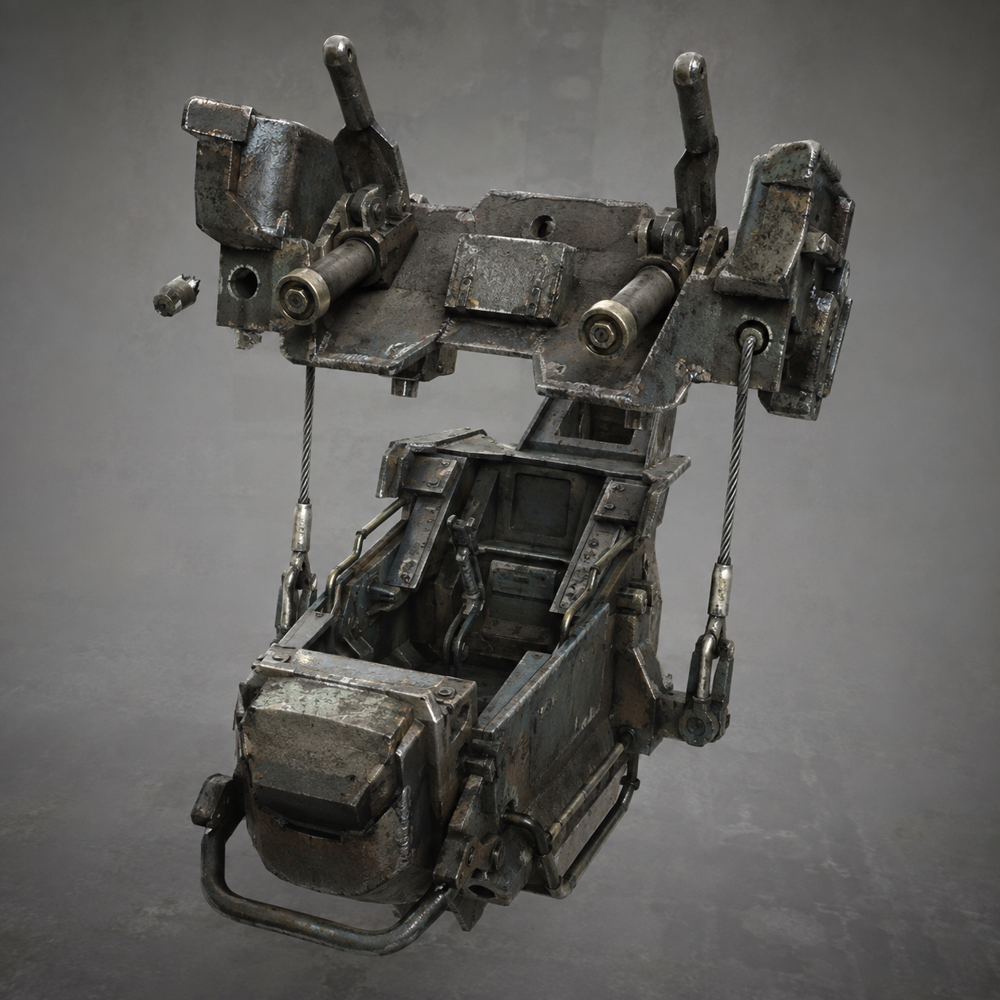

# 第80章 门把手先抓活人

总柜第六列的半圆压痕又往里凹了一点。

它不是敲门声，也不是回声，像一只隔着纸面摸索、寻找开门人的手。

陈序伸手去按压痕，苏弥一把扣住他的手腕。

“先说你要按什么。”

“按住它。”

“这不叫方案，这叫把手送进去。”

陈序的腕骨还在发麻。旧钢缆回收端与总柜之间那半寸斜缝没有合上，三号回路表停在三点六四，黑烟一号右履带卡在门槛边，右膝每隔几息就落一粒细屑。上一章留下的半段回声没有让门里东西学会说话，却让它找到了第六列的压痕。

第六列纸带随之抖了一下，陈默的交接半孔、赵庆的责任孔和那张没有身份的空白纸同时亮起。三种记录没有被合并，压痕却在三张纸之间来回试探，像在挑一只最容易扳动的门闩。

苏弥脸色变了：“它在找收件人。”

“不，它在找能被当成收件人的活人。”

陈序没回答。他看见赵庆责任纸上的淡白痕只亮了一瞬，陈默半孔退开，空白纸则被压出一道新折线。现有记录里，只有活人的责任纸能产生回弹；压痕每次都避开已经拒绝过的孔，说明它不是在认谁，而是在试谁还能替它把门推开。

总柜底部突然传来一声金属摩擦。

翻倒的白塔牵引机轮槽里，同动作猎犬抬起半边身子。它复制到的不是敲击，而是总柜纸带刚才那一下滑动。灰白机械爪沿着最省力的路线伸向陈序，黑色回收索在后面绷紧，猎犬的动作线又亮了起来。

“它要拿我试门。”陈序说。

“我退后，它会照着我退后的路线把苏弥送上去。”

陈序拽动左杆，反标准关节让黑烟一号的肩甲向下折。可右履带不能连续强转，偏心飞轮外缘又快贴到锁片，机体只挪开半步。猎犬的前爪擦过门槛，正好撞向苏弥的右手。

苏弥没有躲。她把维修缆往总柜上一挂，借缆身的回弹把自己向侧面甩开。猎犬扑空，爪尖勾住了黑烟一号胸前那块断门牌，门牌立刻翻到另一面，露出一道新鲜的白色校正线。

“它不是冲我来的。”苏弥落地后看了一眼自己的义指，“它要的是门牌上的人形缺口。”

总柜第六列的压痕忽然向陈序所在的方向弹了一下。

黑砖亮出半行字：

【收件资格试压：活人记录优先。】

下一刻，门内那根看不见的压力线穿过总柜，扯住陈序胸口共同损耗单上刚写进去的名字。左腕的疼意猛地往上窜，黑烟一号右膝同时发出咔的一声。

苏弥抓住总柜边缘：“陈序，松手！”

“松了它就把名字带走。”

“你的名字不是门栓！”

“在这地方，门栓往往比名字便宜。”

压力线又收紧半寸。共同损耗单上的墨迹开始变淡，连同左腕的麻意一起被往第六列拖。它不是在抹掉伤势，而是在把承担伤势的人从记录里剥出去。

苏弥忽然踢开黑烟一号腹侧一块结冰的检修板。

“里面还有一样东西！”

她说得直白：驾驶舱紧急脱离架的用途，是在机体被记录线锁住时，把驾驶员和半截操控舱从主机上强行分开；它不是逃跑加速器，脱离后只能靠两个人同时扳动手柄，才有机会保住操控和落点。

“我想把你的名字和它的门分开。”

“双人手动？”

“一人扳不动。你左腕不行，我右手义指也不稳。”

猎犬第二次扑来，黑索拖得轮槽吱响。陈序咬住牙钻进半开的腹舱，苏弥从另一侧伸手进去。两根手柄之间没有齿轮，只有一条绷直的钢索；一边提前，断销就会卡死，驾驶舱和主机反而会被扭成一块。

“一、二、三！”苏弥喊。

两人同时下压。

驾驶舱脱离架立刻见效。第一根断销崩断，座板向后弹出半尺，陈序与苏弥连同半截操控舱从黑烟一号胸腔里脱开。压力线抓住的共同损耗单被扯断，只带走一小片有陈序名字的纸屑；黑烟一号失去驾驶舱，左肩砸进结冰地面，右膝的细屑一下喷出。

同动作猎犬扑到了空处。

它复制了脱离前黑烟一号的前倾，却找不到驾驶舱这个落点，四足在半空各自走了不同的角度，整只猎犬横着撞上总柜底座。第六列压痕被撞得退回半孔，白色校正线断成三截。

陈序和苏弥滚进一旁的废纸槽。苏弥的右手义指彻底失去一节回弹，陈序左腕像被冰水泡过，暂时抬不起来。

“驾驶舱还连着吗？”陈序问。

“连着两根手动缆，主机不连了。不能连续走，只能一人看方向，一人扳备用杆。”

黑烟一号胸腔里传出短促报码。它没有被拿走，但共同损耗单缺了一角，右膝承重从“还能撑”变成了“只能落一次”。

总柜第六列安静了三息。

然后，半圆压痕旁边多出了一道更小的凹口。

那凹口没有去碰陈序，也没有去碰苏弥。它沿着被扯掉的纸屑，摸到了驾驶舱脱离架留下的断销孔。

黑砖只显示三行：

【收件资格：未完成。】

【试压对象：已改变。】

【下一次：从脱离处接入。】

苏弥盯着断销孔：“它学会的不是我们的动作。”

陈序扶着废纸槽站起来，望向总柜与门缝之间那条看不见的线。

“它学会了，活人会为了不被签收，主动把自己拆下来。”

第六列却缓缓向外吐出一小截新的纸带，纸带尽头，印着半枚尚未落下的手印。

陈序的左腕抬不起来，苏弥的右手少了一节回弹，黑烟一号只能再落一次承重。可那枚手印没有落在他们身上。

它落在了驾驶舱里，正好是两个人下一次必须同时握住的地方。

读者老爷们，这个门把手是该叫“拆人架”，还是“活人脱离险”？下一次若两个人必须同时握住它，先保住谁的记录、谁来承担另一边的损耗，维修站还没有第三个答案。

---

## Metadata

- chapter_number: 80
- word_count: 2109
- generated_at: 2026-08-25 21:35
- upload_status: submitted_pending_review