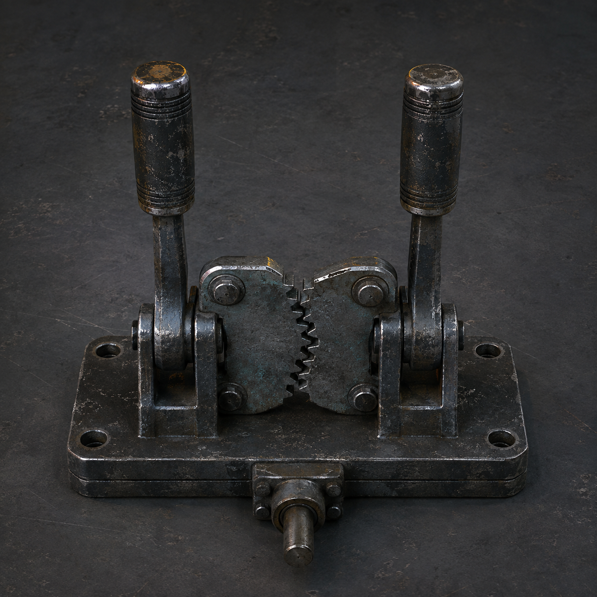

# 第81章 两个人一起背锅

半枚手印贴在驾驶舱的旧钢板上，像有人隔着一层纸，按住了两人的手背。手印一收，半截驾驶舱便沿着脱离架的断销孔往总柜方向滑了半寸。

“它在抓舱，不是在抓我们。”苏弥先看见了钢板上的划痕，“抓住驾驶舱，就能把我们两个人的有效记录一块送进去。”

“那它挺会挑快递。”陈序咬住牙，右手去摸备用杆，“问题是，舱里没有第三只手。”

泵房深处，旧钢缆回收端发出一声闷响。跨过上一次的半段回声后，这个扁平旧钢件仍只负责把压力接进三号回路、再送回原路，不能认人、不能决定开门；如今它被门内学习者压在总柜缺口旁，裂口又多了一条白线。

三号压力表从三点六四掉到三点六一。

“再掉三格，回程线会把驾驶舱当成唯一有效线路。”苏弥慢慢说，“到时候先被扣的不是谁的名字，而是两个人都在场这件事。”

她伸手摸向脱离架下方的一块锈铁板。铁板里藏着两根并列手动杆。

“双人手动联控杆。”她直说用途，“两个人同时往同一方向扳，它才把动作传给驾驶舱；它不替任何人承担记录损耗，动作不齐就会卡死。”

“听着像把锅分成两半。”

“错。它只把力分成两半。”

苏弥刚把右手搭上另一根杆，总柜第六列猛地吐出纸带。纸带拽住驾驶舱，半截舱体朝总柜滑去；同动作猎犬也从牵引机轮槽里挣出半身，四足同时落地，照着黑烟一号脱离前的前倾姿势扑来。

陈序扯下驾驶舱旁的两根传力缆：“左边是你，右边是我。数三下，别替我补动作。”

“你左腕抬不起来。”

“所以我负责不抬起来。”

猎犬撞上舱门，旧钢板向内凹了一拳。陈序的肩膀被震得发麻，手却没有松开。苏弥要把驾驶舱往左拖，陈序顺着她的方向压杆。两根杆刚动半格，底座里的错齿片便咬合，半截驾驶舱猛然横移，擦着总柜边缘停住。

猎犬扑了个空，前爪插进泵房地缝，立刻复制刚才的横移动作，四条腿却各自寻找同一个落点。

“它会学我们这一下！”苏弥喊。

“那就让它学不完整。”

陈序看见驾驶舱底下露出一截断销。脱离架第一根断销已经崩掉，剩下的销孔只能承受一次横向拉扯；再扯，舱和总柜会一起被锁住。他又看见猎犬前爪卡在地缝，动作线被地面裂口截成两段。

同一个事实摆在眼前：猎犬只能复制已经看见的完整动作，而联控杆必须两人同步；只要先让它看见不同步的假动作，再把真正的合力送向相反方向，就能让它把自己撞进裂缝。

苏弥盯着他：“你要故意卡杆？卡死了，我们连舱都保不住。”

“卡一瞬，不卡到底。你听我的数，不要听门里的回声。”

门里果然敲了两下。

陈序把右杆往前推，苏弥没有跟。错齿片发出刺耳的咔声，驾驶舱只挪了一指，猎犬立刻照着这个半动作抬爪。它扑下来的时候，陈序突然松半分，苏弥同时把左杆往后压。

两根杆没有同向。

联控底座卡住了驾驶舱，没让纸带把舱拖走。猎犬却把“前推半格、后压半格”的错动作当成一条完整路线，身体拧成横斜的一团，前爪从地缝里拔出，后腿正好踩进牵引机翻倒后留下的轮槽。

陈序等的就是这一脚。

“现在，同向！”

两人同时向右压杆。双人手动联控杆的错齿片咬住传力轴，驾驶舱没有冲出去，只把剩余的横向力送进轮槽。猎犬被自己的惯性带着撞向牵引机，胸腹卡在窄缝里，校正线从它背上抖出三道断白。

冲击力摊在传力缆上，时间拖长，平均撞击不会一下全压到脱离架。陈序把判断说成白话：“别硬顶，把它的力拖长。”

下一刻，猎犬的左前爪折进轮槽，白塔校正线骤然熄灭一截。它没有被拆毁，却暂时只剩两条腿能复制动作。

总柜也没有被拖走。第六列压痕却继续往外吐纸。

纸带先碰到苏弥的手背，再绕过联控杆，最后停在陈序的左腕旁。上面没有姓名，只有两道并列的浅孔。

“它没决定扣谁。”苏弥看着孔位，“它在等我们自己把两个人排成一条线路。”

“那就不排。”

陈序抓住联控底座，硬把两根杆从脱离架上拔出。底座下的短传力轴随之断裂，驾驶舱失去横移能力，半枚手印也从钢板上剥落，落进总柜第六列。

代价立刻找上来。陈序左腕彻底垂下，苏弥右手剩下的一根义指卡在回弹位置；三号回路从三点六一降到三点五八，黑烟一号胸腔里传出一声闷裂，右膝最后一次承重被提前用掉。

但纸带没有落孔。

驾驶舱还在他们这边，猎犬也被卡住。苏弥用肩膀顶住舱门，望着两根断掉的联控杆：“你把能一起用的东西拆了。”

“留着它，下一次门里就有完整的两只手。”

“那我们下一次拿什么推门？”

陈序抬不起左腕，只能用下巴点向猎犬背后的牵引机：“拿它。白塔的机器至少还知道往前走。”

牵引机轮槽里忽然传出第三声落轴。

这次不是第六列。

总柜底部那条看不见的线，绕过驾驶舱，伸向被猎犬压住的牵引机。黑砖浮出一行新字：

【收件资格：两人并列，未完成。】

苏弥没有问来源。她把断裂的联控杆塞进陈序还能活动的右手里，自己用肩膀抵住另一端。

“先把猎犬拖出来。”她说，“它压着的不是门，是我们的退路。”

陈序看着她被冻红的脸：“这回谁承担损耗？”

苏弥把剩下那根义指往卡死的位置又推了一格。

“先别急着替我决定。”

门内的纸带，终于在两道并列浅孔之间，落下了第一枚黑色小孔。

读者老爷们，这次该判“双人联控杆”先拆，还是判它把锅分得不够平均？下一章若必须把被猎犬压住的牵引机拖出来，先保退路的人，还是先保那条正在落孔的记录，维修站还没填完这张工单。

---

## Metadata

- chapter_number: 81
- word_count: 2166
- generated_at: 2026-08-26 02:33
- upload_status: submitted_pending_review