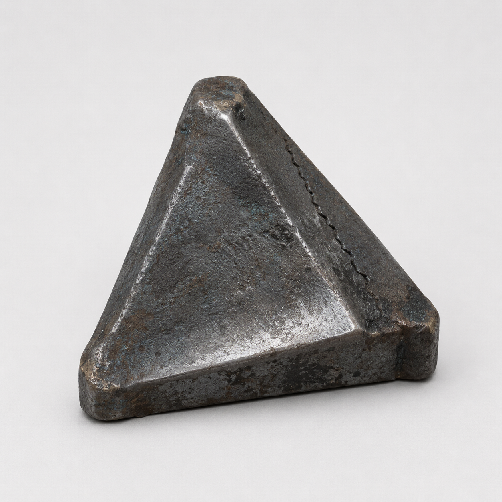

# 第82章 先把这口锅劈成两半

<!-- upload_status: not_uploaded -->
<!-- scheduled_publish: 2026-08-30 12:00 -->
<!-- image: ../images/items/triangular-backpressure-wedge-v1.png -->

总柜第六列落下第一枚黑孔时，陈序正用一只不能抬高的左手，按住苏弥的肩。

“别往后退。”他说，“后面是驾驶舱，前面是猎犬。你退一步，它就能把我们三个算成一条记录。”

苏弥没有问“三个”怎么算。她看着黑孔边缘的纸带像湿舌头一样往外探，立刻把右手那根卡死的义指抵在地面：“牵引机还压着猎犬。先拖机，不然它从轮槽里拔出来，第一口咬的就是驾驶舱。”

“你的手还能用？”

“一根能。你呢？”

“我左手负责疼，右手负责装没事。”

陈序踢了踢脚边的废料箱。里面没有能承重的钢板，只有一块三角形旧铸件，边缘磨成了三道不同深浅的斜面。他把它拽出来，先对苏弥说：“这是三角回压楔，用途是把门里回压分成两股，免得一整条记录被它拖走。楔面不同，受力方向也不同；它不是挡板，撑不住第二次整压。”

苏弥盯着那块脏得像烤糊面包的东西：“你什么时候捡的？”

“刚才。废墟里唯一看起来比我们更不想负责的零件。”

黑孔又往前爬了一寸。驾驶舱底板随之发出细响，半枚手印贴在旧钢板上，五根指痕一起收紧。苏弥的义指被那股回压掰得发白，驾驶舱向总柜滑了半寸。

陈序把回压楔塞进舱底和总柜的夹角，最深的斜面朝门，浅面朝人。他没有试着硬顶，而是把右肩贴上楔背：“现在，拖牵引机。”

“你要用黑烟一号？”

“它右膝只剩最后一次承重。”

“那就不是拖，是把最后一口气借给钢。”

“借完记得收利息。”

苏弥咬住牙，用还能动的义指拨开驾驶舱下的维修缆。陈序把断掉的双人联控杆底座从舱内拽出来。那两根杆已经不能同向传力，他仍把一根压在左脚边，另一根交给苏弥。

“旧杆不是完整联控了。”苏弥说。

“我知道。今天让它干点不完整的活。”

远处的同动作猎犬终于动了。

它的左前爪还折在牵引机轮槽里，身体却把剩下的两条后腿同时蹬直。那是它看见过的最标准扑击，标准到连积雪落下的角度都像被谁画过。它没有判断我们是谁，只是复制一条已经存在的路线。

陈序看了一眼轮槽，又看了一眼牵引机侧面的断轴。

问题很简单：牵引机被猎犬压住，驾驶舱被总柜拖走，黑烟一号不能再承重。若先拽猎犬，舱会进孔；若先顶舱，猎犬会脱槽。唯一能同时做两件事的，是让牵引机先转半圈，把轮槽从猎犬腹下翻出来，再让它自己的扑击把自己压回去。

依据也在眼前：猎犬只能复制完整动作，左前爪却被轮槽截断；回压楔能把总柜的拉力分开，双杆底座还能把两人的不同步动作传给驾驶舱。陈序把判断说给苏弥听：“它要完整路线，我们给它一条缺腿的。你先松，等我喊再一起压。”

“不同步会卡死。”

“卡死总比拖走强。”

苏弥先松了半指。

牵引机猛地转动。猎犬复制她的松动作，后腿向后一缩，身体却被左前爪拽住，腰腹撞在轮槽上。陈序趁机把右杆往前压，苏弥故意慢半拍，驾驶舱底座立刻发出一声尖响。

双杆卡住了。

黑孔边缘的纸带顺着驾驶舱底板往上爬，擦过陈序的手腕。那只左手瞬间失去知觉，五根手指像被别人借走。

“陈序！”

“别齐！它在等我们齐！”

猎犬抬起半边身体，重复了陈序那一下前压。它的右后腿踩上断轴，左前爪仍在轮槽里，整只兽被拧成一个不完整的弧。牵引机借着回压楔分开的两股力，向外翻了半圈。

陈序看见轮槽松开一格，立即喊：“现在！”

两根杆同时压下。

这一次没有完整动作可供猎犬复制。驾驶舱被双杆底座横向顶住，回压楔的浅面把总柜拉力送向地面，深面则把半截舱体推回陈序和苏弥这边。猎犬扑过来的那一刻，自己的左前爪终于从轮槽里拔出，却正好踩进牵引机翻起的断轴孔。

钢爪折了一声。

猎犬没有叫。它只是继续复制那条扑击，于是后两腿一次次把身体往断轴孔里送。每一次重复，轮槽就多压它一分。

陈序用肩膀顶住驾驶舱，笑得像在给坏机器做售后：“客户您好，您的动作已经重复成功，损坏属于自愿。”

苏弥没有笑。她看着三号压力表从三点五八掉到三点四九，咬住了嘴唇：“回压楔裂了。”

“那就把它用完。”

“用完以后呢？”

“以后再找一块不想负责的。”

她忽然抬头：“不行。驾驶舱里还有人。”

这句话比压力表更重。门内的半枚手印再次贴上钢板，像有人隔着门学会了她说话的节奏。黑孔没有继续扩大，却在两道并列浅孔之间往下落了一点黑屑。

苏弥看懂了那点黑屑，脸色变冷：“它不是只想拖走驾驶舱。它在试着把我们的两条救援记录并成一条。”

“那就不让它拿到完整的一条。”

陈序把右杆松开，反手将自己的名字按进共同损耗单的缺角。纸面没有立刻亮，反而把他左腕的麻意往上推了一截。他的判断并不来自相信门里是谁，而来自眼前的结果：楔子裂了一道，猎犬被卡住，驾驶舱仍在这边；如果继续把三号回路当诱饵，下一次被拖走的可能就是某个人的有效记录。

他对苏弥说：“现在分开记。你保驾驶舱，我保牵引机。谁先松手，谁就把自己的代价说清楚。”

苏弥盯了他两秒，忽然把那根卡死的义指狠狠掰直，压住了舱底。

“我不替你保。”

“那你保什么？”

“保我自己决定救谁。”

她一脚踹断回压楔剩下的薄角。

总柜的拉力骤然失去一股支点，黑孔边缘向驾驶舱扑来。陈序没有再喊同步，直接把右杆扳向反方向。苏弥也扳了，但不是同一个方向。

驾驶舱被两股力量夹在半寸缝里，反而没有移动。猎犬复制了他们最后看见的两条路线，身体向左右各偏了一下，断轴孔里的钢爪彻底卡死。

牵引机停了。

驾驶舱也停了。

三号回路却从三点四九跳到三点四七，黑孔像吃饱一样闭合了一线。

陈序的左腕垂得更低，苏弥右手最后一根义指停在弯曲的位置。回压楔裂成两半，黑烟一号右膝传来最后一声闷响，承重彻底归零。

他们救下了驾驶舱，暂时拖住了猎犬，也把牵引机从门口拖出了半个轮宽。

这是今天唯一算得上的胜利。

苏弥喘着气，把那半块楔子捡起来：“它还能用吗？”

“能。”陈序说，“下次只能用一次，而且会把哪一条记录先裂开，交给它自己选。”

“来源呢？”

“不知道。”

“上限？”

“一次。”

“代价？”

陈序看向自己的左腕：“已经开始收了。”

门内忽然传来一声轻响。

不是敲门。

是有人在驾驶舱另一侧，学着苏弥刚才的那句话，慢慢说出了后半句：

“我决定……救谁。”

总柜第六列的黑孔随之翻面，露出一小截还没有落下的白纸。白纸上只有两个并列的空位，分别对着陈序和苏弥。

苏弥握紧卡死的义指：“它在让我们选一个。”

陈序盯着那两个空位，伸手挡住了其中一个。

“不。”他说，“它是在学我们怎么选。”

---

## Metadata

- chapter_number: 82
- word_count: 2794
- generated_at: 2026-08-26 03:00
- upload_status: not_uploaded
