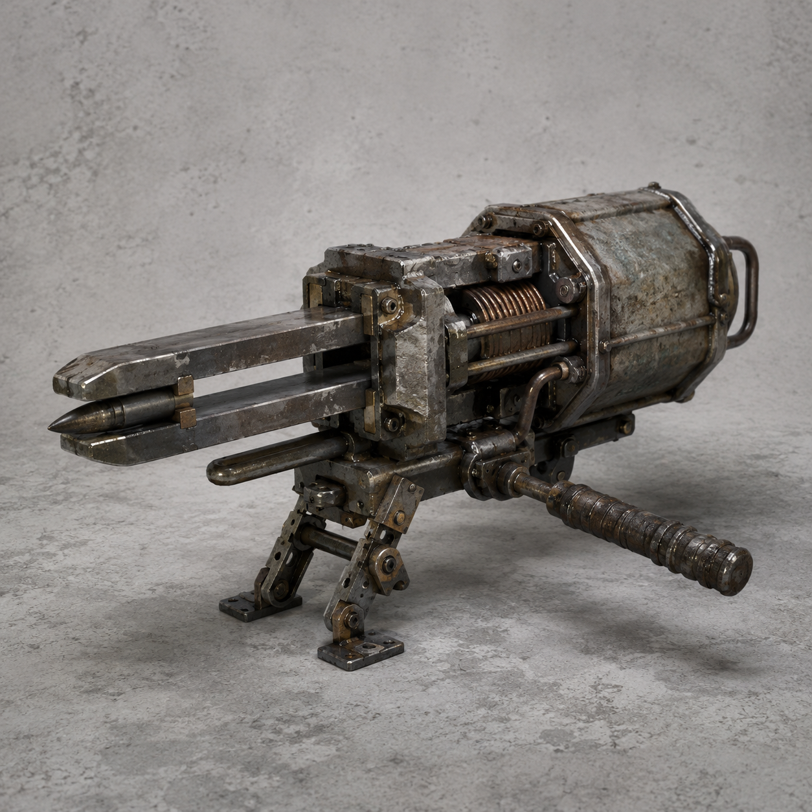

# 第83章 先把射程压低

总柜第六列的两个并列空位还没落下，泵房外先亮起了三道冷白的线。

陈序把半截驾驶舱拖到牵引机后面，才看清那不是校正光。白塔的声音从泵房顶梁上传下来，平稳得像在报一张迟到的维修单：“临川外环，复杂度收容。交出一名，保留一条。”

苏弥按住右手那根卡死的义指，脸色比冰还白：“它们来了。”

顶梁被一发钢钉打穿。短粗的黑钉擦着陈序的耳侧，钉进地面，尾端还在震。第二发紧跟着咬住牵引机的外壳，把半个轮宽重新钉回门槛。

陈序抬头，看见三台瘦长机甲沿泵房上层走廊压下来。它们的装甲没有多余棱角，肩上各架着一支短粗的重工具。苏弥一眼认出来：“磁轨钉枪。两条磁轨把钢钉推出去，中距离能直接钉住履带。固定架不落地，反冲会把枪和人一起掀翻。”

第三发钢钉打来，陈序拽着苏弥滚进总柜阴影。钉子穿过废铁板，尾部震得嗡嗡响。黑烟一号右膝已经彻底不能承重，牵引机的轮槽还卡着同动作猎犬，驾驶舱只能靠两条维修缆拖着走。硬冲上去，等于拿最后一条腿给岳无缺试刀。

“它们在逼我们排队。”苏弥看着三台机甲的站位，“前面一台封门，左右两台交叉射击。谁先露头，谁就会被钉在地上。”

陈序摸到脚边的断轴孔，又看了一眼牵引机。猎犬的左前爪仍折在轮槽里，剩下两条后腿不停复制他们刚才拖拽的动作。它不是援军，却把白塔的第一条射界挡住了。

一枚钢钉擦过总柜边缘，震落半片黑漆。陈序看见钉子的方向，忽然问：“苏弥，你的右手还能推一下吗？”

“能。推完可能彻底卡死。”

“那就推牵引机，不推驾驶舱。”

苏弥盯着他：“你想让它们先钉猎犬？”

“不。让它们以为我们要救猎犬。”

陈序把一根维修缆绕过牵引机前轮，先把缆头故意拖到门口。白塔左侧机甲立即抬枪，固定架咔的一声落在地面。陈序等的就是这一下。他冲出去半步，右肩撞上牵引机侧板，扯缆向左。

钢钉出膛。

猎犬照着他这半个动作扑来，钢钉却没有钉中它，而是钉进了牵引机旁边的断轴孔。磁轨钉枪的反冲把左侧机甲往后一掀，脚下那块薄冰塌开，它的枪口立刻偏了。

“现在！”陈序喊。

苏弥用卡死的义指压住维修缆，右手只推出半寸。牵引机被两股力夹住，轮槽从猎犬腹下翻出一线。猎犬复制她的半寸推力，身体却因为前爪卡住而向后折，刚抬起的两条后腿撞上自己的尾部。

它没有学会停，反而把不完整的动作重复了三遍。每一遍都把轮槽撑开一点。

上层第二台机甲落地，磁轨钉枪的双脚固定架压碎水泥。它没有瞄准人，而是瞄准牵引机与总柜之间那条维修缆。陈序看见枪口下沉，知道这一发若打断缆，驾驶舱会被总柜拖回黑孔。

他没有冲过去挡。

“苏弥，松缆！”

苏弥愣了一下：“松了，牵引机就掉回去。”

“不松，断的是你。”

她咬住嘴唇，先把缆头从自己肩下抽出，再猛地松手。钢钉擦着缆身钉进总柜，缆没有断，牵引机却因失去一侧牵引向外滑了半个轮宽。猎犬被带出轮槽，四条腿同时落地。

它终于获得了一条完整动作。

同动作猎犬扑向最近的白塔机甲。

白塔机甲抬枪、退步、重新固定，动作整齐得像一条已经写好的命令。猎犬把这套完整动作原样复制过去，前爪却在最后一步故意踩上刚才那枚钢钉的尾端。

钢钉一震，白塔机甲的固定架先被自己的反冲掀翻。磁轨钉枪砸向地面，第二台机甲被枪身拖得跪下，射界顿时压低。

陈序拖着左腕冲到牵引机旁，抓住驾驶舱外壳：“苏弥，先把它拖出来！”

“那猎犬呢？”

“它会自己找不平。”

苏弥没有再问。她用还能动的义指扣住维修缆，陈序用右手把牵引机的断轴孔卡进门槛。两人一前一后发力，半截牵引机终于从黑孔边缘脱出，轮子落在泵房的碎冰上。

第三台白塔机甲却已经从侧面绕来。它没有追猎犬，枪口直指驾驶舱里那张半截手印。

陈序看见那枚手印，忽然想起第六列的两个空位。门内东西不是在等他们选谁，它在收集他们每一次“先救谁”的动作。

他把身体挡在手印前面。

苏弥却一把拽住他的衣领，把他拖向另一侧：“别替我挡。你挡住了，它就只会记住你。”

“那你呢？”

“我负责让它记错。”

她抄起半块已经裂开的三角回压楔。这个楔子最多再承受一次整压，第二次一定会沿裂纹断开。苏弥没有把它塞进门缝，而是塞进磁轨钉枪的固定架下。

白塔机甲扣下扳机。

钢钉出膛，反冲沿固定架压下。裂楔把压力分成两股，一股送进碎冰，一股顶回枪身。磁轨钉枪没有打穿驾驶舱，枪口却偏向了旁边的总柜。

第六列的两个空位同时亮了一下。

随后，半块回压楔从固定架下炸成两片。苏弥的右手义指彻底失去回弹，陈序左腕的麻意一路窜到肩膀。那台白塔机甲被反冲掀翻，磁轨钉枪滚进积水，短时间内再也抬不起枪口。

泵房里只剩猎犬撞击铁架的声音，和牵引机拖出冰面的喘响。

他们保住了驾驶舱，也把三台白塔机甲的射界压低了一层。可总柜第六列没有恢复，两个并列空位反而各自多出一条细黑边，像两扇同时学会了开合的门。

门内传来岳无缺的声音。

“陈序，苏弥。”

他叫得很准，准得不像隔着一座泵房。

“你们可以不选。”

第三台白塔机甲重新撑起磁轨钉枪，枪口却没有对准他们，而是对准了泵房外那条通往维修站的热管。

“但维修站会替你们选。”

总柜第六列的第一枚黑孔，朝着热管方向缓缓转了一格。

---

## Metadata

- chapter_number: 83
- word_count: 2230
- generated_at: 2026-08-26 04:10
- upload_status: not_uploaded
