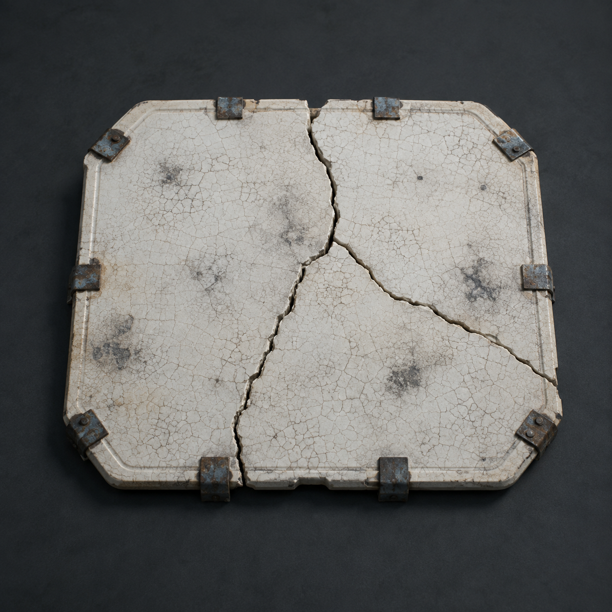

# 第84章 先让热管喘口气

热管外壁已经红到发白。

陈序站在半截驾驶舱旁，左腕麻得像不是自己的，右手却还按着牵引机的制动柄。泵房外那台白塔机甲重新架起磁轨钉枪——那是用钢钉固定结构、必须靠落地架承受反冲的重工具，枪口正压在热管上。只要这一钉落下，维修站的主供暖管会先被打穿，热水冲进冰层，里面那群还没撤走的居民一个也跑不了。

总柜第六列的两个黑孔仍朝着陈序和苏弥。门内岳无缺的声音没有催促，反而像在替他们留时间：“交出一名，热管保留。”

“这人说话真有售后。”陈序抬头，“货没发全，先要我们签收。”

“你还有十秒。”岳无缺说。

苏弥看了一眼总柜，又看热管：“两个空位正在收集我们选择谁。先保热管，等于把选择写成维修站替我们作出；先护空位，热管会断。”

第三台白塔机甲的固定架落地。钢钉尾端在枪口里微微发亮。

陈序看见枪身下方那圈发黑的散热鳍片，忽然转身冲向被掀翻的第二台机甲。磁轨钉枪跨在它旁边，枪身已经被反冲撞出裂缝，里面露出一片乳白色薄板。

苏弥追上来：“那是陶瓷散热片，用来把枪管和磁轨的热量摊开。它不是护甲，挨一发就会碎。”

“能不能让它先替热管喘口气？”

“只能撑住一次热冲，不能挡钢钉。”

“一次够我们把工单改成两份。”

陈序撬下陶瓷散热片，烫得掌心起了一层白泡。他没有把它塞进热管，而是把薄片横卡在第三台机甲的枪架与地面之间。陶瓷片先吸住枪架传来的热，乳白表面立刻裂出蛛网纹，枪口却被抬高了半寸。

白塔机甲扣下扳机。

钢钉擦着热管上沿飞过，钉进后方的冰墙。热管没有破，管壁却被震出一条长长的凹痕。

“这叫保住了？”苏弥问。

“工具还在，当然算。”

裂纹爬满陶瓷片，第三台机甲的固定架往下压。陈序抓住枪身，肩膀被热浪烫得发麻，左腕立刻失去力气。白塔机甲的机械臂顺势一拧，枪口重新指向热管。

苏弥没有去扶他。她抄起半截维修缆，绕过泵房立柱，先把缆头扣在热管下方的旧支架上。

“你要做什么？”陈序问。

“让热管先成为支点。”

她猛地收缆。热管被拽得向下沉，枪口跟着偏开，白塔机甲的钢钉打进地面。冲击沿地面传来，陶瓷散热片终于碎成三块。

“散热片没了。”陈序说。

“它的用途是撑一次，不是替你活着。”

白塔机甲抬腿踩向苏弥。陈序松开枪身，扑过去撞她的肩。两人滚进驾驶舱后方，机甲的脚掌砸中旧支架，热管下沉的角度被踩回去，红白色管壁开始鼓起。

警报声从维修站深处传来。不是白塔的播报，是锈钉在用左臂残留的撞击键敲门。

“热源故障！热源故障！建议所有人员保持冷静并把锅交给陈序！”

泵房外传来一片骂声。几个居民从维修站门后探出头，手里抱着拆下来的暖水桶。有人喊：“站长，今天谁签热管？”

陈序看见那群人没有逃，反而把暖水桶一只只压到热管支架旁。重量很小，却把下沉的管壁稳住了。

他对苏弥说：“你看，工具回归工具本位了。”

“别把人也说成工具。”

“他们是自愿的支架。”

“那就先问。”

陈序转身朝门口吼：“谁愿意压住热管，自己报名字；不愿意的退后，谁也不替你签！”

居民们互相看了一眼。第一个抱桶的老人报了名字，第二个女人把桶放下，说自己只压十秒，第三个人则把桶推回去：“我不压，但我能把孩子带到北墙。”

总柜第六列的两个黑孔同时一滞。

它没有得到一份整齐的选择。

第三台白塔机甲却已经再次装填。陈序看见枪口的热色比刚才更深，便明白陶瓷散热片碎掉不是终点：枪连续射击，磁轨会先过热，下一发必然需要更久的固定时间。

“苏弥，十秒够不够？”

“给我八秒。”

她把自己的纸质记录卡塞进驾驶舱的半截手印里，右手卡死的义指压住卡片边缘：“我不替你选，也不替他们选。但我可以让它记住，选择不是一个动作。”

陈序听懂了。他拖着失去力气的左腕，故意把牵引机的断轴孔对准白塔机甲，右手扳下制动柄。黑烟一号没有冲撞，反而让右履带在碎冰上空转，冰屑飞向枪架。

白塔机甲抬枪避开冰屑，动作短了一拍。同动作猎犬从翻倒机甲后扑出，复制的正是这次抬枪。它的前爪踩上碎裂的陶瓷片，脚底打滑，整具身体撞进固定架。

钢钉终于出膛，却被撞得斜飞，钉穿了白塔机甲自己的肩甲。它踉跄跪下，磁轨钉枪滚到热管旁。

陈序冲过去，先把枪踢远，再用钢缆扣住枪身：“这东西借我用十秒。”

苏弥盯着他：“新武器先说用途。”

“它能把钢钉钉进结构，固定东西；反冲会把没落地的人和枪一起掀翻。”

“你要钉什么？”

陈序抬头看向总柜第六列，又看向那条仍在发白的热管。

“钉住它们的选择。”

他把磁轨钉枪的固定架踩进地面，扣动扳机。

钢钉穿过废铁支架，钉住热管旁那块正在下沉的旧承力梁。热管停住了，居民们压住的支架没有塌，两个黑孔却同时把白纸往外吐了一寸。

纸上没有陈序，也没有苏弥的名字。

只有一行刚刚显出来的字：

“自愿承担者，是否算收件人？”

岳无缺的声音第一次停了半拍。

陈序握着发烫的枪柄，朝总柜笑了一下：“这题你们最好别替人答。”

---

## Metadata

- chapter_number: 84
- word_count: 2032
- generated_at: 2026-08-26 08:04
- upload_status: not_uploaded
