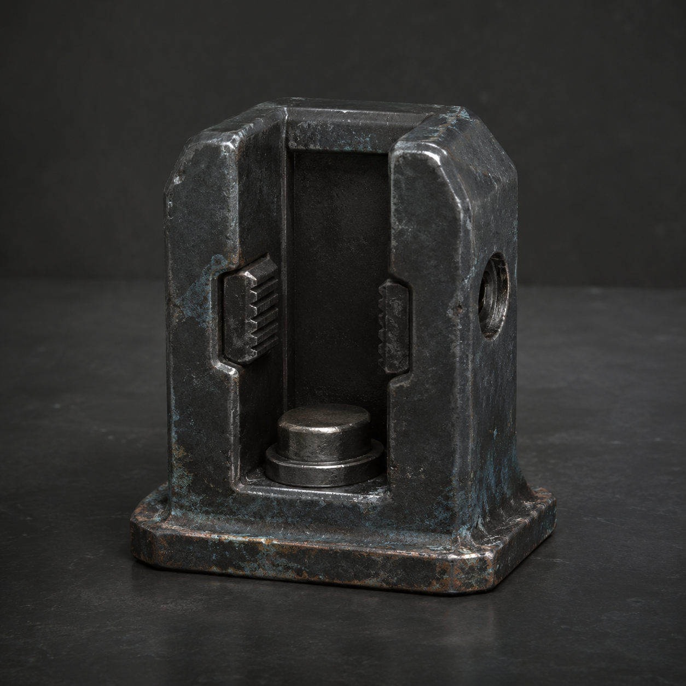

# 第88章 正式收件不能靠抽签

第二条热管的白裂纹像一只刚睁开的眼，贴着北墙上方慢慢往两边爬。

陈序站在黑烟一号的左脚踏板上，左腕麻意已经爬到肩窝。右膝不敢用力，机体右履带只靠门槛托着，像个嘴硬但站不稳的老工人。北墙下的人都看着他，没人再笑“维修站可以送锅”，因为那口锅正在墙外烧红。

“倒计时二十七秒。”锈钉的播报从门后传来，“请提交正式收件人。未提交，随机抽取相似站长一名。”

陈序回头：“随机抽谁？”

“相似度最高者。”

“那你先把自己报上去。”

锈钉沉默了一息：“我不具备人类收件资格。”

苏弥把右手按在驾驶舱边缘，义指仍卡死。她看着那道白裂纹，又看向北墙下的人：“它不是要最勇敢的人。它要一个能被记录、能本人确认、也能承担后果的人。”

陈序看见了三件事：播报说的是“相似站长”，不是“自愿者”；黑孔没有再吐出两个并列空位；而刚才居民一左一右站开，只留下了见证，没有人被登记。系统缺的不是一双手，是一份不能被别人替写的确认。

“所以不能让人站上来替我。”陈序说。

“也不能让你替别人。”苏弥接得很快，“上一回你差点把我的选择改成你的善良。”

这句话像一根细钉，钉在他胸口。热管又响了一声，墙外的白塔机甲同时抬臂，校正光压进裂缝，北墙下立刻有人抱住孩子往后退。

陈序拍了拍黑烟一号的驾驶舱：“那就让系统看见真正的本人。”

“你要报自己？”苏弥问。

“我要先问你。”

他没有伸手去拉她。上一次替她接缆，黑孔把善意也算成了代收；这一次他只把一块冻硬的纸板递到她面前，停在她能自己拿到的位置。

苏弥盯着纸板，忽然笑了一下：“你学会把手停在别人够得着的地方了。”

“维修经验。手伸太快，容易被系统当成抢修。”

门后传来金属滑动声。总柜底部弹出一件新东西：正式收件槽。它的用途先被锈钉说得很直白：“把本人确认的正式收件人固定在工单上，防止旁观、代签和自愿动作被算成收件；不能替人承担损耗，最多固定一次，确认后锁死。”

陈序看见那只黑灰铸钢短槽，槽口两道夹棱已经结着霜，侧面的回执孔却在吐冷白气。苏弥伸手碰了碰确认栓，立刻缩回：“它只给一次。”

“够了。”陈序说，“至少比婚礼司仪诚实。”

“你先问清楚代价。”

“代价是什么？”陈序冲门后问。

锈钉没有回答，槽侧只落下一声脆响。回执孔里弹出半片白纸：确认人承担一次结构损耗；来源未标明；上限未标明。

“这叫售后只报三成。”陈序把白纸夹在指间，“剩下七成等客户自己发现。”

“结构损耗就是确认人自己的身体或设备，立刻少掉一块还能用的承力。”苏弥说。

墙外轰的一声，校正光把热管压出第二道细裂。白塔机甲的枪口越过北墙，正对黑烟一号的驾驶舱。

“我来。”苏弥说。

陈序看着她：“你右手不能动。”

“正式收件不靠右手。”她把纸板压进槽口，用左手按住自己的名字那一栏，“靠我本人说。”

白塔机甲开火前，黑烟一号猛地侧身。陈序没有启动动力，只用左脚踏门槛、右肩压住制动杆，把机体横着挪了半个身位。炮光擦过驾驶舱顶，冻水珠像一把碎玻璃砸下来。右履带发出空转声，最后一层承力面又掉下一片铁屑。

苏弥被震得撞上槽边，确认栓却没有落下。

“还不算？”陈序问。

“她只说了名字。”锈钉播报，“请本人确认收件对象。”

苏弥抬头看向热管，又看向北墙后躲着的居民：“我确认，收件对象是第二条热管的故障事实，不是热管旁的人，不是维修站，也不是陈序。”

这句话落下，槽口两道夹棱同时收紧。白纸上的字没有扩成她的名字，反而浮出一行更短的黑痕：苏弥，本人确认，正式收件。

黑孔没有合上。它吐出一条细线，沿着槽底爬向她的右手义指。苏弥脸色一白，却没有把手抽开。

“别替我。”她说。

陈序咬住牙，把黑烟一号的肩甲撞向北墙。机体借墙反弹，正好撞偏第二台白塔机甲的校正光；第一台机甲的机械臂却抓住了热管支架，三根钢梁同时发出呻吟。

苏弥按下确认栓。

咔的一声，正式收件槽锁死。它没有替她挡住损耗，反而把一次结构损耗清清楚楚送进她右手。最后一根还能回弹的义指彻底停住，槽侧回执孔吐出完整结果：收件人已固定，故障事实已送出，代价由本人承担。

热管的白裂纹停了。

北墙下先有人吸气，随后一个抱孩子的老人拍了一下手。另一个居民赶紧拦住他：“单手鼓掌不算收件！”

老人把手缩回去：“那我用眼神鼓。”

这一次，陈序没有替他们决定该不该鼓掌。他只把黑烟一号往前顶，肩甲撞断白塔机甲抓住支架的机械臂。白塔机甲后退一步，校正光扫空，第二条热管终于不再继续裂开。

黑孔安静了片刻，吐出新的回执：正式收件已成立。下一次回程前，收件人将承担一次更换代价。

来源没有写，上限没有写，只有最后四个字像钉子一样留在纸上：更换对象待定。

苏弥看着自己彻底不动的右手，低声道：“它不是在问谁愿意。”

陈序把那半片白纸折好，塞回槽边：“它在等谁先承认，自己也会坏。”

门后的锈钉忽然补了一句：“评论建议命名已开放：自送自收，或锅的回旋镖。”

北墙下立刻吵成一片。有人说该叫“本人签收不包修”，有人说叫“锅别回头”。第三个名字没人敢先喊。

陈序抬头看向黑孔。黑孔深处传来岳无缺半截的声音：“收件人已固定。现在，请维修站更换它。”

苏弥的右手在冷风里轻轻一颤，正式收件槽的锁死声又响了一遍。

---

## Metadata

- chapter_number: 88
- word_count: 2161
- generated_at: 2026-08-26 11:00
- upload_status: not_uploaded
