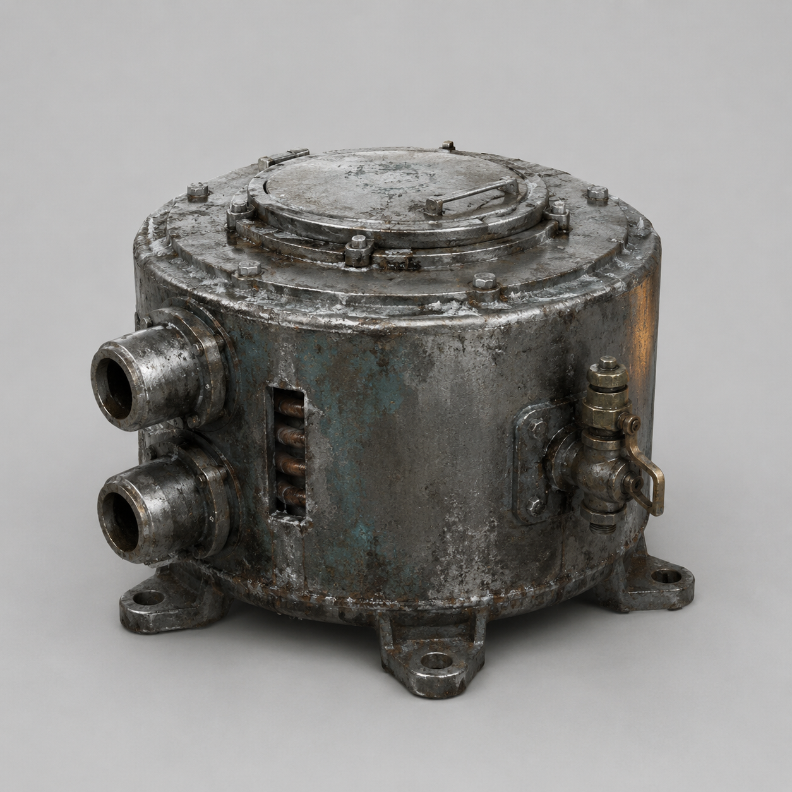

# 第91章 锅炉心先烧谁的手

正式收件槽的锁死声还在门后回荡，红光已经沿冰面追了回来。

苏弥没握陈序伸来的手，只把写着“更换对象待定”的白纸夹在两人中间。她右手义指彻底僵住，左肩也在发硬。

“先说好，”苏弥盯着纸背，“我进槽，不等于你替我选人。”

“我连握手都得先填申请。”陈序说，“上次替你接缆，差点把善良算成收件。”

门缝里的红光忽然一缩。黑孔吐出半行新字：更换对象未提交，热源回程关闭。

锈钉播报：“通往工业母机的回程缝只剩九十秒；工业母机是能拆出大型维修件的旧工厂，回程缝关闭后，维修站失去下一次移动能力。”

黑烟一号右履带不能强转，右膝不承重，左腕麻意越过肩窝。背后的牵引缝露出一截冒热气的旧钢轨，工业母机就在轨道尽头，那里有能补压的锅炉核心。

“走。”他说。

苏弥没有动：“你想拿新东西替换旧东西，先说清楚它会坏在哪里。”

“那就边抢边说明。”陈序一脚踢开门槛上的冻渣，“死在说明书里，不报销。”

两台白塔机甲同时压过北墙。第一台的机械臂砸向红光通道，第二台把校正光横扫过地面。陈序没有让黑烟一号直冲，右履带一转便空滑，机体像一口没端稳的铁锅横着甩出去。光束擦过肩甲，旧漆连同一块薄钢皮飞了。

苏弥用左手把废钢索套上门柱：“三台机甲被前后墙卡住。你撞第一台，它会把力传给第二台。”

“那我不撞它。”

陈序猛拉废钢索，黑烟一号借着门柱反向滑行，肩甲擦着第一台机甲的腿侧过去。白塔机甲顺势踏空，半条腿陷进盐坑。它没有倒，反而抬臂抓住黑烟一号背部的破损门牌。

“抓住了！”锈钉播报。

“它抓的是废铁，不是我。”陈序咬牙，“这也算售后认领？”

白塔机甲往后一拽，黑烟一号的右履带被迫承重，履带齿发出脆裂声。陈序左腕失力，机体被拖回红光里半步。苏弥蹲下，把废钢索绕过盐坑里突出的旧轨。

“你刚才说不撞。”

“我改成让它撞自己。”

她一把拉紧钢索。白塔机甲的后撤力被旧轨拦住，黑烟一号背部门牌先被扯弯，随后像一块歪楔子把机甲的脚跟别住。第一台机甲的机械臂砸空，拳头落进盐坑，整条手臂卡在冻硬的盐壳里。

“局部脱开。”苏弥说，“代价是你的门牌彻底不能承重了。”

“门牌早就不是门牌了。”陈序喘着气，“现在是欠条。”

两人冲进工业母机废料仓。成排旧锅炉像冻死的兽骨，最里面一只矮圆筒从母机底架滑落，四个安装耳砸出黑灰粉尘。

“那是临时锅炉心。”苏弥直说，“用途是把废热和燃料变成黑烟一号履带、液压动作需要的短时蒸汽压力；密封件已经老化，连续高压会漏热，烧坏密封圈。它不是无限能源。”

陈序抬手就要搬。苏弥按住他：“先看两条蒸汽管和泄压阀。接口对不上，硬接会把压力送进驾驶舱。”

门外传来拖地声。第二台白塔机甲撞开盐坑边缘，校正光切进仓门。锅炉外壳冻霜融开，说明里面还有废热。

“两条管接履带液压，泄压阀朝外。”他判断，“我们只需要它撑一次离库，不让它连续高压。”

“为什么不接主锅炉？”

“主锅炉还在母机里。搬不走。”

陈序把黑烟一号的备用牵引钩插进锅炉心底部。钩子只够拖，不够抬；他用一块废轨垫在锅炉心下方，把拖力分到地面。白塔机甲冲进仓门，机械臂横扫过来。陈序猛拉，锅炉心沿废轨滑出半米，机甲的拳头砸在母机立柱上，整座废料仓震得落灰。

锈钉举起铁牌：“物料出库需登记责任人。”

“登记白塔。”陈序喊。

“白塔拒绝签字。”

苏弥把纸卡塞进锈钉胸前：“那就只记‘白塔机甲造成仓门阻塞’，不替任何人签收。”

锈钉停顿：“理解。坏事可以记，坏人不代签。”

陈序把锅炉心拖到黑烟一号腹下。两条蒸汽管一接，泄压阀朝向盐坑。他扳开检修盖，里面旧铜管只剩一圈，冻霜贴着焊缝。

“现在最要紧的是离库，不是把它修成新锅。”苏弥把左手压在另一根接管上，“压力起来后，只能撑一次冲程。你若连续拉满，密封圈会先烧。”

“收到。锅烧一次就算熟。”

白塔机甲从烟尘里扑来。陈序扳开泄压阀，短促蒸汽轰进黑烟一号的液压缸。机体没有站直，只把右履带向前推了半米；第二股压力紧接着冲入另一侧，黑烟一号借废轨低摩擦猛然滑出。

白塔机甲抓空，五指砸穿锅炉心外壳。苏弥用肩顶住接管，把裂口从机甲指缝里挤开，左肩旧伤重新裂开。

“再来一次！”陈序喊。

“再来，密封圈就烧。”

陈序看见黑烟一号已经滑到回程缝边，也看见白塔机甲把半截手指插进锅炉心裂口。继续加压能撞开它，锅炉心会报废；停下，机甲会把他们连同核心一起拖回母机。

他松开主阀，只保留泄压阀的回弹。

机体速度立刻降下来。白塔机甲露出一线空隙，手臂往后一收，锅炉心被扯得离地。

“你又心软？”苏弥问。

“我在给它留一口气。”陈序把废轨上的牵引钩猛地横拧，“锅炉要是只会全开全关，跟白塔也没区别。”

他用半压蒸汽让黑烟一号慢慢后退，锅炉心的安装耳卡进回程缝边缘。苏弥看懂了，把废钢索套上白塔机甲手腕：“你拖锅，我拖它。”

两股相反的力同时落下。白塔机甲的手指从裂口里滑脱，锅炉心砸进黑烟一号腹下，安装耳断掉一只；黑烟一号被反冲撞得侧翻，右履带最后一排齿整片脱落。

回程缝在他们身后合拢，白塔机甲的拳头只砸到红光外沿。

黑烟一号带着临时锅炉心滑进维修站，液压恢复一小截；每次动作都吐白汽，腹下密封缝开始渗热。

“战利品到账。”陈序躺在驾驶舱里，“代价也到账：右履带更不能硬转，锅炉心只能撑一次高压，苏弥肩膀更坏。”

苏弥没有接他的手，只把那片白纸翻过来。纸背原本的空白上，多出一行被热气烘出的浅字：更换对象——本人已到场。

门外居民围了上来。有人说“烧锅的人该负责”，有人说“拖锅的人才是锅主”。锈钉举起铁牌：“第三个工单名暂缺。”

陈序看向纸上的那行字：“读者老爷们，这一锅到底该叫谁的？是‘本人进锅’，还是‘锅先认人’？”

苏弥终于抬头：“别急着让别人替你命名。”

纸背又烘出半个字：到场者，不等于收件者。

---

## Metadata

- chapter_number: 91
- word_count: 2399
- generated_at: 2026-08-27 20:20
- upload_status: not_uploaded
