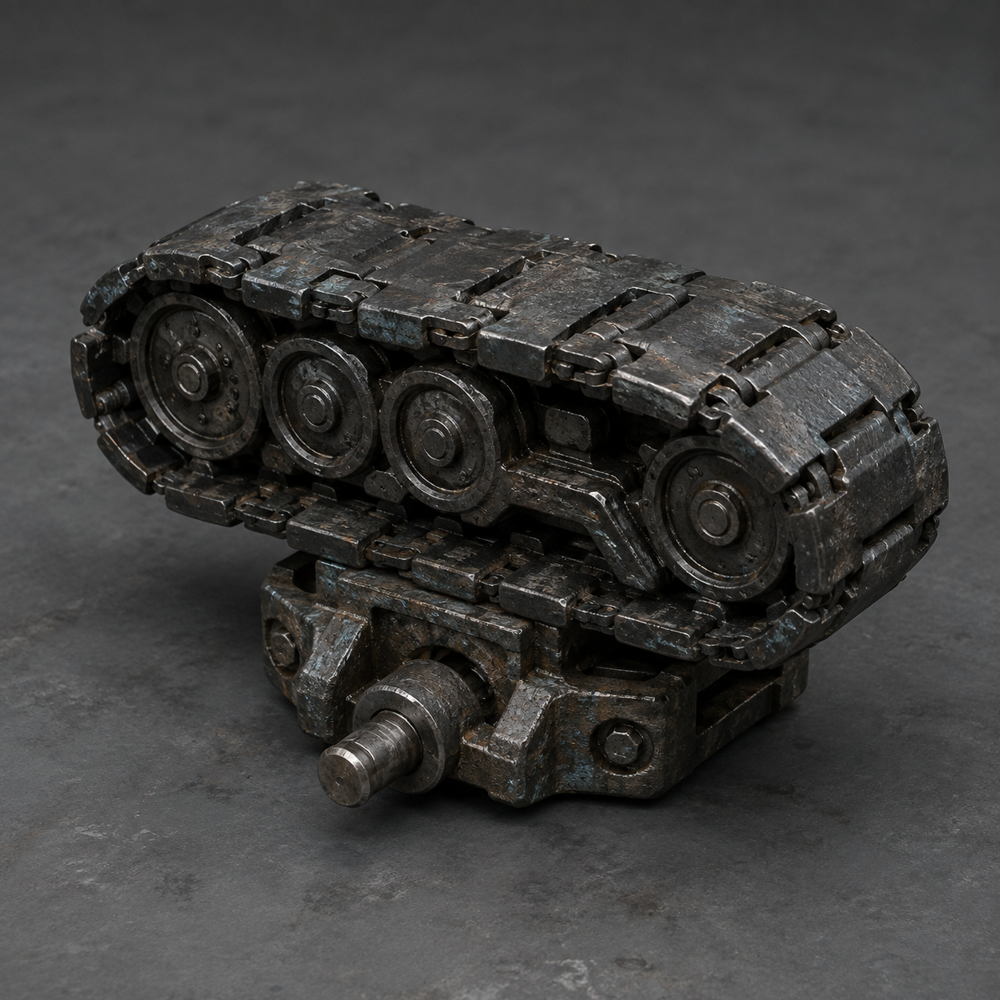

# 第92章 履带足不能替人站槽

红光合拢在维修站门外，临时锅炉心腹下的密封缝还在冒白汽。

苏弥把那张“更换对象——本人已到场”的纸压在槽边。她的右手义指仍然垂着，左肩发硬。陈序躺在驾驶舱里，左腕抬不起来，右履带缺了半截，机体只能靠门槛和肩甲挪动。

“锅炉心只能撑一次高压。”苏弥说，“刚才那两股蒸汽已经用了它一半的耐性。下一次回程，黑烟一号连拖锅都未必拖得动。”

“那就先换上能拖的履带件。”陈序看向维修站后墙。

锈钉探出铁牌：“新部件安装需确认使用者，否则默认归更换对象。”

陈序坐直了一点：“一只履带也能替人站槽？”

“不能。”锈钉认真回答，“但它能让更换对象走到槽里。系统喜欢把能移动的东西当成能负责的东西。”

北墙外的白塔机甲轰穿半截墙，校正光压到临时锅炉心管口，白汽立刻变成尖锐哨声，腹下热缝扩大一线。

苏弥看见铜色密封圈正在发黑，红光回程缝也从三丈缩到一丈。她判断：白塔是在逼他们继续开高压；锅炉心一坏，维修站就失去移动能力。

“不能再靠蒸汽硬顶。”她说，“先拿履带件，把黑烟一号从锅炉心上卸掉。”

“问题是我们没有能站稳的腿。”陈序撑住驾驶舱边缘。

工业母机的废料仓就在红光另一侧。同动作猎犬从倒塌的墙缝里钻出，左前爪仍折在断轴孔里，却学会了黑烟一号的半压滑行动作。它每学会一次，校正光就能更快找准落点。

陈序抓起已经裂开的旧钢缆回收端。上次回弹把它的边缘又撕开了一道口子，他先对苏弥说：“它只能把压力送回黑孔一次，不能认人，也不能替我们确认更换对象。用完这一次，它就只剩一段废缆。”

“那就别拿它吓狗。”苏弥捡起地上的铁片，“拿它给狗一个错误的落点。”

她把铁片插进门缝，只留半寸空隙。陈序放掉一小股白汽，锅炉心随之拖出半寸。

猎犬照着这个动作扑来。它的前爪刚压进半寸缝，苏弥便敲响回收端。

咚！

回声沿旧钢缆冲回黑孔，猎犬以为落点已经固定，整个身体向前折进废料仓。它撞翻一排空锅炉，铁筒滚下斜坡，刚好堵住白塔机甲的腿。白塔机甲抬脚不及，校正光扫偏，锅炉心的热缝没有继续扩大。

“一次。”苏弥松开回收端。钢缆裂口彻底张开，铜丝像烧焦的头发散出来。

陈序拖着黑烟一号挪进履带仓。仓里只剩三种配件：一条长履带，一组短履带片（补断齿用的临时片），还有两只没有编号的承重轮。苏弥指着短履带：“履带足能分担右膝重量，让机体低速横移，但不能连续强转。”

锈钉举牌：“无编号配件不可确认归属。”

“你们工业母机连轮子都要户口？”陈序问。

“无编号不等于无主。”

苏弥蹲下看两只承重轮。轮缘磨损方向相反，一只沾着新鲜黑油，另一只结着盐霜：“长履带装不上。短履带片能补断齿，承重轮必须先支住右膝。”

“判断依据够吗？”陈序问。

“不够。”苏弥把黑油抹在指腹，“黑油是热的，说明它刚转过；盐霜没裂，说明它没承过今天的力。我们先试黑油轮，转不动再换。”

她没有替他选归属，只把黑油轮推到陈序脚边：“你本人确认，用它支右膝。”

陈序愣了一下。正式收件槽的纸背正在发热，像有人在远处催他们把名字写上去。他却把手掌按在黑油轮上：“我确认它是黑烟一号的临时承重轮，不确认它是我的更换代价。”

承重轮咔地卡入右膝底座。黑烟一号的机体向上抬了两寸，锅炉心不再被腹甲压住。轮子确实能转，却每转一圈都带出细小的铁屑。

“这不是完整修复。”苏弥说，“它只能把右膝的重量分出去，不能让右履带连续强转。”

白塔机甲冲破滚锅炉，机械臂从侧面砸来。陈序没有开高压，只扳动泄压阀，让临时锅炉心吐出短促白汽。黑油轮先转半圈，短履带片咬住地面，黑烟一号横着挪出一步。

白塔机甲的拳头砸在盐霜承重轮上。那只沉睡二十年的轮子被打飞，撞进同动作猎犬胸口，猎犬被自己的复制动作带翻。

苏弥抓住这个空当，把短履带片一片片扣进右侧断齿。她先直说：“短履带片的用途是临时补住断齿，让黑烟一号低速挪动；它不能承受正面冲撞，连续转动会把连接销磨断。”

她扣上最后一片，立刻让黑烟一号向回程缝挪。三步之后，连接销发出尖响，右履带又掉下一片。

“三步。”陈序说，“比没有腿多三步。”

他们终于挪到正式收件槽前。纸面浮出两条线，一条指向苏弥僵硬的右手，一条指向陈序正在漏铁屑的左腕。白塔机甲在背后重新起身，校正光把两人的影子压进槽口。

“现在，谁站进去？”锈钉问。

苏弥看着自己的右手：“我已经承担了上一笔收件代价。再进去，可能把右手剩下的东西也交出去。”

陈序看着她的手，又看着自己的左腕：“我站进去，纸就会说我主动接管。”

两人都没有动。替对方做决定，会把保护写成新的代签。

白塔机甲抬臂。陈序忽然把黑烟一号的黑油轮顶进槽前的导轨，低声说：“履带足不能替人站槽，但能把人送到槽边。”

他让短履带片只转半圈。黑烟一号横移，肩甲撞开白塔机甲的机械臂，锅炉心没有再升压。苏弥借着机体挡出的缝，自己走进正式收件槽前一格，却没有把手伸进去。

“我本人到场。”她说，“我确认的是：更换对象由我本人继续选择，不由陈序、不由旁观者，也不由一只履带替我选择。”

槽口第一次完全张开。纸背上的浅字却只落下一半：本人已到场，选择——

白塔机甲的拳头砸中黑烟一号背部。锅炉心的泄压阀猛地弹开，白汽把纸面烫得卷曲。后半行字被热气遮住，红光回程缝却突然向外延长，露出一条通往工业母机更深处的铁轨。

苏弥回头：“它没收下我的名字。”

陈序盯着新铁轨：“也没让我们回去。”

锈钉举起铁牌：“评论命名接口开放：请在‘履带送人’与‘人给履带担保’之外，提交第三个更损的工单名。”

远处工业母机深处响起沉重的启动声。不是白塔，也不是黑烟一号。那声音每响一下，正式收件槽里的纸就多出一个没有落笔的黑点。

苏弥收回手：“下一次，先查是谁在里面替我们点火。”

陈序低头看着黑油轮。轮心传来轻微敲击，像有人用旋转次数替他们倒数。

---

## Metadata

- chapter_number: 92
- word_count: 2396
- generated_at: 2026-08-27 21:10
- upload_status: submitted_pending_review