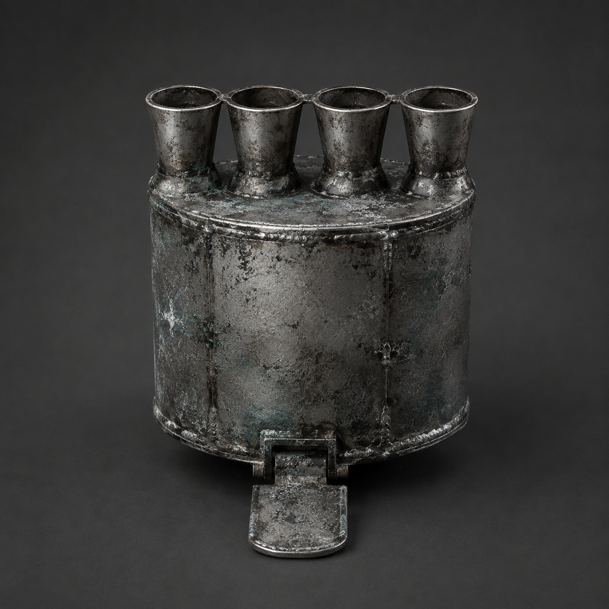

# 第94章 喷筒能跳不能替人签收

维修站里面的点火声响了第三下。连接工业母机与维修站的回程缝，是一条能让机体沿旧轨道往返的短暂裂口；它此刻只剩半丈亮度。

黑烟一号卡在回程缝边，临时锅炉心的密封缝还在滴热水。苏弥左掌的水泡被冷风一吹便发紧，右手义指垂在身侧，仍没有一根能动。她刚拨回的点火阀已经烧黑，短柄卡死在中间，阀体另一端却传来轻微的回弹声。

“它在站里点火。”陈序看向维修站的方向，“再响一次，火就会顺着主供热管冲进居民区。”

锈钉把铁牌转向他们：“主供热管连接北区十二份借热。热冲若进入，十二名伤病者的复温顺序会被打乱，管线也可能炸开。”

苏弥抬起左手，没去碰回拨点火阀：“我们现在有两个问题。里面的火要截住，黑烟一号也要离开回程缝。缝边只剩半丈亮度，拖不动它，下一次回拨会把整台机体留在轨道上。”

陈序看着腹下冒白汽的锅炉心。临时锅炉心上一章只剩一次高压，履带足的最后一片短履带已经弹出，右膝没有承重能力。再开锅炉，只能让机体多挪半步。

“先断管，还是先救车？”他问。

“火从车里进去，先救车就是把火带回去。”苏弥指着回程缝内侧，“看那三条亮线。左边的线贴着我们来时的轨道，右边两条却在往维修站分叉。点火声响起时，最亮的不是阀，而是分叉口。它要借回程缝找北区供热管。”

她话音刚落，缝里的第三条红线猛地蹿出，穿过黑烟一号腹下，向维修站方向钻去。远处北墙上的供热管同时鼓起一串冰包。

“依据够了。”陈序抓住驾驶舱边缘，“它不需要把火烧进锅炉，只要把点火脉冲接上分叉，北区就会先吃到一次过压。”

“还差一个。”苏弥盯住红线，“我们得让它追错位置。”

两台白塔机甲从工业母机的阴影里走出。第一台校正光扫过黑烟一号，校正光是会追着热痕锁定目标的红色光束；第二台抬臂封住回程缝。它们没有立刻攻击，像在等下一次点火给出落点。

陈序的目光落到母机边缘一排拆下的圆筒上。最靠外的一只没有接管，筒壁却留着向外张开的四道喷口。

“那是一次性跃迁喷筒。”苏弥先直说，“用途是把维修机体沿当前轨道猛推一段，跨过短距离断缝；它不是发动机，不能连续喷，也不能替人进入正式收件槽，喷完筒壁会塌。”

她掀开冻住的检修盖，指腹摸到四道喷口内的黑灰：“四个喷口都朝同一方向，筒底有单次点火片。没有第二次点火片，强行补火只会把压力倒灌进驾驶舱。”

“先试它的方向。”陈序说。

“不用试。”苏弥指向地面。刚才被红线擦过的盐霜只向回程缝外翻，说明脉冲从母机向维修站推；喷口朝外，能把机体送离分叉口。她顿了顿，“但它会把我们推过回程缝，落点在维修站哪一面，不能保证。”

“落不到北区就行。”

第二台白塔机甲突然砸下机械臂。陈序没碰锅炉主阀，只把残破履带足的连接底座抵住喷筒底部，借这一点硬度把喷筒拖到黑烟一号腹侧。苏弥用左手接上单次点火片，水泡立刻被热金属压破。

“你左手会伤。”陈序说。

“右手不能动，左手至少还能拒绝。”她咬住牙，“这次我拨。”

白塔拳头擦着驾驶舱砸下。陈序扳开临时锅炉心的泄压阀，最后一股短蒸汽只推开半寸，黑烟一号的肩甲被砸得向内凹。苏弥没有等机体站稳，猛按点火片。

四道喷口同时吐出短而沉的白焰。

黑烟一号像被一只看不见的手从背后踹了一脚，整台机体沿回程缝冲出。右膝没有承重，腹下锅炉心拖出一条火星，最后一片残履带底座当场裂开。陈序把牵引钩扔向左侧轨枕，钩住后只来得及把机体偏开半个身位。

红线追着喷筒留下的热痕扑去，错过了原本的分叉口。它撞上第二台白塔机甲的脚踝，校正光顿时折向母机深处。第一台机甲想转身，自己的红光却先照在它胸口，机械臂停了一瞬。

“它追的是点火余痕，不是我们。”苏弥看着喷筒塌陷的筒壁，“喷筒把一次性落点留给了它。”

下一刻，维修站北墙传来沉闷的咚声。供热管上的冰包没有炸开，十二份借热的温度表只齐齐掉了一格。锈钉举牌：“过压未进入北区，但本日复温顺序提前一格，持续一小时。”

“一格也是代价。”苏弥捂住左掌，“谁把它拨回去？”

陈序回头看回程缝。喷筒已经缩成一圈黑色薄片，不能再次使用；黑烟一号停在维修站外沿，临时锅炉心彻底失压，右膝仍悬着。那条被误导的红线却没有熄灭，沿铁轨折回母机，像有人在另一端重新选中了他们。

缝面浮出一行浅字：一次跳跃，落点由在场者共同承担。

“共同承担不是共同签收。”苏弥把手从阀体上移开，“喷筒替我们越过断缝，不能替我或陈序站进槽。”

陈序看着她烫伤的左掌：“那它替谁把火引走？”

红线尽头传来一声新的点火。不是维修站，也不是工业母机深处，而是黑烟一号腹下已经失压的锅炉心。

锈钉的铁牌翻出背面：“评论命名接口开放：这次是‘喷筒跳槽’还是‘落点共同背’？第三个工单名，继续交给读者老爷们。”

苏弥低头看向锅炉心。失压的圆筒内部，明明没有燃料，仍有一点蓝红余烬贴着旧铜管亮起。

陈序握紧左腕：“下一次点火，在我们身上。”

---

## Metadata

- chapter_number: 94
- word_count: 1998
- generated_at: 2026-08-27 22:35
- upload_status: submitted_pending_review