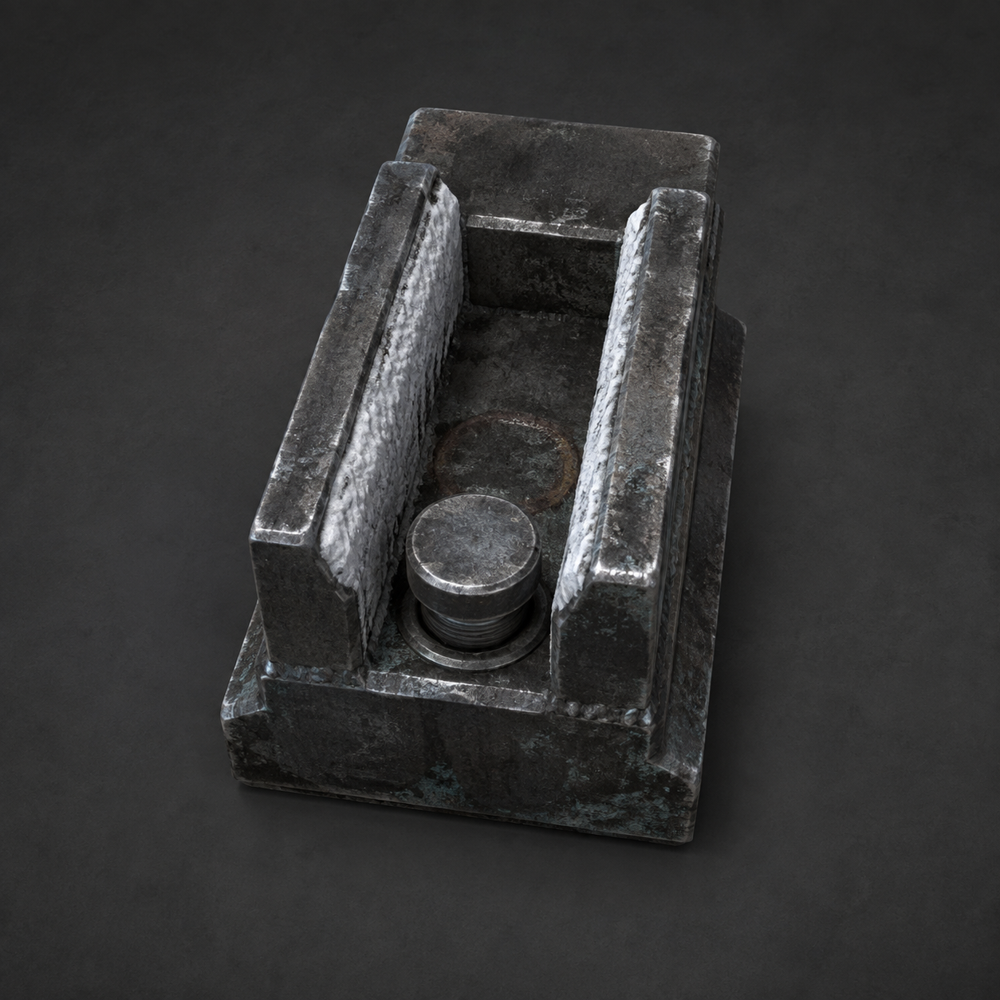

# 第96章 余烬进槽不进名字

白塔机甲的暗橙校正光落在陈序左腕上时，余烬又亮了一下。

黑线旁那几个字没有散开，反而沿着腕骨往上爬：“点火者——在场者。”

陈序的第一反应是甩手。苏弥一把扣住他的袖口，左掌的水泡被布料蹭破，血珠立刻挂在指缝里。

“别甩。”她说，“它刚才沿管路走，遇到固定的旧梁才分流。你把它甩出去，它会找最近的热管。”

“可它已经找上我了。”

“找上你，不等于认定你。”苏弥盯着那行光字，“我们现在缺的是一个能把火和人的记录隔开的地方。”

维修站里传来第二声点火。北墙温度表抬了半格，白塔机甲的拳头也跟着转向陈序。它们像被余烬牵着，先认热，再认人。

陈序抬起左腕，麻意从指尖冲到肩窝，手里的扳手几乎脱落。他看见黑烟一号腹下那只已经裂开的临时锅炉心：旧铜管还在冒热，锅炉没有压力，不能再推车，却能把余烬留在机体里。

苏弥忽然指向维修站侧墙：“那里有一条废检修槽，原来接锅炉排热，没通北区供热管。把火引进去，至少不会直接咬住活人的记录。”

“槽里有什么？”

“不知道。但距离够，管路也断在总柜前。”

白塔机甲抬臂砸下。陈序没有扳锅炉主阀，只用肩甲顶住黑烟一号的歪斜外壳。机体没有动力，仍被拳风撞得横滑，右膝的悬空支架擦过地面，迸出一串铁屑。

苏弥趁这一瞬钻进侧墙阴影。她用左手撬开锈死的检修盖，里面卡着一只黑灰色短槽，槽口窄得只能容下一截铜管，底部有粗大的机械压栓。

“这是隔热回收槽。”她先直说，“用途是把一股短时高热收进去，隔开热量和外面的管路；它不是灭火器，最多接住一次余烬，压栓锁死后不能重复用。”

她把短槽拖出半尺。槽壁内侧结着白霜，底部却留有一圈旧焦痕，说明它确实接过热，不是凭名字猜出来的装饰件。

“这一次就够。”苏弥说。

“你来接？”

“我左手还能压栓。你的左腕已经在被它试着写名字。”

她扯下自己外套的袖口，垫在短槽底下，把槽口对准黑烟一号腹甲那根歪斜旧铜管。陈序看见白塔机甲正绕过废轨，红光已经贴到他腕边，便抓住黑油承重轮，借轮缘最后一圈可用的转动，把腹甲往侧墙推。

这不是启动。承重轮只转半圈，右履带没有强行咬地，机体靠肩甲的斜面滑向检修槽。可轮缘里的铁屑被挤进轴承，黑烟一号的腹部发出沉闷摩擦声。

“再来半寸！”苏弥喊。

陈序看见白塔拳头砸向她，松开承重轮，抬起左腕迎着校正光晃了一下。

“陈序！”

“它现在只追我的热。”

红光果然偏了。拳头擦着他的肩头落下，砸裂地面一块冻硬的旧水泥。陈序被冲力掀得跪倒，右膝刚碰地便一阵钻痛；他咬住牙，用扳手勾住白塔机甲脚踝，把自己拖离第二拳的落点。

苏弥没有趁机逃。她把铜管往回收槽里再送一寸，左掌水泡压在槽沿上，痛得肩膀发抖。

“它会沿管路走。”她盯着铜管口，“上章我们已经看见，固定的旧梁能让它分流。现在槽底的压栓能把这股热锁在隔热层里。只要我先锁槽，你再断开旧铜管，它就没有北墙那条路。”

“断开后它会去哪？”

“进槽。一次。”

“要是槽没接住？”

“那它就重新找最近的热路，北墙离这里不到三十步。”

这个判断有两样东西作证：北墙温度表在余烬每次亮起时上升，检修槽底却只有旧焦痕没有供热分叉。陈序不再问。他把扳手卡进铜管下方的旧夹口，等白塔机甲再次转身。

白塔机甲的校正光扫过陈序左腕，余烬亮得像要钻进黑线。黑烟一号的腹甲同时发热，铜管沿着槽口往外抖。

“就是现在！”苏弥按下压栓。

粗大的机械栓砸进槽底，短槽内侧立刻起了一层灰白隔热霜。陈序用肩膀撞断旧夹口，铜管从腹甲上脱开。那粒蓝红余烬没有扑向他的手，也没有窜去北墙，而是沿着断管冲进窄槽，撞在底部焦痕上。

隔热回收槽猛地一震，槽口外的空气骤然冷下去。白塔机甲的红光失去热痕，拳头停在半空；北墙温度表回落，十二份借热的冰包不再鼓动。

“接住了！”苏弥压住压栓，“但只接住一次。”

槽内没有火焰，只有一条细细的蓝红线贴着内壁游动。它像还想找出口，却被压栓和隔热层困在焦痕里。陈序伸手去碰，苏弥立刻用肩膀撞开他的手。

“别把手伸进去。槽隔开热，不隔开你的记录。”

陈序收回手。腕上的黑线仍在，字却从“点火者——在场者”变成了一半模糊的划痕。白塔机甲失去目标，转头去找被断开的旧铜管，机械臂砸在空处，反震让自己胸口的校正灯裂了一道缝。

锈钉从废轨后爬出来，举起烧穿的铁牌：“故障播报：火进槽，名字没进槽。暂不接受锅炉余烬代签。”

苏弥看着回收槽：“它确实能隔开一次热，但没证明能隔开一次责任。槽底焦痕是旧的，谁用过、替谁接过，我们还不知道。”

“所以它救了北墙，也可能留下旧账。”陈序说。

他把黑烟一号的断铜管拖到废检修槽旁。机体没有锅炉压力，右膝仍不能承重，黑油承重轮也只剩最后半圈可用；可白塔机甲暂时失去校正目标，维修站至少多出一段不会立刻爆开的空档。

苏弥的左掌开始发麻，右手义指依旧垂着。她把隔热回收槽的压栓又试着往下按，压栓纹丝不动。

“锁死了。”她说，“这件东西已经用完。下次不能拿它当现成答案。”

陈序看向自己的左腕。黑线旁那行字没有完全消失，只留下“在场者”三个暗红轮廓。维修站深处又传来点火声，这一次没有热量沿管路出来，只有隔热回收槽内的蓝红线轻轻跳了一下。

苏弥抬头：“它在槽里听见了谁的名字？”

陈序没有回答。白塔机甲胸口裂开的校正灯里，浮出一小段不属于陈序、也不属于苏弥的旧维修编号。

锈钉把铁牌翻到背面：“评论命名接口开放：是‘余烬进槽不进名字’，还是‘锅炉火先隔离’？第三个工单名，交给读者老爷们。”

编号闪了第二次。

这一次，维修站的门内有人用陈默的声音说：“别把我的旧账，接到活人身上。”

---

## Metadata

- chapter_number: 96
- word_count: 2283
- generated_at: 2026-08-27 23:30
- upload_status: submitted_pending_review