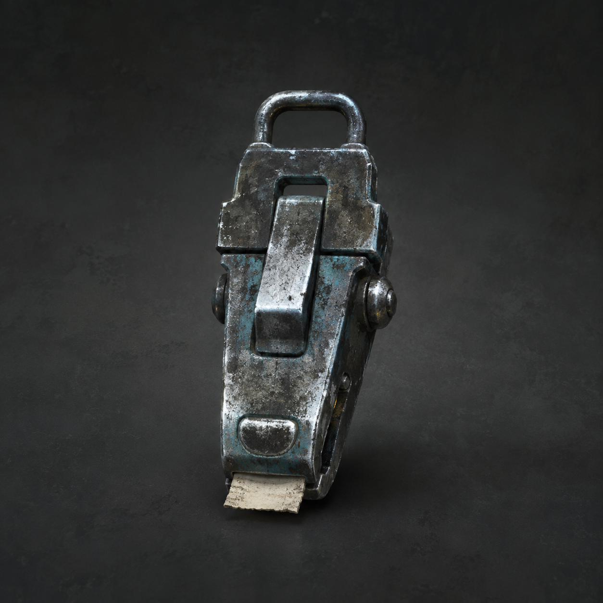

# 第98章 纸背名字不能替人签收

纸背那三个“陈序”还没干，门外的三台白塔机甲同时抬头。

陈序按住纸角，没有把手伸进去。上一回它们追的是旧维修编号，空铜管和半块铁牌把那条路引出门，代价是黑烟一号右膝彻底报废，锈钉胸口的编号也被烧掉一角。现在门缝里推出来的是他的名字，谁碰上去，谁就可能被当成收件人。

“门里在逼你签。”苏弥跪在碎冰旁，左掌的血滴在铁牌上，“白塔的红光已经照过来。你不处理，维修站会被当成你的收货地址。”

第一台机甲踩碎门槛。黑烟一号没有锅炉压力，右膝不能承重，黑油承重轮只剩半圈；陈序刚想拖它横移，门内那张纸又往外伸了一寸，红光立刻从机甲胸口跳到纸背。

“不能让纸碰地。”苏弥说，“地面是站的记录面，名字落地，白塔就有地方盖章。”

“那就给它夹个临时岗位。”

陈序从黑烟一号腹甲里摸出一只旧钢制回执夹。它的用途是夹住纸质维修单，只让纸边和金属接触，不让整张单子贴上记录面；夹口只有一次锁合，锁死后不能把收件人改成别的人。

他把回执夹扣在纸背边缘，咔的一声，刚写下的名字被夹住，纸面悬在门槛上方。

红光没有扑向陈序，反而沿夹口绕了一圈。白塔机甲的拳头擦着门框砸下，冰砖炸开，锈钉举起只剩半块的铁牌挡了一下，整台身体被震得撞上墙。

“故障播报：夹住纸，不夹住我。”锈钉爬起来，“岗位描述清楚，待遇暂缺。”

第二台机甲从侧面压向苏弥。她没有去抢纸，而是用右手还能微微弹动的义指勾住回执夹的尾环，把夹子向外一拽。纸背离开门缝，白塔红光跟着移动，第二台机甲的拳头偏了一寸，砸进第一台机甲的肩甲。

第一台机甲被撞得横过来，膝部正好卡住门框。第三台机甲立刻抬脚去踢它，陈序看见两具机体的重量都压在同一块碎冰上，便扯住门柱上的旧钢筋，把钢筋往下一压。冰面先裂，第一台机甲的脚底打滑，第三台的踢击擦过门框，反倒把自己的膝盖撞出一声闷响。锈钉趁机用肩膀顶住歪掉的门，嘴里还在播报：“公共维修提醒：请勿在客户拒收时互相验货。”

苏弥被震得向后滑了半步，仍死死勾着尾环：“你把它们的目标当成了牵引绳。”

“维修站穷，只能把敌人的执着当工具。”

陈序看见两件事：回执夹只能让纸边悬空，不能抹掉名字；红光追着夹子走，却没有回到他腕上的黑线。于是他判断，门里要的不是一个真正签名，而是一张能把“在场者”钉成收件人的纸。

“你想把它送给谁？”苏弥问。

“谁都不送。让它自己排队。”

他扯下黑烟一号肩侧最后能转的半圈轮缘，把机体往门柱上一靠。黑烟一号不能承重，却能用斜着的惯性顶住门框。第一台机甲拔出拳头，第三台已经绕到后方，红光压向陈序左腕，黑线里的“在场者”重新发热。

陈序没有躲。他抬起被麻意穿过肩窝的左腕，朝门内喊：“维修单写了我的名字，没写我同意。按你们的规矩，缺一项就退回原厂！”

门内安静了一拍。

苏弥盯住纸面：“名字旁边没有手印，收件栏也还是空的。它只能证明有人写了你，不能证明你收了。”

“那就让它把缺项露给白塔看。”

苏弥猛地松开尾环。回执夹没有把纸弹回门内，而是借着门槛的斜面滑向三台机甲中间。纸边悬着，夹口锁着，名字始终没有碰地。三台机甲的红光同时追纸，互相撞在一起；第三台的机械臂扫中第二台胸口，校正灯裂出一道细缝。

陈序趁缝隙冲过去，没去拿纸，只用扳手敲在回执夹的锁舌上。第一敲，锁舌发出空响，证明夹子还在承受；第二敲，夹口外壳裂开，纸边却没有掉下去；第三敲，锁舌终于卡死，回执夹把维修单钉在门外一根旧钢筋上。

红光绕着纸转了两圈，找不到落下的记录面。门内传来纸张摩擦声，像有人在另一头翻找收件栏。白塔机甲的拳头停住，最靠门的一台退了半步，踩塌的门槛却没有再往里压。

维修站暂时守住了。

黑烟一号的肩甲又掉下一片铁屑，轮缘磨出一道白痕；陈序左腕的麻意压到指尖，苏弥左掌重新裂开，锈钉胸口剩下的倒置编号又暗了一格。回执夹锁死，不能再改纸，也不能替任何人签收。

“即时收益。”苏弥看着门外，“名字还在纸上，但收件栏没有人。”

“代价是它知道我在纸边。”陈序说。

锈钉把弯掉的铁牌举过头顶：“维修站公共播报：本次客户已写名，拒绝收货；夹子已锁，售后不换人。”

门内忽然传出陈默的声音：“陈序，别把名字留在门外。”

陈序的手停在扳手上。苏弥看见他的指尖发白，却没有替他回答。那张纸背下方，原本空着的收件栏慢慢浮出一条新横线，横线尽头不是签名，而是一枚正在成形的旧维修印。

门外有几个躲在废料堆后的维修员探出头来。有人小声说：“他爹都喊了，还不算本人？”另一个人立刻反驳：“喊话算口供，不能算签收，咱们上次替人按手印，供暖票少了三天。”两句话传开，连锈钉都把铁牌转向他们：“争议已登记，活人不得被群众代签。”

陈序听见那句“少了三天”，把伸向纸边的手收了回来。苏弥没有替他判断，反而把一枚碎冰踢到纸下：“你若现在按住纸，它会把你的动作当同意；你若让它继续飘，至少还能逼门里先露出印章的来历。”

“所以我不签，也不逃。”陈序说，“先让它把自己盖出来。”

陈序看向回执夹：“它要盖章，还是要找一个能替我说‘收到’的人？”

锈钉把铁牌翻面：“评论命名接口开放：‘写名不收货’和‘夹子先背锅’之外，第三个工单名，交给读者老爷们。”

门外的纸没有落地。

门内的印，却按下了半寸。

---

## Metadata

- chapter_number: 98
- word_count: 2079
- generated_at: 2026-08-27 23:59
- upload_status: not_uploaded
