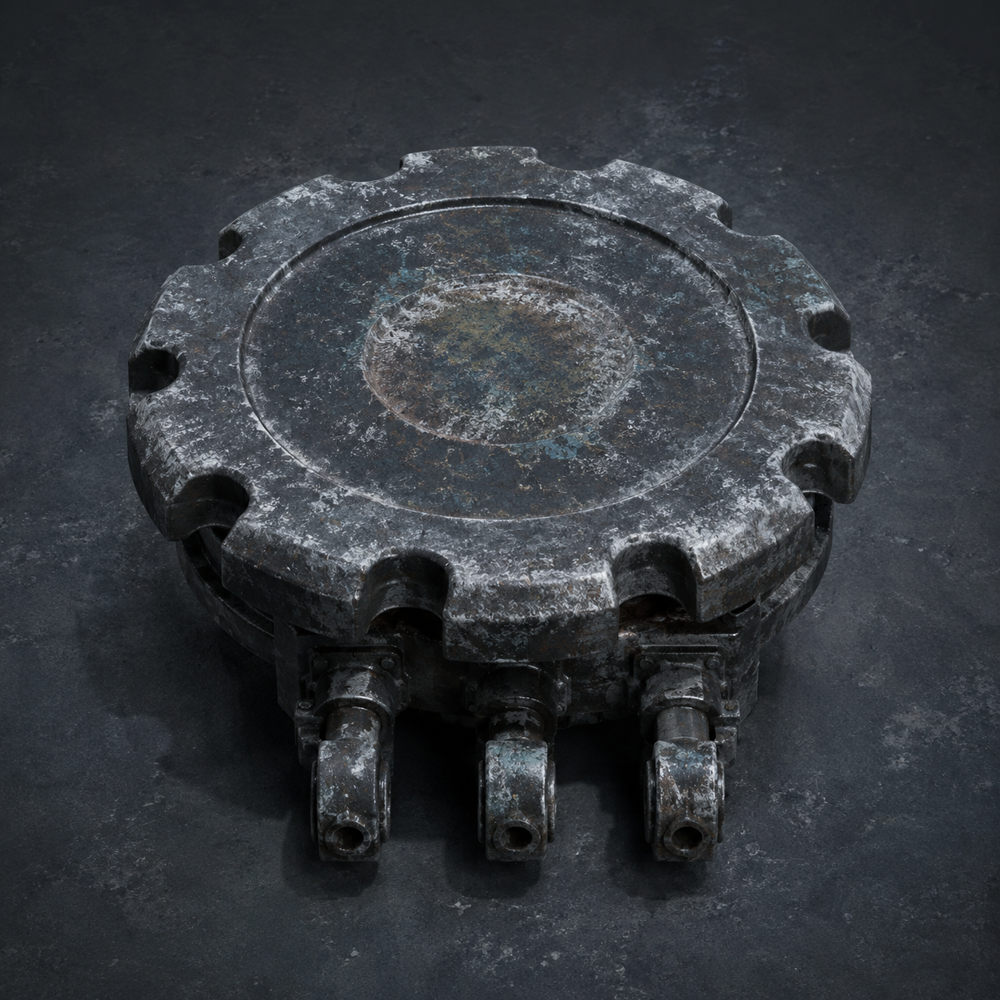

# 第99章 旧印返厂先撞哪台机甲

门内那枚旧维修印已经按下半寸。

纸背上的“陈序”被回执夹悬在门外，印章却隔着门槛往下压。三台白塔机甲同时转向，红光不再追纸，而是照向维修站最深处的工业母机。那台沉睡多年的旧工厂机器先是咳了一声，接着把整面地板震出灰尘。

“它要用母机盖章。”苏弥捂住左掌，血从指缝里渗出来，“一旦母机接上旧印，门里的收件栏就有了实体。到时候，谁站在门里，谁就可能被写成陈默的替身。”

陈序看了眼门缝，又看了眼黑烟一号。右膝悬架报废，锅炉没有压力，轮缘只剩最后半圈；硬撞进去，机体会先散架。

“那就先把章送回原厂。”

“你知道原厂在哪？”

“不知道。但这台母机肯定比我更想见自己的章。”

第一台白塔机甲撞穿门柱。锈钉被碎砖砸得跪下，胸口倒置的公交编号又暗了一格。它没有退，反而把后装机械臂插进门缝，抱住门内伸出的旧铜轨。

“故障播报：发现客户争抢印章。建议排队，禁止用拳头插队。”

门内立刻回了一声敲击。旧铜轨猛地绷直，锈钉整台身体被拖向门里。

陈序没有去拉它。苏弥已经扑到母机旁，掀开一块结霜的检修板，露出一只灰黑色圆盘。圆盘不是按钮，也不是动力源；它的用途是把母机输出的方向切到不同旧工位，转到哪一格，材料就会从哪条轨道送出。盘边只有一圈手指能卡住的缺口，底下连着三根粗短拉杆。

“母机换向盘。”苏弥说，“能把输出导向不同工位，但现在卡在第三格。你要是硬拧，最先断的是拉杆。”

陈序摸到圆盘边缘，冰冷的金属让左腕黑线又麻了一下。

“第三格是什么？”

“旧维修印的回收工位。”

“那不正好。”

“不正好。回收工位会把印章连同最近的责任记录一起吸走。”

第二台白塔机甲从侧墙撞入，苏弥被冲击掀翻，右手义指磕在母机外壳上，发出一声脆响。她没有松手，反而把一张纸质记录卡塞进圆盘与拉杆之间。

“先别转。”她说，“卡片能让它只接触方向，不接触记录面。你要是把我也算进换向，今天就不用抢母机了，直接抢我的手。”

陈序看见她把记录卡压在自己手腕下，没有把选择交给他。他伸手去扶，她却用肩膀顶开。

“我能站。”

“你左掌在流血。”

“所以我没空替你疼。”

第三台白塔机甲抬腿踩向回执夹。纸一旦落地，旧维修印就会有完整记录面。陈序扭头看见三台机甲的重量都压在门外一条冻裂的旧轨上，轨道正被母机启动的震动抬起。

他想起黑烟一号只剩最后半圈轮缘，不能用来撞，只能用来把一次惯性送出去。速度和重量不变时，惯性会沿接触面继续推行；换句话说，机体不必完整启动，只要让轮缘在正确的斜面上滚半圈。

“苏弥，第三格能不能只偏一格？”

“能。但输出会撞向门外旧轨。”

“旧轨能断吗？”

“母机一启动就会断。”

“那就让它断得有用。”

陈序钻回黑烟一号残破的驾驶舱，把扳手卡进轮缘缺口。白塔机甲的脚落下，回执夹被震得咔咔作响，纸边却还悬着。锈钉死抱铜轨，门内的敲击一声接一声，胸口编号像被一只看不见的手往里拽。

“锈钉，松手！”

“否定。门内有人，不能松。”

“那不是命令，是建议。”

锈钉停了半拍，机械臂又收紧：“建议拒绝。建议没有授权范围。”

陈序愣了一下。白塔机甲的拳头已经砸到它背上，后装机械臂的接缝裂开一道口子。锈钉仍没松手，却把右脚蹬向门柱，把拖拽力传进地面，不再让自己的胸口编号承受全部拉力。

苏弥看见这一幕，抹掉嘴角的血：“它学会分担了，不是替人签收。”

“它只是怕自己摔得难看。”陈序说。

他猛地压下扳手。黑烟一号的轮缘滚出半圈，歪斜机体沿旧水泥斜面撞向母机底座。不是撞母机，而是把母机旁那根断轨顶起。断轨翘起，第三台白塔机甲踩空，膝部砸在门槛外，红光从回执夹上移开一瞬。

“现在！”苏弥把记录卡往下一压。

陈序拧动母机换向盘。圆盘从第三格卡到第二格，拉杆先发出闷响，随后整条旧工位轨道向门外弹出。门内旧维修印被吸出一道黑红的细线，顺着轨道冲向三台白塔机甲。

第一台机甲抬臂格挡，黑红细线却绕过它的拳头，钻进胸口裂缝；第二台想后退，被翘起的断轨绊住；第三台刚撑起膝盖，线头已经贴上它的校正灯。三台机甲同时响起白塔播报：

“责任来源不一致，回收对象无法唯一确定。”

它们互相推搡起来。第一台把第二台推向门柱，第二台的肩甲撞上第三台，第三台反手一拳砸在第一台胸口。红光乱成一团，旧维修印被三台机甲各吸住一截，谁也没能把它完整盖进母机。

工业母机轰然停住。

门内的敲击也停了。回执夹仍锁在旧钢筋上，纸没有落地，纸背的名字没有变成签收。维修站暂时保住了门，母机的第二格旧工位却被整条弹出的轨道卡死，今后只能向门外送料，不能向内回收。

陈序从驾驶舱里滚出来，左腕麻意窜过肩窝。黑烟一号的轮缘彻底掉下一圈铁屑，肩甲裂口扩大，右膝悬架仍像一条断掉的腿。

苏弥把记录卡抽出来。卡面没有红印，但她的左掌伤口裂得更深，右手最后一根能回弹的义指彻底停住。

锈钉松开铜轨，踉跄两步，胸口编号只剩半边。它低头看了看自己的脚：“故障播报：本次没有代签。本人拒绝承担全部拖拽，已申请两只脚共同负责。”

陈序看向门外。三台白塔机甲还在争抢那条黑红细线，门内却传来一声更轻的敲击，像有人隔着母机摸到了第二格轨道。

旧维修印没有回到门里，也没有消失。它被卡在三台机甲之间，印面朝着陈序，背面却浮出一行新字：**回收工位已改，下一次只收一个人。**

陈序没有去碰那行字。苏弥已经把记录卡折成两半，锈钉则挡在门口，谁也没替他回答。

“评论命名接口开放。”锈钉举起残牌，“这次给三台互相验货的白塔机甲起名。是‘旧印三等分’，还是‘谁先撞谁报修’？第三个工单名，留给读者老爷们。”

门内又敲了一下。

这一次，黑红细线没有动。

动的是陈序脚下那条通往工业母机深处的轨道。

---

## Metadata

- chapter_number: 99
- word_count: 2349
- generated_at: 2026-08-30 23:30
- upload_status: submitted_pending_review