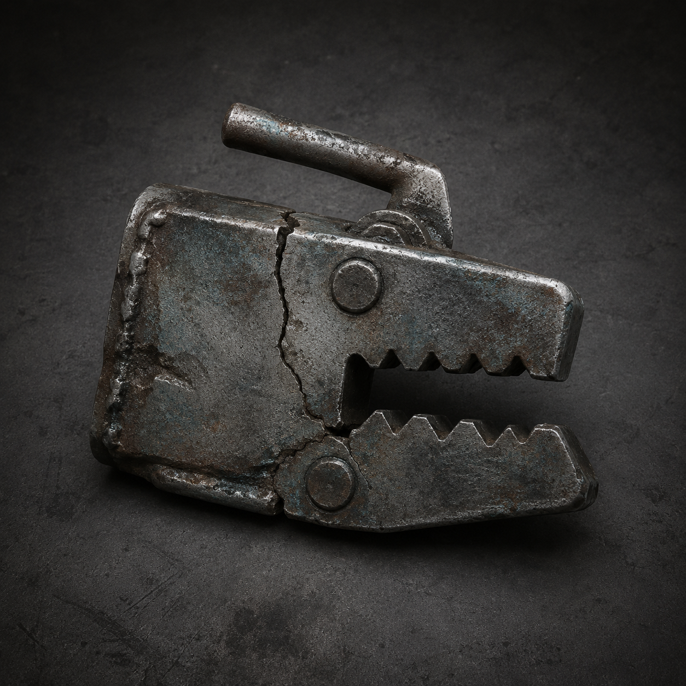

# 第一百章 先把轨道夹住再谈联手

脚下的轨道往母机深处滑了一寸。如果不把脚下的轨道卡住，母机就会把陈序和苏弥送进旧印的收件位，至少有一个人会被写成收件人。

陈序没有跳。他的右膝悬架已经报废，跳下去只会把自己摔进黑孔。黑烟一号斜靠在门框上，肩甲裂口被冷风灌得哗哗响，左边还能转的轮缘在铁面上刮出一串白屑。

“轨道在送我们进去。”苏弥按住左掌的裂口，右手那根最后能回弹的义指垂着，“进去以后，旧印要是盖在谁身上，谁就是收件人。”

门内的旧维修印又往前推了半寸。三台白塔机甲同时转头，第一台伸出机械臂，第二台用肩甲顶住它，第三台却把炮口压向母机外侧。它们没有听谁的命令，只在争同一条黑线的归属。

陈序看见黑线从母机第二格工位爬出来，擦过白塔机甲的脚踝，又沿轨道朝黑烟一号的驾驶舱缝隙钻。上一次他们让回执夹把纸悬在门外，印没有找到收件人；这一次，母机换向盘把旧印推离了门口，反而给它送来了一整段能走的轨道。

“先夹轨。”陈序说。

他从废料堆里拖出一枚新东西：轨道止退夹。它的用途很直白——用两片咬合的旧钢板卡住轨道，防止母机继续把车和人送进深处；夹不住黑线，也不能替谁签收，受力过大时会先裂开。

苏弥看了一眼：“你右膝不能承重。”

“所以你负责把夹子送到轨底。”

“我左手裂着。”

“那就用没坏的手。”

她瞪了他一眼，却没有把夹子丢回去。苏弥拖着左肩旧伤，绕到黑烟一号侧面，用右手义指勾住夹柄。义指没有回弹，她便把前臂压在钢板上，整个人借重量往下一沉。

第一台白塔机甲抢先伸臂。陈序拉动黑烟一号还能动的半圈轮缘，机体没有前进，反而用肩甲撞向旁边的第二台。第二台的白光擦过裂开的肩甲，烧掉一块铁皮；第三台趁空隙挤进来，三台机甲的脚同时踩上母机边缘。

“它们不是来抓人。”苏弥咬着牙，把夹子推到轨道底下，“它们在抢谁有资格站进收件位！”

陈序看见第三台机甲的脚底没有黑线，第一台脚踝却已经被线缠住。证据够了：旧印要的不是最强的东西，而是被轨道送到它面前、又没有拒绝位置的人。白塔机甲互相推挤，正好会把一个活人或一台机器挤成“在场者”。

他把半块记录卡塞进驾驶舱缝里，冲苏弥喊：“别让它们替我们选！夹住轨道，逼母机停料！”

苏弥用肩膀顶住钢板。轨道止退夹两片旧钢板咬合，卡齿先崩掉一枚，轨道仍在滑；她没有松手，改用膝盖顶住夹柄。第二枚卡齿嵌进母机底梁，铁面猛地一震，黑烟一号的驾驶舱向后退了半寸。

轨道停了。

代价也立刻落下来。苏弥左掌的裂口被钢板边缘重新撕开，血滴进轨缝；陈序左腕的麻意越过肩窝，五根手指一齐失力。止退夹外侧裂出一道长缝，只能再承受一次短促回压，不能当完整夹具重复使用。

门内的印没有消失。它沿着停住的轨道往回爬，擦过白塔第一台机甲的脚踝，最后停在那台机甲胸口一块没有编号的白板上。白板亮起一行不完整的字：收件人——

第三台白塔机甲忽然抬炮，瞄准第一台胸口的白板。

陈序把半块记录卡按在驾驶舱缝上：“苏弥，松夹。”

“松了它们就进母机！”

“不松，第一台就被写死。”

苏弥的手停住。她看着第一台机甲脚下那条黑线，又看了看陈序按在缝里的记录卡：“你想让它们自己承担收件？”

“我想让它们先证明，谁在替谁按印。”

她没有回答，膝盖却慢慢撤开半寸。止退夹没有完全松脱，只让轨道回弹了一下。第一台白塔机甲胸口的白板被黑线擦亮，第三台的炮口随即偏开，转向母机第二格。

门内传出一声很轻的敲击。

旧印下方，那行字终于补出后半句：收件人——不在名单内。

陈序抬头。母机第二格深处，另一条没有脚印的轨道正朝他们这里接上来。

锈钉举起只剩半边编号的胸牌，第一次没有播报故障：“陈序，下一份工单不是给机器的。”

苏弥把裂开的止退夹踢进轨缝，挡住了回弹的第一下。她的右手义指仍然垂着，却盯住那条新接上的轨道。

“那就让它先把人送出来。”

---

## Metadata

- chapter_number: 100
- word_count: 2240
- generated_at: 2026-08-30 23:59
- upload_status: not_uploaded
- chapter_images: [轨道止退夹]
Immediate problem: stop the rail before the machine writes a person as receiver.

The rail stopped. The machine no longer sent them deeper, but the white tower machines gained time to choose the chest plate.
