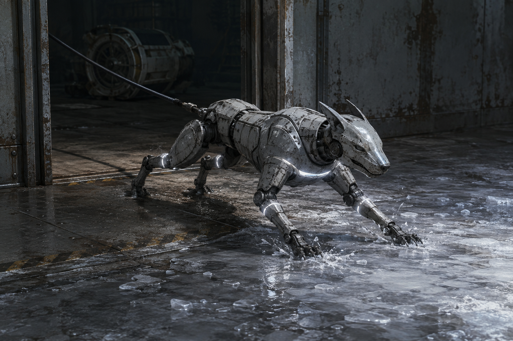

# 第74章 猎犬不会学会刹车

同动作猎犬卡在翻倒牵引机的轮槽里，四条腿仍按校正光的顺序蹬动。

它每蹬一下，轮槽就向外崩一块冰。黑烟一号的右履带卡在泵房门槛上，右膝轴承裂口继续落细屑，机体只能靠苏弥缠在总柜把手上的维修缆吊着。陈序看着那只不断扑空的猎犬，最想做的是把门关上，再把它拆开。

苏弥却把黑色空位片塞进他掌心。上一次它只是替白塔预留收件资格的空槽，这一次孔里的动作编号还在跳，像一张没有收件人的工单被谁不断盖章。

“别捏。”她说，“它正在给猎犬找下一段标准动作。”

门外的猎犬忽然停了一拍。

陈序看见它胸口的冷白校正环不是在照着自己刚才的动作回放，而是在把“扑击—撞偏—复位”压成越来越短的一条线。每次复位，它都会少一寸犹豫。要是不处理，下一次它撞进来的就不是右履带，而是黑烟一号的右膝。

“最急的是让它进不来。”陈序抬头，“但不能再拿机甲硬接。”

“你终于承认自己不是门。”苏弥把维修缆再收紧，“那你打算拿什么挡？”

陈序看向半截胸前门牌和牵引机旁的轮槽。门牌没法再垫履带，轮槽却被猎犬撞宽了一点。动作越标准，落点越固定，固定就意味着能被借走。

“我不挡它。”

陈序踢开泵房侧边的旧料箱。箱里滚出三枚冻硬的螺母，他抓起一枚，朝门外砸去。

螺母撞在牵引机残轮上，发出清脆一声。

猎犬立刻转头。它把陈序刚才抬臂、扭腰、甩出的动作完整复制了一遍，前爪落在残轮上，身体却没有扑向他，而是沿着门框斜线滑了半步。

“它学的不是目标。”苏弥盯着那半步，“它学的是你最后一次动作的终点。”

“那就给它一个不该到的终点。”

陈序抄起第二枚螺母，故意做出一个右肩发麻时才会有的歪动作：先抬手，手腕塌下，再用左膝撞向门框。他的右膝不能承受正面冲击，这一下只把重量压在左边。

猎犬照做。

它从轮槽里蹿出，前爪落向门框，后腿却按着陈序的歪斜顺序收拢。那一收让它失去原本的直线扑击，胸腹擦过冰壳，黑索从背后猛地勒住校正环。

陈序等的就是这一勒。他把第三枚螺母塞进总柜下方的窄缝，扯动维修缆，让总柜向外歪半格。猎犬的黑索被总柜一带，牵引机残轮随之滚动，轮槽像一只突然张开的嘴，把猎犬的后半身重新卡住。

猎犬没有挣扎。它胸口的动作线却亮得更白，竟把陈序刚才的歪动作再做了一遍。前爪收拢，后腿蹬直，黑索绷紧。轮槽边缘发出咔的一声，裂缝从冰面一路爬向泵房门槛。

苏弥脸色变了：“它不只是复制动作，它在复制结果。”

陈序也看见了。猎犬第一次歪着摔回轮槽，第二次却把轮槽被撞开的角度一并学走。只要动作留下可重复的结果，校正光就会把结果也当成标准。

“那还困得住吗？”梁魁问。

“困不住。”陈序说，“但能让它每次学会，都先替我们拆掉自己的路。”

他扶住门框，朝猎犬慢慢走三步：第一步落干冰，第二步踩湿沟，第三步停在门槛外。那是猎犬正在寻找的完整终点。

苏弥一把抓住他：“你要把自己喂给它？”

“我把坏路喂给它。”

猎犬冲出轮槽。它复制陈序三步的节奏，第一步踩干冰，第二步踩湿沟，第三步却落在门槛外。湿钢让前爪打滑，后爪仍按干冰的推力蹬出，整个身体被自己的标准动作拧成一股斜力，猛地撞向门框外侧。

黑索断了。

猎犬没有撞进泵房，反而被反弹力甩到牵引机底下。那台残破机器被它一撞，轮轴转过半圈，翻倒的车身把泵房门外唯一的直线路径压死。猎犬四足还能动，却只能在车腹下重复三步，越重复，越把自己往冰缝里塞。

黑砖亮出一行短促回执：

【复制对象：最近可见动作。】

【复制结果：仅限已形成的重复轨迹。】

【异常：动作终点正在污染校正线。】

苏弥盯着最后一行：“污染校正线不是它的能力，是我们把错误结果重复给它之后，校正光自己留下的痕。”

“所以它的来源还在门外。”陈序捡起黑色空位片，“空位片只报动作编号，没报谁发出的光。它能把错误学进去，但不知道什么时候会把错误吐给下一个执行体。”

他话音刚落，门外的猎犬停止了三步循环。

它转过头，隔着牵引机底盘，看向苏弥。

苏弥的右手义指在冷风里轻响。她为吊住黑烟一号连续收缆三次，那三个动作比陈序的歪路更稳定，更像可复制的标准轨迹。

“别动。”陈序压低声音。

猎犬从车腹下伸出前爪，先做了一遍苏弥收缆的动作。维修缆在总柜把手上随之收紧，黑烟一号的重量猛地压向右膝。

苏弥没有松手。她看着陈序：“它先学谁，不等于谁该负责。”

“我知道。”陈序咬住扳手，“可它下一步要是学会把人也当成缆绳，咱们就得先决定——让它咬最标准的那个，还是让最不标准的那个去教它刹车？”

维修站外的报码线立刻吵成两派。有人说该让苏弥放手保机甲，有人说陈序才是最会把规则弄歪的人。陈序没有替他们选，只把黑砖翻到工单空白处。

“读者老爷们，这次别给猎犬起名，先判一口锅：下一次它复制谁的动作，责任该落在动作最标准的人身上，还是落在故意教它犯错的人身上？”

门外，校正光再次亮起。

猎犬没有扑向陈序。

它学着苏弥收缆的动作，把黑烟一号往门外拖了一寸。

右膝轴承里，传出第二声裂响。

---

## Metadata

- chapter_number: 74
- word_count: 2192
- generated_at: 2026-08-25 13:30
- upload_status: not_uploaded
