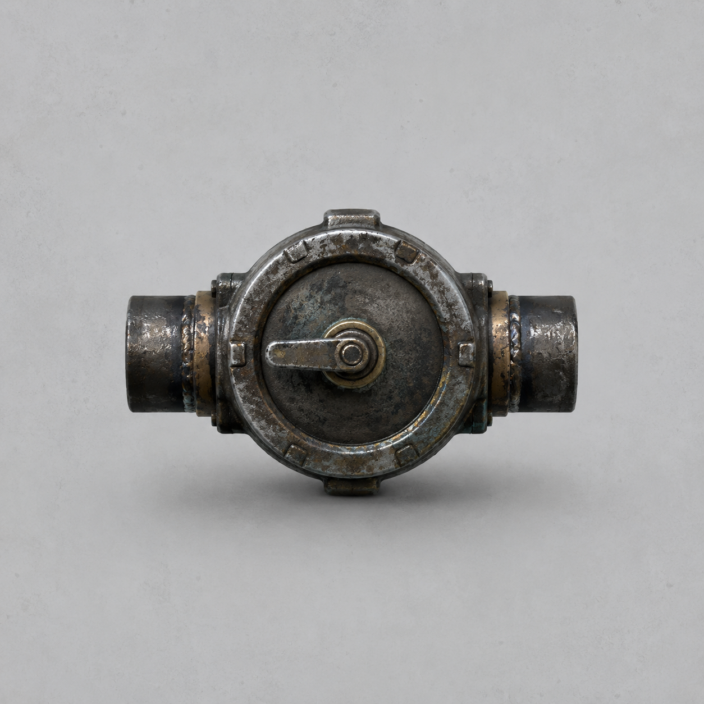

# 第93章 回拨点火阀不能替人认领

工业母机深处的启动声每响一下，正式收件槽里的黑点就多一个。

他们已经把能走的履带和能烧的锅炉都压在这条缝边，退回去会失去修理站的移动能力，继续往里走则会把苏弥的名字和伤势一起交给那只看不见的手。

苏弥站在槽前，右手义指仍垂着，左肩旧伤被白汽烘得发红。陈序把黑烟一号横在她身前，右膝下的履带足只剩一片短履带还能咬地，临时锅炉心的密封缝正往外渗热。

“先把里面那东西停掉。”苏弥说，“它每点一次火，回程缝就往母机深处缩一寸。缝没了，我们和锅炉心一起留在这里。”

陈序看着她的右手：“你进槽，纸上会不会把锅炉烧坏也算你的？”

“所以我不进。”她把白纸折成两半，“我要的是能走的路，不是替你们把损耗签完。”

锈钉举牌：“现有收件人未更换。建议一人进入正式收件槽。”

“建议可以退回。”陈序扳动黑油承重轮。上章它把右膝重量分走、让机体横移过三步，连接销却已经磨出铁屑；临时锅炉心也只能再撑一次高压。黑烟一号挪动半步，腹下便吐出一声闷响。

母机深处忽然亮起三道红光。第一道沿铁轨扫来，白塔机甲从侧门撞出，拳头直奔锅炉心。陈序没有加压，短履带只转半圈，机体横着滑开。拳头擦过腹甲，锅炉心的管口被震松，白汽把驾驶舱玻璃蒙成白墙。

“看见了！”苏弥抹掉玻璃上的霜，“它不是在追我们，是在照着点火声校正。每次启动，光就提前扫到下一段轨道。”

“那点火声就是它的眼睛。”陈序说。

第二台白塔机甲从红光里压下来，机械臂砸向回程缝。陈序猛拉牵引钩，黑烟一号被履带足拖得横移，右肩撞上母机立柱。立柱没倒，机体却被反震得左腕彻底麻死。白塔的拳头落空，砸在轨道边缘，红光顿时偏向刚才的声音。

苏弥盯着轨道深处：“它在里面替我们点火。不是为了启动整台母机，而是在用短脉冲让校正光重复同一个落点。”

陈序看她：“你怎么确定？”

她指向地面。三处焦黑点间距相同，只有最里面那处还冒着蓝红色余烬；每次余烬亮起，白塔机甲就转头。锅炉心管口的温度却没有上升，说明火不是从他们这边烧出去的。

“火在轨道里，光跟着火走。”苏弥说，“要停它，不必拆母机，只要让下一次点火回不到原来的管路。”

黑烟一号背后的旧钢缆已经烧成废缆，牵引钩也只剩半截。陈序想把白塔引过去，苏弥却挡住驾驶舱门：“别用自己当诱饵。你左腕没感觉，履带足再磨一圈，黑烟一号会趴在回程缝上。那样谁都不用认领，直接一起报废。”

她从母机边缘撬下一只短阀。阀体是旧黄铜和黑钢，左右各有管口，中间只有一根能来回拨动的短柄。

“这是回拨点火阀。”苏弥先直说，“用途是把下一次点火脉冲拨回旧管路，让火只在阀前响一下，不让它进校正光的管线；它不能造火，也不能增加锅炉压力，连续拨动会烧坏阀芯。”

她把阀门递给陈序：“现在就用一次。”

“你不怕它把热量拨到你手上？”

“怕。所以由我来拨。”

第三道红光已经贴到两人脚边。苏弥没有进正式收件槽，只把左手按在阀柄上。陈序把黑烟一号的残履带顶住阀后的旧轨，替她稳住管口。白塔机甲冲来，机械臂先砸向苏弥。

陈序扳泄压阀，临时锅炉心吐出最后一股短蒸汽。黑烟一号横移半步，肩甲撞偏机械臂；履带足连接销发出脆响，最后一片短履带从齿槽里弹出。机体停住，苏弥却把阀柄拨向相反方向。

母机深处的点火声响起。

没有火光沿轨道窜出，只有阀体内部“咔”地回了一声。最里面那处蓝红余烬熄灭，白塔机甲猛地转向空轨，拳头砸进自己的引导架。引导架塌下一截，第二台机甲被卡住，第一台的校正光也因此扫偏。

“有效。”苏弥松开阀柄。

阀体却烫得发黑，短柄卡在中间。她的左掌起了一层水泡，右手义指仍没有动。陈序想扶她，她先把手缩回去：“别碰。碰了，锈钉又会说你替我承受。”

“我只是想确认你还活着。”

“那就看，不要签。”

红光回程缝停止收缩，并向维修站方向亮出半丈。可锅炉心的密封缝同时裂开，最后一股蒸汽从腹下喷出。黑烟一号失去动力，靠履带足残片和肩甲卡在缝边，不能前进，也不能后退。

锈钉举牌：“回拨点火阀使用者未登记。是否默认归更换对象？”

苏弥看着烫伤的左掌：“不。它只拨回了一次点火，不替任何人认领损耗。”

陈序把那只烧黑的阀门压在轨道上：“物件能替我们改变方向，不能替我们填名字。这个道理要是再写错，下一次就让工单自己进槽。”

母机更深处传来第三次启动声，却没有红光跟出。阀体里的短柄轻轻回弹，像还有一只看不见的手在另一端拨它。

苏弥抬头：“里面的人发现阀门了。”

“那他为什么不直接关火？”

她看向回程缝里新增的一行浅字：点火者——拒绝认领。

锈钉把铁牌翻到背面，认真写下：“评论命名接口开放：这口拒绝认领的锅，叫‘阀先回拨’还是‘点火人不签收’？第三个工单名，留给读者老爷们。”

陈序没有笑。他听见黑烟一号腹下最后一滴热水落地，刚好响了三下。

下一次点火，已经在维修站里面。

---

## Metadata

- chapter_number: 93
- word_count: 1990
- generated_at: 2026-08-27 20:05:33
- upload_status: not_uploaded
