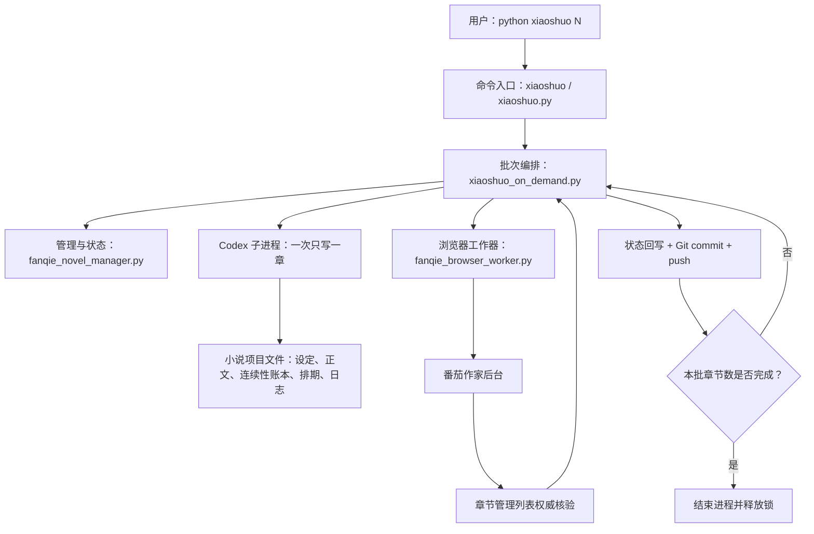
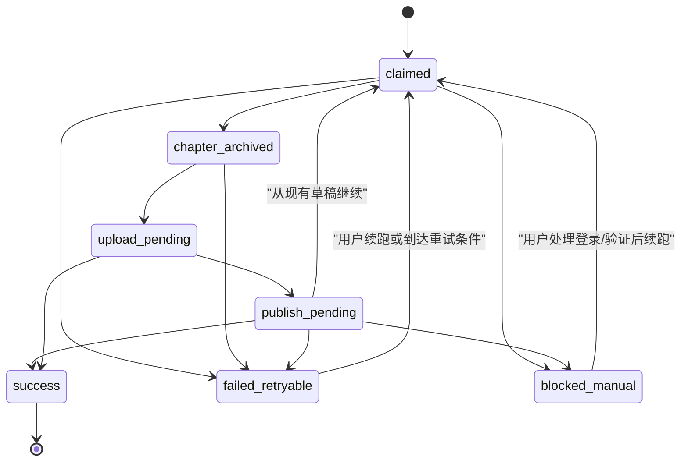

# 番茄小说管理器：项目详解、简历写法与面试指南

> 文档用途：帮助项目作者真正理解系统、整理简历项目经历，并准备面试追问。
> 分析对象：当前仓库中的 `xiaoshuo`、`xiaoshuo.py`、`xiaoshuo_on_demand.py`、
> `fanqie_novel_manager.py`、`fanqie_browser_worker.py` 以及《404修理站》项目文件。
> 结论以当前代码为准；不把计划中的功能包装成已经完成的功能。

## 一、先用一句话说清楚这个项目

这是一个用 Python 编写的 AI 网文生产与发布流水线：用户输入需要完成的章节数，系统会读取小说设定和连续性状态，调用 Codex 串行生成、质检并归档章节，再通过 Playwright 操作已经登录的番茄作家后台，设置定时发布，并以章节管理列表中的“待发布、审核中或已发布”作为成功依据，最后回写状态、记录日志并同步 Git。

如果别人只给你 30 秒，可以直接说：

> 我做了一个面向番茄小说的 AI 内容生产和发布管理器。它不是简单调用模型写文章，而是把小说设定、章节连续性、质量检查、任务状态机、浏览器自动化、失败恢复、发布结果核验和 Git 留痕串成了一条可恢复的流水线。最关键的设计是严格串行和权威状态回读：上一章没有在番茄后台确认进入审核、待发布或已发布，就绝不生成下一章，从而降低重复章节、错书发布和状态漂移。

## 二、项目解决了什么问题

长期连载并不只是“让 AI 再写一章”。真正困难的是下面这些问题：

1. 模型每次运行都是新上下文，怎样记住人物、伤势、道具、承诺、世界规则和未回收伏笔？
2. 写作完成、保存到本地、填入网页、进入审核、定时发布是不同状态，怎样避免混为一谈？
3. 浏览器点击超时后，动作可能成功也可能失败，怎样避免再次点击造成重复提交？
4. 批量生成五章时，怎样保证第 2 章一定建立在第 1 章的最新结果上？
5. 程序、网络或浏览器中途退出后，怎样从正确位置继续，而不是重写、跳章或重复上传？
6. 怎样确保操作的是正确作品，且不把 Cookie、密码、验证码等敏感信息写入仓库？
7. 怎样让每次内容和状态变化都有日志、提交记录和可追溯历史？

这个项目的核心价值，就是围绕这些可靠性问题设计了一套本地状态驱动的工作流。

## 三、总体架构



系统可以分成五层：

| 层次 | 主要文件 | 职责 |
|---|---|---|
| 命令入口层 | `xiaoshuo`、`xiaoshuo.py` | 解析 `N`、`--resume`、`--check`、`--setup-browser` 等参数 |
| 批次编排层 | `xiaoshuo_on_demand.py` | 领取任务锁、优先恢复待发布章节、调用 Codex、调用浏览器、推进批次 |
| 管理与状态层 | `fanqie_novel_manager.py` | 项目注册、结构校验、job 管理、运行锁、状态机、恢复信息和环境检查 |
| 浏览器适配层 | `fanqie_browser_worker.py` | 启动专用 Chrome、填表、发布设置、安全停止、最终列表核验 |
| 数据与知识层 | 小说目录、`shared/` | 保存设定、章节、连续性、质量标准、排期、状态和运行日志 |

这种拆分的意义是：写作逻辑、任务调度和网页操作变化频率不同。番茄页面改版时，主要修改浏览器适配层；小说写作规则变化时，主要修改项目 Markdown；任务恢复逻辑则集中在管理器中。

## 四、一次命令到底发生了什么

以 `python xiaoshuo 5` 为例，数字 5 表示本批次要成功完成五个章节槽位，不是创建五本书，也不是一次让模型生成五章。

### 1. 命令入口

无扩展名的 `xiaoshuo` 只负责导入 `xiaoshuo.py` 的 `main()`，方便用户输入简短命令。`xiaoshuo.py` 解析参数，然后把正常任务转给 `xiaoshuo_on_demand.py`。

特殊参数包括：

- `--setup-browser`：初始化专用 Chrome 登录会话；
- `--check`：检查项目结构、Codex、Playwright、Chrome、浏览器配置和书籍绑定；
- `--dry-run`：只输出计划，不写作、不打开浏览器；
- `--resume <job-id>`：继续之前未完成的同一批次；
- `--debug-browser`：出错时保留页面，便于人工观察。

### 2. 创建或恢复 job

管理器会创建一个 JSON job，核心字段包括：

```json
{
  "id": "时间戳-随机串",
  "book_id": "cosmic-404",
  "target_chapters": 5,
  "completed_chapters": [],
  "status": "queued 或 running",
  "result": null,
  "events": []
}
```

job 解决的是“这一次用户要求做几章、已经成功几章”的问题。它与 `chapter_state.json` 不同：

- job 是一次执行批次的进度；
- `chapter_state.json` 是整本小说的长期进度；
- `batch_schedule_*.json` 是每一章在番茄上的排期与上传状态；
- `.manager_runtime.json` 是管理器近期运行状态和重试信息。

这四类状态不能混用。

### 3. 获取全局运行锁

系统使用 `.manager.lock` 防止两个进程同时写同一本小说或同时操作番茄后台。创建锁时使用 `O_CREAT | O_EXCL`，它让“检查锁和创建锁”成为一个原子动作，避免两个进程同时认为自己拿到了锁。

按需运行还会在锁中记录进程 PID 和 `owner_mode=on_demand_process`。下次启动时，如果 PID 已不存在，管理器会识别陈旧锁并清理；普通锁超过配置的 180 分钟也会被视为过期。

这部分可以用一个面试术语概括：**跨进程互斥 + 陈旧锁恢复**。

### 4. 优先恢复未发布章节

编排器扫描所有 `batch_schedule_*.json`，按章节号排序。只要发现本地已经有正式章节，但状态还不是 `submitted/scheduled/pending_review/published` 等完成状态，就先处理它。

这样设计是为了保证幂等性：

> 已经写好的章节先继续上传，不再次调用模型，不推进 `next_chapter_number`，也不新建同章。

只有不存在待恢复章节时，系统才生成新章。

### 5. 调用 Codex，一次只写一章

编排器通过 `codex exec` 启动一个隔离、临时的 Codex 子进程，并明确要求：

1. 读取技能、项目规则、小说设定、连续性账本、最近三章和批量排期；
2. 只处理 `next_chapter_number` 对应的一章；
3. 完成写作、质量检查和一次修订；
4. 保存草稿与正式章节；
5. 更新章节状态、连续性账本、排期和当日日志；
6. 将上传状态先写成 `not_uploaded`；
7. 不访问浏览器，不修改 job 运行状态；
8. 一章完成后立刻结束。

“一次只写一章”非常重要。如果一次提示让模型写五章，后四章无法读取前一章实际修订后的状态，连续性容易漂移；现在每章结束都会把新事实写回磁盘，下一次子进程重新读取最新状态。

### 6. 写作质量和连续性如何保证

小说上下文不是只靠聊天记忆，而是外部化到文件：

| 文件 | 保存内容 |
|---|---|
| `novel_config.md` | 作品定位、读者、篇幅和稳定目标 |
| `outline.md` | 主线、阶段目标和后续章节方向 |
| `characters.md` | 人物身份、关系、能力和状态 |
| `world.md` | 世界规则、地点、制度和力量体系 |
| `style_guide.md` | 文风、节奏、结构和禁用表达 |
| `continuity_ledger.md` | 伤势、物品、承诺、倒计时、未解决事件等动态事实 |
| `chapter_state.json` | 当前章节号、上传状态、下一章必须承接的事项 |
| 最近三章 | 最近场景、语气、动作和章节钩子 |
| `quality_scorecard.md` | 连续性、冲突、人物、文本、结尾等评分标准 |

每章日志还会记录章节目标、冲突升级、解决方式、结尾钩子、质量评分、最强/最弱场景、连续性风险和下一次实验。这让系统不只是生产内容，也能积累可复盘的写作经验。

### 7. 解析章节并准备上传

浏览器工作器只接受规定格式的 Markdown 章节：

```markdown
# 第N章 标题

正文……

---

## Metadata

- upload_status: not_uploaded
```

解析器提取章节号、标题和纯正文，Metadata 不会被上传。如果正文少于 1000 个字符，程序会拒绝继续。

### 8. 使用专用 Chrome 登录会话

Playwright 以有界面的持久化上下文启动本机 Google Chrome。浏览器资料保存在 `%LOCALAPPDATA%/xiaoshuo/fanqie-chrome-profile-v2`，不进入 Git 仓库。

第一次由用户亲自登录。程序之后复用 Chrome 保存的登录状态，但代码不读取、不导出 Cookie、Token、密码或验证码。

这里的安全边界是：**复用浏览器会话，不接触会话秘密**。

### 9. 串行填写章节号、标题和正文

番茄输入框属于 React 受控组件，直接一次 `fill()` 后，值有可能被后续渲染覆盖。因此程序会模拟更接近人工的输入：点击、全选、删除、逐字输入、Tab 失焦，再读取真实值。

正文使用 ProseMirror 编辑器填入。填入后还会重新查询 DOM 并检查：

- 章节号是否仍然正确；
- 标题是否仍然正确；
- 页面正文是否以本地首段开头；
- 页面正文是否以本地末段结尾；
- 页面正文长度是否明显偏离本地内容。

这不是普通“填表”，而是**写后读（write-read-verify）**。

项目真实运行中出现过“第 32 章被页面回读成 3”的问题。系统没有继续发布，而是标记失败；续跑后重新填写并成功。这正好说明回读校验不是多余步骤。

### 10. 完成番茄发布设置

当前固定流程是：

1. 点击一次“下一步”；
2. 如出现错别字提示，点击“提交”；
3. 选择“仅基础检测”；
4. 选择“是否使用 AI = 是”；
5. 打开定时发布；
6. 选择日期并设置时间；
7. 回读关键值；
8. 点击一次“确认发布”。

页面上任何验证、登录失效、风控、政策提示或无法确认作品身份的情况，都会触发安全停止。

### 11. 不相信“点击成功”，只相信列表状态

点击“确认发布”返回不代表业务成功。网络可能在请求发出后断开，浏览器工具也可能只是完成了点击但服务端没有受理。

因此系统最后必须进入章节管理页，使用“第 N 章 + 完整标题”唯一定位目标行。只有目标行显示以下状态之一才算本章成功：

- `审核中`；
- `待发布`；
- `已发布`。

只看到草稿、只看到页面中别的章节处于待发布、或者目标行不唯一，都不能算成功。

这是整个项目最值得讲的可靠性设计：**用业务系统的权威读模型确认写操作结果，而不是用自动化工具的返回值代替业务成功。**

### 12. 回写本地状态并同步 Git

平台核验成功后，系统会更新：

- 对应排期项的状态、核验时间和番茄 URL；
- `chapter_state.json` 的最后上传章节和上传状态；
- 正式章节与草稿 Metadata 中的 `upload_status`；
- 当日日志；
- job 的 `completed_chapters` 和事件历史。

随后只暂存本章涉及的文件，创建 Git 提交并推送。如果平台已经成功、但 Git 推送因网络失败，job 会保留 `changed_paths_pending_git`。续跑时先重试 Git 同步，不会因为 Git 失败而再次上传已经进入审核的章节。

## 五、三个状态机必须分清

### 1. 运行状态机



- `failed_retryable`：网络、页面加载、临时控件错误等可重试问题；
- `publish_pending`：内容已经进入草稿或发布流程，但没有取得权威成功状态；
- `blocked_manual`：登录、验证码、风控、政策确认等必须由人处理的问题。

### 2. job 状态机

- `queued`：已经创建，等待工作器或按需编排器领取；
- `running`：批次正在处理；
- `finished + success`：成功章节数严格等于目标数；
- `finished + partial/failed/blocked`：保留事件和完成章节，可按 job id 续跑。

`job-progress` 对相同章节会更新已有记录，而不是重复追加；达到目标数后拒绝继续推进。这降低了重复计数风险。

### 3. 章节上传状态机

常见本地状态可以理解为：

```text
not_uploaded
  → draft_saved / upload_pending / publish_pending
  → submitted_pending_review / pending_review
  → scheduled / pending_publish
  → published
```

在 `submit_publish: true` 的作品中，`draft_saved` 只是中间态，不能把整批任务标记成成功。

## 六、失败恢复和幂等设计

### 1. 为什么不能承诺严格的 exactly-once

浏览器自动化跨越本地进程、网络和第三方网站，没有分布式事务。点击确认后如果连接断开，本地无法瞬间确定平台是否受理。因此不能诚实地宣称“数学意义上的严格一次”。

这个项目采用的是更现实的方案：

- 本地状态持久化；
- 章节号和标题作为业务键；
- 已有草稿优先恢复；
- 有副作用动作只执行一次；
- 结果未知时先做只读核验；
- 成功后再推进 job；
- 重试前检查权威状态。

面试中可以说：

> 我没有把它包装成严格 exactly-once，而是用持久化检查点、业务唯一键、状态回读和禁止盲目重放，实现接近 exactly-once 的业务效果。

### 2. Codex 子进程中断怎么办

系统最多自动重试一次。但在重试前，会先检查 `last_completed_chapter` 是否已经推进。如果 Codex 只是回传连接中断，而章节实际已经完整归档，就直接进入上传，不会再次生成同章。

### 3. 浏览器在确认前失败怎么办

如果失败发生在“确认发布”之前，并且属于临时错误，异常会被标记为 `safe_to_retry`，编排器最多重试。此时还没有最终提交，不容易造成重复发布。

### 4. 浏览器在确认后失败怎么办

一旦开始点击“确认发布”，就不再允许自动重试提交。正确做法是打开章节列表做只读核验；如果无法确定，就保留恢复状态，等下次从页面现状继续。

### 5. Git 推送失败怎么办

平台成功与 Git 成功是两个不同事实。平台已经进入审核后，绝不能因为 GitHub 断网而重复上传。程序会保留待同步文件列表，在下次运行开始时先补做提交或推送。

## 七、安全设计

项目中已经实现的安全边界包括：

1. 每本书单独绑定项目目录、作品 URL 和 book id；
2. 项目路径必须位于仓库根目录下，防止配置造成路径越界；
3. 页面必须能确认目标 book id 或作品名，否则停止；
4. 登录、验证码、二维码、风险控制、政策提示命中即停止；
5. 登录资料只由 Chrome 自己保存在本机专用 profile，不写入项目；
6. 不读取或导出 Cookie、Token、密码、验证码；
7. 只提交本批涉及文件，避免把无关文件或敏感文件带入 Git；
8. “确认发布”只允许在日期、时间、AI 和定时开关校验通过后点击一次。

## 八、为什么使用 Markdown 和 JSON，而不是数据库

当前系统属于单机、单作者、低并发工作流。Markdown 适合人直接阅读和修改小说设定，JSON 适合程序读取章节号、job 和排期状态；Git 又天然提供版本历史。因此当前阶段使用文件系统的开发成本更低，也更透明。

它的代价是：

- 多进程并发写入能力弱；
- 跨多个状态文件没有数据库事务；
- 查询和统计能力有限；
- schema 演进主要靠代码约定；
- 文件越来越多后，扫描成本会上升。

如果扩展为多用户、多书并发或云服务，可以迁移到 SQLite/PostgreSQL，并增加 job queue、事务、唯一约束、审计表和对象存储。现在没有过早引入数据库，是符合项目规模的工程取舍。

## 九、当前项目的真实边界和不足

这部分面试时主动说一两点，反而会显得你真正理解系统。

### 1. 它不是后台定时守护进程

当前常用模式是用户运行 `python xiaoshuo N`，程序在命令执行期间工作，完成后退出。`manager_config.json` 中的每日 12:00 和 `due/next` 命令提供调度判断，番茄章节也会被设置为定时发布，但仓库当前没有创建 Windows 计划任务或常驻轮询服务。

准确说法是“支持排期和到期判断的按需批处理”，不要说成“每天无人值守自动启动”，除非以后另行接入系统调度器。

### 2. 邮件报告配置存在，但当前按需主链路没有实际发送邮件

`publish_config.md` 中有邮件开关和收件地址，技能规范也定义了报告内容，但当前 Python 主链路只写本地日志，没有连接邮件服务。因此简历不要写“已实现邮件通知”；可以写成待扩展能力。

### 3. 页面选择器仍然依赖番茄当前 DOM

ProseMirror、Arco 组件 class、按钮文字和表格结构发生变化时，浏览器层可能失效。当前通过唯一定位、可见性检查、回读和安全停止减少误操作，但不能消除第三方页面改版风险。

### 4. 作品名校验存在硬编码

浏览器安全检查中除了 book id，还直接判断了“404修理站”文本。若注册第二本正式作品，应把作品标题加入 `PublishConfig`，从配置读取，而不是保留硬编码。

### 5. 发布时间控件仍有改进空间

日期已经通过可见日历选择；时间目前通过输入框键入后回读。虽然有结果校验，但项目规范更希望通过可见时间选项点击，因为第三方受控输入可能回退。后续应把时间也改为显式选择列表，并在确认前集中校验日期、时间、AI 和开关。

### 6. 缺少系统化自动测试

当前可靠性主要来自真实页面验证、日志和防御性检查，还没有完整的单元测试、状态机测试或模拟网页集成测试。适合优先补充：

- JSON 原子写入与状态迁移测试；
- pending 章节选择和恢复测试；
- job 去重、完成计数和锁清理测试；
- 使用本地 HTML fixture 模拟番茄页面的浏览器测试；
- Git 推送失败后的恢复测试。

### 7. 多文件更新不是一个事务

排期、章节状态、Metadata、日志和 job 是依次写入的。JSON 单文件采用“写临时文件 + `os.replace`”避免半文件，但多个文件之间仍可能在崩溃时短暂不一致。当前依靠日志、job 和续跑修复；更高可靠性版本可以加入 write-ahead journal 或数据库事务。

### 8. 质量评分仍以模型自检为主

质量门槛、最近章节和连续性账本能显著减少问题，但模型既是作者又参与自检，不能等同于独立编辑审核。可以增加规则检查器、实体状态差异比较、重复度检测和人工抽检。

## 十、这个项目是怎样一步步做出来的

你可以把开发过程讲成“从最短路径逐步工程化”，而不是声称一开始就设计完整。

1. **先解决内容结构化**：把大纲、人物、世界观、文风、章节状态拆成固定文件，让新会话可以恢复上下文。
2. **再解决单章闭环**：写作、质检、草稿、正式归档、状态更新和日志形成最小可用流程。
3. **接入番茄浏览器自动化**：使用 Playwright 和专用持久化 Chrome，避免在代码中管理账号凭据。
4. **从真实故障中加校验**：针对受控输入丢字、正文渲染覆盖、日期回退、页面控制超时等问题，增加逐项回读。
5. **定义权威成功信号**：不再把“按钮点击完成”当成功，而是回到章节列表唯一匹配目标行。
6. **增加状态机和恢复点**：区分未上传、草稿、发布待确认、审核中、待发布、已发布，以及可重试和需人工处理。
7. **增加批量串行和进程锁**：支持 `python xiaoshuo N`，同时防止重复运行和跨章状态漂移。
8. **增加 Git 审计和推送恢复**：每章变化独立提交；平台成功但 Git 失败时，不重复触发平台动作。

这个演进过程比“我用 Playwright 自动点了几个按钮”更能体现工程能力。

## 十一、简历怎么写

### 项目名称建议

**番茄小说 AI 创作与发布管理器｜Python / Playwright / Codex CLI / Git**

### 一段式项目介绍

> 独立设计并实现面向番茄作家平台的 AI 小说生产与发布流水线，将长篇小说上下文管理、单章生成与质量检查、批量任务编排、浏览器自动发布、定时排期、权威状态核验、断点续跑和 Git 审计整合为一套本地工具。系统采用文件化知识库维持跨会话连续性，通过任务状态机、进程互斥锁、业务唯一键与写后回读机制降低重复生成、错书发布和页面状态不一致风险。

### 简历要点版本

- 使用 Python 设计分层批处理架构，将 CLI、任务状态管理、AI 写作和 Playwright 浏览器适配解耦，支持按指定章节数严格串行执行与 job 级断点续跑。
- 将人物、世界观、故事大纲、文风和动态连续性账本外部化为 Markdown/JSON，使独立模型会话可恢复上下文，并通过最近章节、质量评分卡和章节后状态回写控制长篇连载一致性。
- 针对 React 受控输入和第三方页面不稳定问题，实现章节号/标题/正文写后回读、正文首尾校验、唯一元素定位、发布参数复核及安全停止策略。
- 以番茄章节管理列表中的目标章节业务状态作为权威成功信号，结合持久化检查点和禁止未知动作重放，降低浏览器超时导致的重复章节与重复提交风险。
- 实现跨进程文件锁、陈旧 PID 锁清理、失败分类、job 事件记录、Git 按章提交与推送失败恢复，提高长任务的可观测性和可恢复性。

### 关于量化数据

当前仓库已经归档至少 35 章，并有多次实际“审核中”核验记录。简历可以写“已用于 35+ 章的生成、归档与发布实践”。不要凭空填写节省了多少百分比时间或成功率；如果要写，应先从日志统计真实数据。

### 关于“独立开发”的诚实表达

如果别人问代码是不是你一个字一个字敲的，建议回答：

> 这是我的个人项目，我负责需求、流程设计、故障判断、验收标准和持续迭代，具体实现过程中使用了 Codex 协助编码和内容生成。我能解释每个模块的职责、状态流转、失败恢复和现有缺陷，也实际根据页面故障调整过实现。

这比回避 AI 协作更可信。现在很多工程项目都会使用 AI 工具，重点是你是否真正掌握系统并能负责结果。

## 十二、高频面试问题与参考回答

### Q1：这不就是调用 AI 写小说，再用脚本点网页吗？

不是。模型调用和网页点击只是两个执行器。主要工作是建立可靠的业务闭环：跨会话连续性、章节级状态、批量串行、输入回读、发布权威核验、失败分类、断点恢复、互斥锁和 Git 留痕。没有这些，系统很容易重复写章、传错作品、把草稿误判为发布成功，或者中断后不知道从哪里继续。

### Q2：为什么不让模型一次生成五章？

因为长篇内容存在状态依赖。第一章修订后可能改变人物伤势、物品和伏笔，第二章必须读取这些最新事实。系统把五章拆成五个串行事务，每章归档并回写连续性后，下一章才开始。

### Q3：怎样保证小说连续性？

我把静态设定和动态状态分开。大纲、人物、世界观和文风是相对稳定的知识；`continuity_ledger.md`、`chapter_state.json` 和最近三章是动态上下文。每章完成后，把新伤势、道具变化、承诺、倒计时和下一章必须兑现的事项写回，下一次生成重新读取，而不是依赖旧聊天记忆。

### Q4：怎样避免重复章节？

先扫描排期文件和正式章节。如果某章已经存在但还没取得平台完成状态，就优先恢复该章；只有待发布队列为空才使用 `next_chapter_number` 写新章。job 中也按章节号记录完成项，相同章节更新而不是重复计数。

### Q5：浏览器点击超时后怎么办？

超时不等于失败，因为请求可能已经发出。确认发布之前的临时失败可以有限重试；一旦点击最终确认，就禁止自动重复点击，只通过章节管理列表做只读核验。确认失败前不重放有副作用动作。

### Q6：怎样判断发布成功？

不使用 Playwright 的 click 返回值作为业务成功。程序返回章节管理页，用“第 N 章 + 完整标题”唯一匹配目标行，并读取该行状态。只有审核中、待发布或已发布才算成功。

### Q7：为什么使用 Playwright，不直接调用番茄接口？

项目使用平台正常网页流程，没有依赖未公开或不稳定的内部接口。Playwright 能复用用户可见的登录会话，也便于对页面状态做回读。代价是受 DOM 改版影响，所以我把页面逻辑隔离在浏览器工作器中，并设置安全停止条件。

### Q8：登录信息怎么处理？

首次由用户在专用 Chrome 窗口手动登录，之后复用本机持久化 profile。代码不读取或导出 Cookie、Token、密码和验证码，profile 也不在仓库内。

### Q9：文件锁可靠吗？

创建锁使用原子排他创建，能防止两个本地进程同时领取。按需锁记录 PID，进程死亡后可以清理；另有超时兜底。它适合当前单机模型，但不适合多机分布式场景，多机应改用数据库租约或 Redis 分布式锁。

### Q10：为什么 JSON 写入要先写 `.tmp` 再 `os.replace`？

直接写原文件时如果进程崩溃，可能留下半截 JSON。先完整写临时文件，再原子替换目标文件，可以保证单个状态文件要么是旧版本，要么是新版本，不容易出现截断内容。

### Q11：系统怎样区分错误？

临时网络、页面加载和控件不可用属于 `failed_retryable`；已经生成或存草稿但发布未确认属于 `publish_pending`；登录、验证码、风控和政策提示属于 `blocked_manual`。不同错误采用不同恢复策略，避免所有异常都无脑重试。

### Q12：为什么 Git 也属于主流程？

小说正文、设定和状态本质上都是重要数据。按章提交能提供审计、版本回退和异地备份。平台成功与 Git 推送成功被分开记录，Git 断网不会导致平台重复提交。

### Q13：如果程序在更新多个文件时崩溃怎么办？

单个 JSON 文件有原子替换，但多个文件目前没有统一事务。恢复时依靠 job、章节文件、排期和日志交叉判断。更高版本会增加写前日志或数据库事务，这也是当前明确的技术债。

### Q14：为什么不用数据库？

当前是单机单作者、文件数量有限，而且 Markdown 需要直接供人和模型阅读，Git 也需要追踪文本差异。文件系统更简单透明。多用户、多书并发或需要统计查询时，再迁移数据库更合理。

### Q15：如何应对番茄页面改版？

浏览器逻辑集中在一个适配模块，尽量使用语义按钮、placeholder、角色和唯一匹配，不使用固定屏幕坐标。无法唯一定位或作品不匹配时安全停止。后续会用本地 HTML fixture 做回归测试，并把硬编码标题改成配置字段。

### Q16：你最满意的设计是什么？

我最满意的是权威状态核验和未知动作不重放。第三方页面自动化最危险的不是明确失败，而是“不知道刚才是否成功”。系统不把点击返回当完成，而是读取目标章节在业务列表中的最终状态，从根本上减少重复提交。

### Q17：你遇到过什么真实问题？

遇到过 React 受控输入吞掉章节号第二位、正文填入后标题重新渲染丢失、日期组件值回退、浏览器控制超时和 Git 推送断网。对应做法是逐字段串行输入、失焦触发、正文后重新查询控件、首尾及长度回读、最终列表核验，以及把 Git 待推送路径持久化。

### Q18：如果让你继续优化，优先做什么？

优先补自动测试和浏览器适配回归测试；然后把作品标题完全配置化、把时间改为可见选项选择、增加多文件事务日志；最后才考虑数据库、消息队列和系统定时器。优先级依据是先降低当前真实故障，而不是为了技术栈复杂化。

## 十三、可能遇到的问题与排查表

| 现象 | 可能原因 | 正确处理 |
|---|---|---|
| 提示找不到 Codex | CLI 未安装或不在 PATH | 安装 CLI，执行 `codex login` 和 `codex login status` |
| `--check` 显示 Playwright 不合格 | 未安装或版本低于要求 | 根据 `requirements.txt` 安装依赖 |
| 专用 Chrome 未初始化 | 尚未执行首次登录配置 | 在用户桌面终端运行 `python xiaoshuo --setup-browser` |
| Chrome 启动失败 | 专用 profile 被残留 Chrome 占用 | 关闭专用 Chrome 后续跑原 job |
| 页面提示登录/验证码/风控 | 会话过期或平台安全校验 | 停止自动化，用户手动处理后 `--resume` |
| 章节号只输入了一位 | React 重渲染吞掉字符 | 不继续发布；依靠回读失败停止，续跑后重新输入 |
| 正文为空或首尾不一致 | 编辑器未聚焦或云草稿晚加载覆盖 | 等待编辑器水合，重新定位后填入；仍失败则停止 |
| 标题在填正文后消失 | 页面重渲染替换了输入控件 | 正文后重新查询标题框并恢复、再次回读 |
| 日期显示后又回退 | 对受控输入框直接写值 | 使用可见日历选择并回读 |
| 点击确认后连接断开 | 结果处于未知状态 | 不重复点击；只读检查章节管理列表 |
| 只看到草稿 | 尚未真正提交发布 | 记录 `publish_pending`，下次沿用草稿继续 |
| 平台已审核中但 Git push 失败 | GitHub 网络问题 | 保留待推送路径；下次先补推，不重复上传 |
| 提示已有任务运行 | 另一个进程持有有效锁 | 查询 job/进程；不要并发启动 |
| 进程已死但仍有锁 | 陈旧锁 | 下次命令会通过 PID 或超时规则清理；先确认目标 PID 确实不存在 |
| `validate` 报章节状态不一致 | 章节文件最高编号与 state 不一致 | 对照正式章节、日志和排期修复，不直接盲改章节号 |
| 页面找不到按钮或匹配多个 | 番茄 DOM 改版或弹窗变化 | 开 `--debug-browser` 观察，更新浏览器适配层，不能盲点 |

## 十四、常用命令速查

```powershell
# 首次环境准备
codex login status
python xiaoshuo --setup-browser
python xiaoshuo --check

# 只看计划
python xiaoshuo 1 --dry-run

# 严格串行完成指定章节数
python xiaoshuo 1
python xiaoshuo 5

# 查看任务并续跑
python .\fanqie_novel_manager.py job-status
python .\fanqie_novel_manager.py job-status --job <job-id>
python xiaoshuo --resume <job-id>

# 排查浏览器步骤
python xiaoshuo --resume <job-id> --debug-browser

# 查看项目与待处理章节
python .\fanqie_novel_manager.py validate
python .\fanqie_novel_manager.py session --book cosmic-404
python .\fanqie_novel_manager.py pending --book cosmic-404
```

## 十五、建议的后续迭代路线

### 第一阶段：测试和配置化

- 为状态机、锁、pending 选择、job 恢复和 JSON 写入补单元测试；
- 建立番茄页面 HTML fixture，做无账号的浏览器适配回归测试；
- 将作品标题、成功状态文案和选择器配置化；
- 日期和时间统一改成可见控件选择；
- 增加日志敏感信息扫描。

### 第二阶段：一致性和可观测性

- 增加多文件 write-ahead journal；
- 为每一步记录结构化耗时、重试次数和失败分类；
- 提供本地只读仪表盘，展示每章写作、归档、上传和 Git 状态；
- 从日志计算真实成功率、平均耗时和人工介入次数。

### 第三阶段：规模化

- 把 job 和章节状态迁移到 SQLite/PostgreSQL；
- 引入任务队列和租约锁，支持多书并发、同书串行；
- 接入 Windows 计划任务或独立调度服务；
- 增加邮件或其他通知渠道；
- 对模型调用增加成本、超时和版本追踪。

## 十六、最后应该记住的六句话

1. 这个项目的核心不是“生成文字”，而是**可靠地推进一个有状态的内容生产流程**。
2. 小说连续性依靠**外部化知识与每章状态回写**，不是依靠聊天记忆。
3. 批量任务必须**一次一章、严格串行**，上一章闭环后才开始下一章。
4. 浏览器自动化采用**写后回读、唯一定位、安全停止和未知动作不重放**。
5. 发布成功必须由**番茄章节管理列表的目标行状态**证明，不能由点击返回值证明。
6. 简历可以突出状态机、幂等、恢复、浏览器可靠性和 Git 审计，但不要把当前按需工具夸成已经实现的云端无人值守平台。

如果把这六句话讲明白，再能结合一次“章节号被吞、系统停止并续跑成功”的真实故障案例，你就已经能够比较扎实地介绍这个项目了。
