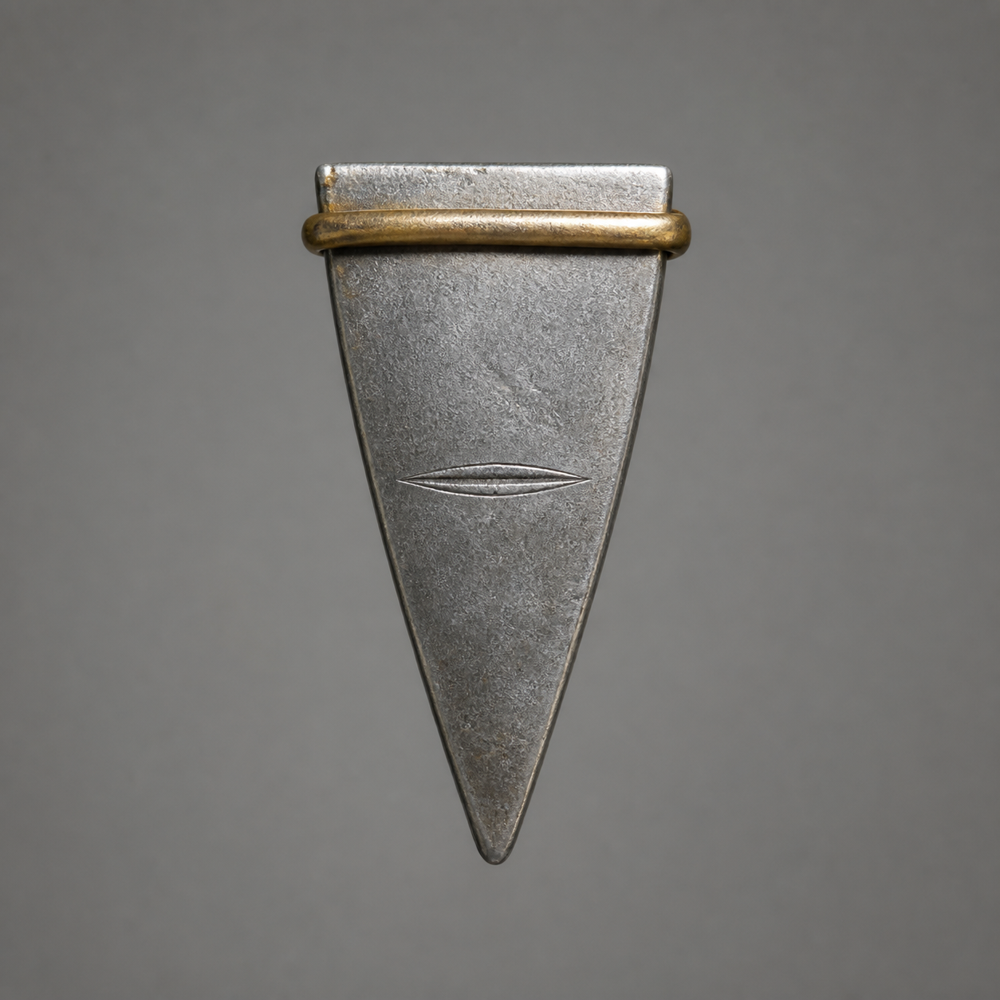

# 第17章 明天的我先欠一句话

“先找声音，再堵眼。”

青色裂纹熄灭不到三息，陆遥便把话说死。

明日午时，他的左眼会替镇天碑看见栖霞村二十七个人。没人知道“看见”之后会发生什么，可石壁上正在消失的村名已经给了最坏的参照：栖霞村排在一百零八个被抽取地气的村子最前面，名字每少一笔，村里的地气就会再薄一分。

若那二十七个人也被碑记住，他们很可能会从“村名”变成镇天碑下一批直接抽取的落点。

陆宁握紧布架：“回村。现在走，明日午时前能到。”

“走不了。”商青梧替陆遥按住左眼新渗出的血，“碑窟行路签已经耗尽，石门只认这一次进出。我们现在退出，再想进来就要重新领签。更要紧的是，声音让他在午时前找到留下话的人。只回村躲，不知道碑从哪里看，二十七个人藏进地窖也未必有用。”

“所以分两件事。”陆遥道，“声音的来处是线头，堵眼是剪线。先找线头，找不到就回去把二十七个人全塞韩大人床底下。镇天碑若还敢看，算他家风不正。”

韩照夜扫他一眼：“我父亲的床装不下。”

“那就劳烦韩姑娘劝他换张大的。”

嘴上还能欠，说明人暂时没被那滴血吓住。可陆遥没有催陆宁继续下阶。他侧躺在布架上，先让顾长夜把方才发生的事从头说了一遍。

“你的血悬在眼角，被牵向右壁。”顾长夜道，“裂纹先亮，声音后响。最后留下明日午时。”

“声音像不像阿绫学的？”

阿绫立刻炸毛：“我学你，比你本人喘得好听！”

商青梧把沾血药布举到石缝前。阿绫凑近嗅了两次，尾巴慢慢压低：“不是假嗓子。声音里有他的血味，还有这块碑的灰味。像有人把他说过的话埋进石头，又从上游挖出来。”

这是第一份依据：声音不是外人模仿，至少与陆遥本人和这条碑缝同时有关。

陆遥又让韩照夜用剑鞘轻敲石阶。

第一下，声音往下散。

第二下，顾长夜用掌心堵住左壁，回声仍从右侧青缝里返上来。

第三下，韩照夜把剑鞘压在写着“栖霞村”的刻痕下方。细碎石灰没有落向台阶，反而贴着墙面向上爬了半寸。

碑窟里的地气正在向下流，声音却能沿青缝逆着抽取方向往上走。

“留音在下面。”陆遥作出判断，“有人明日午时在更深处说话，青缝把声音送回了我们刚才碰见它的时刻。它能往回送多久不知道，但路在右壁后面。”

“也可能只是碑让你以为如此。”韩照夜道。

“所以不拿猜测当答案。”陆遥冲她抬了抬下巴，“再找一处回声，能重复，才往下走。”

石阶再下九级，尽头被一面黑石门封住。门上没有锁孔，只刻着两行小字。

“外层查验至此。”

“一签一次，验毕即退。”

身后的封路石同时发出闷响，像在催促他们原路离开。

陆宁看向陆遥：“你的签确实用完了。”

“签写的是进外层一次。”陆遥从怀里摸出正式仙籍木牌。木牌正面证明他已经通过第三验，背面还有韩照夜亲手添下的见证，“没写查到一半，石头可以替我宣布验毕。”

他又取出韩百川的官印。

官印隔章再用，作用仍是那一桩：它是巡山使替陆遥作保的官凭，也是天巡司必须认账的责任印。陆遥把印面朝向石门，却没有动用受伤的右臂，只让顾长夜托住印底，自己以左手两指扶正。

“正式仙籍查验本地天禁记录，巡山使官印作保。”陆遥客客气气道，“记录还在往下，查验人还活着，哪一条算验毕，请门上写清。”

黑石门没有回答。

身后的退路却又缩窄一寸。

陆遥笑了：“不写，就是没有。规矩是你定的，我只负责让你也守。”

官印落进门面一处积灰的方槽。

整扇门先向外顶了半寸，像要把他们赶走，随即又被仙籍木牌上亮起的白光压回去。两股判定在石中来回磨了三次，门缝终于吐出一张薄如蝉翼的灰片。

灰片上只有八个字。

“查验未结，准入检修道。”

实质收益落在眼前：他们没有再花一张行路签，也没有被赶出碑窟，而是凭已经生效的查验权打开了右壁后的窄门。

“韩姑娘，”陆遥把官印收回来，“替我转告令尊，多谢他老人家又送一程。”

“你自己还。”

“那不行，欠人情容易，欠命危险。”

窄门后不是继续向下的石阶，而是一圈贴着镇天碑根部修出的环廊。环廊只有三尺宽，中央是一口深不见底的竖井。无数黑色根须从井壁垂下，把来自一百零八个村子的微光一点点送向井底。

陆遥不能下地，更不能攀高。陆宁与顾长夜把布架横过来，一前一后贴墙抬行；韩照夜走在外侧，剑鞘始终抵着布架边缘，防止它向竖井滑。

走到环廊第三个转角，陆遥忽然抬手：“停。”

右壁有一道新鲜血痕。

血已经干了，颜色却与他眼角那滴一模一样。旁边还压着半个掌印，掌根避开左肩，五指用力方向偏向右侧——正是一个右肋不能受压、左臂又无法负重的人，扶墙时会留下的姿势。

商青梧拿银针刮下一点，放到陆遥新鲜的血布旁。两处血在针尖上凝成同一种暗红，没有相斥。

“血气相同。”她说，“伤势也相同。至少留下掌印的人，和你现在的身体状态一致。”

这是第二份依据。

顾长夜蹲下看地面。环廊灰尘里没有来时脚印，只有四条布架腿曾经落下的浅坑。坑距与他们此刻抬着的布架完全一样，却从另一头延伸而来，停在血掌印前。

不是一个未来的陆遥独自走到这里。

明日之前，他们这几个人还会抬着同一副布架来一次。

陆宁沉声道：“我们已经走在那句话发生的路上。”

“看样子明天的我也没长出新骨头。”陆遥盯着血印，“好消息，没死。坏消息，药费还得接着欠。”

血印下方嵌着一枚灰银色三角楔。它只有半掌长，楔身扁平，正面开着一道闭合眼缝般的凹槽，尾端缠着一圈旧金色软铜。旁边的检修刻字没有卖关子，第一句就写明用途：

“断视楔：检修镇碑时钉入青色眼纹，可让镇碑暂时看不见该路连接的人与地。”

第二句才写限制。

“一楔一纹，闭眼一刻；取下即复。”

它不是兵器，也不能毁掉镇天碑，只是一枚给碑工争取检修时间的临时楔子。至于谁造了它、为何留在未来血印下、闭眼时被抽取的地气会去哪里，刻字没有说明。

“正好。”陆遥道，“先验货。”

商青梧立刻按住他的手：“你不能钉。”

“我负责选地方，出力的人另算工钱。”

韩照夜已经拔出半寸剑，又停住：“用剑柄敲？”

“先别敲主纹。”陆遥指向环廊边缘一条只连着无名碎石的细小青线，“那条没有村名，也没有人。钉错了，最多让一块石头暂时看不见自己。”

顾长夜先用短刀刮开青线表面的灰。阿绫贴近嗅过，确认后面只有冷石味，没有活人、村落或封禁的气息。证据在前，韩照夜这才用剑柄把断视楔轻轻送进细纹。

楔尖刚碰到青线，井底忽然亮了一下。

韩照夜立刻停手。陆遥左眼却像被人从里面拨开，血沿鼻梁滑下半寸。原本只连碎石的光丝没有变暗，反而分出一根更细的支线，朝代表栖霞村的主纹探去。

“方向反了。”陆宁道。

“刻字只说钉入，没说哪一面朝下。”顾长夜把断视楔翻过来。它的背面并非平整，靠近尖端处有三道由浅到深的磨痕，“有人以前拔过它，受力都从尖端往尾环走。刚才我们让尾环先承了力。”

陆遥没急着让韩照夜重敲。他让阿绫再闻一次分出的支线，又让商青梧把银针横在青纹上方。支线靠近银针时，针尖的血珠被吸向井底；楔子一移开，血珠便停住。

错误方向不是闭眼，而是在给镇天碑多开一条视路。

“好东西还挑正反。”陆遥擦掉鼻梁上的血，“刚才若直接往栖霞主纹钉，明天都省了，它今晚就能先看一遍。”

商青梧重新替他压住眼角：“代价也记上。每多开一条线，你的左眼先替它接一次。”

“记韩姑娘工钱里。”

韩照夜把楔子翻到磨痕顺着青线的方向：“再胡说，我按第一种方向钉你额头。”

“那还是公账。”

众人这次先退开布架，只让顾长夜用短刀背抵住楔尾，避免任何人站在青纹正前方。韩照夜再落剑柄时，力道也只用了方才的一半。

第一下，楔身只入一线。

青纹立刻从明亮变成浑白。环廊外那块拳头大的碎石还在，却不再把微光送往井底。

第二下，断视楔完全咬住裂缝。它正面的眼缝凹槽缓缓合拢，井下与碎石相连的那一根光丝当场断开。

效果在同章兑现：它确实能让镇天碑暂时看不见一条连接，而且不会把连接的东西一同毁掉。

陆宁没有立刻认这个结果。她捡起那块碎石，在青纹闭合期间先移到左侧，再搬回右侧。井底没有任何光丝追着它移动；等碎石放回原位，石面也没有裂伤或失去重量。

“不是把石头毁掉，也不是把线挪去别处。”她道，“只是碑这会儿找不到它。”

这次回查才把断视楔的基础效果真正坐实。

顾长夜立即开始计时。

半刻过去，碎石仍在原处，光丝没有恢复。断视楔尾端的旧金软铜却一点点变黑，像有什么东西沿着闭合的眼纹反咬回来。

“代价不只是一刻后复明。”商青梧道，“它在承受原本要经过这条线的东西。若钉进连着二十七个人的主纹，楔子未必撑得到一刻。”

陆遥没有把未知说成答案：“只证明会反噬楔身，撑多久、断后往哪儿去，都还要试。”

一刻刚满，楔尾发出极轻的一声裂响。

眼缝重新张开，碎石到井底的光丝也随之接回。韩照夜拔下断视楔，楔身没有碎，只在旧金软铜上多了一点焦黑。

阻断办法已经找到了，限制也看得见：一枚楔子只能闭住一道眼纹一刻，而且会承受回流。明日午时，只要找到连接栖霞村二十七人的那道主纹，并让断视楔撑过镇碑睁眼的时刻，他们就能暂时阻止“看见”。

问题从“毫无办法”变成了一个能执行、也能判断成败的目标。

陆宁把楔子用药布包好：“现在回村，先让那二十七个人知道。”

“还不行。”顾长夜指向血掌印前方。

四枚布架脚印越过转角，继续通往环廊深处。未来的他们没有在拿到断视楔后离开。

更深处，青色眼纹一条接一条亮起。每亮一条，陆遥左眼便跟着刺痛一次。到第七条时，墙内再次传来他的声音。

这一次不再是完整留音，只剩几个被石头磨碎的字。

“……别拔……”

“……第二枚……”

“……会看见我爹……”

声音停下时，陆遥左眼里的血忽然分成两线。

一线仍指向代表栖霞村的主纹。

另一线越过一百零八个村名，指向井底一个此前没有亮过的位置。黑暗中，第二枚断视楔正钉在一只闭合的巨大青眼中央，楔尾缠着半截已经烧焦的木鸢铜扣。

铜扣背面，露出一个他们都认得的“北”字。

陆遥脸上的笑消失了。

第一枚楔子能救二十七个人。

可未来的他留下第二句警告，显然不是要他们把井底那一枚也拔出来。

那只被迫闭上的眼睛正在看的，可能是陆沉舟。

---

## Metadata

- chapter_number: 17
- word_count: 3928
- generated_at: 2026-08-12 11:25 +08:00
- upload_status: submitted_pending_review