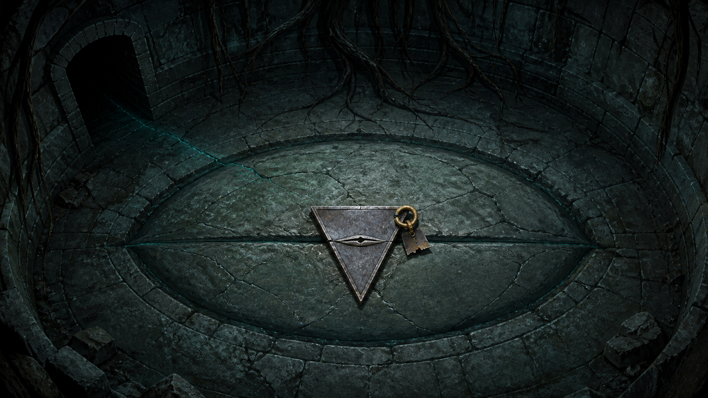

# 第18章 我爹这条路，谁也别看

“谁都不许碰井底那枚楔子。”

陆遥盯着黑暗里那个“北”字，先把最容易犯的错堵死。

第二枚断视楔正钉在巨大青眼中央。断视楔能让镇天碑暂时看不见一条连接；上一枚插反时，却会多开一条视路，还先从陆遥左眼里收血。若井底这一枚真在替陆沉舟遮眼，贸然拔下，等于亲手替镇天碑把人指出来。

可不弄清它遮住的是谁，明日午时，他们也不敢拿第一枚去堵栖霞村二十七人的主纹——两枚楔子若遮的是同一条路，动一处，另一处可能先开眼。

目标只有一个：不拔楔，先让那只闭眼自己露出正在找谁。

陆宁把药布包里的第一枚断视楔往怀里按紧：“怎么验？”

“先找它从哪边挨骂。”陆遥道，“眼睛闭着，眼皮总有里外。”

韩照夜看向井底：“你下不去。”

“说得好。”陆遥躺在布架上，脸不红心不跳，“所以劳烦诸位抬稳。我负责体弱多病，你们负责吃苦耐劳。”

陆宁抬手就在布架腿上敲了一记。

井壁回声荡了三圈。阿绫没笑，它伏在环廊边缘，鼻尖几乎贴到石面：“下面不只有碑灰味。还有烧焦的风骨木。”风骨木能记住长期吹过它的风向，受热时会朝旧风来处轻颤，陆家一直拿它做木鸢骨架。

木鸢铜扣不是孤零零缠在楔尾。井下还有陆沉舟木鸢烧毁后留下的东西。

顾长夜将短刀横放在环廊上，刀尖探出半寸。刀身映不出井底，却映出垂落的黑色根须。那些根须都把村落微光送向下方，只有靠近巨眼的三根在逆着收缩，像有什么力量从眼中往上顶。

韩照夜从地上弹下一粒石屑。

石屑先擦过第一根黑须，根须向井底一缩；再碰第二根，仍是如此。撞上第三根时，根须却猛地向上抽起，将石屑甩回环廊。

“第三根不是在抽东西。”顾长夜道，“它在挡。”

这是第一份看得见的依据。巨眼周围并非所有线路都向镇天碑输送东西，至少有一根在把外来的触碰推开。

“先试外圈，不碰眼。”陆遥道。

顾长夜用短刀切下一条空药布。陆宁把布一端系住小石，另一端留在手中，沿着井壁慢慢放下。药布没有活人血气，也不连任何村名，若它仍能引起反应，就能先分清哪一侧是镇碑的视路。

小石经过前两根黑须时，布面只沾灰。靠近第三根，药布忽然向巨眼方向绷直。

陆宁立刻停手。

闭合的青眼没有睁，眼皮外却浮起一圈极淡的青光。光先追着小石转了半寸，随后被中央断视楔截住，像一股水撞上门板，沿着楔身分向两边。

楔尾那半截烧焦铜扣轻轻一颤。

环廊上，陆遥左眼没有出血。

商青梧用两根银针分别贴在他左眼下和第三根黑须上。眼下银针安静，井边那根却一点点发青。

“外圈在看药布，楔子把视线挡住了。”她道，“而且这次回流没有落到陆遥身上。”

“说明它挡的不是我这只眼。”陆遥道，“再找内侧。”

韩照夜皱眉：“再近一步，就可能惊动楔后的人。”

“所以不用活人的东西。”

陆遥低头看向自己的旧工具囊。短凿留在甲七舟，麻绳也断过几截，囊底只剩两片风骨木和三枚旧铜扣。他用左手拨出一片最窄的风骨木。

木片离开原处后，受热时仍会朝旧风来处轻颤。它不是新法器，更不会替人找路，只能证明某一阵风曾经从哪里吹来。

“这是爹五年前削剩的。”陆宁一眼认出木纹，声音沉了些，“铺子北窗挂了五年，记的是栖霞山北坡风。”

“正好。铜扣上的字也是北。”

陆遥没把木片直接丢下去。他让阿绫先嗅，确认木里只有旧风和陆家木作铺的松油味；又让商青梧用无血细线绑住，避免它沾上陆遥的血。

木片被放到巨眼上方三尺时，外圈青光追了过来。

中央断视楔把它挡住。

再降一尺，风骨木忽然不再下垂，而是横着指向巨眼后方。那不是被井风吹动。井里所有湿冷气都在向下，木片偏偏向北侧石壁抬起。

铜扣随之又颤了一下。

一声极轻的木响从闭眼后传来。

咔。

两短一长。

陆宁的手骤然收紧。那是陆家修木鸢时的报平安暗号。五年前陆沉舟教过他们，若隔着风雨看不见人，就敲两短一长，表示“人还在，路没断”。

声音不是从井下传上来，而是从青眼背后的北侧石壁传来。断视楔遮住的并非通往村子的抽取线，而是一条横穿山腹、指向北方的隐蔽视路。

这条路上至少有陆沉舟留下的木鸢和陆家暗号。

还不能据此断言敲击者就是他本人，但足够判断：拔楔会让镇天碑看见这条北路上的目标。

“验到了。”韩照夜道，“收木片。”

陆遥却看着那三根逆缩的黑须：“还差一件事。它是在替里面挡外面，还是替外面挡里面？”

顾长夜抬眼：“有区别？”

“有。若只挡镇碑往里看，我们能把救村的楔子钉在别处。若也挡里面往外送信，明日的我为什么还能把话送回来？”

陆宁正要收线，井下忽然传来一声裂响。

不是断视楔。

系着风骨木的无血细线被第三根黑须缠住了。黑须不再把它往外推，反而沿线向上爬，直奔陆宁手腕。

外圈青光同时分出第二道细丝，绕过断视楔左侧，向环廊探来。

错误答案出现得比他们预想更快：镇天碑找不到楔后的北路，便开始沿着放下去的线反查是谁在敲门。

“松手！”商青梧喝道。

陆宁没有松。细线一丢，风骨木就会落到巨眼上，替镇碑留下陆家木作铺的气味和旧风。

韩照夜剑锋已出，却没有斩黑须。那东西连着青眼，斩错一根，可能等同拔楔。

“斩线中段！”陆遥道，“留下面那截给它，别让上面这截带人回去。”

韩照夜一剑切断陆宁手下三寸的细线。

黑须卷着下半截猛然缩回。风骨木向巨眼坠去，陆遥胸前青羽却没有亮。他也没有让任何人伸手去抢，只盯着木片偏转的方向。

“顾长夜，刀背，北壁！”

顾长夜一步踏到环廊外沿，短刀没有碰木片，只用刀背重重敲了一下北侧石壁。

咚。

石壁里的两短一长立刻回了半声。

第三根黑须被那声回响引得向北一偏。风骨木擦过它的末端，没有落向巨眼，而是卡进井壁一条窄缝。

陆宁手腕上只留下一道青灰勒痕。她没流血，细线也没有再连着她。

代价落了地：用物探路同样会被反查；再拿任何带人气、血气或来处的东西靠近，镇天碑都会顺线往回找。陆宁替这次试探挨了一道勒伤，那片记着北坡风的旧木也留在井下，暂时取不回来。

但结果同样清楚。

断视楔能挡外圈向北路看，却不完全截断北路向外传来的敲击与回声。未来留音能沿青纹送回，正是利用了这个单向缺口。

“现在收工。”陆遥道。

韩照夜还剑入鞘：“你方才若判断错，木片会落进眼里。”

“所以我先让你斩线，再让他敲墙。”

“你怎么知道回声会引开根须？”

“不知道。”陆遥坦然道，“我只看见第三根一直在挡外物，却会回应北边的敲击。让它在木片和熟悉的声音里选一个，总比让人下去抓强。”

他顿了顿，又补一句：“再说，顾兄的刀还欠我租钱，掉下去不划算。”

顾长夜把短刀收回袖中：“从你那一半里扣。”

阿绫沿环廊嗅了半圈，忽然在地上打了个喷嚏。方才被斩断的细线附近，多出了一层极薄的白灰。白灰没有流向井底，而是往来路方向铺出一串指甲大小的箭头。

每一枚箭头旁都刻着同一句检修短令：

“发现反查，封闭活路。”

这不是法器，只是旧碑工留给同伴的撤退标记：一旦镇碑顺着检修物反查，就要把通往活人的路线隔开，免得一条线牵出整队人。

白灰箭头尽头，环廊来时的窄门正在缓缓合拢。

顾长夜冲过去，以短刀鞘卡住门缝。门只停了一息，刀鞘便发出不堪重负的轻响。

“它要封的不是我们。”陆宁盯着门上的灰字，“是我们回村的路。”

陆遥看向她怀里的第一枚断视楔。

他们已经验证井底第二枚楔子遮的是通往北方、带有陆沉舟线索的暗路，不能拔，也不能挪。第一枚仍可用于明日午时遮断栖霞村二十七人的主纹，可它插入后只能闭眼一刻，还会承受回流；更糟的是，方才的反查已经让碑窟启动封路。

若现在被困，救村方案再正确也送不回去。

商青梧先把最要命的一点说透：“第一枚楔在无名碎石的细纹里撑满了一刻，不代表它在二十七个人的主纹里也能撑满。回流有多重，我们还不知道。”

“所以不能等午时才第一次钉。”陆宁道。

“也不能提前拿活人试。”

陆遥看着第一枚楔尾已经焦黑的旧金软铜，作出选择：“回去后先把二十七个人分成三处，由他们自己决定是否暂离原屋。我们只在三处之间找一段没有人的主纹旁支，拿同样多的碑灰和二十七块无名木牌压上去，测楔子能撑多久。木牌只算重量，不刻人名，不让碑顺名字找人。撑不过一刻，就轮流冷却楔尾，绝不把谁留下来替它扛回流。”

这不是完整答案，却把未知上限变成了回村后能验证的步骤：先用无名物模拟负担，再由二十七个人知情选择去处；没有谁会在不知情时被拿去给镇碑验货。

“韩照夜，”陆遥忽然道，“你爹的官印，能不能命令碑窟不得封检修人？”

“官印只能为查验作保，不能改镇碑旧令。”

“那就不改。”

陆遥让顾长夜把韩百川官印托到门前，又让陆宁取出第一枚断视楔，却没有往任何青纹里钉。

他把药布包着的楔子放在官印旁，让门上的旧令同时看清两样东西。

“查验人携带能封闭视路的检修器，要把反查从活人身上断开。”陆遥对着石门道，“你现在封我们，明日反查照样沿栖霞主纹找到二十七个人。放我们出去，楔子才能钉下去。”

石门仍在合。

“它不听道理。”阿绫急得刨地。

“我也没跟它讲道理。”陆遥抬起正式仙籍，“我在让它认责任。”

仙籍证明查验尚未结束，官印证明巡山使为此次查验作保，断视楔则证明他们确实有能力执行“封闭活路”。旧令要阻止镇碑反查牵出活人，就不能先把唯一能堵眼的检修器困在井边。

三道白光在门上互相磨过。

门缝又窄了一指。

顾长夜的刀鞘裂开。

陆遥没有催青羽，也没有调用早已耗尽的命痕。他只把那句灰字逐字念完：“发现反查，封闭活路。”

“我们就是去封活路的人。”

门停住了。

下一瞬，它不是向两侧打开，而是把环廊外壁推出一块三尺长的灰石板。石板背面刻着一条更窄的检修滑道，斜通碑窟外围。旧令没有撤销封闭，只承认了他们是执行封闭的人，给了一条仅供撤离的路。

局面真正改变：他们保住第二枚楔遮住的北路，没有惊醒巨眼；也带着第一枚楔和已验证的用法取得了离开井底的撤离通道。至于通道通向哪里，旧令没有保证。

“韩姑娘，”陆遥抬了抬下巴，“令尊今日又送路。”

“这条路是旧碑工留的。”

“那官印只是负责盖得响亮。功劳小些，账不能免。”

众人沿滑道退回。陆宁走在最后，亲眼看着巨大青眼重新沉进黑暗。中央楔尾的“北”字没有再动，北侧石壁却在门合拢前传来最后一下敲击。

不是两短一长。

是三短。

陆家木作铺里，三短从来不报平安。

它只表示一件事：

别按原路回来。

而他们刚拿到的检修滑道，尽头恰好不是来时的试仙台石门。

灰石板冲出山腹时，冷风迎面灌入。前方没有试仙台，也没有栖霞村的山路，只有一条架在云下的废弃北向索桥。

桥头木牌上刻着一行被火燎过的字：

“折风井旧运道——活人止步。”

---

## Metadata

- chapter_number: 18
- word_count: 4109
- generated_at: 2026-08-12 12:01 +08:00
- upload_status: submitted_pending_review