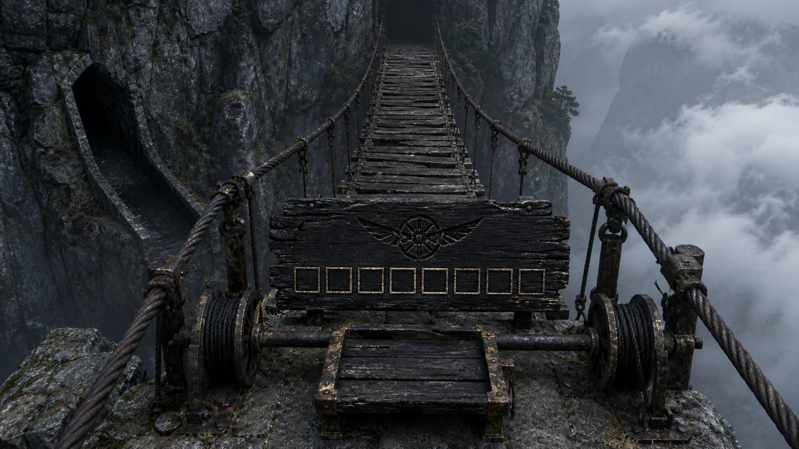

# 第19章 活人过桥，死人买路

“都别上桥。”

陆宁一脚踩住最前面的顾长夜，另一只手把布架往山壁内侧拖。

桥头那块烧焦木牌刚写着“活人止步”，云下便传来一声绷响。离他们最近的铁索向下一沉，桥面上三块朽木同时翻转，露出背面一排灰白齿痕。

那不是劝人回头的告示。

这条废弃索桥仍在辨认上桥的是不是活人。认错一步，桥板就会把人送进云底。

而明日午时，镇天碑会借陆遥左眼锁定栖霞村二十七个人。第一枚断视楔能让碑暂时看不见一条连接，却还没试过能不能扛住二十七人的主纹回流。楔子、用法和模拟办法都在他们身上；若今晚回不去，村里连试错的时间都没有。

“目标改一下。”陆遥躺在布架上，左眼药布又洇出一点红，“不是去折风井。先找这条旧运道怎么把东西送出去，再找人怎么回村。”

顾长夜看向北方。索桥穿过云层，另一端只剩一个黑点：“父亲的线索就在前面。”

“所以才不能五个人一起追。”陆遥道，“爹若真在那边，晚追一夜未必死。村里二十七个人明日午时真会被点名。”

他没有替其他人决定。

“我选先送楔子。谁不同意，现在说。”

韩照夜收住已经探向桥面的剑鞘：“先救人。但要弄清楚，‘活人止步’是桥会杀活人，还是只准某种东西通过。”

商青梧把陆宁腕上的青灰勒痕重新缠好：“先试桥头，不拿人试。”

顾长夜沉默片刻，也退回石地：“先送楔子。”

阿绫看看索桥，又看看云底：“我不是人。”

“你会饿，会怕，还会偷吃药渣。”陆遥道，“今天先按活的算。”

“谁偷吃了！”

它这一嗓子震得桥头木牌掉下一层黑灰。

灰后露出三道被火遮住的旧刻痕：一只没有点睛的木鸢，八个并排的方框，方框下是一条指向北方的细线。

云从桥板缝里向上翻。两根承重铁索一根沉黑，一根锈红，过了十余丈便一同没入北面的山影。桥头横轮下压着一块孤立木托，左侧山壁却另开着斜向下的黑槽。索桥往北，黑槽退南，两条路从一开始就不是同一个去处。

陆遥看得最久的不是那八个方框，而是无睛木鸢。陆沉舟做的每一只木鸢都会点两粒黑漆当眼睛，说飞物没有眼，便只会照别人画好的路走。眼前这只偏偏被剜去了双眼。

“认识？”陆宁问。

“像爹的手艺，又故意不像。”陆遥道，“只能说明他见过这套运记，不能说明牌是他刻的。”

他把那点想追过去的心思压回去。暗号、木鸢和折风井都在北面招手，可越像父亲留下的路，越不能让它替二十七个人决定明日的死活。

陆宁蹲下去，没有碰木牌，只用一截干草扫开余灰：“木鸢是旧天工院的运记。八个方框不是八个人，是八席货位。”

陆遥记不得甲七舟内的亲历，但无命木牌留下的证词还在：父亲末次掌舵去折风井，载的是顾长夜前八程遗落的旧命。

眼前八席货位，正好对上那八程旧命。

“这不是普通人走的桥。”顾长夜道，“它运旧命。”

旧命，就是一个人在重生后被遗落的过去人生。它有记忆、有形状，却不再被此刻活人的命灯承认。桥上的“死人”未必真是尸体，而是这些已经从今生剥落的旧人。

这解释了“活人止步”的基础意思，也解释了为什么陆沉舟曾驾甲七舟来这里。

但解释不是证据。

韩照夜用剑尖挑起一粒桥头石子，轻轻送上第一块桥板。

石子没有呼吸，也没有名字。桥板只是微微下沉，没有翻转。

她又从袖中取出一截被剑气削断的旧穗。穗上沾着她的血，刚触到桥板，铁索便发出一声尖鸣。三块木板同时侧翻，差点把剑穗夹进齿槽。

韩照夜及时收剑。

“它认活人血气。”商青梧道。

“还不够。”陆遥看向顾长夜，“拿刀鞘裂片。”

顾长夜的刀鞘方才卡门时已经开裂。他掰下一小片无血的黑木，放在石子旁边。

桥板这次没有翻，八个灰白方框却亮了一个。那片黑木上沾过顾长夜长年握刀留下的气息，桥没有把它判成活人，却把它当成某一席旧命的随身物。

看得见的证据凑齐了：活人血气会触发翻板；没有血气、却带着顾长夜旧气息的东西，可以占用旧命货位。

“桥不杀死物。”陆遥道，“它只拒绝活人，把带有旧命气息的货送往北边。”

“第一枚楔子没有顾长夜的气息。”陆宁按住怀里的药布包，“更不能让它沾。沾了旧命，镇天碑也可能顺着来处找人。”

问题从能不能送，变成了怎么让桥认货、又不把楔子认成某个人。

陆遥盯着八个方框看了一会儿：“先别碰楔子。让桥送一件无名的东西。”

陆宁从工具囊里找出一块削木时留下的无名垫片。上面没有人名、血迹或陆家暗号。她把垫片放上第一块桥板，桥板不翻，方框也不亮。

石子和木片一起停在原处。

错误答案很清楚：桥允许死物站上去，不等于会替任何死物运送。只有八席旧命货位被认领，索桥才会启动。

“那就借顾长夜一席。”韩照夜道。

顾长夜摇头：“我的气息会落在楔子上。”

“不落在楔子上。”陆遥看向那片刀鞘裂木，“落在车上。”

桥头右侧埋着一只锈死的横轮。轮轴下压着半块木托，大小恰能卡进两条铁索之间。木托不是新法器，只是旧运道装货用的托板：货放在上面，方框认的是托板占哪一席，不必让每件货都沾上旧命气息。

陆宁先用干草把木托拖出来。托板中央有一道浅槽，边缘八个铜角只剩三个，背面还刻着一句白话旧规：

“席认托，不认货；一席一送，活物翻桥。”

用途和限制都写在同一处。只要用顾长夜的刀鞘裂片让托板认领一席，托板上的无名死物就能被送过桥；可托板上只要混入活物，整桥仍会翻。

“验货。”陆遥道。

他们没有立刻放断视楔。

陆宁先把无名垫片放进托板浅槽，顾长夜再将刀鞘裂片按入托板左上角。第一个灰白方框亮起，锈死横轮竟自行转过一齿。

托板沿铁索向前滑了三尺。

陆宁用麻绳将它拉回，垫片没有焦黑，刀鞘裂片也没有黏到木片上。商青梧用银针分别刮过两者，针尖只在刀鞘裂片上显出顾长夜的冷灰气息；无名垫片仍是干净木色。

桥能运货，也能把席位气息隔在托板上。

第一枚断视楔终于可以送。

可送到哪里，仍是问题。

索桥北端通向折风井，栖霞村却在南面。他们若把楔子送去北边，只会离村更远。

陆遥让陆宁把托板再次推上第一块桥板，却没有装货。韩照夜敲了敲桥头木牌上的北向细线，回声只往索桥深处走；顾长夜转而敲木牌背面，山腹里却回了一声更近的空响。

阿绫贴着石地一路嗅到检修滑道出口，爪子扒开一层白灰，露出横轮下方第二道齿轨。那道齿轨不是向北放桥，而是斜着退回山腹。

“有回送。”陆宁道。

她用短木撬动横轮。横轮正转，托板去北边；反转，托板会滑进山腹里的回送槽。槽口旁也有刻字：

“错货退南库。”

南库不是栖霞村，但从方位上看，它位于碑窟南侧，至少比折风井北端更接近回村山路。

“所谓错货，就是占了席，却不属于那一程旧命的东西。”陆遥道，“断视楔没有顾长夜气息。让托板借他的席启动，桥走一段就会发现货不对，把它退进南库。”

韩照夜冷声道：“也可能直接丢下去。”

“所以先送垫片。”

无名垫片重新装上托板。刀鞘裂片占住第一席，横轮正转，托板向北滑出十丈。

第一个方框一直亮着。

到第十一丈，桥索忽然一震。托板中央的垫片与席位气息对不上，第二道齿轨随即咬合，整块托板没有翻落，而是被一股斜力拉向山壁。

山腹裂开一道半人高的黑槽。

托板带着垫片滑了进去。

片刻后，南侧深处传来三声木轮滚响。黑槽外一块积灰多年的路石亮起小字：“错货已退南库。”

方案有了可见结果：桥确实会把无名错货退往南侧，不会扔进云底。

代价也在下一刻出现。

顾长夜掌心那道与刀鞘裂片相连的旧茧忽然裂开，渗出一线血。托板借的是他的旧命货位，虽然没有把气息沾给货物，运道仍从当前的他身上收了一次“认席费”。

他低头看了一眼：“还能送一次。”

“一次够了。”陆遥道。

“你们呢？”陆宁问。

“楔子先走。人走别的路。”

“若南库封死呢？”商青梧问。

“楔子至少离开了会回收活人的桥头。”陆遥道，“最坏是我们今晚再找南库，不是让全村等我们先逛完折风井。”

陆宁没有立刻同意。她把三种结果逐一摆出来：楔子可能完整到南库，可能卡在回送槽，也可能被旧运道当成危险检修器扣住。无论哪一种，他们都不能把“已送出”误当成“已送到村”。必须有人亲眼拿回药布包，核对楔尾焦痕没有增加，才算交付完成。

“我去南库。”她说。

“你手伤了。”陆遥道。

“所以不抬你。”

“这理由听着很私人。”

“你再说一句，我把你留给活人回收。”

顾长夜把短刀换到左手。他掌心旧茧一旦被运道收过认席费，下一次会收多少没人知道：“我留桥头断后。若北边的东西先到，至少有人能砍断横轮。”

韩照夜看向回送槽：“我送布架下去。剑能卡齿，也能在槽塌时撑一息。”

商青梧则把药箱系到自己腰后：“我跟陆宁找楔子。她的腕伤和顾长夜的掌伤都不能再碰碑灰。”

每个人都选了自己承担的那一段。陆遥没有替他们改，只补了一条共同边界：“看见南库出口先找风，不见楔子不分头；北桥来东西，顾长夜只断轮，不上桥。”

他从一开始就没打算让活人钻进托板。旧规已经写明活物翻桥，拿自己赌一次不是勇，拿同伴一起赌是蠢。

陆宁取出药布包。断视楔隔章再用，作用仍是钉进青色眼纹，让镇天碑暂时看不见那条线；它只能闭眼一刻，楔尾还会替被遮住的连接承受回流。她没有拆开药布，只在外层又裹了一张无字油纸，放入刚被麻绳拉回的托板。

顾长夜将剩余刀鞘裂片压入第一席。

横轮转动。

托板载着楔子滑进云中。

十丈。

十一丈。

索桥斜震，南侧黑槽再次张开。托板没有翻，药布包也没有散。它被第二道齿轨稳稳拽进山腹，沿回送槽滚向南库。

路石上的小字逐一亮起：

“错货已退。”

“南库接物。”

“一席已清。”

第一枚断视楔离开了他们，却比他们更早踏上回村方向。只要找到南库出口，陆宁预备的二十七块无名木牌与碑灰模拟就能在明日午时前开始。

顾长夜掌心的裂口又深了一分，刀鞘裂片则在托板角上化成灰。第一席不再发亮，这条借旧命送货的办法不能立刻重来。

“现在轮到人。”韩照夜望向山腹里那条半人高的回送槽，“槽里没有桥板。”

“也没有写活人止步。”陆遥道。

商青梧先把一束止血草扔进槽口。草束没有被翻走，回送齿轨也没有咬它，只沿着斜坡滑下两丈，停在一处宽平台上。

平台边缘吹来带松脂味的南风。

那是靠近栖霞山的风。

陆宁剪下一小截腕上药布，压在槽口。布角先向南飘，又被更深处一股稳定的冷风托起。她用炭在石沿画下两道线，等了十息，布角始终没有越线。

“不是一阵乱风。”她道，“下面有通向南坡的开口。”

这份回查不能证明出口就在栖霞村，却证明回送槽没有绕回北桥。楔子所走的方向与他们救村的方向一致。

陆遥又让阿绫把鼻子伸进槽里。阿绫闻见无字油纸、药布和焦黑软铜的味道，三种气味都在下方，没有散进云里。

“楔子没掉。”它说，“还在那条槽里，离这儿……很远。比一锅肉远，比两锅近。”

“距离说得很严谨。”陆遥道。

“我饿的时候最严谨。”

众人正要把布架送入槽口，索桥北端忽然传来一声沉重的车铃。

不是甲七舟的退客铃。

云层后，一盏接一盏灰灯亮起，正沿旧运道向桥头靠近。桥头八个方框里，剩下七个同时泛白。

木牌上被火烧掉的最后一行字，也在灯光下显了出来：

“旧命入井，活人回收。”

他们把楔子送进了南库。

也因此重新叫醒了这条专门回收误入活人的旧运道。

---

## Metadata

- chapter_number: 19
- word_count: 4310
- generated_at: 2026-08-12 19:10 +08:00
- upload_status: submitted_pending_review