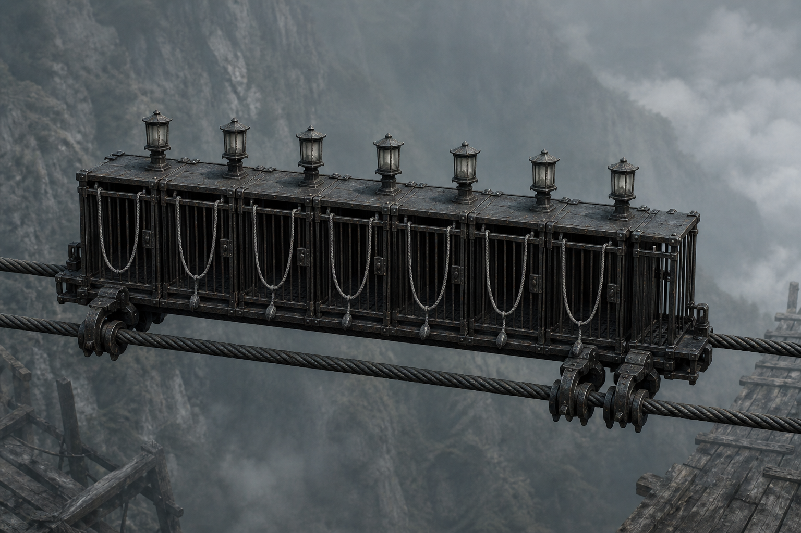

# 第20章 请把活人退回南库

北桥灰灯只剩三十丈。

陆遥还躺在布架上，先把最要命的结果说给所有人听：“那辆车若进桥头，木牌就会按‘活人回收’把我们送去折风井。楔子在南库，村里二十七个人明日午时就会被镇天碑看见。我们被送北边，两头都救不了。”

云下传来第二声车铃。

七盏灰灯排成一线，照亮一辆贴着双铁索滑来的窄长黑车。车身没有轮子，底部四只铁爪扣住索桥承重索；七个半人高的铁笼前后相接，每个笼门上都垂着一根灰白探血索。

探血索是用来找活人血气的。只要索头尝到新鲜血，它就会把对应的人拖进铁笼，送往北面的折风井。

它只抓“桥域”里的目标。桥域就是旧运道眼下仍算在桥内的范围，站在桥头、桥板或尚未封闭的回送槽里，都可能被它算作待收活人。

用途刚看明白，最前一根探血索便从车头弹出。

它没有先找站着的顾长夜，反而直扑陆遥左眼的血。

韩照夜横剑鞘一挡。灰索在鞘上绕了半圈，摸不到血，又转向顾长夜裂开的掌心。顾长夜短刀一翻，把索头钉在桥头木牌上，却没斩断。

索身猛地绷直，竟拖着整辆黑车又近了半丈。

“断轮。”陆宁喝道。

顾长夜抬刀便要劈桥头横轮。

“等一下。”陆遥道。

刀锋停在锈轮上方。

“再等，它就把你当晚饭装走。”顾长夜说。

“它若真想吃人，七个笼子没必要一人一格。”陆遥盯着车身，“这是运货，不是喂兽。先看它怎么认货。”

陆宁已经把布架前端塞进南向回送槽。商青梧跪在平台边，把药箱和一束止血草先推下去。韩照夜守着槽口，只等陆宁与商青梧进去，便把陆遥连布架一起送下。

可回送槽的石门正在收窄。

黑车每近一丈，槽门便合上一寸。若探血索完成七次核验，南库这条退货路也会被一并封死。

他们没有时间把每一种可能都试一遍。

陆遥让韩照夜从剑穗上割下先前沾血的一小段麻线，系在无名木垫片上，放到桥头第一格已经熄灭的货位里。

“第一席清了。”韩照夜道，“放这里没有用。”

“就是要看它还认不认清席。”

灰白探血索闻到旧血，立刻松开木牌，卷住垫片。第一只铁笼“咔”地打开，索头把垫片拖进去，笼门随即合拢。

车身侧面亮起一条灰线。

“一号活物，血息已止。”

“待回收。”

一块沾着死人血的木片，也被它算成了活物。

商青梧盯住垫片落下的位置：“它认血，不认人。血是不是还在流，它也分不清。”

这是第一份依据。

陆遥又让阿绫把那束止血草从槽里叼回来。草上没有血，只有商青梧药箱里的苦味。他把草束扔向第二根探血索。

索头从草叶间穿过，毫不停留。

第二只铁笼没有开。

“只认血味。”陆宁道。

“还差一件。”陆遥望向黑车底部。

车辆已滑到十一丈外。车底四只铁爪扣着两根承重索，索桥每震一下，爪背就泛起与装货托板相同的暗白光。那道光并不只往北走，还沿山壁里的第二道齿轨分出一线，正是错货退南库时亮过的方向。

黑车不是索桥之外的东西。

它本身也是一块更大的装货托板。

陆遥作出判断：“它把血当活人，把七个笼子当七席货位。装满后才往北送；若笼里的‘活人’不是桥上该收的货，旧运道仍会把错货退南库。”

韩照夜道：“木片能骗开笼，不等于能让整车改道。”

“所以先错一格。”

顾长夜从刀鞘裂口里抠下一点早已冷透的木灰。刀鞘裂片已经用尽，这撮灰只残留极淡的旧气息，不能再占旧命货位。商青梧把灰抹到第三块无名垫片上，再点上一滴韩照夜剑穗里的旧血。

第三根探血索果然将垫片拖入第二只笼子。

笼门合拢的一瞬，车底暗白光先向北亮，随即在第二只铁爪处断了一下。山壁回送齿轨同时“咬”出一声脆响。

黑车向北的速度慢了半分。

车侧灰字变成：“血息已止，旧命不符。”

“错货二次核验。”

方案有了可见征兆：错货确实能让整辆回收车触发南库齿轨，但一格不够，车辆仍在靠近。

代价也跟着落下。

第二根探血索忽然倒甩回来，像是要重新寻找真正的活人。它擦过陆宁右腕，药布当场裂开，青灰勒伤里渗出一线新血。

索头立刻钉住她的手腕。

陆宁被拖得向桥边滑了半步。

商青梧抱住她的腰，韩照夜一剑鞘卡进石缝，顾长夜则用短刀压住灰索。三人同时受力，才没让陆宁越过“活人止步”的第一块桥板。

“现在有真货了。”顾长夜冷声道。

“那就让它按规矩验。”陆宁没有喊退。她反手扣住探血索，“车要的是桥域里的活人。只要我离开桥域，它抓到的就是离库错货。”

她看向南向回送槽。

陆遥明白了她的选择，却没有替她点头：“索不一定会松。下去后可能把你吊在槽口。”

“所以你们先把车骗偏。”

“姐，你这计划听着像拿自己当最后一件货。”

“你躺在布架上说这话，很有说服力。”

陆宁用左手将腕上药布勒紧，对商青梧道：“你先下。看见楔子，先核焦痕，不要因为后面有人催就直接拿走。”

商青梧没有争。她把一根药绳系在陆宁腰间，另一端绕过槽内石柱，先沿无桥板的斜坡滑入南库。十息后，绳上回了两短一长。

路通，人稳。

陆宁这才抓着探血索后退。她每退一步，黑车便向桥头近半尺；可当她跨进回送槽，整条灰索骤然绷直，车侧“桥域活人”的灰字闪烁起来。

“桥域边界不在槽口。”韩照夜道。

陆宁已经滑下两丈，探血索仍不肯放。

错误答案暴露了真正边界：只要回送槽的石门还开着，槽内的人仍算桥域活人。必须让石门在她身后合上，车才会把这一索判成离库错货。

可石门一合，陆遥和韩照夜便来不及下去。

顾长夜更不能走。他答应留在桥头断轮，北车若不改道，就要有人把索桥彻底卡死。

“先送伤员。”韩照夜抓住布架，“我和顾长夜最后关门。”

“不。”陆遥道。

“你现在没有挑人的资格。”

“我有挑路的资格。”陆遥看向第一只笼中的沾血垫片，“车只认血，不认人；石门只认桥域，不认谁站在桥头。我们不必把七个笼子装满，只要让它以为该收的人已经全在车外。”

他让阿绫钻到黑车与山壁之间。

阿绫不是人，探血索也不认它。它贴着石台跑到车底，照陆遥说的位置，咬住第二道齿轨旁的一根旧木销。木销是用来标记回送槽开闭的：销在，槽门开，桥域延伸进槽；销拔，旧运道便把槽内算作已经离库。

这件东西的用途刚说明，阿绫便一口拔了出来。

回送槽石门轰然下落。

陆宁手腕上的探血索先是一紧，随即松开。车侧灰字从“桥域活人”变成“活物离库”。第二只笼里的两块垫片也同时被改判为“血息已止”。

七根探血索失去活人目标，在空中乱摆。

黑车第一次停住。

“现在。”陆遥道。

韩照夜把布架前端猛地送进槽门下方。顾长夜没有斩横轮，反而一刀劈断木销旁已经锈穿的限位片。下落的石门被布架撑住一尺，足够陆遥侧身通过，却不足以让探血索重新把槽内算回桥域。

这个办法只能撑三息。

第一息，韩照夜把布架推进槽内。

第二息，阿绫钻过门缝，顾长夜把短刀换回右手。

第三息，韩照夜与顾长夜同时翻入斜坡。顾长夜最后抽走布架尾端，石门在他靴后重重合拢。

桥头再没有一个活人。

黑车七根探血索全部垂落。车底向北的暗白光熄灭，南向回送齿轨却一节接一节亮起。

“回收目标离库。”

“车载货物不符。”

“错货退南库。”

整辆灰灯黑车在桥头横移半尺，被山壁里的斜轨硬生生拽离北向双索。七盏灰灯一盏接一盏转向南面，车身擦着石壁滑进另一条更宽的回送井。

韩照夜没有马上收剑。她先用剑鞘敲了三处：北向承重索不再震，回送槽石门外的探血索全部垂死，南向齿轨却随着车身一节节受力。顾长夜又把一滴掌血弹回桥头，最末那根灰索只在门外晃了晃，没有越过已经拔销的边界。

这三处回查把结果钉死了：车已改走南库，槽内众人不再属于桥域，探血索也不能隔门重新抓人。若其中任何一处仍向北受力，顾长夜就会立刻斩断横轮；现在他的刀可以留给开路。

他们没有被它抓去折风井。

反倒依法把一辆活人回收车退进了南库。

“规矩是它写的。”陆遥趴在布架上喘了一口带血的气，“我只是替它把退货做完。”

“少说一句。”商青梧的声音从下方传来，“你的肺不会因为占了便宜就长好。”

南库不是库房，而是一条开在山腹里的长斜台。被旧运道退回的破木、铁扣和碎石堆在两侧，中间留着一条仅容布架通过的风道。黑车从另一口滑入，撞在尽头的止退木上，七个铁笼依次弹开，把两块沾血垫片吐进灰堆。

车辆改道已经成功，众人也付出了代价：顾长夜短刀在劈限位片时崩出一道缺口；陆宁腕伤重新见血；撑门的布架右腿折断。陆遥被最后一下震得右肋发闷，咳出的血沫比先前更红，只能继续左侧卧，仍不能自己站起。

商青梧和陆宁却顾不上先处理这些。

她们在第三道回送弯后的木托上找到了无字油纸包。

陆宁没有说“拿到了”，而是当场拆开外层油纸。药布没有散，灰银色扁平三角楔仍在里面，正面的闭合眼缝浅槽没有崩裂。商青梧用银针刮过楔尾，旧金软铜上只有井底短试留下的那一道焦黑，没有新增第二圈烧痕。

阿绫也凑近嗅了三遍：“药布、油纸、焦铜。还是原来那一枚，没被换。”

到这一刻，第一枚断视楔才算真正取回。

陆宁重新包好它，直白回顾了下一步：“这枚楔能让镇天碑暂时看不见一条连接。回村后先拿二十七块无名木牌和碑灰模拟负担，不刻人名，不拿村民验货；撑得住，明日午时才有资格往主纹里钉。”

“撑不住就轮流冷却楔尾。”商青梧接道，“谁也不替它扛回流。”

南库尽头吹来稳定的松脂风。陆宁先放出一片干净药布，布角持续指向东南；阿绫闻到栖霞山北坡风骨木的味道，虽隔着山腹，却比桥头近了许多。

众人沿风道前行半里，终于看见一扇向山外开的旧卸货门。门轴锈死，门面却留着一只掌印槽和一行旧规：南库错货，由当前查验人领回。

陆遥的正式仙籍证明他仍是碑窟未结案的查验人。韩百川官印隔章再用，仍只是为这次查验作保的责任凭证，不能替他改旧令。顾长夜托住官印，韩照夜把仙籍压进掌印槽，两样凭证一同亮起。

卸货门开了。

实质收益落在所有人眼前：断视楔完整取回；南库出口通向栖霞山北坡旧樵道；他们没有消耗新的行路签，也没有被回收车送进折风井。只要连夜赶路，明日午时前仍来得及做无名木牌试验。

门外天色已经压暗。

远处栖霞村的屋脊只剩一排黑影。村口二十七户人家的风轮，却没有像往常一样各自转动，而是分成了两边。

十二架朝北，十五架朝南。

中间那架属于陆家木作铺，叶片被人卸下，平放在地上。

陆宁看了一眼，便知道这不是风乱了方向。

这是村里的人已经作出了三种不同选择：有人要走，有人要留，还有人拒绝在不知道代价以前替任何一边转动风轮。

而南库卸货门即将合拢时，黑车最末一只空笼里忽然掉出一块被血浸黑的旧路牌。

上面没有顾长夜的名字。

只有陆沉舟五年前刻下的一行小字：

“第八席之后，不许再送活人入井。”

---

## Metadata

- chapter_number: 20
- word_count: 4080
- generated_at: 2026-08-12 20:20 +08:00
- upload_status: submitted_pending_review