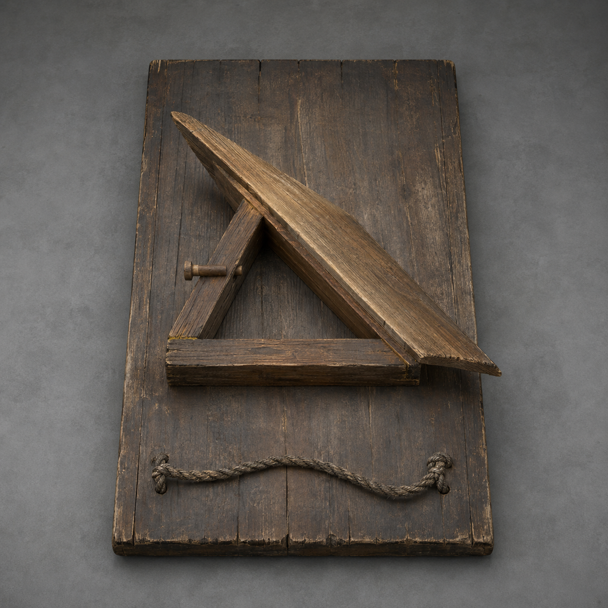

# 第25章 二十七户不能共用一双翅膀

镇天碑睁开的那一线青眼，先看见了陆遥。

下一瞬，陆家门槛木上的碑灰整片熄灭。

不是赦免。

陆遥左眼猛地一热，眼前二十七条支纹同时亮起，像二十七根细针穿过他的眼底，分别钉向村中二十七户。田里的湿气、井里的凉意、屋梁中的木香，正沿那些细针往镇天碑倒流。

若让青眼把二十七条支纹全部看清，分流风轮拆开的选择会被重新合成一村；等不到午时，二十七户便会先被抽空。

商青梧一把按住陆遥左眼，指缝里仍渗出血：“别看它。你这只眼正在替碑认路。”

“我也不想看。”陆遥咳出一口血沫，“它没交看路钱。”

镇天碑第二次轰鸣。

张家屋顶的木香先淡了。张三叔怀里的孩子又咳起来，齐婆婆脚边那碗井水结出薄冰。更糟的是，分流风轮的二十四枚已接风片正在同时向村北偏转，三枚未定的空片也被青光托起。

碑不只抽风，还在补齐那三户没有交出的答案。

“先钉楔。”韩照夜握住剑鞘，“再慢一轮，它会把未定也算成同意被看。”

陆宁没有立刻动手。

断视楔隔了一夜再用，基础作用没变：钉进眼纹，能让镇天碑一刻钟看不见那条纹连着的人和地方；但楔身要替被遮住的路线承受回流。昨夜它只在模拟旁支撑过二十四户，眼前却是真正的二十七户主纹。

陆宁先把楔尖贴近陆家支纹，没有敲下去。

青光立刻绕过楔身，改向张家与齐家。两家的门槛木同时滑向北边，井水冰层又厚一分。

“不能先闭一户。”她收回楔子，“主纹会把看不见的那份摊给别人。赦令刚演过一遍。”

错误答案只试了一息，后果已经摆在地上。

直接钉主纹更快，却会让第一户得救、其余人替他补账；等一条条钉完，断视楔也早被回流烧穿。

陆遥用还能动的左手摸到分流风轮外环。木环震得像一根拉满的弓弦，却没有哪一枚风片真正离开地面。

“它为什么非要看门槛？”他问。

陆宁盯着青光的去向：“门槛是每户与地气相接的地方。昨夜我们用它分开来处，现在碑也沿它找人。”

“那就先把来处抬起来。”

张三叔没听懂：“把二十七家房子都抬走？”

“房子太重。”陆遥道，“先抬门。”

陆宁顺着他的目光看向二十七截门槛木，又看向各家为御风准备的门板。第六章时，村民曾踩门板借风离地，但那次二十七块门板被百家绳连在一起，只能同升同落。如今若再共用一根绳，镇天碑会顺着绳把所有人合成一户。

必须让每一块门板自己吃风。

陆宁从铺里拖出一副半成品木架。那是她昨夜给陆遥布架换腿时削下的三角余料，一长两短，能在门板下撑出一道斜面。

“这叫分户风翅。”她当众说清用途，“装在一块门板下面，只把这一户屋顶轮送来的横风折成向上的力；不接总绳，不替旁边抬人。木销一拔，门板立刻落回地面。”

新东西没有藏到最后才显本事。

陆宁把三角架扣到陆家旧门板下，只接陆家那枚平放的风片。阿绫对着屋檐吹了一口，横风钻进斜面，门板左角当场抬起两指；陆宁拔销，门板立即落地，既没牵动张家，也没碰齐家。

用途、效果和退出办法，一次短试全看见了。

“能飞？”小满眼睛亮了。

“只能离地。”陆宁道，“风翅不是法器，不加力。载得越重，起得越低；木架裂了就会摔。谁把它当飞舟，我先把谁腿打断。”

陆遥在布架上叹气：“陆掌柜，你这生意听着不太吉利。”

“你是第一个售后。”

镇天碑第三次抽风压了过来。

这一次，村中两口浅井同时见底。张家孩子额头浮出灰青细纹，三枚未定风片被迫立起一半。留给他们的不是一夜，而是下一次轰鸣前的半盏茶。

二十七副风翅来不及精做。

陆宁把结构拆成三件事：三角木架撑斜面，一根短销接本户风片，一条脚绳负责人在板上站稳。没有总轴，没有百家绳，也不刻姓名。每户只做自己的，做坏了便自己修；邻户可以教，不能替人插最后那根销。

赵木匠领十四户削长边，张三叔领十户劈短撑，三户未定不接方向，却各自做了一副空架。

“我们没选往哪儿飞。”齐老汉的儿子说。

“风翅只让你能离地，不替你选北还是南。”陆宁把空架推给他，“不装也行。但碑现在要把不选写成同意被抽，你至少得有退出地面的办法。”

齐老汉躺在门板上听完，自己将短销放进空槽，却没有接任何风片：“我先保留能走，往哪走等我喘匀了再说。”

这是第三种选择，不是少数服从多数后的空白。

韩百川始终站在村界外。他没有阻止木工作，却抬手封住了北坡木栅：“离地便是飞。栖霞村仍在禁飞令下。”

陆遥从怀里摸出那张正式仙籍，又把韩百川的官印压在上面：“大人昨日用赦令说想走可走，今日退件，路没给，灾倒先给了。我们不飞高，只把门槛从镇天碑的验收地面上挪开。按你们自己的话，这叫赦令退件后的自救。”

“赦令已退。”

“退的是交人，不是你许过的活路。”陆遥笑了一下，“何况大人亲口说离地才算飞。我们若离的是地气，不离地面呢？”

韩百川看向那些门板。

每块门板下都垫着本户门槛木。风翅先抬门槛，再抬门板；从镇天碑的支纹判定看，各户来处仍压在自己脚下，只是整段来处一起离开了主纹。

这是歪理，却不是凭空编的漏洞。赦令刚用二十七户支纹分别验收，韩百川若否认门槛能代表本户，就等于连昨日那场免灾都不成立。

“最多一尺。”韩百川终于道，“越过一尺，按私飞论处。”

陆遥认真道谢：“多谢大人替二十七户量好第一步。”

韩百川脸色没变，村界的木栅却又压低半寸。

他不是来帮忙的。他只是不愿亲手把天庭刚用过的支纹规则说成假话。

二十七副风翅在第四次轰鸣前排到晒谷场。

短试从最轻的空门板开始。第一块升起三寸，落下时右角先触地，说明风翅偏斜。赵木匠没加第二根共绳，而是把自家短撑削薄一片。第二次，门板四角同时离地。

接着放一袋粮。

门板只起一寸，三角架发出裂声。陆宁立刻拔销，换粗长边，并把承重上限用炭写在板底：一名成人，或两个孩子，不能再加粮袋。

这句限制在载人前便说清了。

第五次抽风到了。

二十七条青光从镇天碑扑向晒谷场。已完工的十八块门板同时震起，未完工的九户屋梁则发出干裂声。镇天碑先挑没有退出地面的人抽取。

“先带孩子。”张三叔主动把孙女放上门板，自己留在地上扶架。

小满的母亲也把孩子抱上另一块。三户未定各自推来空风翅，接走两名病人与一袋公用药材；他们仍没选离村方向，却先选择不让最弱的人被抽。

没有人等陆遥发号施令。

十八户各自插销。

十八块门板先后离地，最高不过八寸，最低只有两寸。高低不齐，方向也乱，有两块差点相撞。负责未定格的人立即拔掉相邻短销，让它们落回去重新调角。

青光追到门槛木下，却在离地的旧木上断开。

张家孩子额头的灰纹第一次没有靠断视楔便淡了一层。齐婆婆家的井水停止结冰。风翅没有打败镇天碑，只把十八户从这一轮点名里暂时移开。

效果看得见，限制也一样清楚：门板最多离地一尺，离不开村界，风一停就落；留在地上的大人和九副未完工风翅仍在被抽。

“还差九户！”陆宁喊。

陆遥胸口每震一下便疼得发黑。他不能下地、不能抬木，更不能借青羽替二十七户找答案，只能盯着十八块门板升落的先后。

镇天碑每次先抓最低的那一块。

不是因为人重，而是那块风翅的斜面迎风最少。它在找最容易重新接地的支纹，再顺着那一户往旁边并。

“别追求一样高。”陆遥道，“让它们轮流当最低。三息换一户，谁都别连续贴地。”

“凭什么有效？”韩照夜问。

陆遥指向青光：“它每次只先咬最低的一条。前一户落下时拔销，后一户接风；青光换目标的那一息，就是断视楔进主纹的空当。”

先有十八次可见的追逐，才有这个判断。

陆宁让三户先试。张家落，齐家升，赵家再落。青光果然在三块门槛间换了两次方向，每次都迟一息，没能沿任何一户爬上外环。

办法成形了：二十七副风翅不必同时飞，只要按各户自己确认的顺序轮流离地，让主纹永远找不到一块持续接地的共同门槛；断视楔便在青光换路时钉进真正的眼纹，遮住整轮点名。

失败边界也很明白。任何一户不愿离地，都可以不插销；但其他人不能把他的门槛偷偷接进轮换。那一户留下的支纹由本人决定如何承受，断视楔不能以救全村为名抹掉他的拒绝。

九副风翅赶在下一声碑鸣前完成。

陆宁把顺序木牌放在场中，不写北、南，只写一到二十七。各户自己来取位置。张三叔选第一，齐婆婆选最后，三户未定分别取了七、十四、二十一。二十五户没有因为反对赦令便变成同一个方向，一户弃权也没有被从轮换中删掉。

第六声碑鸣落下。

第一块门板升起。

张三叔站在板上，双腿抖得比风翅还厉害。他从没飞过，门板只离地半尺，手却死死攥住脚绳。

“别低头！”陆遥喊。

“你闭嘴！”张三叔回骂，“我怕的是摔，不是高！”

第二块、第三块依次离地。

齐婆婆踩上门板时没有等人扶。赵木匠与儿媳仍选不同的轮换段，各自插自己的销。三户未定只升不转，风翅保持正中，证明离地不等于选择离村。

二十七块门板像一圈参差不齐的木叶，围着分流风轮轮流浮起。没有总绳，没有一只手同时控制所有人。

当青光从第二十六户转向第二十七户时，陆宁抬起断视楔。

“现在。”

韩照夜以剑鞘定住主纹边缘，顾长夜用崩口短刀压住另一侧。两人只固定眼纹，不碰任何一户的木销。

陆宁左手扶楔，受伤的右腕只落一锤。

灰银楔尖钉进青色眼缝。

镇天碑巨眼骤然睁大。

这一回，读者般的众人终于看清村北裂开的并非一条普通碑缝。整座镇天碑下方，青色石纹铺成一座半埋地底的眼形庭院；二十七道支纹从庭院边缘伸向各户，中央竖缝正被断视楔钉住。那是镇天碑主纹眼庭——它把一村二十七户分别看见，再把所见合成一份“全村结果”。

断视楔的旧金软铜瞬间烧红。

回流没有落到某一户，而是沿轮换中的二十七块门槛逐段传递。第一户落地前拔销，第二户升起；第二户落地，第三户接风。每个人只替自己撑过三息，不多替邻家一瞬。

一刻钟开始倒数。

第三十息，张家风翅裂了一根短撑。张三叔没有伸手抓齐家的门板，自己拔销落地，赵木匠把备用木撑踢给他，却不替他装。张三叔两息修好，再回到轮换尾端。

第六十息，陆遥左眼又流血。眼庭被遮后，镇天碑改从他眼里找路。商青梧用药布蒙住他的眼，青羽没有亮，也没有替他指出安全线。

“看不见还指挥吗？”她问。

“不指挥。”陆遥喘道，“他们会飞了。”

第九十息，最小那枚未定风翅被回流压到贴地。齐老汉亲手拔销，没有改投北或南。他让儿子把门板转成正中，再次升起。

“我还没想好。”老人说，“碑也得等。”

最后十息，断视楔尾出现第二圈焦痕。

陆宁右腕已经握不住锤。韩照夜可以用剑气替她压楔，却没有越过木匠的手。顾长夜把自己的刀背垫在楔尾下，缺口又崩掉一块，只替金属分走震动，不替任何人决定是否继续。

“拔不拔？”陆宁问所有人。

二十七户的回答并不整齐。

有人喊再撑，有人先问孩子，有人要求看井水。商青梧报出三项结果：孩子额纹未加深，井水没有再结冰，屋梁木香停止外流。继续三息可以完成一刻；再多，楔尾软铜可能烧断。

知道收益，也知道上限，二十七户才各自留下木销。

最后三息走完。

陆宁拔出断视楔。

青色眼庭没有重新睁开。

它中央那道竖缝仍在，却失去了二十七条支纹的去向。每户门槛已在轮换中留下各自独立的离地记录，镇天碑不能再把其中任何一条当成全村共同来处。

风灾没有消失。

村外树梢仍被地底风压弯，北坡木栅仍封着，断视楔尾第二圈焦痕也已绕过大半。可井水回升半寸，张家孩子额头恢复原色，二十七户都保住了自己的地气。最重要的是，第一批凡人没有借法驾、没有靠仙人托举，踩着自己做的风翅，轮流离开了镇天碑替他们划定的地面。

陆遥躺在只剩两根横木的布架上，蒙着流血的左眼笑：“大人，一尺量得挺准。”

韩百川没有回答。

他抬手，将村界外的北坡木栅彻底压下。

与此同时，失去支纹的镇天碑从地底升高一寸。

一行旧金色判词沿碑座浮出：

“副碑脱离辖地，启动回收。”

天边随即落下四道锁碑云索，第一道正砸在唯一的出村山口。

二十七户刚学会把自己的门槛带离地面。

天巡司便要把整块镇天碑，连同被封住的栖霞村，一起收走。

---

## Metadata

- chapter_number: 25
- word_count: 4049
- generated_at: 2026-08-14 16:15 +08:00
- upload_status: not_uploaded
