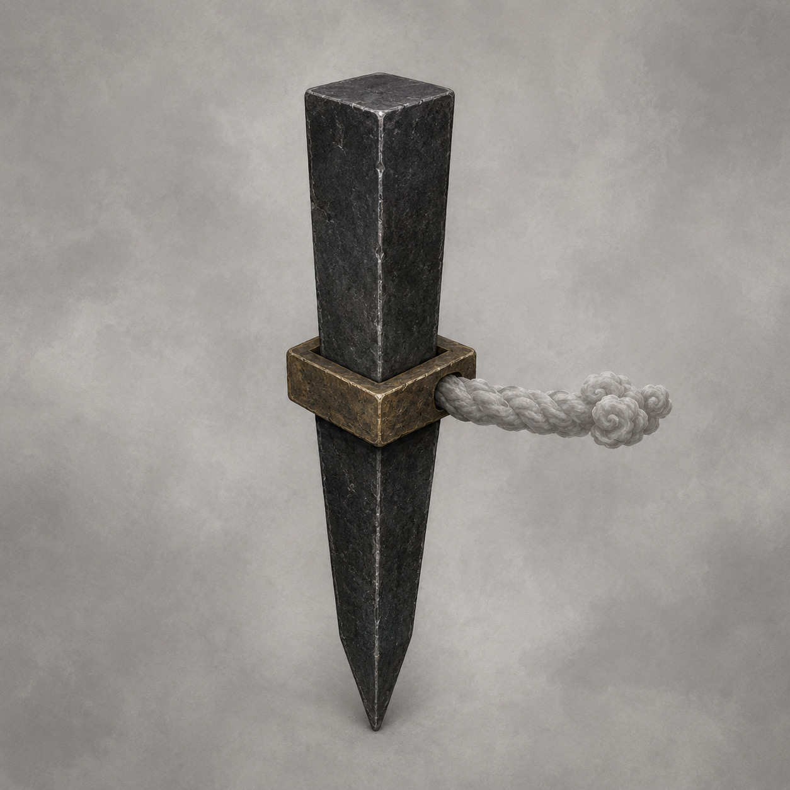

# 第26章 收碑可以，别把人算附件

第一道锁碑云索砸进山口时，栖霞村所有人的影子都往镇天碑方向滑了半尺。

影子没有回来。

云索横在唯一的出村路上，灰白链身比屋梁还粗。链尾从碎石里翻起一枚半臂长的乌黑四棱铁钉，钉腰套着方形旧金环，环后只接这一道云索。

“那叫回收界钉。”韩百川站在村界外，声音越过木栅，“它用来钉住回收边界。第四枚落地以前，凡是仍与副碑连在一起的人、屋、地，都会被算作附载物，随碑一并拖走。”

用途刚说清，界钉便向下沉了一寸。

张家门槛下立刻结出一层黑霜。张三叔怀里的孩子被影子拽得向后一仰，后脑险些撞上门板。齐婆婆家半口井也发出拔塞般的闷响，井沿向镇天碑横移了一指。

这不是吓人的空话。

四枚界钉若全部钉实，回收边界就会合拢。到时镇天碑升一丈，村中人屋便被拖一丈；山根先断，活人再跟着摔进云索要去的地方。

而另外三道云索还悬在天上，正分别对准东、南、西三处村界。

“拔钉！”赵木匠抄起撬杠。

“别碰。”顾长夜先用崩口短刀敲了一下链尾。

只一声。

刀口又缺了一粒铁屑，回收界钉却纹丝未动。更糟的是，钉腰方环转过半面，赵家门槛也浮出黑霜。它把攻击界钉的人家直接添进了附载。

赵木匠硬生生收住撬杠。

错误办法只试了一下，代价已经看得见：强拔界钉不仅拔不动，还会把出手者一家更牢地钉进回收边界。

陆宁将断视楔塞回油纸。那枚楔子隔章再用，仍只能让镇天碑暂时看不见一条眼纹，楔身还要替那条路承受回流；楔尾第二圈焦痕已经绕过大半，拿它挡四道云索只会先烧断软铜。

“不能硬挡。”她说，“先看它凭什么把一户算成碑的附件。”

“看人，还是看门槛？”陆遥问。

商青梧把药布重新压紧他左眼：“你先看我。咳血再多一口，我把你算药箱附件。”

陆遥老实了两息。

他仍躺在两横木拼成的布架上。右侧第六肋内移，肺叶擦伤，左肩剑洞未合，右臂不能发力，左臂也负不了重。方才影子一滑，他胸腔又震出一股血腥气，只能侧头把血沫吐进布角。

青羽没有亮。

“败中见隙”也不能再用。那枚命痕的试命次数早已耗尽，他如今只完成了不用命痕看出破绽的第一步，眼前没有第二次借来的答案。

陆遥只能看地上真实发生的事。

第一枚界钉落在山口，最先结霜的却不是离它最近的木栅，而是张家门槛。其次是齐家井沿，再是赵家门槛。三处远近不同，昨夜在分流风轮上的位置也不相邻，唯一相同的是刚才都承受过镇天碑回流。

陆遥问：“空屋呢？”

村北有一间塌了半边的旧柴房，主人三年前已经搬走。柴房比张家更靠近界钉，墙脚却没有黑霜，影子也没动。

“它不按远近收。”韩照夜道。

“也不只认房子。”商青梧指向齐家井沿，“井没有主人站在旁边，照样被拖。”

他们还缺一件能把两种可能拆开的证据。

陆宁让人取来一块没有沾过碑灰的空门板，放在张家门槛外。界钉毫无反应。再把张家那根短销接进分户风翅——这种木架隔章再用，作用仍只是把本户横风折成有限向上的托力，木销一拔便退出，不接总轴，也不会替邻户抬人。

风翅刚把张家门槛抬起两指，空门板底下也冒出了黑霜。

不是因为空门板属于张家，而是它此刻替张家承了风。

陆宁立刻拔销。

门槛落地，空门板与张家风翅断开。它底下的黑霜随即褪去，张家门槛却重新变黑。

一次接入，一次退出，结果前后相反。

“界钉不认户籍，也不认谁睡过这间屋。”陆遥道，“它认的是谁正替副碑受力。只要一件东西接上碑的回流，它就把那件东西连同上面的人写成附载。”

韩百川没有否认：“回收副碑，自然包括维持副碑运行的一切附着物。”

“说得好。”陆遥笑了笑，“那不替它运行的，就不能顺手打包。”

办法有了方向，却没有立刻变成答案。

二十七户刚才都用分户风翅轮换承受过回流。镇天碑虽然暂时找不到共同门槛，回收界钉却把那次受力留下的黑霜一户户翻了出来。只让门槛离地没有用；门槛一落回去，旧回流仍会被算作“维持副碑”。

第二道云索下降了一丈。

东边三间房的瓦片同时向上颤动。再过半盏茶，第二枚界钉就会落地。四边一合，他们连验证第二次的空地都没有。

“把二十七户都从风轮上拔掉？”张三叔问。

“拔掉以后，碑先抽人。”陆宁道，“风灾没停。我们断开附载，也得有人接住眼前这一轮回流。”

这是第一个错误答案：全拔，云索暂时少了附载，镇天碑却会沿落地门槛直接抽空人屋。

韩照夜看向镇天碑：“让碑自己承。”

她抬起剑鞘，隔空压住主纹边缘。青色眼庭立刻将回流推向碑身。镇天碑升高的那一寸发出石裂声，第一道云索随之绷紧，山口两侧崖壁同时掉下碎石。

“也不行。”顾长夜道，“碑一受满，云索就拖。”

这是第二个错误答案：让副碑独自吃回流，等于主动凑齐“脱离辖地”，会让回收提前开始。

必须有一个既不属于二十七户、又暂时不让副碑继续升高的承力处。

陆遥目光落到村界外。

韩百川脚边，压着封山用的天巡司辖界石。界石不属于栖霞任何一户，却一直替天巡司标定“辖地”从哪里开始。更重要的是，第一道云索砸下时，界石的影子没有滑动。

“韩大人。”陆遥客气道，“借你家门槛用用。”

韩百川顺着他的视线看去：“那是天巡司辖界石，不是你们的承风木。”

“正因为不是我们的，才好验货。”

陆遥让陆宁把韩百川官印放到界石顶端。官印仍在他手里，正式仙籍也仍有效；这两样不能凭空命令云索，却足以要求一次天巡司辖地内的附载核验。

官印接触界石的刹那，第一枚回收界钉腰间的方环转向村外。

一行旧金小字从环面浮出：

“回收前，先验辖地附载。”

这条程序原本就是云索的一部分，不是陆遥编出的漏洞。界钉先钉边界，便必须在拖走前列清边界内到底有哪些附载物。

陆遥没有让官印替全村担责。他只用它打开核验，真正要回答“是否附载”的仍是二十七户自己。

“三步。”他道，“先让一户把回流送到辖界石，只送三息；界钉若转向界石，证明它认当前受力，不认旧霜。再由各户逐一退出，留下不接碑的证据。最后把二十七份结果分别刻在风片上，不让官印合写成一村。”

“三息后界石若被算成附载呢？”陆宁问。

“拔官印，断核验。大不了韩大人损失一块门口石头。”

韩百川道：“你倒大方。”

“大人放心，石头若丢，我替您写失物告示，不收墨钱。”

嘴上占完便宜，陆遥没有替别人点第一户。

张三叔自己接上短销。

陆宁用一根孤立风骨木条搭在张家风片与界石之间。木条只传这一户的三息横风，不接其他风片。第一息，张家门槛黑霜变薄；第二息，辖界石表面出现一道青痕；第三息，回收界钉方环果然从张家转向界石。

张三叔立即拔销。

青痕停在界石表面，没有往官印里钻。陆宁取走风骨木条，张家门槛的黑霜没有回来。

界钉认当前是否仍在受力，不会死咬一次旧记录。

“可行。”商青梧没有只看光色。她把两片湿药布分别压在张家门槛与界石上：前者保持柔软，后者硬了一瞬又恢复，“张家已经退出，界石也只替它承了三息。”

有了用途、短试和退出结果，剩下二十六户才开始。

齐家先送井沿的凉意，赵家再送屋梁木香。每户只接一根短销，只用一条孤立木条，只让辖界石承三息。三户未定也照样参加；退出副碑附载不等于选择北走或南留，他们的风片始终保持正中。

第九户时，第二枚界钉在东界落地。

黑霜从东边压过来。两道云索开始互相收紧，晒谷场地面裂出一道斜缝。陆宁右腕无法再握木条，赵木匠接过测长，却仍由各户自己插拔短销。

第十六户时，陆遥再次咳血，布架右侧被地缝顶起。商青梧用脚卡住横木，拒绝让他坐起。

“你若敢说躺着不算受力——”

“不说。”陆遥喘着笑，“我现在是重点保护的贵重附件。”

话音刚落，东边那枚界钉忽然下沉半寸。

两枚方环隔着整座村子对正，张家已经褪去的黑霜又从门槛边缘冒出一线。不是张家重新接上了碑，而是东、西两道回收边界开始合拢，想把已核验的旧记录重新包进去。

陆宁立刻把张家的浅白断痕贴到官印侧面。

官印亮起一角，界钉才停住。

“每做完一户就得当场留证。”她道，“不能等二十七户全做完再一起盖。回收边界一收紧，前面的结果会被当成尚未核验。”

陆遥点头：“那就一户一户结清，别给它月底并账。”

办法因此多了一道不能省的步骤：每户拔销后，先看门槛黑霜是否消退，再摸湿药布是否仍软，最后把本户风片贴过官印侧面。三项都对，才轮到下一户。只见一处变白不算退出，因为赦令已经证明，天庭的光能遮颜色，却遮不住水分和木香继续被抽走。

第十七户的门槛白了，药布却仍在发硬。

赵木匠蹲下去，发现他家风翅底部有一根教学用细绳搭着邻户木架。那根绳没有拉人，只是先前赶工时用来比齐斜面，却也在传递一点震动。

“断掉。”那户主人自己取刀。

细绳一断，药布才重新变软。

众人这才看懂“附载”的狠处：它不需要一根能抬人的总绳，只要还有东西替副碑传力，哪怕只是校正木架的一根细线，也足以把两户重新连进同一批货。

各家开始检查自家门板。借过的量尺归还，搭在邻架上的绳头割开，临时共用的木撑拆成两截。邻户仍可递工具、扶伤者，却不能让同一件承力物横跨两副风翅。

韩百川看着那些被割断的细绳，忽然道：“一村若事事分开，风灾来时也只能各自受。”

“分开结账不等于分开救人。”陆宁没有停手，“我可以替张家削木头，张家也可以替我扶门板。可谁的门槛接没接碑，不能由一根忘了拆的绳替他回答。”

韩照夜把剑横在第二枚界钉前方三丈，没有用剑气硬碰，只用剑鸣报出它每次下沉的时机。她保护的是核验不被偷改，不是替陆遥挡下云索。

“下一次收紧还有二十息。”她道。

“够四户。”赵木匠答。

“只够三户。”商青梧指了指陆遥布架下新裂的地缝，“第四户会让两边边界同时压过来，先换地方。”

赵木匠没争快。他与顾长夜各抬一端，把布架横移到已经完成核验的张家门板上。陆遥右臂没动，左肩也没有承重，仍被短短一段移动震得脸色发白。

没人把他的伤忘成解题时可以暂时关闭的麻烦。

第二十四户退出时，第一道云索忽然松了半尺。

山口木栅仍被压住，路没有开，但张家、齐家和赵家门槛下的影子一一弹回原位。孩子不再被影子拖拽，井沿也退回原处。

最后三户全是未定户。

韩百川道：“你们若不选去留，回收核验不会给出方向。”

齐老汉躺在门板上，亲手把自家短销插进正中槽：“它问我是不是碑的附件，又没问我要往哪边走。不是同一个问题。”

三息后，他自己拔销。

第二十七户完成。

分流风轮的二十七枚风片各自浮出一道浅白断痕。它们不是同意离村，也不是同意留下，只证明一件事：此刻没有哪一户仍替副碑维持回流。

韩百川官印在辖界石上震了一下。

陆遥没有让它盖“栖霞村无附载”的总印，而是让陆宁把二十七枚风片依次贴过印侧。官印只作天巡司核验见证，每一户的结果仍留在各自木片上。

回收界钉方环转过整整一圈。

旧金字重新出现：

“副碑附载：碑身一座。民户：零。”

第一、第二道云索同时离开二十七户的影子，收向镇天碑。

村子没有被回收程序放走。北坡木栅仍被韩百川封死，风灾仍在山根下翻涌，第三、第四道界钉也还悬在半空。可至少从此刻起，天巡司若拖碑，不能再把二十七户写成碑上附送的木屑。

这是实打实夺回的一条边界。

代价也随核验落了下来。

辖界石替二十七户各承三息，表面裂成二十七块细鳞。最后一户退出后，黑石从中间崩开，韩百川官印下方多出一道贯穿裂纹。

陆宁收回官印，手心全是黑石粉：“再验一次，这块石头就撑不住。”

他们只把民户从第一轮附载里摘了出去，没有第二块辖界石可用。

更麻烦的是，回收程序在找不到民户附载后，又翻出了下一项。

两枚已经落地的界钉同时转动方环。第三道云索没有继续砸向西边村界，反而在半空改了方向，链尾正对陆宁手中的官印。

金字从云层一路亮到山口：

“辖地失附载，追索担保人。”

韩百川的官印仍归陆遥持有。

而天巡司的回收程序，下一步要收的不是村。

是这枚官印当前担保的人。

---

## Metadata

- chapter_number: 26
- word_count: 4020
- generated_at: 2026-08-14 18:09 +08:00
- upload_status: submitted_pending_review