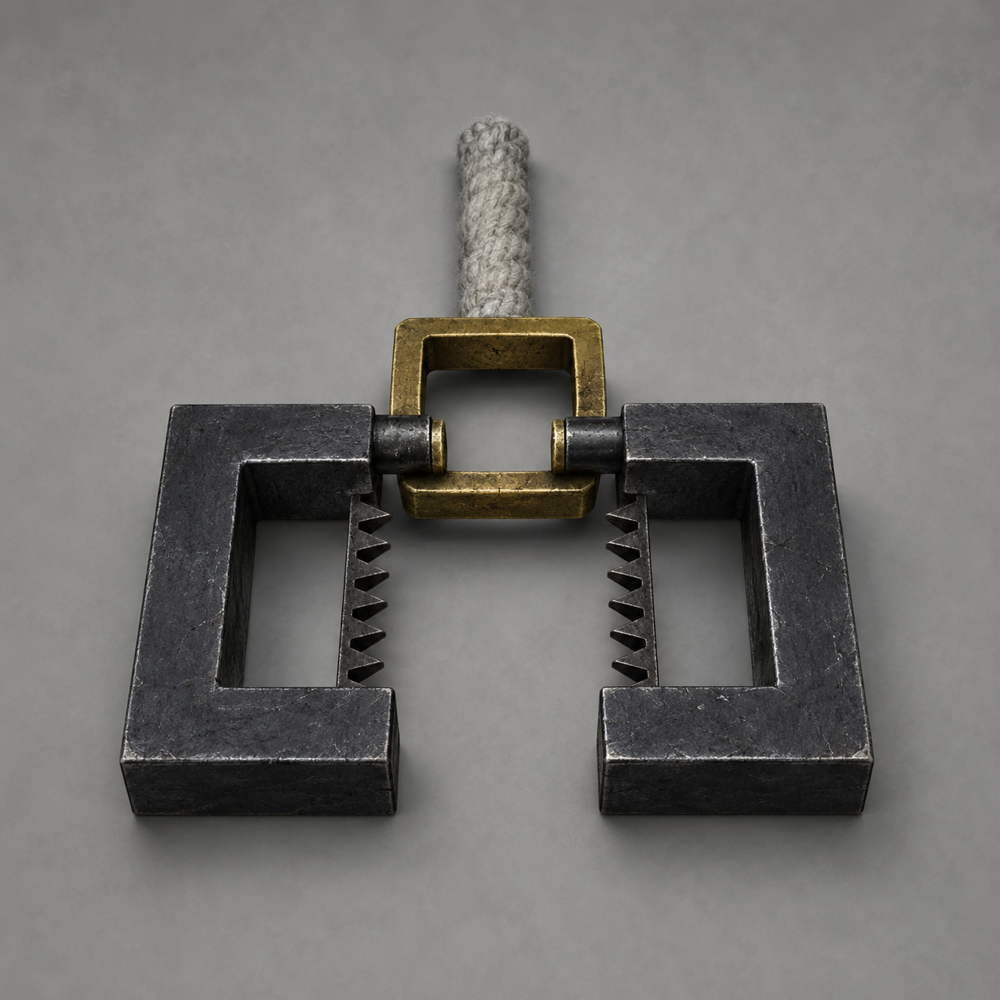

# 第27章 拿印的人不替你背锅

第三道云索在半空转向，链尾没有落向村界。

它直扑陆宁手里的韩百川官印。

陆宁腕伤发作，五指刚松，陆遥便用还能动的左手把官印压回布架。灰白云索随即折出一个直角，仍追着官印下坠。链尾裂成两片乌黑半环，半环内侧各有一排倒齿，中间只留出能夹住一枚印的方口。

“那是追保锁。”韩百川隔着北坡木栅开口，“它会沿仍有效的保契找到担保责任。锁口一合，担保的人或抵押物便要替失去的附载补位，直到副碑回收结束。”

这里的附载，就是仍替副碑受力、会随碑一起被拖走的人或物。

用途刚说完，两片半环便咬住官印四角。

半环并不封死。每当官印底部有一条契痕发亮，对应那一侧倒齿才会向内收一格；若契痕转灰，倒齿便退回。它不是普通锁链，而是一把把契约责任一项项夹实的锁。

旧金细线从锁口钻出，一头缠向陆遥手腕，一头沿地面爬向韩照夜。陆遥胸口猛地一沉，布架被拖向镇天碑三寸；韩照夜脚下石板也裂开一道细缝。

追保不是一句吓人的判词。它真要从持印人和保举人里拖一个活人补进云索。

顾长夜用缺口刀背卡住布架横木：“先丢印。”

“不能丢。”陆宁道，“官印是第八章押进保契的证物，也是韩百川改道押送后暂归陆遥的赔押。谁扔远，锁就追谁；谁砸毁，可能先把毁印的人补成债主。”

官印隔了数章再被追索，作用仍没变：它证明韩照夜曾保举陆遥接受审决，也证明韩百川违反约定路线后，押物应暂归被保人。陆遥已经取得正式仙籍，不再靠它求人作保，可改道违约的账从未结清。

陆遥咳出一口血，朝赵木匠抬了抬下巴：“拿块空门板。别拿谁家的。”

赵木匠推来一块没接风翅的旧门板。陆宁把官印放上去，所有人同时退开。

追保锁拖着门板向镇天碑滑了半尺，缠在陆遥腕上的旧金线却没有松；另一头仍钉着韩照夜脚下的裂缝。

锁追的不是眼前谁拿着印。

第一条猜测当场被否掉。

“再试活人换手？”张三叔问。

“不试。”陆遥喘道，“一块门板已经证明它不认手。再拿人轮流摸，只是给它多送几个名字。”

第四道云索又下降一丈。

两枚已落地的回收界钉同时收紧，镇天碑升高的那一寸发出碎裂声。山根下的风灾没有停，北坡木栅也仍封着。追保锁若在第四枚界钉落地前找不到责任，就会先按官印碰过的人结算。

陆遥手腕上的金线开始往皮肉里勒。

商青梧把药布塞进线下，只一息，湿布便冻硬：“最多半盏茶。再拖，你这只手先没血。”

陆遥看向韩照夜：“你当初保我什么？”

“保你到县城受审。”韩照夜答得很快，“韩百川改道，保契作废；我后来守试仙台，是另一场赌约。”

“那你脚下为什么也有线？”

“因为保契没退。”

韩照夜抬剑，没有斩云索，而是用剑尖挑开官印底部一层已经发黑的旧蜡。蜡下露出三道契痕：第一道刻着陆遥的名字，第二道是韩照夜按下的剑骨细纹，第三道才是韩百川官印的方形印痕。

三道痕不是一回事。

陆遥是被保人，韩照夜是保举人，官印是押物。追保锁却借同一枚印，把三种身份全拧成了“担保人”。

韩百川伸手：“把印给我。我是押印的人，追索自然该由我结。”

“先别急着孝顺。”陆遥道，“韩姑娘还站在线上。”

他让顾长夜用刀鞘将官印推向木栅，只推到韩百川指尖能够碰到的位置。韩百川两指刚压住印角，追保锁上的两排倒齿同时收紧。

缠陆遥的线没有消失，韩照夜脚下的线也没有断。村中已经弹回原位的二十七道影子反而又向北坡偏了一寸，张家门槛下刚褪去的黑霜冒出针尖大的一点。

把印交还，不是把责任从两个人身上取走，而是让原押印人重新接管整份契约。届时韩百川只需补盖一次，回收程序就会把刚退出附载的二十七户重新列入辖地担保。

陆遥立刻让顾长夜挑回官印。

韩百川没有强夺。他看见了那一点黑霜，也知道陆遥看见了。

第二条省事的路同样被一次短试否掉。

“它是看不懂，还是故意省事？”阿绫绕着官印闻了一圈。

“先当它看不懂。”陆遥道，“若连看不懂的账都拆不开，更别提故意的。”

他让陆宁取出自己的正式仙籍，放到第一道契痕旁。仙籍刚靠近，“陆遥”二字便由红转灰。试仙台已完成审决，被保人的目的早已达成；这道旧保契不能再用来证明他仍需谁担保。

可追保锁只松了一枚倒齿。

缠住韩照夜的线仍在发亮。

“需要保举人确认终结。”陆宁看懂了契痕缺口，“仙籍只能证明他已经过验，不能替你说当初那份保举到此为止。”

韩照夜把剑尖压进自己的细纹：“我保陆遥到场受审。如今审决已成，仙籍有效。此后他走哪条路、欠哪笔债，由他自己承担，不转给我，也不由我替他决定。”

剑骨发出一声清鸣。

第二道契痕随之转灰。

韩照夜脚下的旧金线当场断开。她没有被拖向云索，陆遥腕上却还有最后一圈线，且比先前勒得更深。

追保锁将方口转向韩百川。

韩百川脚边的辖地印影亮了。

众人这才看清，第三道契痕后面还有一条更细的延长线。它没有连向陆遥，也没有连向韩照夜，而是穿过村界，没入北坡木栅下方的天巡司封地纹。

韩百川当年押进去的不只是私印。

那枚官印同时代表栖霞辖地的封锁、征调与担责权。保举陆遥只是表层契约；更早以前，韩百川已经用同一枚印替镇天碑续过辖地担保。二十七户刚退出附载，辖界石又崩了，回收程序便顺着仍有效的旧担保找了回来。

“所以它追的不是我。”陆遥看向韩百川，“也不是你女儿。它要的是你拿这枚印替副碑押下的东西。”

话说到这里仍只是判断，还缺一份能让追保锁承认的证据。

陆宁从崩开的辖界石里挑出一块带直边的黑石鳞片。石片正面留着二十七户核验后的浅青裂纹，背面却有一小段与北坡木栅相同的封地黑纹。她把黑纹贴到第三道契痕旁。

追保锁先是毫无反应。

“石头不是责任人。”韩照夜道。

“但可以拿来验它究竟追哪一份权。”陆宁将石片移向韩百川袖口。黑纹靠近巡山纹时，锁口右侧三枚倒齿一齐转向；移向陆遥仙籍，倒齿又退回原位。

她再把石片贴近北坡木栅。第三道契痕后的细线立刻亮到尽头，追保锁拖着官印朝木栅移动，却没有再加紧陆遥腕上的线。

三处对照足够了：它要追的是韩百川以巡山使身份押下、至今仍落在北坡木栅上的封禁权，不是他的修为，不是韩照夜的命，也不是谁碰巧拿着官印。

韩百川沉默。

第四道云索又落三尺。云下已经能看见最后一枚界钉的乌黑钉尖。

陆宁问：“押的是什么？”

“辖地封禁权。”韩百川终于道，“二十年前风灾后，天巡司允许我以封禁栖霞山路为代价，替副碑维持辖地认定。只要封锁仍在，副碑便算有人看守，不会被上层立即回收。”

这不是替他免责。

二十年的封路保住过风灾下的一部分人，也让镇天碑能继续抽走栖霞地气。韩百川保护的秩序和村子慢死的代价，都落在同一枚印里。

“现在有两条路。”韩百川道，“把官印还我，我补一份新的辖地担保，追保锁便退。或者让它收走封禁权，北坡会开，但副碑从此再没有辖地名义。第四道云索会直接拖碑。”

“补担保要押谁？”齐婆婆问。

韩百川没有避开：“仍是栖霞辖地。二十七户刚退出的附载，会被重新核验。”

“那不叫退锁。”陆宁道，“叫把人再塞回去。”

韩百川没有只让他们听一句后果。他屈指在木栅上轻敲，先调出续担保的预印，却没有真正盖下。

预印亮起的一瞬，张家那点针尖大的黑霜扩成铜钱大小。齐家井沿又向镇天碑偏了半指，第二十七枚未定风片则被旧金线扯离正中。

韩百川立即撤掉预印，三处变化才停住。

续担保能让追保锁退开，代价也在生效前说得明明白白：二十七户会被重新接回副碑，其中连三户尚未作出的去留选择都要被辖地担保一并吞掉。

张三叔抱紧孙女：“这路不选。”

齐老汉躺在门板上喘了两口：“我还没选走，也没选替碑留下。别把两句话并成一句。”

赵木匠儿媳已经把药包背到肩上，却仍站在自己那枚北向风片旁，没有替父亲拔南向销。众人的答案依旧不整齐，拒绝被重新附载却是一件可以分别确认的事。

韩百川看向越来越近的第四枚界钉：“开北坡，拖碑会更快。你们当中有人来不及走。”

这一次，他说的是实情。

北坡封禁权若被收走，唯一山路会打开；可镇天碑也会失去最后一层辖地担保。风灾、重伤者、三户未定和仍不愿离村的人，不会因为路开了便自动安全。

陆遥没有替二十七户选走。

他只把眼前两件事拆开：“开不开路，是封禁权的账。走不走，是各户自己的账。不能因为有人不走，就让一扇官门永远替所有人关着。”

他又看向韩百川：“印是你押的，结不结由你说。可若你补担保，先前‘民户：零’的核验就会被你亲手改回去。”

韩百川望过村中二十七枚留着浅白断痕的风片。

那些痕是各户自己插销、自己拔销留下的。他可以用凝脉境修为压碎风轮，却不能让压碎后的木屑变成二十七户重新同意附载。

韩照夜收剑入鞘：“爹，我保过的人已经不用我保。你替碑押的门，也该由你自己决定收不收。”

她没有替父亲作答。

韩百川抬手。

村外的灵气骤然沉下，陆遥布架四周的石子同时陷入土中。凝脉境后期若要夺印，在场没有谁能正面拦住；韩照夜的剑刚出半寸，顾长夜也将缺口短刀反握。

陆遥没动。

他动不了，也没装作自己能打。

韩百川的手越过木栅，却没有抓官印。他将两指按在北坡封地纹上，把自己的血按进那条延长契痕。

血落下以前，他停了一息。

“封禁权一收，山口不再替你们挡风。”他说，“木栅后是旧樵道，三处塌坡，一处断桥。伤者过不快。你们要的不是一扇开门，是开门以后每一步都有人承担。”

“对。”陆遥说，“所以先把门还给走路的人。塌坡怎么过，我们自己看；谁走、谁留，也让本人说。不能因为路难走，就把关门说成替人走完。”

这是陆遥此刻能作的主动选择。他没有力量拔界钉，也不能站起来领人冲坡；他能做的是拒绝用二十七户重新附载换自己的手腕松开，并把是否续押的责任原样推回押印者。

“以栖霞巡山使韩百川之名，”他说，“旧担保不续。封禁权，准予回收。”

追保锁猛地合拢。

它没有夹碎官印，而是从印底抽出一枚巴掌大的旧金色虚印。虚印上缠着栖霞山路的黑色封条，一端连木栅，一端连韩百川袖口。

韩百川闷哼一声，袖口上的巡山纹当场熄灭一半。

北坡木栅随即从中裂开。

不是被剑斩，也不是被风吹倒。构成封锁的每一道黑纹都被追保锁从木头里拔出，卷进第三道云索。压了栖霞村五年的山路第一次没有官印挡在前面。

风从裂口灌进村中。

张三叔先去抱孩子，赵木匠推来门板，三户未定仍把风片保持正中。有人往北坡搬药，有人守着自家老人，也有人明确说暂时不走。路开了，没有哪只手替他们把方向一起拨好。

陆宁立刻把人分成三拨，却不按走留分。第一拨只去看三处塌坡和断桥，不带老人孩子；第二拨给伤者加固门板与分户风翅；第三拨守井、守药和镇天碑动静。去探路的人回来以后，各户再决定是否出发。

“我去看断桥。”赵木匠儿媳先开口。

“我守药。”三户未定中的齐老汉儿子把正中木销压稳，“看路不等于现在就走。”

张三叔则把女儿交给商青梧，自己抄起绳卷：“我只量塌坡，不替她定今晚过不过。”

北坡第一次有了具体去法，也保留了回头和暂不选择的余地。

陆遥腕上的旧金线终于松开。冻硬药布落地时，他整只左手已经青白，肩头剑伤也被刚才一拖重新渗血。商青梧按住血口，没许他坐起。

实质收益却同样看得见：北坡封锁解除，追保锁收走的是天巡司辖地封禁权，不是陆遥、韩照夜或二十七户中的任何一个活人。

韩百川也付了代价。他仍是凝脉境巡山使，栖霞辖地的封路权却已被自己的旧担保收走；至少在这次回收结束前，他不能再用同一枚官印把北坡关上。

陆遥把官印推回陆宁掌心，对韩百川认真道：“大人放心，印我还替您保管。门就不劳您再关了。”

韩百川没有回嘴。

因为第四道云索已经越过刚打开的北坡。

它不再寻找民户，也不再寻找担保人。最后一枚回收界钉在空中翻转，钉尖朝上，方形旧金环则对准镇天碑底座。

四道云索同时显出新的判词：

“辖地担保已失。”

“副碑改由官印当前持有人随行监送。”

官印在陆宁手中一震。

紧接着，镇天碑下方传来一声比先前三次都沉的断裂。

整块碑，开始向天上拔。

---

## Metadata

- chapter_number: 27
- word_count: 4078
- generated_at: 2026-08-14 19:50 +08:00
- upload_status: not_uploaded

