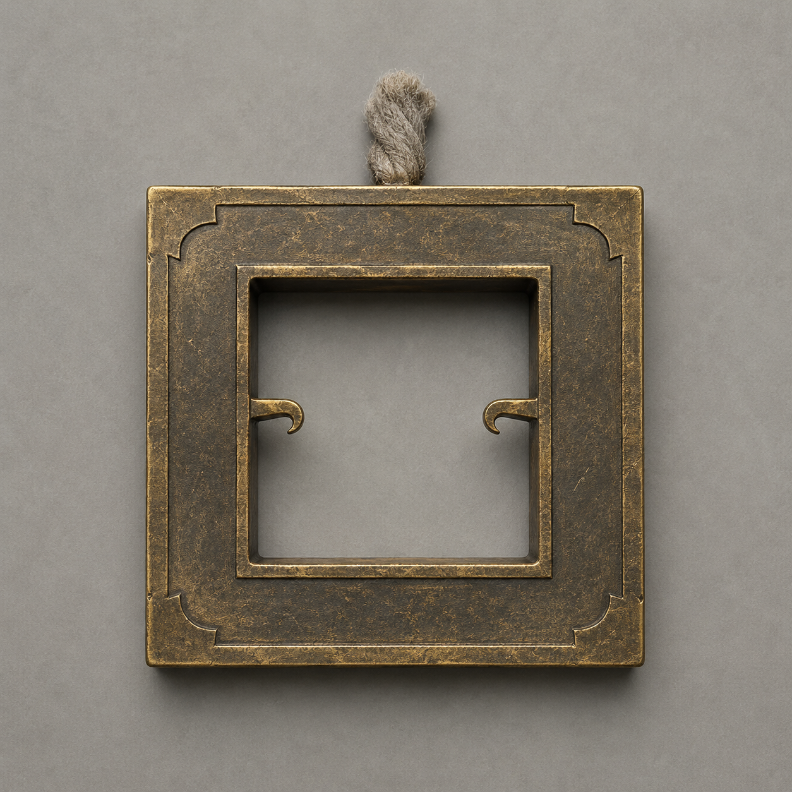

# 第28章 监送人不能挂着去

镇天碑离地的第一寸，陆遥的布架也跟着抬了起来。

不是风托的。

韩百川官印在陆宁掌心剧烈一震，第四道云索垂下一副旧金色方架。方架中央只有一个容纳官印的方槽，两侧各伸出一只向内弯的短钩，后方则接着一根灰白短索。短索的另一头没入镇天碑底座，碑升多高，它便收多长。

“监送印架。”韩百川抬头道，“它把官印锁成监送凭据，再沿官印账目牵住当前保管人。副碑上升一尺，保管人也必须随行一尺；跟不上，便拖着走。”

这里的监送，不是站在地上看碑离开，而是拿印的人必须与碑同去，直到回收结束。

用途刚说完，方架两只短钩便扣住官印。

陆遥左腕上刚松开的旧金细线重新亮起。布架左端猛地离地半尺，他整个人向右一滑，内移的第六肋像被从肺边重新撬了一遍，当场咳出一口血。

商青梧用肩顶住布架：“放下！”

“它若听医嘱，”陆遥喘得发白，“记得让它顺便付诊金。”

镇天碑没有停。

四道云索已经全部收向碑身，北坡封禁虽开，山根下的风灾仍在向外顶。石碑每升一寸，地缝便向村中延一截；再让它斜拔三尺，最靠近碑窟的六间屋会先塌。更急的是，监送印架正把陆遥从布架上单独扯走。他不能飞跃、不能攀高，右臂不能发力，左肩也不能负重。下一次收索若把人吊空，断肋会先扎进肺里。

顾长夜反手将缺口短刀压进旧金线下方。

刀背刚碰线，印架左钩便向内合了一格。陆遥手腕上的线立刻勒深，皮肤重新泛出缺血的青白。

“别斩。”陆宁道，“追保锁刚收完旧担保，监送印架现在只认赔押保管。碰它的人越多，它越可能把协助者也记成随行。”

顾长夜收刀。

这条路不能靠硬断。短试已经把后果摆出来：外人强碰牵线，印架会先把账面保管人勒得更紧。

陆宁隔着衣袖托住官印，没有去拔短钩。官印从第八章被韩百川押入保契后，隔了数章仍是改道违约的赔押；被保人与保举人的契痕虽已转灰，这笔赔押却还没有由双方结清。她将印放上空门板，自己立刻退开。

方架拖着空门板向碑座滑去。

陆遥腕上的旧金线没有转移。

“不认手，也不认垫印的东西。”韩照夜看向官印底部，“它认账上写的保管人。”

陆宁翻过官印。

前两道灰契痕下方，果然还有一行细得几乎看不见的小字：

“改道赔押，暂交陆遥保管。”

这便是判断的依据。印在谁手里不重要，监送印架沿的是尚未结清的保管记录；空门板换手无效，顾长夜碰线又只让陆遥受力，都与这行字相合。

“把赔押结了。”赵木匠道，“印还韩百川，陆遥便不用跟碑走。”

“不能直接还。”陆宁摇头，“刚才韩百川只碰印角，整份旧契便险些重开。现在被保与保举虽已结清，北坡封禁权也已收走，可谁也不知道直接归印会不会把‘民户：零’一起当成旧账重验。”

不是不肯还，是不能拿二十七户再试一次。

韩百川看见众人望来，先将右手压在木栅裂口外，没有碰印：“归还官印要由押印人与保管人同时确认。只要写清仅结改道赔押，理论上不会重开旧担保。”

“理论上？”商青梧冷声问。

“辖界石已经崩了，没有第二块石头给你们复核民户。”

错误答案因此更清楚：立刻归印也许能救陆遥，却可能让已经退出附载的二十七户在没有核验工具的情况下重新入账。这个代价不能靠一句“理论上”替所有人承担。

镇天碑又升半尺。

碑窟东侧屋墙轰然裂开。好在探路的人尚未带老幼上北坡，守井一拨立即将近碑的六户往晒谷场撤。三户未定仍保留正中风片，却各自推来空门板接伤者；他们不必先选择离村方向，便能选择不站在要塌的屋下。

陆宁也没有让全村围着一枚印等答案。

“探路照走，报塌坡和断桥能不能过；守药的把伤药挪到晒谷场；其余人只撤近碑六户。”她一边分派，一边把两根横木重新绑紧，“监送是陆遥眼前的账，不等于所有人的路都得停。”

陆遥躺在布架上看着那副旧金方架。

印架每次收索，先动的是官印，随后才是他腕上的线。空门板被拖近碑座时，方架两侧短钩会贴住门板边缘，却没有把门板列成保管人。它只需要一件东西承住官印，不在乎那件东西跟不跟保管人一起走。

“所以它只管我随行，不管我怎么随。”陆遥道。

韩照夜听懂了：“你想给监送人加一块承力板。”

“说得讲究些。”陆遥看向韩百川，“给公务随行的伤号配张床。”

“印架只认官印与保管人同程。”韩百川道，“你若把别人或别户风片接进承力板，正在替门板受力的那一方就会成为监送附具，被一并接入随行账目。回收途中一旦脱落，账仍算在你身上。”

基础限制说清了：可以借工具随行，不能借别人替自己受力；支撑物必须与官印、保管人同进同退，半途坏了，监送不会因此停下。

陆宁把陆家旧门板拖来，却没有立刻绑人。

她先用两袋与陆遥体重相近的湿砂压住门板，再把监送印架的两只短钩扣在门板前端。官印仍放在中央方槽，灰白短索绷直。陆家分户风翅隔章再用，仍只是把本户横风折成有限托力，木销一拔便能退出；这次陆宁没有接屋顶风片，只保留门板下的一长两短三角木架，让它当缓冲脚。

“先空载验三件事。”她说，“门板是不是跟碑同速，短钩会不会把木架算成新保管人，落下时能不能自己停。”

韩百川屈指在碑座旁弹出一缕风，只让镇天碑升一寸。

官印先升。

门板随即被两只短钩平平托起。两袋湿砂没有滑动，三角木架也没有浮出契痕。陆宁随即拔掉门板侧边唯一一根短销——它原本负责接入风片，此刻并未接风，拔除后只让斜向导风面收平。

门板没有坠落。

印架仍托着它，与镇天碑保持同样的一寸高度。

“它认短钩承力，不认风翅。”陆宁道，“风翅只当落地缓冲，不能当升力。这样不会接上陆家屋顶，也不会把陆家写进监送。”

小满蹲在一丈外盯着：“怎么试它能停？”

“不拿人试。”

陆宁让顾长夜以长绳从侧面扯住门板，模拟碑身忽然倾斜。门板一歪，旧金方架右钩立刻外展半寸，左钩却锁死，给门板留出回正的余地；两袋湿砂滑了半掌，被脚绳拦住，没有掉下。

这副架子不会替人保命，只会保证官印不离开方槽。要让陆遥不被甩下去，还得靠门板四角的护绳、脚绳与他自己承担的固定。

“能用。”陆宁道，“但只够一个人。谁也不许顺手站上去。”

陆遥问：“陪床也没有？”

商青梧把药箱捆到自己背上：“有。飞出三尺前我替你重新扎伤，之后我走地上的路。你若把肺咳出来，自己抱好。”

她没有因担心便擅自登上门板，也没有要求其他人替陆遥承担监送。

真正接人前，陆宁又把办法概括了一遍：印架短钩托门板，监送力只走官印与陆遥的保管线；分户风翅断开本户风片，只留下三角木架缓冲；四角护绳限制侧滑，任何一根断裂，陆遥就用左手拉掉胸前红销，让门板上的官印从中央槽退到侧槽，触发印架暂停核验。

“暂停多久？”顾长夜问。

韩百川道：“三息。只够重新固定，不够下地。”

红销因此不是逃脱监送的法器，只是一个三息的检修停位；它的来源、完整上限和回收途中还能触发几次，印架上没有写。当前行动所需的用途与限制却都已讲明。

陆宁先用木槌敲红销半寸。

官印从中央方槽滑向侧槽，灰白短索果然停收。镇天碑仍被另外三道云索向上拔，第四道却松了三息，门板保持原高。第三息末，方架发出一声脆响，官印被弹回中央，短索继续绷紧。

效果当场验过，没人需要等到陆遥被吊空才知道红销管什么用。

“只能把它当最后一口气。”陆宁道。

“那就留着。”陆遥说，“我这人别的没有，最后一口气挺多。”

陆宁却没有接他的笑。她把官印从方槽里暂时托起，逼监送印架停在原地：“还有一个选择。你和韩百川现在只结改道赔押，赌旧契不会重开。若赌对，你留在地上；若赌错，二十七户再入附载，我们也许连发现的石头都没有。”

晒谷场安静了一瞬。

这不是她替陆遥选，而是把两条路的收益与最坏后果都摆在他面前。随碑走，危险落在陆遥一个人身上；当场归印，风险可能落回二十七户，而且没有辖界石做第二次核验。

陆遥望向那些正在撤屋、背药、量坡的人。他们没有围过来劝他牺牲，也没有替他保证愿意再赌一次。齐老汉儿子仍守着正中风片；张三叔已经背着绳卷跑上北坡；陆宁问的只是他的决定。

“不归。”陆遥道，“赔押先留着。韩大人改错的路还没赔完，不能拿全村当退印的试纸。”

他抬起青白的左手，自己把胸前红销按回原位：“我随碑。你们走地上的路。”

韩百川看了他一眼：“回收去处未知。监送中途也未必允许你下来。”

“那正好。”陆遥咳着血笑，“我替大人看看，您守了二十年的碑究竟往哪儿交货。回来再收路费。”

这是他本章的选择，不是被云索拖走后的漂亮话。他保留官印和违约赔押，换二十七户不必承担一次无法复核的归印风险；代价是他以凡人重伤之身，亲自进入未知的副碑回收路。

商青梧没笑。她重新缠紧陆遥左肩，又用宽布固定右胸，确保断肋一侧不承护绳压力。陆宁与顾长夜一前一后把他挪上门板；整个过程陆遥右臂没有发力，左臂也没有负重，仍疼得额头全是冷汗。

官印放回中央方槽。

陆遥腕上的旧金线先亮，随后从皮肉表面退开，转而沿护绳绕过门板四角。它仍认陆遥为保管人，却接受门板替他承受同程牵引。

判断成立了。

“监送人到位。”韩百川道。

第四道云索猛然收紧。

镇天碑拔离山根一尺。旧金方架托着门板同步升起，陆遥没有被单独吊走。门板下的三角木架擦过地面，削掉一层木屑，随即完整离地；它没接陆家风片，陆家门槛也没有结出黑霜。

第二尺，碑窟东墙彻底倒下。近碑六户已经撤空，没有人被埋。守井的人报井水仍在，探路的人则从北坡传回第一处塌坡可绕、第二处要架绳，断桥对面还有完整旧桩。

一根来不及收走的晒衣绳被风卷起，忽然缠住门板下的三角木架。

绳尾还拴在赵家偏屋。绳子刚绷直，偏屋门槛立刻泛出针尖大的黑霜。监送印架不认谁晒过衣服，却会把任何正在替门板承力的东西算成监送附具；若让绳子继续牵着，赵家便会被重新接进这趟随行。

“断绳！”地面有人喊。

顾长夜已经抬刀，却在旧金短钩向内一动时停住。由地面强斩，印架可能把他的出手也并进承力。陆遥没有等别人替他冒险。他用左手扯掉胸前红销，官印滑入侧槽。

第四道云索停收。

第一息，门板仍在风里摆。陆遥不能坐起，只能侧过左肩，把预先系在脚绳上的木片往外一踢。

第二息，木片沿绳滑到三角架下，顶开陆宁事先做的活扣。晒衣绳从木架缺口脱出，偏屋门槛的黑霜随即停止扩大。

第三息，官印弹回中央方槽。

门板重新随碑上升。

赵家偏屋没有被带起，顾长夜也没有被写进监送。红销第一次在真实危险里触发了已经说明过的效果，却也让销尾多出一道裂纹。

“还剩几次？”陆宁仰头问。

陆遥摸了摸裂口：“不知道。按它这个脾气，最好当没有第二次。”

上限没有被凭空补全，眼前代价却清清楚楚：三息救下了赵家，也损坏了唯一检修销；下一次再有杂物牵连，他未必还能暂停。

第三尺，山根风灾冲出裂口。

陆遥的门板被吹得横摆，右侧护绳绷到极限。他没有动用青羽，也没有调用试命次数为零的“败中见隙”，只凭风压撞击门板的先后喊：“左后绳松半扣，右前绳收一扣！”

陆宁在地面照做。

门板转回正向。她随即松手，不再让地面的人替他持续受力。四根护绳都留在门板上，接下来要由陆遥自己看住。

他没有飞。

他只是躺在一块由监送印架托住的门板上，伤得连坐都坐不起，却把天巡司原本用来拖人的随行规则，讨成了一张不额外收人的病床。

实质结果也落在地上：官印仍由陆遥保管，没有重开二十七户附载；北坡探路与近碑撤离没有因监送停下；陆遥随碑升起，却没有让陆宁、商青梧或任何一户替他成为监送附具。

代价同样清楚。

门板只能载他一人，红销只验证出三息暂停，第四道云索不会因为他伤重而减速。左肩的血已经浸到第二层布，右胸每次震动都带出血沫；一旦护绳或三角架在高处损坏，他仍没有第二块门板可换。

镇天碑升到第四尺时，底座终于完全离地。

一直被埋在土里的碑底翻了出来。

那里没有普通石根，而是一整面倒刻的天巡司旧规。泥土簌簌落下，第一行字正对陆遥的门板：

“祭风之日，一切离地之物，归天巡司先行扣押。”

韩百川抬头的瞬间，陆遥也看见官印在监送印架中央自行转了半圈。

印面朝下。

正对着已经离地的镇天碑。

---

## Metadata

- chapter_number: 28
- word_count: 4146
- generated_at: 2026-08-14 21:06 +08:00
- upload_status: submitted_pending_review