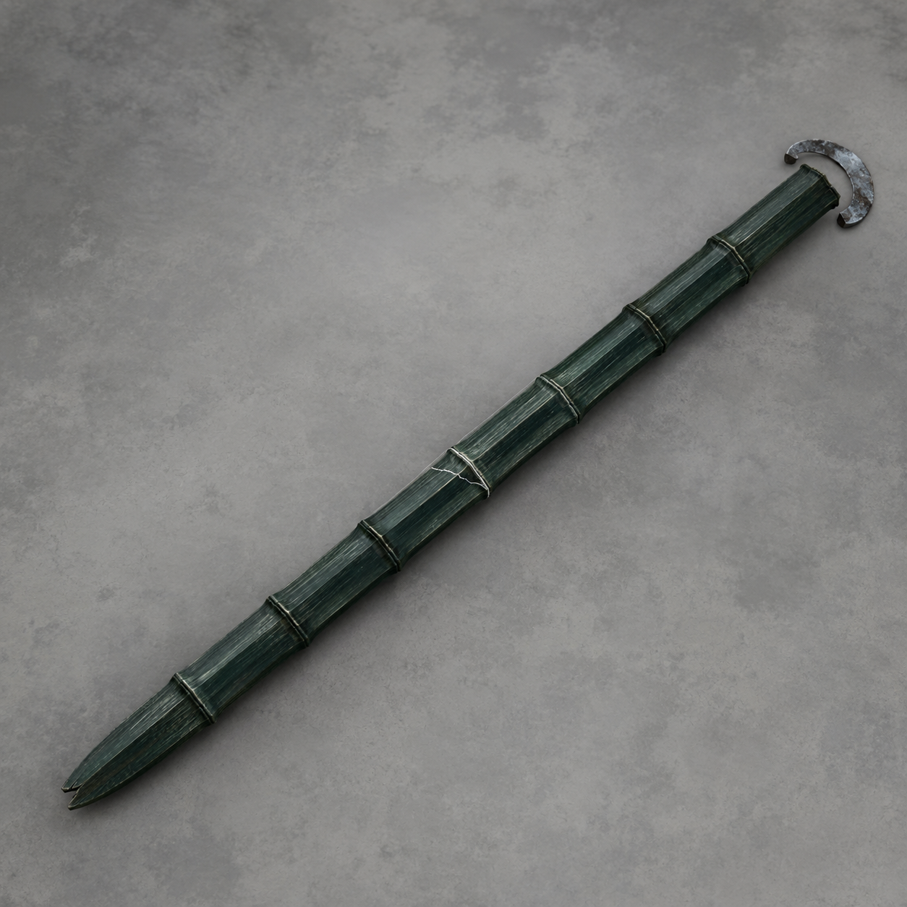

# 第30章 这把剑，算你们的过路费

云缝合拢前，四道云索把镇天碑硬拽了进去。

陆遥的门板紧随其后，板角刚擦过倒垂屋檐，一块瓦便向“天上”坠去——屋檐确实倒挂在云底，梁柱朝上，门窗朝下，像一座被翻过来的官署。

门楣铜牌还亮着三行字：

“栖霞旧扣押所。”

“专验辖内暂扣之物。”

“停用十九年，房梁欠修。”

所谓云上扣押所，就是天巡司留在云层里的旧验货官署；韩百川说辖内没有，是因为这地方早被停用，却不知为何仍在接收副碑。

陆遥还没笑完，三声索鸣从屋脊后逼近。

三名黑甲人踩着绷直的灰索滑出。那是巡天索骑——把云索当空中轨道、专门截停失控押物的追骑。他们脚下铁靴扣索，手中长钩一摆，三人便从不同高度夹住镇天碑。

为首者只看了一眼陆遥：“旧所无活人验位。割掉监送附具，保碑入库。”

监送附具指的正是陆遥和门板。若四角护绳被割断，印架仍会牵着账面保管人走，门板上的重伤少年却会先摔进云底。

第一柄长钩已经扫来。

陆遥扯松右后护绳。门板借碑身转向，钩尖擦断左前绳，木板骤然侧翻。他左肩撞上板沿，血立刻透过药布，右胸也咳出一串血沫。

他胸前那枚红销还在，拔掉便能让监送印架停三息，可销尾上次脱绳时已经裂了。现在再拔，门板也许能停，红销却可能直接折断，让官印卡死在侧槽。陆遥只在它上面按了一指，没拿未知的第二次机会赌命。

三名索骑没有追出各自脚下灰索一丈。第一人收钩时，铁靴后的锁扣始终咬着索身；第二人换位，必须等两道灰索交叉。陆遥看见了：他们快，是因为索路替他们承力；离了索，黑甲只会往云底掉。

“动作这么快，”他喘道，“看来贵所欠的不是工钱，是人命。”

第二名索骑抬手，一柄青影从背后脱鞘。

那是一柄三尺长的残缺青竹飞剑，剑身像削出双刃的深青老竹，共七节；剑尖缺了半寸，第三节到第五节横着一道白裂，剑尾套着一枚灰铁御风环。

“青竹剑只能沿剑尖直刺，也能托一人冲出三丈，途中不能急转。”索骑按下御风环，“拿它钉住门板！”

用途说完，飞剑便拉出一条笔直青线。

它快得陆遥躲不开，却也直得不会追人。剑鸣先到左耳，门板左侧木屑随后扬起；他由这两处可见变化判断，剑路会穿过自己腰侧，再钉进后方倒檐。

陆遥没有硬撑。他一脚蹬松左后活扣，把仅剩三根护绳的门板主动放斜。

飞剑贴着腰侧穿过，削开衣摆，深深扎进门板前梁。御风环仍在发力，竟拖着整块门板向倒檐直冲。

第一名索骑趁势压下长钩，想把陆遥从板上挑走。

陆遥却用左手把右前护绳在剑尾绕了半圈。飞剑不能转，他能让门板转。门板被直冲之力甩过半周，原本朝陆遥落下的长钩反被板角顶开，钩索缠上索骑自己的铁靴。

“你——”

“别谢。”陆遥认真道，“公务互助。”

飞剑带着门板撞过倒檐。欠修十九年的木梁当场折断，瓦片倒卷而下，逼得后两骑同时收钩。为首索骑则被自己的钩索拽离灰索，黑甲在半空荡成一只钟摆。

第二次攻势被撞散，代价也落到了实处：门板前梁裂开一掌宽，青竹剑上的白裂又越过一节，陆遥左前护绳彻底报废。再来一次，他未必还有东西可转。

第三名索骑拔刀去斩飞剑。

陆遥先扯出扣押牌。那块乌木牌仍用左右铜夹把副碑和官印扣在同一笔临时账里，基础作用就是让两件被扣物一起等待复核。

他没拿牌挡刀，而是先把“待结”旧金薄片靠近御风环。薄片上的方印刚对准旧所铜牌，环内暗纹便亮了一圈；挪开半寸，暗纹又灭了。旧所确实认这笔尚未结清的保管欠账。

第三名索骑已经压到头顶。陆遥这才把薄片拍进剑尾御风环。

薄片是天巡司尚未结清的保管欠账，不是灵砂。御风环却把它认成旧所签发的通行凭证，青竹剑骤然加速，拖着门板从第三名索骑刀下穿过。刀锋只削掉御风环半圈铁皮，没能斩中剑身。

这次陆遥赌的依据很简单：铜牌写着旧所，薄片盖着“待结”，两者的旧金纹路刚靠近时同时亮过。若判断错，飞剑只会停；若判断对，旧所便得先认自己欠下的路费。

结果是三丈直冲全部兑现。

门板越过最后一道拦截索，青竹飞剑的御风环也“咔”地裂开。它不再受索骑驱使，只剩半圈铁皮挂在剑尾，剑身则牢牢卡在前梁里，成了陆遥本章真正拿到手的战利品。

“追！”为首索骑在后方怒喝。

四道云索却已带着镇天碑穿过旧所。索骑若离开灰索便无处借力，只能看着门板被扣押账一同拖走。

陆遥没有追击。他仍是连坐起都困难的凡人，青羽也没替他开路；能冲出这一段，靠的是索骑自己送来的直线飞剑、旧所承认的欠账，以及门板上最后两根半护绳。再回头，任何一样都不够他用第二次。

陆遥摸了摸青竹剑扩大的裂纹：“三丈不拐弯，裂口还管饱。诸位读者老爷替我押一项——它先裂，御风环先散，还是我先被它颠散架？”

云雾在前方豁然分开。

旧扣押所后面不是仓库，而是一整座倒悬城。千百重屋脊挂在云海之下，道路铺在头顶，灯火像倒流的星河。

城门正中，悬着一只烧焦的木鸢。

木鸢左翼残缺，尾扣上那个“北”字，被风吹得正对陆遥。

那是陆沉舟的木鸢。

---

## Metadata

- chapter_number: 30
- word_count: 2003
- generated_at: 2026-08-20 17:00 +08:00
- upload_status: submitted_pending_review