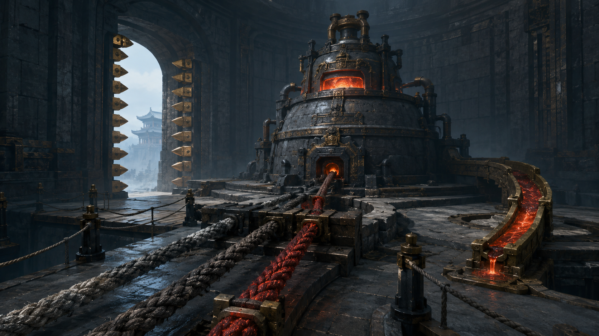

# 第33章 剑炉先烧碑，欠账先烧谁

赤红铁水从镇天碑底滴下来时，第一座索桥先响了一声。

不是桥要塌，是桥下那根被拖偏的云索先烫得发白。三道云索绷在碑身上，原本拽着它往内城门走；如今最外侧偏了一丈，铁水便顺着偏斜的索纹往回淌，像有人隔着城门给碑系上了一根烧红的绳。

“一刻钟。”沈雁回盯着桥下，“二号剑炉烧的不是碑面，是碑底的入门锚。入门锚就是副碑卡进城门时咬住门齿的底部铁件；它一软，副碑会自己滑进门里。”

“炉子隔着门也能烧？”

“二号剑炉只烧进内城的副碑。它把炉火送进云索，不认人，也不认谁在桥上。”

用途说清，第二滴铁水砸在桥梁上。木梁立刻冒出一缕青烟，桥面向下沉了半寸。

陆遥低头看了一眼自己的右胸。伤口里那口血还没压住，右臂不能发力，左肩也不能负重。桥另一端，四名收网人用套竿指着沈雁回；沈雁回的灰布左臂垂着，手里只有修索骨锥。

“你们平时怎么停炉？”陆遥问。

最瘦的收网人没好气道：“副碑进门，炉自停。没进门，谁敢碰炉路？”

“那就是从没遇到过不肯进门的碑。”陆遥抹掉唇边血，“恭喜诸位，今日见世面。”

铁水连着落下。最外侧云索猛地一缩，镇天碑底擦过桥上横梁，向门内滑了两尺。卡住它的青竹飞剑发出一声脆响，剑尾旧铜抱箍的新缝又张开了。

沈雁回忽然抬头：“剑能不能再冲一次？”

“能。”陆遥说，“但它只能沿剑尖直冲三丈，不能急转；御风环只剩半圈，白裂在第七节。再冲，剑可能先碎，门板也可能先散。”

“那你还问我？”

“我没问你，我在提醒这场买卖的售后。”

他看向镇天碑底。铁水每隔三息砸在同一条偏斜云索旁，第三次落下时，沟里竟浮出一圈暗金纹。

炉火不是随便烧，它沿着最外侧云索找到入门锚；云索偏得越厉害，热力越集中。

陆遥伸左脚碰了碰青竹剑插入的桥梁。剑尖钉在木梁下方，剑身正对云索，却被门板和桥梁的夹力压住。若把剑拔出，碑会继续滑；若让剑再冲，三丈直线会把桥梁连同门板一起往外推。

“我要把碑往外推半丈。”陆遥说，“不是挡住炉火，是把炉火烧偏。”

收网人听懂了，脸色先白后黑：“你要拿桥当扳手？”

“不然呢？你们城里没有扳手，只有会收人的杆子。”

“推偏了，云索会把碑甩下云海。”

“它现在进门就一定不掉？”

这句把四个人都问住了。

镇天碑底又滴下一线铁水。桥梁“咔”地裂开，裂缝顺着陆遥脚边爬来。沈雁回先动了。他没有去碰陆遥，而是用骨锥挑开桥边一块旧压索木，露出下面三根横着的承力梁。

“外推要借第二根梁。”沈雁回道，“第一根裂了，第三根是空的。可我只能用一只手压住梁头。”

陆遥看了看他缠灰布的左臂：“你这条胳膊能压？”

“不能。”

“那你说得很有建设性。”

沈雁回把骨锥递来：“你用脚。”

陆遥接过骨锥，却没立刻动。他把锥尖抵在青竹剑尾的旧铜抱箍上，先轻轻一拨。抱箍果然没有把裂口合紧，只能防止第七节继续张开；剑身一晃，白裂便沿着竹节爬出半指。

抱箍只能临时箍裂口，不能让残剑多出一分耐久。陆遥把骨锥插进抱箍缝里，借锥身卡住松动的铜圈，再对沈雁回道：“我数三下，你压第二梁；收网人一起松套竿，不许救碑，先救桥。”

最瘦的收网人骂道：“你把倒悬城当自家木作铺了？”

“你们牌子都写完好，坏了当然算你们的。”

三名收网人对视一眼，竟同时松了半寸套竿。沈雁回趴低身子，以右手和肩骨顶住第二梁。陆遥则用左脚蹬住门板裂口，左手不敢负重，只用脚背勾住骨锥。

“一。”

铁水落下，云索白得像一条烧红的蛇。

“二。”

镇天碑又向门内滑了一尺，第一道金齿已经擦过碑角。

“三！”

陆遥猛地蹬下。

残缺青竹飞剑沿剑尖直冲最后三丈，门板、桥梁和第二根承力梁同时向外顶。没有转弯，也没有凭空多出力道；只是直冲的力撞上了沈雁回压住的梁头，把被炉火烤软的云索顶偏半丈。

镇天碑没有飞出去。它只是被推离门心，底部入门锚擦着金齿，铁水随偏斜的索纹泼向内城门侧的旧炉槽。

那是把多余热力收回去的旧回火槽，里面立刻传出一声闷响。

二号剑炉的火没有熄，烧红的铁水却先浇在了自己的回火槽里。门内金齿被烫得合拢一半，副碑卡在门外，桥下云索的白色迅速退成暗红。

“成了？”最瘦的收网人探头。

“只成一半。”沈雁回喘道，“回火槽撑不了多久。”

陆遥也没笑。他听见青竹剑里传来细密的碎响，剑尾抱箍从中间崩开一道口，骨锥被震得脱手。门板前梁的裂口又张开半指，最后半根磨绳绷成了白毛。

代价一件没少：残剑不能再无损直冲，门板再受一次拉扯就会散，陆遥右胸的血沿衣襟往下淌。

可副碑没进门。

陆遥把掉在脚边的骨锥踢回沈雁回：“修索的东西，先还你。下次别拿这么贵重的命当压梁石。”

沈雁回接住骨锥，第一次正眼看他：“你不问我为什么知道回火槽？”

“问了你就会说。你说了我还得判断真假。”陆遥看向门内，“现在先收账。”

他指着那半扇被铁水烫黑的金齿：“这座城把副碑判作必须入内的散件，炉子又把它判作必须烧掉的副碑。两条规矩撞在一起，谁的账先算？”

收网人们没有回答。

因为门内忽然亮起一行暗金小字，贴在被烫黑的门齿上：

“副碑未入内，二号剑炉不退火。”

沈雁回看完，脸色变了：“它要把整座第一索桥当回火槽。”

桥下暗红的云索重新发亮。刚被推偏的镇天碑开始缓慢回正，第一座索桥的桥身却被热气一寸寸烤软。

陆遥摸了摸裂开的青竹剑尾，朝四名收网人露出一个还算客气的笑。

“诸位，炉子要烧桥，桥上有我。”

他顿了顿，指向沈雁回手里的骨锥。

“现在该轮到谁来给这口炉子起个不误导人的名字了：烧碑炉，还是烧桥炉？两个都不够损，诸位看官替我补第三个。”

桥底又落下一滴铁水。

这一次，铁水没有落在碑上，而是穿过木梁，滴进了第一座索桥下方一口封死十九年的黑井。

井里传出一声比陆家暗号更慢的敲击。

一长，两短。

---

## Metadata

- chapter_number: 33
- word_count: 2140
- generated_at: 2026-08-21 12:00 +08:00
- upload_status: submitted_pending_review