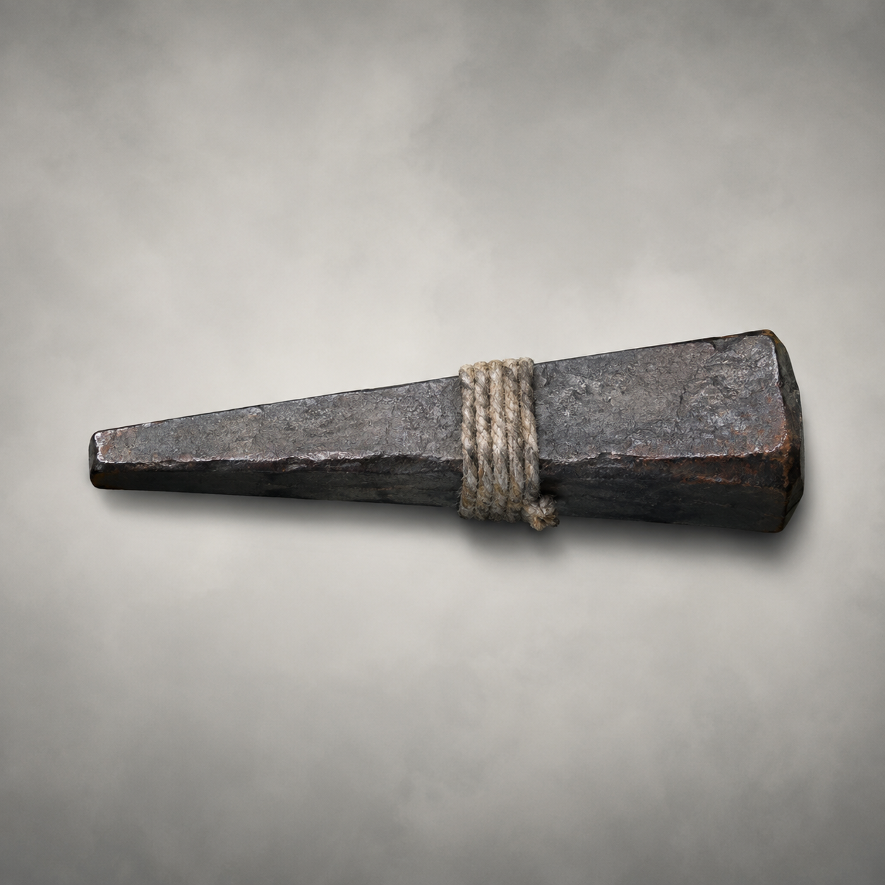

# 第35章 黑井开门，先赔谁的桥

黑井里的木鸢亮起第二只眼时，第一座索桥先向下弯了一尺。

陆遥没有敲第二次。

第34章末那句“别敲第二次，会看见我”还贴在耳边。他把右脚从井缝旁收回，顺手按住胸口。右胸的伤口被热气一烘，血又渗出一线；右臂不得发力，左臂也不能负重，能用的只剩两条腿、一副牙口和桥上快要散架的木头。

“你不问它是谁？”沈雁回压着第二根承力梁，声音被铁水的轰鸣切碎。

“问了它就会顺杆爬。”陆遥盯着木鸢，“会学我声音的东西，先按骗子算。骗子若想进门，通常比客人更着急。”

木鸢嘴部咔地张开，陆遥自己的声音从井壁里传出来：“你父亲留了路，走路就能见他。”

沈雁回眉头一沉：“它知道陆沉舟。”

“它知道木头。”陆遥踢了踢衣襟里的木屑，“知道一个姓，不等于知道一个人。桥下那东西借的是回火管，开门之后，第一口吃的是整座索桥。”

话音刚落，内城门金齿又合拢半寸。镇天碑被外侧云索拖得一歪，碑底擦过梁头，铁水像一串烧红的雨落下。沈雁回肩下的第二根梁发出闷裂声，四名收网人立刻把套竿往后收。

“再这样下去，桥先断，碑随后进门！”最瘦的收网人喊道，“把黑井封回去！”

“封回去用什么？”陆遥扭头，“你们那盏验客灯能照人，能不能照火？”

没人答。

这便是眼前的问题：黑井是剑炉的泄压路，镇天碑又堵在门外。铁水被退回黑井，炉压会烧穿桥梁；铁水顺云索回门，副碑会被烤软入城。无论选哪边，索桥和二号剑炉只能留一个。

沈雁回忽然抬起骨锥：“桥下第三梁后有一条旧风槽，原本给回火槽散热。风槽被一枚回火楔堵着。拔楔能把热气引向西侧空索，但那条空索连着坠客坪。”

“回火楔能做什么？”

“它是堵住旧风槽、控制炉压方向的铁楔。拔出来，热气会顺空索散走；插回去，风槽重新封死。”

用途说清，沈雁回却没有动作：“空索那头若有人，热气会把人掀下绳坪。”

“收网人，西侧绳坪现在有没有人？”陆遥问。

最瘦的收网人看了一眼腰牌：“三名散客，两只货笼。”

“那就先让他们趴下。”

“你命令我？”

“不，我提醒你。你们的规矩是先收活人，再收散件。若散客被热风掀下去，坏的是你们的账；若你们现在把人按住，坏的只是你们袖口。”

收网人骂了一句，还是分出两人奔向西侧。陆遥趁这瞬间蹲下，把手伸进桥梁裂缝。热得发麻的铁屑硌进掌心，他不敢用右臂，只用左脚踩住梁头，借身体下坠把指尖探到第三梁后。

摸到的不是铁楔，而是一截发白的麻绳。

“沈雁回，骨锥。”

“你右手不能用。”

“所以才叫你给我。”

骨锥递到脚边。陆遥用脚背勾住锥柄，把尖端送进麻绳与铁楔之间。绳子一绷，井里的木鸢忽然笑了，声音仍是他的：“你要把火送给别人。”

“纠正一下。”陆遥咬住牙，把脚跟压下，“我把你不要的火送回你们自己的空路。”

木鸢的眼光骤然一暗。桥下的黑井像被什么撞了一下，所有铁钉同时响了一遍。

陆遥立刻停脚。

声音有先后。井壁里的回声先响，镇天碑底的铁水才落；可刚才那一遍，是黑井先动，炉火后跟。它不是被动泄压，它能借空心铁管推回一股力。

“它在等我拔楔。”陆遥道，“想把热气吹上桥。”

沈雁回看向他：“那还拔不拔？”

“拔，但不替它开门。”

这是陆遥的选择。他将骨锥尖端换到铁楔靠外的一侧，只挑出半寸，让风槽先开一条窄缝；然后把残缺青竹飞剑的剑尾对准西侧空索。残剑只能沿剑尖直冲三丈，不能急转，剑尾旧铜抱箍也已崩裂，不能再拿来硬顶镇天碑。

可它还能把窄缝里的热风送直三丈。

“沈雁回，等我冲剑，你把楔子只拔半寸。”

“你要用残剑推风？”

“不然拿嘴吹？我嘴是用来收账的。”

西侧绳坪传来收网人的吼声：“散客已伏，货笼扣住！”

陆遥屈膝压住桥面，左脚抵住剑身，右脚勾住骨锥。木鸢又开口：“陆遥，父亲在下面。”

他眼神一冷：“那就让他自己敲门。拿我声音借路，算什么本事？”

“一。”沈雁回低喝。

铁楔松动半寸，旧风槽里先吐出一股黑灰热气。

“二。”

热风撞上残剑剑尾，剑身的第七节白裂又长了一指。陆遥没有加力，只把脚尖往旁边挪了半寸，让直冲方向对准空索。

“三！”

沈雁回猛拔铁楔，陆遥同时蹬剑。

残剑没有转弯。它沿着剑尖方向直冲三丈，硬把窄缝里喷出的热风推出桥外。墨青空索被热浪一撞，先向下垂，再猛地弹回；西侧三名散客抱住绳结，两个货笼却被掀起，撞在一起，发出一声闷响。

最瘦的收网人扑过去扣住货笼，回头冲陆遥吼：“你拿我家空索试剑！”

“你家空索先拿我家桥试火。”陆遥喘着气，“现在双方都有使用记录，公平。”

黑井里的热压被风槽泄走，二号剑炉的铁水终于没有继续往桥下滴。镇天碑底部却仍被外侧云索拽着，内城门金齿停在半合的位置；第一座索桥保住了，副碑也没有进门。

代价随即落下。残竹剑的剑尾抱箍彻底断开，剑身跌回桥面；回火楔被拔出一半，卡在风槽里，不能再完整封回；陆遥掌心烫出两道血泡，右胸的伤口重新裂开。

沈雁回把铁楔捡起，递到他面前：“这东西还能用。”

陆遥没接，只看向井口的烧焦木鸢：“先记账。它的基础用途是改火，不是开门；今日它确实改了火，可也把里面那东西惊醒了。”

木鸢的两只眼睛一起亮起。

这一次，井里没有学他的声音。

一个陌生、沙哑的男声沿铁管传上来：“陆沉舟的儿子，第三次别敲。你若想见他，先把门外那块碑送进来。”

陆遥捡起断掉的剑尾抱箍，朝沈雁回偏了偏头：“听见没有？它开始替我爹发号施令了。”

他看向卡在门外的镇天碑，笑意一点点收干净。

“下一次，我们不救桥。”

内城门的金齿，缓缓露出了一条只容一人通过的缝。

“我们把送碑的人，先送进去。”

诸位看官若要给这口“能泄火、不能认爹”的回火楔起外号，至少有两种叫法：一是“热风快递”，二是“孝顺开门砖”。至于第三个，等它下一次把谁送进门，再见分晓。

---

## Metadata

- chapter_number: 35
- word_count: 2170
- generated_at: 2026-08-21 12:00 +08:00
- upload_status: not_uploaded
