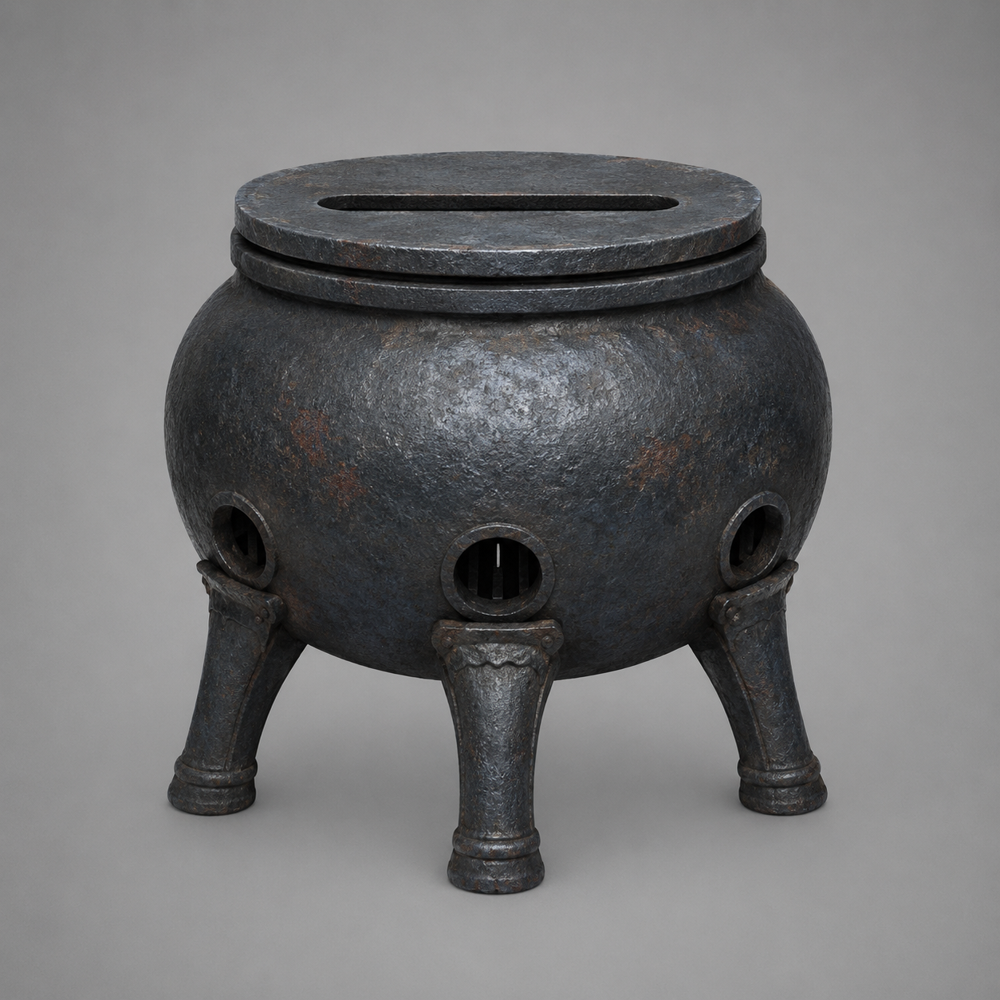

# 第36章 小炉先炼谁的命

内城门那道只容一人通过的缝，像一只故意留给陆遥的眼睛。

黑井里的陌生男声还在回荡：“把门外那块碑送进来。”

陆遥捏着断掉的青竹剑尾，掌心烫得发麻，右胸的血顺着衣襟往下淌。他没有再敲井，也没有立刻答应，只抬头看了看镇天碑。

碑底卡在第一座索桥上方，三道云索一边拖，一边被炉火烤得暗红。沈雁回和四名收网人都被压在桥头，谁也不敢松手。镇天碑再往前半尺，内城门会开；再往后半尺，索桥会断。

“你们听见了。”最瘦的收网人盯着他，“把碑送进去，大家都活。”

“这话听着很像借钱前说的‘我肯定还’。”陆遥擦掉嘴角的血，“你们先说，谁担保？”

“门里要的是副碑，不是人。”

“那更该找你们的碑，找我干什么？”

沈雁回忽然偏头：“西侧空索下面有东西落下来了。”

陆遥顺着他的目光看去。散开的热风卷过空索，三块焦黑铁皮从云雾里滚出来，露出半截青铜炉脚。炉脚下面拖着一块折断的木台，台上还压着一个灰布包。

“炼器台。”沈雁回说，“倒悬城外的坠台。里面有燃料。”

“燃料能把碑烧化？”

“不能。能让小炉升温。”

“小炉升温又能干什么？”

沈雁回看着他：“三足温风小炉，能把材料炼成修补胶、爆风丸或临时剑蜡。升温要一炷香，燃料只有一份，三样只能选一样。”

用途说得很直白。陆遥也终于明白，坠台不是救命宝库，而是一道必须先下注的窄门。

“修补胶能补桥？”

“只能补裂口，补不了承力梁。”

“爆风丸能炸开门？”

“能把人和东西一起吹飞。”

“临时剑蜡呢？”

“让你的残剑多撑几次直冲，但不能让它转弯。”

陆遥低头看了看青竹飞剑。第七节白裂已经爬到剑脊，剑尾抱箍彻底断了。拿它硬顶镇天碑，刚才那一下已经算把祖宗牌位踹上了灶台。

“我选小炉。”他说。

最瘦的收网人一愣：“小炉不是三样里的一样。”

“你们的规矩先收活人，再收散件。我的规矩是先收能做选择的东西。”陆遥指向西侧坠台，“把它拉过来。炉子归我，燃料先不归我。”

“凭什么？”

陆遥指了指那条只容一人的门缝：“凭你们若不拉，碑就继续往里走。到时候门里要的是碑，不是你们。”

    这句话落下，最外侧云索又猛地一沉。金齿门缝扩大了一指，镇天碑底部擦出一串暗红火星。收网人脸色变了，立刻分出两人去扯坠台上的旧索。

坠台刚离开西侧空索，桥面便向下一陷。三名散客被迫抱住绳结，货笼里的铜片哗啦啦滚了一地。一个满脸煤灰的矮个子冲陆遥喊：“你们炼器的都这么挑时候吗？”

“我们不挑。”陆遥把铁屑踢开，“我们只是把坏时候分给最该负责的人。”

矮个子看了看收网人手里的绳，又看了看正在合拢的金齿门，竟咬牙把货笼推到桥内侧：“炉子归你，风骨木归你，等你炼完，先把桥上的人送走！”

“听见没有？”陆遥回头对收网人说，“散客都比你们会算账。你们若再拖，等炉子升温，第一批被吹下去的就是你们。”

最瘦的收网人脸色铁青，却不敢再争。两人用旧索套住坠台，另一人踩住炉脚，剩下的人死死顶住第二道云索。局面没有变好，只是从四个人看住沈雁回，变成了所有人一起看住一座会掉下去的炉子。

    沈雁回仍压着第二根承力梁，肩头灰布被铁屑划出一道口子。他把一枚空心铁钉递给陆遥：“钉进台脚，防它滑回云里。”

“你不是把修索骨锥还我了吗？”

“骨锥修索，铁钉锁台。用途不一样。”

新道具先说用途，陆遥接过铁钉，发现它中空，钉身轻得像一截晒干的芦苇。他把钉尖插进木台裂缝，再用断剑尾横着一撬。坠台被拖到桥边，三足小炉终于露出全貌：黑青炉腹只有半人高，底下三只铁足各自带着风孔，炉口没有火，只有一条细窄的进风缝。

“升温一炷香。”沈雁回说，“这段时间里，炉子不能挪，风孔不能堵。”

“那它最适合炼什么？”

沈雁回看向不断合拢的金齿门：“看你想救桥，还是想闯门。”

陆遥蹲下，把灰布包里的燃料倒出。不是灵石，而是几块被风磨白的旧风骨木。它们一落进炉腹，炉底便传来一声低沉的呜鸣，三只铁足同时张开。

桥下黑井立刻回了一长一短两声。

陆遥的手停住了。

井里的男声竟在数：“一炷香，够把门外的碑炼成门里的东西。”

“它会说话不稀奇。”陆遥盯着炉口，“稀奇的是，它知道炉里有几块木头。”

沈雁回脸色一沉：“别点火。”

“不点，桥断；点了，井里那位替我们选。”陆遥抬手按住炉盖，烫意立刻透进指骨，“所以我不炼修补胶，也不炼爆风丸。”

他把残竹剑平放在炉口上方，借风孔里吐出的热气慢慢烘剑身。

“我要炼临时剑蜡。”

收网人骂道：“你拿它过门？”

“不。”陆遥看向那道只容一人的门缝，“我要让它先替我试一试，门里到底收碑，还是收人。”

炉火尚未真正升起，门缝里却伸出一根漆黑的金属指节，轻轻敲在镇天碑上。

碑身裂纹里，传出了陆遥自己的声音：

“第三次别敲。”

陆遥抬眼，笑意一点点冷下去。

“诸位，评论区先替我判一件事：这口炉该炼剑、炼风，还是炼那个躲在井里的嘴？”

---

## Metadata

- chapter_number: 36
- word_count: 2021
- generated_at: 2026-08-21 16:45 +08:00
- upload_status: submitted_pending_review