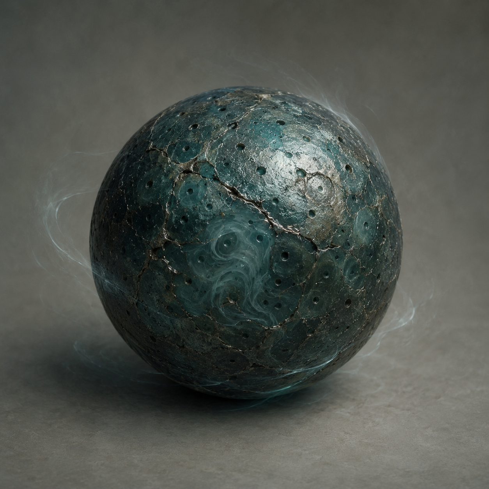

# 第38章 一颗风丸只炸一面门

门内抬起第四根黑金指节时，三足温风小炉的炉盖也裂开了。

两道细缝从盖心爬到边沿，热气像被谁掐住脖子，只能一阵一阵往外喷。炉底的三只铁足同时发出尖响，桥面跟着下沉半寸。

“先说好。”陆遥按住炉盖，掌心刚结的硬痂立刻被烫开，“这炉子要是炸了，算谁的？”

“算你的。”最瘦的收网人咬牙扯紧旧索，“是你挑的炉子。”

“那你们别站在我的炉子旁边。”

“桥是大家的！”

“所以才问你们，愿不愿意一起赔。”

沈雁回压着第二根承力梁，灰布袖口已经被铁屑割成了穗子。他抬眼看了一下炉盖：“风孔没有堵，裂纹却往外张。不是炉火太旺，是门里的热压在找新的出口。”

陆遥顺着他的目光看去。

镇天碑底下那道暗红火星，正沿着碑身裂痕往外爬。每爬过一寸，门缝里的黑金指节便向外探一分。它不是在推碑，像是在摸索一条能把声音送出来的路。

“它要的不是副碑。”陆遥说，“副碑只是能让门开口。真正能替它开口的，是人。”

门内借着他的声音轻轻笑了一下：“聪明。”

“夸我可以，先交诊金。”

“四次。”门内说，“下次给你四次直冲。”

陆遥看向残竹剑。剑蜡还黏在第七节裂口上，黑色硬脊撑得住直冲，却已经出现三条白线。三次是借来的命，第四次未必是多一次机会，也可能是门里算准了他会继续拿剑去撞。

“我不撞第四次。”

这句话让收网人都愣了。

陆遥伸手从灰布燃料包里拈出一粒暗青色的丸子。它只有拇指大小，表面布满细小风孔，轻轻一晃，丸子里便传出闷雷似的滚响。

“这是爆风丸，作用很直白：把炉子积住的热风一次性喷出去，能把人和东西一起吹开，但只能控制一面，不能拿来护住四周。”

沈雁回皱眉：“你什么时候拿的？”

“刚才炉子挑燃料的时候。”

“你选的不是临时剑蜡？”

“我选了一份风骨木。”陆遥把丸子托在掌心，“炉子能炼三样，不代表一份燃料只能出一样。它刚才烧出来的不是剑蜡，是把余热压进了这颗丸子。”

沈雁回盯着他：“炉子说明里没有这条。”

“所以我没把它当说明，当成了炉子在咳嗽。”

炉盖又裂开一道口子，热风喷向桥外。三名散客被吹得往后退，脚下的铜片滚到云索边上。最瘦的收网人赶忙扑过去按住铜片，另一名收网人却松了旧索，镇天碑立刻往门缝滑了半尺。

“别松！”沈雁回喝道。

晚了一步。

第一座索桥猛地一沉，门齿朝内合拢。黑金指节抓住碑底，五根指头同时收紧，碎裂的墨青石面上立刻爬出蛛网般的白线。

陆遥没有去扶碑。

他先把爆风丸塞进炉口，再用空心铁钉扣住炉盖裂缝。铁钉只能锁住炉盖，锁不住喷出的风；他要的也不是让炉子安静，而是让它只朝一个方向发火。

“沈雁回，第二根梁还能撑多久？”

“三息。”

“收网人，按住外侧云索。”

“你凭什么命令我们？”

“凭我知道炉子会往哪边炸。”陆遥指向门缝，“不想让门里的东西把桥一起收进去，就把风口朝外。谁现在松手，谁就是第一件被吹进门的散件。”

这次没人反驳。

四名收网人分开站位，三名散客抱住炉脚。沈雁回用肩顶住承力梁，低声数：“一。”

陆遥扭动炉盖上的空心铁钉。

“二。”

门里的黑金指节向后一缩，像在等他打开一道更大的口子。

“三！”

陆遥拔钉。

爆风丸没有立刻炸开。

炉子先发出一声极轻的吸气，三只铁足下的风孔同时倒转。桥面上的铁屑、灰布碎线和几块铜片被吸向炉口，连镇天碑裂缝里的暗红火星都被扯得一晃。

“它在收风？”沈雁回变了脸色。

“收的是门里的风。”

陆遥抬脚踹在炉身侧面。

炉腹轰然一震。

下一刻，暗青色的风柱从炉口横着喷出，先掀翻两名收网人，再撞上门缝。黑金指节被风柱顶得向后折，五根指头在碑面上刮出刺耳的响声。镇天碑没有被吹进门，反而沿着索桥向外滑了整整一丈。

第一座索桥重新弹起。

门齿只差三指宽便要合拢，却被风柱卡在了那里。门内传出一声闷响，像有什么庞大的东西撞上了门背。

陆遥被反震掀倒，右胸的伤口再次裂开。他咬住袖口，没让自己松手。炉口的风已经变细，爆风丸外壳裂成两半，剩下的风力只够维持十息。

“现在！”他喊，“把碑推到西侧空索，别让它回门心！”

沈雁回先动。

他没有去救陆遥，而是把肩从承力梁下抽出半寸，借着索桥回弹的力道撞向镇天碑。四名收网人跟着压索，散客也抱住碑底。镇天碑擦着门槛滑过，暗红火星被风柱吹散，门内那五根指节终于松开。

风停了。

炉盖落回炉口，裂纹却从两道变成了七道。爆风丸留下的青灰粉末沿炉口淌下，像一层结了霜的泥。

陆遥撑着残竹剑站起来，先看桥，再看炉，最后看门缝。

镇天碑被推到西侧空索上，离门心足有一丈。第一座索桥暂时保住，内城门的金齿也停在半合的位置。可门缝里没有收回第四根指节，只留下半截黑金指尖，死死勾着碑面的裂纹。

“一颗丸子，只炸一面门。”陆遥咳出一口血，“看来炉子没骗人。”

沈雁回拾起爆风丸裂开的外壳：“还有第二颗吗？”

“没有。”

“那你笑什么？”

陆遥指着门槛：“因为它刚才被风吹出来的，不是铁屑。”

门缝外侧，落着三片焦黑木屑。木屑拼在一起，恰好是半只烧焦的木鸢翅膀。翅膀下面压着一张薄纸，纸上只有一行新字：

“第四次不收剑，收开门的人。”

陆遥看完，把纸递给沈雁回。

“诸位，评论区替我判一判。”他擦掉嘴角的血，“这次门里收的是人，还是收一个会开门的人？”

门内的黑金指尖忽然轻轻一勾。

镇天碑裂缝深处，传出第一声不像陆遥的呼吸。

---

## Metadata

- chapter_number: 38
- word_count: 2210
- generated_at: 2026-08-21 18:05 +08:00
- upload_status: not_uploaded
