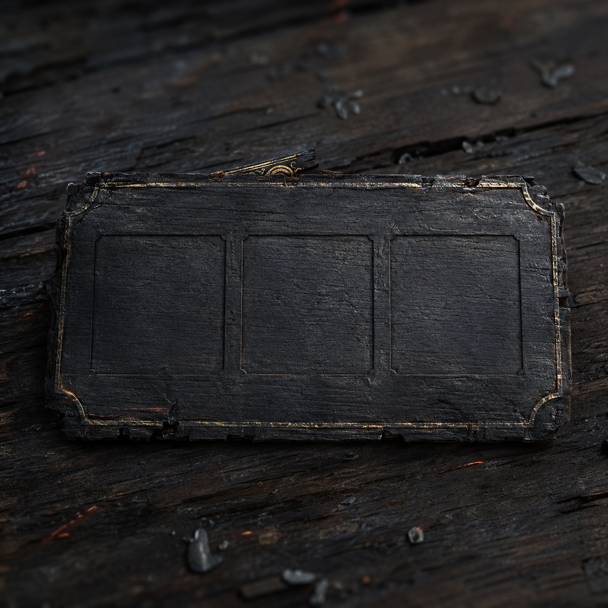

# 第39章 门里收人，先验谁的名字

镇天碑裂缝深处那声呼吸又响了一下。

它不像陆遥。陆遥喘气时右胸会疼，气息总在第三个字前断一下；门里的呼吸却平稳得过分，像有人隔着一层门，把他的喘息一口口数清楚。

“收人。”黑金指尖勾着碑缝，“先收开门的人。”

陆遥撑着残竹剑站稳。爆风丸已经炸空，三足温风小炉炉盖裂成七道，余热沿西侧空索爬。镇天碑离门心一丈，索桥暂时弹起，最外侧云索仍在暗红回温。

“收谁？”陆遥抹去嘴角的血，“先把收据拿出来。”

门缝里的黑金指尖没有回答，只往回一缩。下一刻，五根指节同时扣住碑面，指节之间浮出一块薄薄的黑牌。黑牌不是门，也不是碑，它像一片被烧平的木片，边缘嵌着细金线，正面只有三个凹下去的空格。

沈雁回看了一眼：“收人牌。它用来确认被收进去的人名和来路，三个空格分别填名、担保、去处。”

“你见过？”

“押路旧所的收人牌都这样。牌先认名，再认担保，最后认门后的去处。三项缺一，收人只算扣押，不能算入门。”

收人牌的用途很直白：它不杀人，只留下姓名、担保和去处三笔账。

“那它为什么不直接收我？”陆遥指向黑牌，“我名在这儿，担保人也在桥上，去处不就是门里？”

最瘦的收网人脸色变了：“别让它填。”

收网人没有答。沈雁回的手指在承力梁上收紧，压出一串血印。

黑牌上的第一个凹格亮了，浮出两个字：陆遥。

陆遥左眼随之一疼，像有人把一根烧红的针从眼眶后面穿过去。他看见门缝里有一条极细的灰线，正从黑牌伸向自己的左眼，又沿着镇天碑裂纹绕回门内。

“它在认名。”沈雁回说，“别看牌面，先断灰线！”

陆遥没有拔剑。他右臂不能发力，残竹剑又只剩直冲，碰那条细线就等于把自己的名字送去盖章。

他看向三足温风小炉。刚才爆风丸把积热横向喷空，炉盖裂纹更大，炉口却还吐着一股细长的热气。热气没有散，正被门缝的压力往黑牌方向牵。

“小炉还能撑几息？”

沈雁回看了看炉足：“三息。风孔没堵，但炉盖一掀，余热会反冲。”

“这就够了。”

陆遥抓起空心铁钉。它的用途是锁住会滑动的炉盖，不能堵住热风；这一点他记得清楚。他把铁钉插进裂缝，却没有拔出，而是将钉尾朝向黑牌，借着金属把炉口那股细热风引成一条直线。

“散客，去按炉脚！”陆遥喊，“收网人继续压索，谁松手谁负责把副碑送进门！”

满脸煤灰的矮个子愣了：“不是门里收人吗？”

“门里收人，门外收账。你们先替我把账本吹歪。”

矮个子骂了一句，带着两名散客扑向炉脚。四名收网人本想趁乱后退，最瘦的那个刚松半寸旧索，镇天碑便向门缝滑去。

陆遥立刻喊：“他要把碑送进去！”

三名散客同时回头。矮个子抄起一块铜片砸在收网人脚边：“你们说门里不收人，那就别拿人和碑一起押！谁动一下，我先记你们名字！”

收网人被迫重新压住云索，桥面暂时稳住。

“担保：韩百川官印。”门内用陆遥的声音念道，“第三格，去处：倒悬城内。”

陆遥笑了一声：“好一张会替人填空的牌。”

他终于看见问题。黑牌没有韩百川的官印，只是把镇天碑裂纹里的追索气息冒充担保；“倒悬城内”也不是具体去处。

依据很简单：姓名亮得最稳，担保只在牌边闪烁，去处连凹痕都没填满。门内是在拿陆遥的名字补一张不完整的收人账。

“沈雁回，押路旧所的规矩是不是三项缺一，只能扣押？”

“是。”

“扣押牌要不要见证人？”

“要。至少一名押路人，一名被押人，牌面还要留下去处。”

陆遥点头：“那它这张牌，少了一个见证人，也少了真正去处。”

他把染血的指尖点向黑牌，却在将碰未碰时停住。

“我可以进门。”陆遥对门里说，“但先补第三格。你把门后的具体去处说出来，再让沈雁回和我一起按牌。否则这不是收人，是冒名扣押。”

门内沉默了。

沉默里，黑牌第一格的“陆遥”开始变浅。

陆遥等的就是这一瞬。他猛地把空心铁钉向下一压，三足温风小炉的炉盖被锁死，残余热气沿钉身直冲黑牌。热流没有炸开，只把牌边细金线烫得卷曲。灰线从黑牌退回镇天碑，左眼的刺痛随之松了一线。

“现在！”陆遥喊。

沈雁回撞开承力梁，矮个子和散客同时扯住炉脚。细风导向黑牌，第二格先亮后灭，冒出焦黑烟气。

门内指节猛然收紧。镇天碑被拖回半尺，索桥木梁发出将断未断的闷响。

陆遥抬起残竹剑，用剑身平面顶住黑牌，不刺，只把它挡在门缝外。

“规矩是你定的，我只负责让你也守。”

剑身一横，黑牌被卡在门槛上。门内那股牵引力没有收回，反而顺着剑身压进陆遥掌心。临时剑蜡留下的黑痕裂成细纹，掌心的烫伤再次渗血。

沈雁回吼道：“松剑！它在借剑认你！”

“我知道。”陆遥咬住牙，“所以得让它认错一次。”

他侧过剑身，把黑牌翻了半面。牌背没有三个凹格，只有一道被烧断的旧木鸢翅纹。黑牌一接触门槛，木鸢翅纹便发出一声干涩的鸣响，门内那口不像陆遥的呼吸第一次乱了节拍。

第一格的“陆遥”彻底熄灭。

黑牌从门缝弹出，砸在镇天碑外侧。沈雁回用修索骨锥把它钉在桥板上。黑牌未碎，三道空格却重新变成空白。

门齿停止合拢，暗红云索也暂时冷了一瞬。陆遥右胸伤口裂得更深，视野一黑，残竹剑传出细响，第七节白裂又长了一寸。

矮个子捡起黑牌，没敢翻动：“这算我们抢来的？”

“不算。”陆遥喘着气，“算它自己把收据落在门外。”

沈雁回盯着牌背：“这不是收人所的旧牌。旧牌没有木鸢纹。”

门内忽然有人说话，这次没有借陆遥的声音。那声音年轻沙哑，像很久没用过喉咙。

“名字可以错，担保可以借，去处不能填错。”

黑牌第三格在门外自行亮起，浮出一行歪斜小字：陆遥的去处——木鸢归巢。

门后那口呼吸停了半拍。

陆遥忽然不笑了。木鸢不是收人凭据，而是有人替他写好的去处。

下一刻，黑金指尖松开镇天碑，转而指向桥下那口封死十九年的黑井。

井里传来两长一短的敲击。

这一次，黑井里响起的不是陌生男声，而是陆沉舟的声音：

“遥儿，别让他们把我送回去。”

---

## Metadata

- chapter_number: 39
- word_count: 2288
- generated_at: 2026-08-21 18:40 +08:00
- upload_status: submitted_pending_review