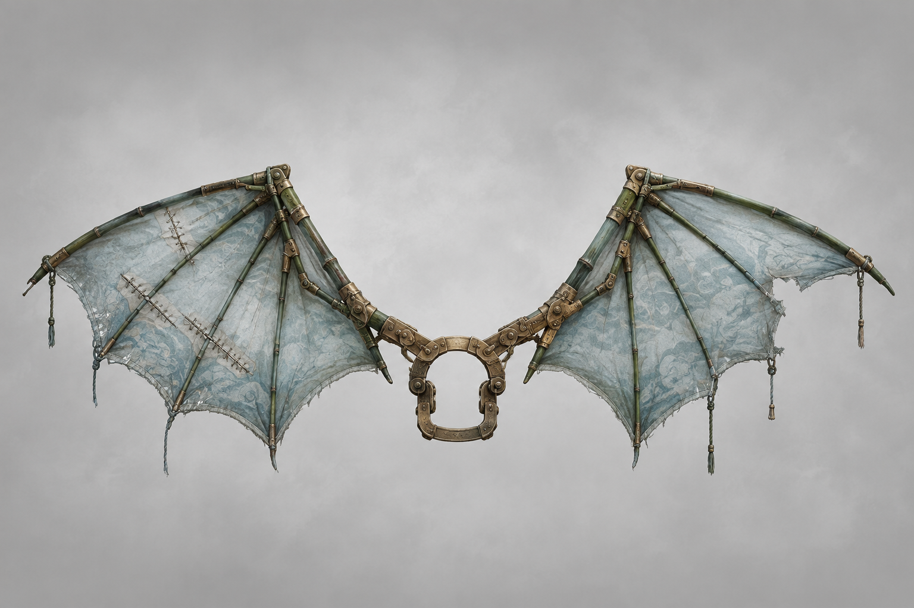

# 第41章 黑井先叫谁的名字

黑井睁着那只青色的眼睛，先叫出了韩百川的名字。

黑井是二号剑炉泄压后的回火路，井底热压一变，连着它的云索和桥梁就会先断。

陆遥的手还按在裂成两半的收人牌上。牌背那片烧焦木鸢翅指向井底，井里的陆沉舟让他别下来，另一个声音却催他下去；如今青眼一开，所有声音都像被扔进了同一口锅里，连谁在说话都分不清。

收人牌是押路旧所用来登记姓名、担保和去处的旧木牌，三项缺一便只能算扣押，不能把人送进门。

“韩百川？”沈雁回盯住井眼，“他不在桥上。”

“所以它叫的是名字，不是人。”陆遥抬头看向镇天碑。刚才收人牌上的担保曾借过韩百川官印的名，门内指节也沿铜线反扣了收网人。黑井先喊韩百川，很可能是在找那笔担保的真正主人。可若黑井把名字收进去，桥上的人和碑就会一起被牵走。

脚下的第一座索桥忽然向下一沉。

最外侧云索红得像烧透的铁丝，镇天碑压在西侧空索上，内城金齿卡着半块碑身。四名收网人被自己的索文锁住，短个子仍抱着第二根承力梁；沈雁回右肩压梁，左臂垂着，没法再替所有人撑一次。

“先救谁？”一个收网人咬牙问，“井里那位，还是桥上这些活人？”

“问得好。”陆遥咳出血沫，“我也正准备把这道选择题退回出题人。”

他没有去撬井盖。黑井的用途已经明白：它是二号剑炉泄压后的回火路，井底热压一变，云索和桥梁就先断。陆遥看见井眼每次眨动，最外侧云索便亮一寸；青眼不是在看他们，而是在借桥上的承重点确认谁的名字能挂住这块副碑。

“沈雁回，数井眼。”

“一眨一压，三眨后梁断。”

“收网人，把你们的索文报出来！”

最瘦的那人骂道：“凭什么？”

“因为黑井正在叫韩百川。谁替他担保，谁先报去处。报不出来，就把你们的名字从索上摘下来，换你们自己去井底。”

这句威胁比桥下的热气更快。四名收网人互相看了一眼，短个子脱口道：“甲七舟！”

“闭嘴！”最瘦的收网人喝止。

晚了。青眼在井底一转，青光沿铜线冲上收人牌。牌裂缝里的“陆”字被压得更深，第三格的“归巢未定”却开始往“甲七舟”三个字靠拢。

陆遥立刻明白了：井底不是在问谁该下去，它在寻找一条能把人送回旧路的去处。收网人报出甲七舟，等于替门里补上了去处，黑井马上就会把陆沉舟和自己一起收走。

“把话说完整！”陆遥把牌举到井眼上方，“甲七舟哪一层，哪一席，谁接人？”

没有人回答。青光又闪了一次，最外侧云索发出绷断前的尖鸣。

沈雁回看向桥外：“三息。”

陆遥的目光落在断掉的炼器台上。台底压着一副青灰薄翼，原先是废弃法驾用来贴风滑行的折叠翼，翼骨被铁屑削断两根，风帛却还在。它的基础用途很直白：折云翼能把人贴着侧风滑出去，借铰扣改变方向，但不能凭空升高，也扛不住正面撞击。

“这是折云翼。”陆遥先对所有人说清用途，“它只负责借侧风转向，不负责把谁从天上托起来。”

他用左手扯出翼根旧铜扣，扣在腰背。扣环一合，残翼便被索桥的热风吹得展开半边；右胸伤口随之抽痛，他差点跪倒。

沈雁回盯着他：“你要下井？”

“我连走路都得算步数，下井是给井底送餐。”陆遥指向西侧空索，“我要去那边，把镇天碑的受力点换掉。”

他看见云索的红光不是平均传热：最外侧亮，内侧暗，说明小炉余热都在外边回流。只要让副碑再向西滑半丈，井眼就会失去挂住它的角度，桥上众人的名字也不会被一口气拖下去。

“你们四个，继续压索，别松。”陆遥对收网人说，“沈雁回，等我喊三，松右肩半寸，把梁的回弹送给碑。”

最瘦的收网人冷笑：“你凭一只破翼就能改碑？”

“不能。”陆遥把残竹剑横咬在齿间，“但能让你们四个先看见自己的去处。”

青眼第三次眨动。

云索猛地收紧，陆遥借侧风蹬离桥板。折云翼没有把他托高，只把他的身体贴着西侧空索推出去。第一下转向太急，左翼修补线崩开一道，陆遥撞上半块镇天碑，右胸疼得眼前发黑；他没有拔剑，只用翼根铰扣勾住碑角，把自己和副碑一起拖出半丈。

“三！”

沈雁回松右肩半寸。第二根承力梁回弹，四名收网人被迫同时压索，短个子脚下的索文立刻改成了“收路者，先报去处”。

镇天碑向西滑动。

青眼里的光线跟着偏了一寸，铜线上的热意骤然变冷。黑井没有闭眼，却再也够不着牌背的“陆”字。

陆遥借折云翼的侧风翻回桥板，落地时双膝一软，残竹剑插进木缝才没滚下去。折云翼右侧风帛撕开巴掌大一块，翼骨的暗金铰扣却卡住了，没有散架。

桥保住了半边。门内金齿退开一指，镇天碑离门心又远了半丈；可黑井里的青眼没有消失，反而把目光从收人牌移到了陆遥腰后的折云翼上。

井底传来陆沉舟的声音：“遥儿，别让它认出那只翼。”

另一个声音紧跟着笑：“认出来了。折云翼，旧债第七件。”

陆遥低头看着翼根旧铜扣。扣面原本被煤灰遮住的刻痕，此刻一笔笔亮起来，正是一个他从未见过、却和父亲木鸢同样朝北的标记。

“诸位，评论区替我判一判。”他抹掉嘴角的血，“这玩意儿该叫救命翼，还是欠债翼？”

黑井里，韩百川的名字又响了一遍。

这一次，声音来自折云翼的铜扣。

---

## Metadata

- chapter_number: 41
- word_count: 2178
- generated_at: 2026-08-21 16:22 +08:00
- upload_status: not_uploaded
