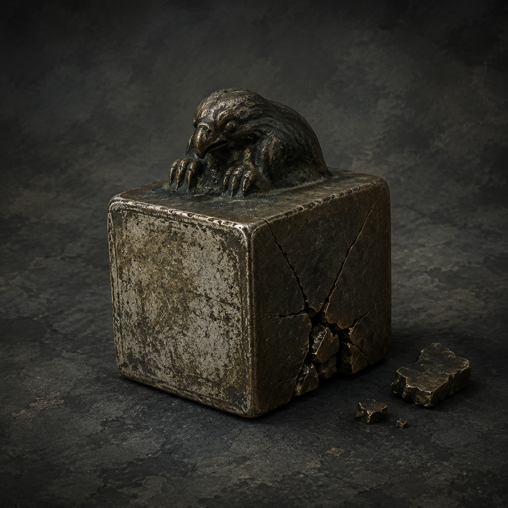

# 第42章 铜扣先追谁的旧印

韩百川三个字从折云翼的铜扣里响出来时，陆遥先看了一眼自己的手。

铜扣没有咬住他的指头，翼面也没有往井底塌。它只是沿着旧刻痕一明一灭，把黑井里的青光引到最外侧云索上。

“它在找韩百川。”沈雁回压着承力梁，额角的汗被热风吹成一线，“找到了又怎样？”

“找到了，就得让他自己来认账。”

陆遥蹲下，把折云翼的右侧风绳缠回腰扣。上章撕开的风帛不能再硬撑，残竹飞剑也只剩直冲的路；这只翼现在只能贴着侧风滑出去，借铰扣转向，不能凭空升高，更扛不住正面撞击。这个限制他记得，比自己的伤口还清楚。

井眼一眨，第一座索桥向下一沉。

四名收网人同时被索文拽得跪地。最瘦的那人咬牙道：“韩巡山使不在这里，黑井叫他的名字也没用。”

“没用你急什么？”陆遥伸手，“把你们押路用的东西拿来。”

短个子护住腰间铜袋：“没有。”

“那就把你自己挂上去。”

陆遥说完，直接把一截断掉的云索扔向他。短个子侧身去躲，腰间铜袋被索头一勾，啪地落在桥板上。袋口裂开，滚出一枚巴掌大的旧铜印，印钮像一只缩着爪子的铁鸟，印面磨得发白。

“追索铜印。”最瘦的人脸色变了。

陆遥捡起铜印，先把用途说给所有人听：“它用来标出当前替人担保的名字，印在承力物上，牵引就会顺着印面追到真正担保人。谁借名，谁认账；印错了，先裂的是印，不是被追的人。”

“你敢动官差的押路印？”

“我不动。”陆遥把铜印对准第二根承力梁，“我只是替它找主人。”

沈雁回看了他一眼：“你要把韩百川引到桥上？”

“引他认名，不是引他送死。若他真没押这笔路，铜印自己裂；若他押了，就让他先替门内解释，为什么收人牌的担保栏会借他的名。”

黑井又响了一声韩百川。

这一次，铜扣上的北向刻痕亮得刺眼。最外侧云索像一条烧红的手指，猛地朝陆遥腰间探来。陆遥没有后退，反而把追索铜印按在第二根承力梁上。

铜印落下，整座桥板都震了一下。

没有金光，也没有雷声。印面只吐出一缕细黑铜线，沿承力梁钻进索骨，再从索骨跳到收人牌的裂缝里。牌上残留的半个“陆”字被压得更深，已经写歪的“甲七舟”却一点点褪成空白。

“它没认韩百川。”沈雁回低声说。

“不。”陆遥盯着铜线，“它认的是韩百川留下的担保路径。人不在，路径还在。”

最瘦的收网人忽然割向铜线。

陆遥早等着这一刀。他侧身撞开对方，右胸伤口立刻涌出热血；残竹剑不能急转，他便没拔剑，只用剑鞘卡住那人的腕骨，顺势把人推到承力梁旁。

“动线之前先报去处。”陆遥咬着牙，“门里的规矩你们自己写的，别只会拿来收别人。”

那人撞上梁，追索铜印立刻发出一声脆响。铜印背面裂开一条细纹，黑线却没有断，反而分成四股，分别缠住四名收网人的脚踝。

井底青眼第三次眨动。

四人脚下同时浮出字迹：担保人未到，收路者先押。

短个子当场哭出声：“这不公平！”

“你们把人名借给门的时候，怎么没问公平？”陆遥擦去嘴角的血，“现在轮到自己填表，突然想起世上有这个词了？”

门内黑金指节顺着铜线探出半截，镇天碑又向门心滑了寸许。追索铜印的裂纹迅速爬过印钮，梁下的铁水却开始回流，像有一只看不见的手在拽着桥根。

“印要裂了。”沈雁回道。

“裂就让它裂在该裂的地方。”

陆遥重新扣紧折云翼。翼根铜扣先前认出了韩百川，正是这条旧债线的入口。他不能让铜线一路追到黑井底，也不能让镇天碑回到门心；唯一能做的，是借侧风把追索铜印连着第二根梁一起拖到西侧空索，让路径离开井眼的承重点。

“等我滑出去，松右肩一寸。”

“半寸。”

“你什么时候学会讨价了？”

“从你每次都说半寸，最后都要我赔一根梁开始。”

陆遥咧了咧嘴：“行，今天算你涨价。”

青眼第四次眨动。

他借侧风蹬离桥板，折云翼没有把他托高，只把身体贴着索桥外沿推出去。右侧破风帛被风一扯，伤口跟着发麻；他咬住残竹剑，把翼根铰扣勾住第二根承力梁，带着追索铜印一起向西拖。

“现在！”

沈雁回松右肩一寸。

第二根梁回弹，铜线骤然绷直。四名收网人被索文拽得向西扑倒，镇天碑则沿空索滑出半丈，黑井青光从它底部擦过，没能再扣住收人牌上的残字。

追索铜印终于碎开。

碎片里没有韩百川的名字，只有一枚极小的官印轮廓，印边缺了一角。那缕黑铜线顺着折云翼的铜扣一闪，钻回翼骨，像是认出了同一笔旧账。

门内金齿退开两指。黑井没有闭眼，却第一次没有再喊韩百川。

最瘦的收网人趴在桥板上，声音发抖：“你把印毁了，门会追谁？”

陆遥落回桥边，双膝一软，靠残竹剑撑住：“印毁了，账没毁。现在门知道韩百川只是担保人，不是收人牌上真正该被收的那个人。”

他低头看向碎铜片。缺角官印的轮廓正朝北，和折云翼铜扣、焦黑木鸢的方向一模一样。

井底忽然传来一声极轻的笑。

不是陆沉舟，也不是门内指节。

“韩百川认账，陆沉舟欠账。”

黑井青眼缓缓转向陆遥腰后的折云翼。

“那你呢，陆遥？你替谁押路？”

陆遥握紧碎掉的追索铜印，右胸的血一滴滴落在桥板上。

他看着那只眼睛，嘴角的笑意慢慢收干净。

“我不替谁。”他说，“我只走我自己押过的路。”

说完，折云翼的铜扣里，第三个名字响了起来。

“陆遥。”

---

## Metadata

- chapter_number: 42
- word_count: 2131
- generated_at: 2026-08-21 21:00 +08:00
- upload_status: not_uploaded
