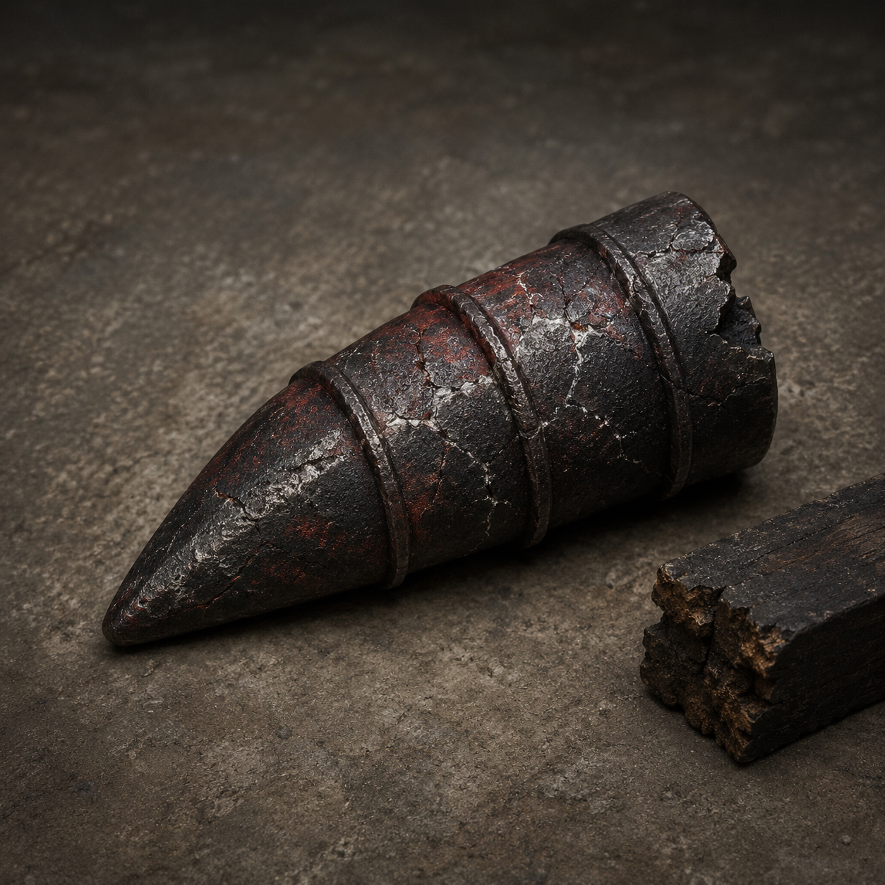

# 第44章 第三席先换谁的梁

第三席伸出来的那只手没有抓住韩照夜，先抓住了云路。

云路往下一塌，折云翼铜扣里的旧印立刻发烫。陆遥被拽得向前半步，右胸的血又从指缝里冒出来。韩照夜踩在残桥另一头，脚下白线一寸寸裂开，像有人从路底把她的名字往下拖。

第三席是门内按旧账收路的一个位置；谁被它认上，名字就会跟着承力的云路一起下沉。

“别接那只手！”陆遥喊。

“你以为我想接？”韩照夜横剑压住脚边，“它认的是韩家旧账，不是我。”

“那你家账房挺有眼光，隔着门都知道挑最漂亮的那个。”

韩照夜抬眼，一道剑鸣擦着他耳边过去。陆遥偏头躲开，身后的桥板却被剑风劈出长缝。她不是要杀他，剑尖每次落下，都在试哪一根云索与第三席相连。可黑井闭眼之后，失去青光约束的云索开始乱抓，内城金齿拖着镇天碑缓慢合拢，沈雁回和四名收网人全压在第二根承力梁上。

再合一寸，桥先断；桥一断，镇天碑就会把所有承力物拖进门缝。

“沈雁回，第二根梁还能撑多久？”

“若你继续问，能撑到你问完。”

“那我换个问法。谁愿意先死？”

四名收网人同时闭嘴。

陆遥看见他们脚下的索文还停在“去处不明，暂缓收押”。这条规则救了他们一息，却也把四个人钉成了桥上的配重。第三席伸出的黑手每往外探一寸，第二根梁就往下弯一寸；韩照夜若斩断主索，桥会塌，若不斩，第三席就会借梁认人。

他摸到腰间那截被韩照夜削下的暗金翼骨，骨面上的名字已经淡去，只剩一个缺角印轮。

“韩照夜，你刚才那一剑，能不能只斩一半？”

“剑不是你的账房。”

“那就让账房先借我一根笔。”

陆遥冲向残桥边的废料堆。那里压着一只扁平的黑铁匣，是坠台上用来固定旧风槽的工具箱。铁匣被火烤得滚烫，锁扣却没有封死。他用左肩不敢承重，只能用鞋尖挑开盖子，里面滚出三根短钉、半团灰绳和一块写着“换梁”的旧铁牌。

他拿起最粗的短钉，先对所有人说清楚：“这是回风换梁钉。它的用途是把一根快断的承力梁，临时接到旁边还能吃力的旧梁上；钉进去以后，压力会沿着钉身转过去，但只能撑三次回风，钉身也会热裂。”

“你说得像买菜。”沈雁回道。

“因为买菜不说用途，容易买错。”

第三席黑手忽然五指一收。第二根梁发出闷响，沈雁回右肩被压得向下一沉。陆遥不再废话，咬住残竹剑，用剑柄敲开承力梁外侧的焦木，把回风换梁钉斜斜打入裂口。

短钉没有发光，只传出三下闷震。第一下，第二根梁的弯势停住；第二下，桥下回流的铁水沿钉身拐向一旁的旧风梁；第三下，黑铁钉的尾端立刻裂出一道白纹。

“成了！”短个子收网人惊叫。

“成一半。”陆遥说，“它只替你们换了梁，没替你们还账。”

压力转开的一刹那，韩照夜出剑了。

她没有斩第三席的黑手，而是斩向回风换梁钉旁边那根废弃旧梁。陆遥看见剑路，脸色一变：“你斩错了！”

“我在逼它换手。”

剑锋落下，旧梁断成两截。原本被换开的铁水忽然失去回路，顺着断口喷向第三席。黑手吃到热流，五指缩回半寸，云路的塌陷也随之停住。

陆遥这才明白：韩照夜不是要保梁，她是要让第三席短暂失去“坐席”这一个承力点。可第三席退得太快，内城金齿反而咬住镇天碑，碑身向门里拖去。

“你救了人，门收了碑。”陆遥冲她喊。

“所以你还站着做什么？”

“等你家账本发善心？”

他把折云翼重新扣回腰背。只会贴侧风滑行、借铰扣转向的破翼右侧风帛已经撕开，不能升高，也扛不住正面撞击；这一次，他要借它沿着被斩断的旧梁侧风滑过去。回风换梁钉替第二根梁争来的三次回风，正好够他换三个落点。

“沈雁回，第一次回风，松右肩半寸！”

“你又要拿梁做跳板？”

“不是跳板，是临时户口。用完就注销。”

陆遥蹬出桥边。折云翼没有托他上升，只把他贴着侧风送向镇天碑。第一次回风拐来，第二根梁向外弹，他借力碰到碑角；第二次回风压下，镇天碑被推离金齿一尺；第三次回风袭来，回风换梁钉尾端啪地崩开，黑铁碎片擦过他的手背，带走一层皮。

陆遥却把残竹剑插进碑缝，借最后一点侧风把碑身横推向西。

“规矩是你定的，”他对门内说，“收路先看去处，没坐席就别伸手。”

镇天碑猛地卡回门外。

内城金齿咬了个空，第二根梁卸下大半压力，四名收网人滚成一团。沈雁回踉跄着站起，右肩明显肿高，却终于能把手从梁上挪开。

韩照夜落回残桥，剑尖指着第三席留下的黑缝。黑缝里没有人，只有一枚被烧红的旧木牌，牌面刻着两个位置：第三席，已有人；第四席，空。

“它把我从第三席挪到了第四席。”她说。

“恭喜，升迁全靠被拖。”陆遥擦掉手背上的血，“不过第四席空着，说明里面那位还没坐稳。”

黑缝深处传来一声轻笑。

“陆家的人，果然只会换梁，不会换命。”

陆遥看向那块旧木牌。木牌背后贴着一小片焦黑木鸢翅，翅根朝北，正与折云翼铜扣的旧印相合。

韩照夜忽然收剑：“你父亲曾坐过第四席？”

“不知道。”陆遥盯着黑缝，“但有人不想让我知道。”

远处云路再次下沉，这一次不是第三席，也不是第四席。四名收网人的索文同时变黑，末尾浮出一行刚刚写成的字：替补入席，先押陆遥。

短个子失声道：“规则改了！”

“规则没改。”陆遥拎起裂开的回风换梁钉，“是有人终于找到我的去处了。”

他看向韩照夜：“韩姑娘，站队吗？你家旧账要是先收我，我就把第四席的空位让给你。”

韩照夜的剑锋转向四名收网人。

“我先问他们，谁签的替补。”

黑缝里，第四席的位置缓缓亮起。那只看不见的手没有再伸向韩照夜，而是隔着一座镇天碑，朝陆遥的影子按了下来。

诸位读者老爷，这一席该算韩照夜家里谁的旧账：是她父亲韩百川，还是早就坐在里面的陆沉舟？两边都有证据，若要替陆遥起个“换梁不换命”的新外号，也请留一个比他自己更损的。

---

## Metadata

- chapter_number: 44
- word_count: 约2100
- generated_at: 2026-08-23 19:34 +08:00
- upload_status: not_uploaded
