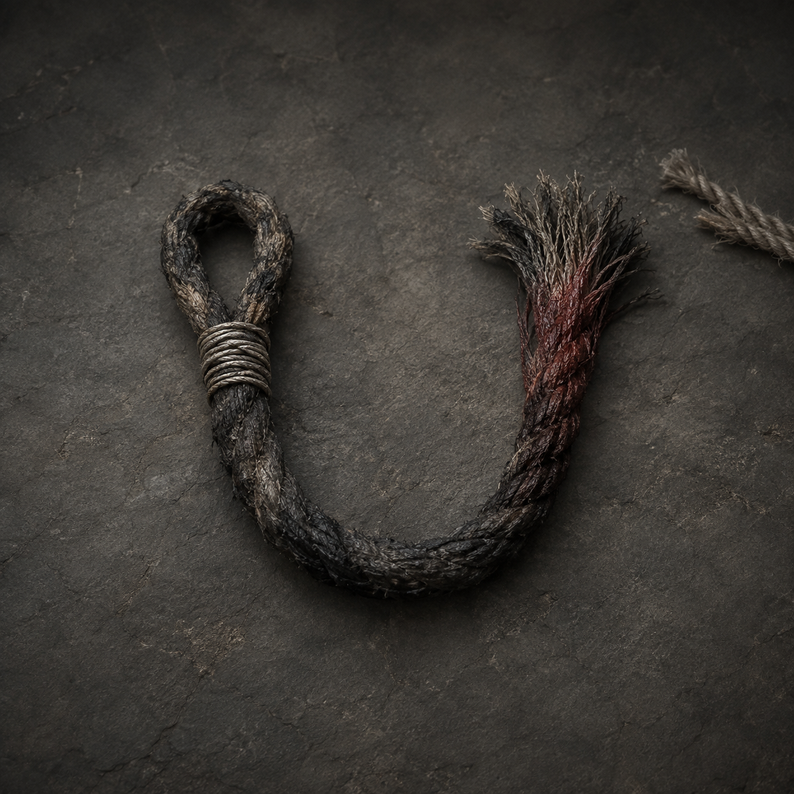

# 第45章 先押谁，谁就是替补

第四席是门内按旧账收路的替补位置。那只手按下来的时候，陆遥的影子先被压扁了。四名收网人的索文——写着姓名与去处的承力记录——同时变黑，最后那行“替补入席，先押陆遥”还在往下渗墨。镇天碑卡在门外，金齿重新咬住碑角；若影子被拖进门，桥上的人会一起算成收押。

“先押谁？”陆遥盯着那行字，“都往西挪，别让它挑离门最近的那个。”

四个人刚挪半步，最矮的收网人脚下忽然一沉。他的影子被拉长，整个人被扯得向门缝滑去。

沈雁回抬手去抓，右肩的力道又压回去：“它不是按人，是按去处！谁的去处最空，谁先被当成替补。”

陆遥看向四人的索文。三个人还有“暂缓收押”，最矮的那人却一片空白。

“你把去处撕了？”

“不撕桥就掉！我总不能填家门口吧，门口也在它账上！”

“填家门口不丢人，丢人的是替门里的人填。”陆遥拨开桥板碎木，“韩姑娘，第四席把你挪走，是因为你有去处，还是因为有人担保？”

韩照夜看着烧红木牌。第三席的字已熄灭，第四席的金线沿焦黑木鸢翅纹，经过折云翼铜扣，落到陆遥影子上。

“它把我的位置让给了你。”她说，“不是替补，是换账。”

陆遥没有硬拔木牌，而是先看它落下的位置：牌角压着桥板缝，金线每亮一次，镇天碑就往门内滑半寸；韩照夜一动，那只只能贴侧风、不能升高硬撞的折云翼铜扣便牵出一缕金线。木牌不是席位本身，它在借两个人的去处互相抵押。

他摸到腰间那截上章只撑过三次回风、如今已经裂开的回风换梁钉。它不能再撑桥，却还能把一处快断的受力点临时挪走。

“这根钉子已经热裂，不能再撑桥。”陆遥先把用途说给众人听，“但它还能把木牌压住的那一小块桥板，临时接到旁边的旧梁上。钉进去以后，牌的压力会先落到旧梁，不会直接落在人的去处上。”

沈雁回皱眉：“旧梁也断了。”

“断的是梁，不是规矩。”

他用残竹剑挑起木牌，不碰金线。牌身离缝一寸，最矮的收网人停止下滑；牌身落回去，他又向门缝滑去。陆遥试了两次，确认金线只认承力点。

“判断出来了？”韩照夜问。

“第四席不收人，只收能替它承力的名字。谁的去处空，它就把谁写进席里。”

“那你还碰它？”

“因为我的去处不空。”

陆遥从怀里摸出正式仙籍木牌，把血浸发暗的“栖霞村”三字压到木牌旁，隔着半寸对齐。

金线忽然停了。

门内的声音变了调：“凡人仙籍，不得替席。”

“既然我不能替席，就不能先押我。”

“仙籍只认去处，不认人。”

“那更好。”陆遥转头对最矮的收网人说，“把你的去处填上。”

矮个子愣住：“填哪里？”

“填你现在站的地方。”

“这里是桥！”

“桥也是去处。你刚才救桥时站在这里，就把这里认成暂住处。它要收你，先得承认自己把桥当地方。”

矮个子咬牙，从腰间摸出一截暂留索绳，绳身已烧剩大半。它的用途很直白：把一个人的暂住处写进承力索文，先让桥认这个人站在哪里，再防止门内把他当成无处可去的替补。索绳蘸着手背上的血，在空白索文末尾写下：第一座索桥，西侧三丈，暂留。

字迹刚成，黑色索文猛地一缩，影子的拉力消失；第四席的金线却扑向索绳，要烧掉“暂留”两个字。

“现在！”陆遥喝道。

沈雁回松开右肩，四名收网人把西侧云索往外扯。陆遥将裂钉斜打进木牌压住的桥缝，把压力转到旧梁；韩照夜同时出剑，斩向木牌背后的焦黑木鸢翅纹。

翅纹断开，金线失去北向牵引，第四席的光猛地回缩。镇天碑被门齿吐出半尺，桥面向西横滑，四名收网人险些被甩下去。

陆遥抓住旧绳，右胸顿时一热，血从衣襟淌出。他把残竹剑插入桥板：“沈雁回，喊他们别往回跑！桥在认新去处，谁退，谁就又成空名！”

“都听见了？”沈雁回厉声道，“往西站！谁敢退一步，自己把名字送进门！”

四人硬生生稳住脚。最矮的收网人把染血索绳缠在腕上，桥面终于停住。

木牌上的第四席暗下去，第三席却没有重新亮起。两行新字从牌面浮出来：替补去处已定；陆遥，待核。

韩照夜收剑，盯着那两个字：“它暂时不能押你。”

“暂时也是赢。”陆遥拔出裂钉。钉尾最后一圈承压环掉在地上，黑铁彻底碎成两截。

门内那道声音低低笑起来：“陆家的人，你以仙籍占桥，算不算私改去处？”

陆遥把碎钉踢到门缝前：“先结保管费。桥是我们撑的，名字是我们填的，席位空着也别收租。”

有人没忍住笑了一声。笑声刚起，镇天碑背面浮出一枚比官印更旧的缺角轮廓，照向那截染血索绳。

索绳上“第一座索桥，西侧三丈，暂留”逐字变红。

沈雁回脸色一变：“它认了这个去处。”

“认了就好。”陆遥看着门内，“现在轮到它说，谁有资格把桥上的人带走。”

缺角轮廓里传出第三个声音，苍老，隔着铁管，又像从木头深处刮出来：

“陆沉舟的替补，不能留在桥上。”

韩照夜的剑锋横过来：“你父亲也坐过第四席？”

缺角轮廓边缘慢慢写出小字：第四席旧账，签名人——陆沉舟；替补核验人——韩百川。

门齿开始重新合拢。这一次，先被夹住的不是镇天碑，而是那截已经被承认的染血索绳。

陆遥握紧残竹剑：“韩姑娘，站我这边，还是站你爹的签名旁边？”

韩照夜看了眼自己的第四席旧印，剑尖转向门缝。

“先把我父亲的签名砍出来。”

门内的铁水顺着索绳倒流，朝两人的脚下同时亮起。

诸位读者老爷，这笔替补旧账该先算韩百川的签名，还是陆沉舟留下的席位？若要给“拿桥当暂住处”的陆遥起个外号，诸位觉得叫“桥上房东”还是“仙籍占道”更损？

---

## Metadata

- chapter_number: 45
- word_count: 约2100
- generated_at: 2026-08-23 19:34 +08:00
- upload_status: submitted_pending_review