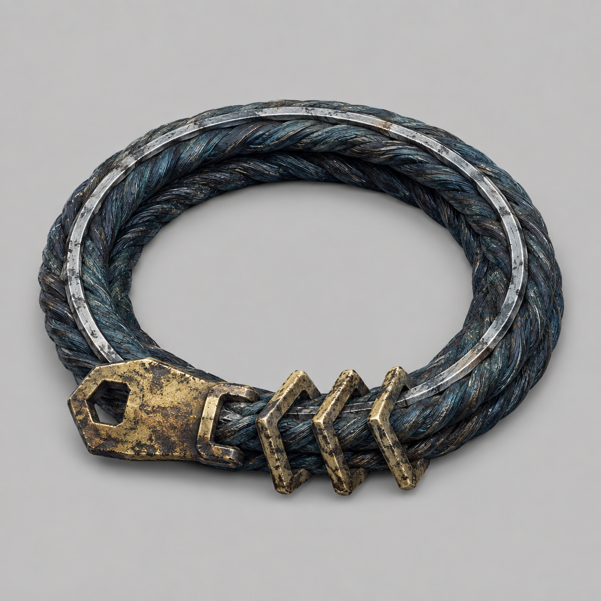

# 第48章 缚风索先锁谁

缚风索第三次收紧时，陆遥听见了自己的骨头响。

缚风索的用途很直白：锁定飞行轨迹，把人下一步能走的方向写死；它怕火，但眼下没有火。

不是错觉。那道从峡谷上方落下来的黑线，先擦过他的肩，再绕着折云翼的铜扣一绞，整片右侧风帛立刻被拽成了半张破旗。风眼刚替他撑住一息，便被这根索子拖得偏了半寸。

门内的苍老声音还在重复：“风眼暂留，须有人领路。”

“领路就领路，怎么还附赠一条勒脖子绳？”陆遥咬住血腥味，朝东侧空索看去。

空索尽头，三面灰青色小旗同时翻开。旗后不是收网人，而是六个穿轻甲的人。他们站成两列，脚下各踩一块薄薄的反光鳞甲。那东西的用途很直白：把正面打来的剑气偏开一次，偏开后鳞片就会碎掉一片。六人脚边已经铺了十几片碎鳞，显然不是来讲道理的。

最前面的短发男人抬手：“试令候选陆遥，交出镇天碑，随我们去甲七舟验名。”

陆遥看了一眼门缝外卡住的副碑，又看了一眼身后被铁水逼窄的桥面：“你们验名的地方，能不能先报销医药费？”

没人笑。第二根缚风索从云层里甩下来，索头没有去捆他，反而钉住了折云翼左侧的铜扣。两条索子一前一后，竟把他在空中的路线夹成了一条直线。

沈雁回抬起还能动的右肩：“它锁的不是人，是飞行轨迹。”

“看出来了。”陆遥低头看着索身。两条浅银色的导风槽顺着黑铁短索往前延伸，每逢风眼转向，槽里的细灰便往同一处沉。索子不是凭空追他，而是在把他下一步能走的方向写死。

他现在最急的不是冲出包围，而是不能让缚风索把折云翼拖进金线。右臂不得发力，左臂不能负重，右胸的伤口刚被热气烫裂；硬拽索子，只会让风帛先断。

韩照夜忽然横剑：“陆遥，别动。”

一道金线从第四席旧印里弹出，贴着她的剑鞘擦过。她若斩断，镇天碑就会被门齿拖进去；她若不斩，缚风索便会把陆遥送到六人面前。

“你们试令司讲不讲先来后到？”陆遥冲那短发男人喊，“门里先喊我领路，你们后喊我验名。按规矩，后来的得排队。”

短发男人冷笑：“你以为拖一句话，就能等到风眼散掉？”

“我是在提醒你。”陆遥指了指他脚下，“你们的鳞甲只防剑气，不防脚下。”

男人低头的一瞬，陆遥把半截暂留索绳甩向东侧空索。那条旧索绳的用途他们已经见过：把一个人的暂住处写进承力索文，防止门内把人当成无处可去的替补。它不能替人挡剑，却能让桥先认位置。

索绳落地，陆遥用残竹剑挑住绳尾，借着缚风索的拉力在桥板上写下：“东侧空索，临时领路。”

字刚成，东侧空索猛地一沉。

六人的反光鳞甲同时亮了一下，第一道剑气从韩照夜剑鞘边缘擦出，顺着索文横切过去。最前面的男人立刻抬脚，脚底鳞甲把剑气偏向云外，可那块鳞片也随之裂成两半。

“他把领路写到我们脚下了！”有人惊叫。

“不是你们说要验名吗？”陆遥喘着气，“先验谁站得住。”

第二道剑气紧随而来。六人催动鳞甲，六片反光鳞片接连翻起，剑气被偏向两侧，擦着缚风索飞过。索身上的银槽被剑气刮出火星，锁环却没有松，反而把六人的站位一一牵成直线。

沈雁回突然明白：“你要让他们自己把索子拉直。”

“对。绳子怕火，我没有火；但他们有鳞片。”

陆遥咬牙把残竹剑往桥缝里一压。短发男人以为他要借力冲刺，立即收紧缚风索。六人的鳞甲被索子牵着向前，东侧空索承受的重量骤增，桥下风眼也被压出一声闷响。

陆遥等的就是这一下。

他没有冲向六人，而是松开剑柄，任由缚风索把自己横着拖过桥栏。折云翼不能升高，也不能正面硬撞，他便把破损的右侧风帛贴上风墙，借铜扣猛转方向。风只给了他半个身位，他却把那半个身位让给了镇天碑。

镇天碑沿着索桥边缘向东滑去，碑角撞上第一枚锁环。

咔的一声，锁环被撞歪，缚风索的第一段牵引松开。六人脚下的鳞甲失去共同受力点，第二块、第三块鳞片接连崩碎。短发男人急忙去抓索头，脚下那句“临时领路”却先一步亮起，把他的去处认在了东侧空索。

门内金线立刻转向。

“领路人已定。”苍老声音说。

六人脸色全变。门齿没有咬陆遥，反而沿着东侧空索压下去。短发男人脚下的鳞甲只剩一片，他若后退，自己就会成为被门内认定的领路人；他若前进，缚风索便会把其余五人一并拖进来。

“你不是要验名吗？”陆遥扶着桥栏，笑得肩膀发抖，“先报你的名字。放心，我替你写得很清楚。”

短发男人拔刀劈向索文。

韩照夜比他更快。她没有斩缚风索，而是一剑削断了男人手边那块反光鳞甲。鳞片碎裂，刀气偏斜，正好切进缚风索的浅银导风槽。

索子怕火，却也怕被导风槽反向灌风。两股风在槽内相撞，黑铁索身骤然鼓起，三枚锁环一齐弹开。第一根索子脱离折云翼，第二根索子却缠住了短发男人的脚腕。

“韩照夜！”陆遥喊，“你这一剑算谁的账？”

“先算你的。”她收剑，“你要是被拖走，谁来砍甲七舟的门？”

“行，记我账上。”

陆遥抓住脱落的索头，没去救短发男人，而是把它钉进镇天碑裂纹旁的旧铜抱箍。缚风索的锁定作用立刻转了方向，整条索子从“追人”变成“牵碑”。镇天碑被拉得向东一沉，内城门金齿终于停止收拢。

六人趁机退开，三块反光鳞甲彻底碎掉，剩下的鳞片也布满裂纹。短发男人被同伴拖回去，临走前死死盯着陆遥：“下一次，试令不会只来六个人。”

“那你们记得带火。”陆遥把索头丢回桥板，“这条绳子怕火，基础用法我已经替你们试完了。”

话音落下，二号剑炉的余热沿桥底猛地一窜。缚风索表面的灰白纤维先红了一线，锁环里传出细碎的裂响。

陆遥的笑意收住了。

门内的苍老声音也第一次停顿：“缚风索，不是试令司的东西。”

折云翼的残翼外，云层深处又垂下来一根一模一样的黑线。它没有锁陆遥，也没有锁镇天碑，而是对准了东侧空索尽头那盏孤灯。

孤灯下，半只木鸢翅骨轻轻一转，传出陆沉舟的声音：

“第三行，先填领路人。”

---

## Metadata

- chapter_number: 48
- word_count: 2346
- generated_at: 2026-08-25 14:30 +08:00
- upload_status: submitted_pending_review