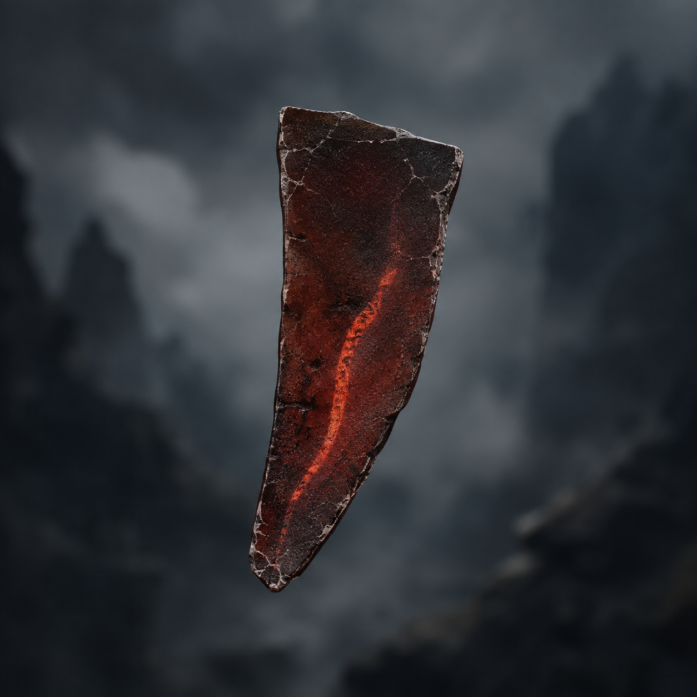

# 第49章 引风火片先烧谁的账

缚风索第二次鼓起时，短发男人已经把刀抵到陆遥喉前。

刀锋没有碰到皮肉，索身先把它横着拖开。陆遥偏头避过，耳边仍被削下一缕头发。东侧空索尽头，那盏孤灯还在晃，半只木鸢翅骨发出的声音像隔着炉膛传来。

“第三行，先填领路人。”

上章刚退开的六名试令候选重新压上来。缚风索锁住折云翼的残翼，门内金线锁住东侧空索，镇天碑则被黑索牵在桥边。三股力一齐收紧，桥板发出连续的碎响。沈雁回和四名收网人脚下的索文已经烧黑，再退一步，他们的去处就会被门内抹掉；不退，陆遥便会被拖到短发男人的刀下。

“你们试令司办事挺讲究。”陆遥捂着右胸，血从指缝里往下滴，“六个人围一个伤员，还要借门里的绳子凑数。差一张桌子，我就以为你们在摆宴。”

短发男人没有被激怒，只抬手一扯。缚风索的三枚锁环同时转向，陆遥下一步能走的方向被压成一条直线，直通他脚下。

沈雁回忽然喝道：“别走那条线！索子不是只锁你，它在把镇天碑和你写成同一个去处！”

陆遥低头看见了证据。黑索浅银色的导风槽里，灰屑没有往他身上沉，而是每隔一息分成两股，一股贴着折云翼，一股贴着碑角；两股灰屑最后都指向东侧空索。导风槽就是索身上引导风力和牵引方向的浅槽，灰屑沉到哪里，索子就把谁的去处往哪里并。门里认的不是谁被捆，而是谁和谁一起承受这条路。

“它想让我领路，拿碑替我压席。”陆遥咧了咧嘴，“可我不想给这座门当搬运工。”

韩照夜横剑逼退一人：“那你想做什么？”

陆遥没有回答，反而冲着桥下喊：“小炉还有没有余火？”

沈雁回看向二号剑炉。炉腹只剩一线暗红，热流沿桥底钻过，刚才烧裂的木板被烘得发白。

“余火有，够烧断半根索子！”

“半根不够。”陆遥伸手，“给我引风火片。”

沈雁回一怔：“那是从炉里取余火的薄片。引风火片的用途，就是把炉中余火引进风道，点着怕火的绳索；拿手碰会烫穿皮。”

她说完便咬牙把一片暗红薄片从炉门缝里夹出来。薄片边缘裂着灰白细纹，中间却有一线橙红，像被封在陶片里的小蛇。

“用途说得很清楚。”陆遥接过薄片，指尖立刻冒出焦烟，“可惜说明书忘了写，拿它的人会不会疼。”

“你可以放下。”

“那不行，疼是我现在最便宜的东西。”

短发男人踏前一步，六块反光鳞甲同时亮起：“收刀，交碑。你若把火引进索身，整座索桥都会塌。”

“你亲口说了两件事。”陆遥抬眼，“第一，缚风索怕火；第二，桥会塌。那我就不烧桥，烧你们的去处。”

他没有把引风火片贴向黑索，而是用残竹剑挑住折云翼的铜扣，把薄片塞进缚风索下方那条浅银导风槽。折云翼只能贴侧风滑行、借铰扣转向，不能升高，也不能正面硬撞；陆遥不敢让它承火，只借它破损右翼刮来的侧风，把薄片上的余火送进槽口。

火线没有立刻烧断绳子。它先沿导风槽倒着爬，像一条细蛇钻进六名候选人脚下的反光鳞甲。

“他把火送进风槽了！”有人失声。

“怕什么？”短发男人强行收紧索子，“反光鳞甲能偏剑气！”

“我又没说那是剑气。”陆遥抬脚踩住桥板上刚写成的“东侧空索，临时领路”。“这是炉火。你们的甲片能偏开一次剑气，却不能把自己的热量偏给别人。”

第一块鳞甲先红，随后裂成两半。火线顺着索身往回烧，三枚锁环像被烙铁烫过，猛地弹开一枚。黑索对折云翼的牵引松了一寸，陆遥立刻借侧风横移，不升高，也不迎撞，只把镇天碑从短发男人脚下拖开半尺。

门内金线追着碑角落下。

短发男人脸色变了。他脚下那句“临时领路”忽然亮起，门里苍老的声音同时响起：“领路人已定。”

“你们不是要验名吗？”陆遥借着桥栏站稳，“先报名字。别怕，我这人记性好，尤其擅长替别人把账写全。”

男人挥刀砍向索文。韩照夜却先一步出剑，剑光不斩他，只削碎他脚边最后一片反光鳞甲。鳞甲碎屑飞散，火线顺势钻入他靴边，缚风索骤然反缠，五名同伴被一起拽得跪倒。

“韩照夜！”男人怒喝。

“你若斩索，门会认陆遥。”她收剑，“我只替门挑个站得住的。”

陆遥趁这一息把引风火片往前一推。余火烧过第二枚锁环，黑索从中段爆开，五名候选人滚向西侧，短发男人则被临时领路的索文钉在东侧空索边。镇天碑失去牵引，轰然向桥外滑去，门齿追出半尺后停住。

沈雁回抓住四名收网人的衣领：“别松脚下的索文！去处还没稳！”

她话音刚落，二号剑炉的余火便彻底暗下。引风火片在陆遥指间裂成三片，最后一线火星沿着黑索钻入云下，烧出一股刺鼻焦味。

陆遥把焦黑的碎片丢在桥板上，右胸疼得眼前发白，嘴上却没停：“看见没有？火只烧绳，不烧桥。至于桥为什么没塌，那是因为我聪明；至于下次还能不能聪明，得看炉子肯不肯加班。”

短发男人被索文压住，仍死死盯着他：“你以为赢了？领路人已经写进第三行，门内会沿着你的名字追到甲七舟。”

“那正好。”陆遥看向孤灯下的半只木鸢，“有人替我填了船票，我总得上船看看是谁收钱。”

木鸢翅骨忽然转向，陆沉舟的声音没有再出现，灯下却落下一枚焦黑木片。木片上只有半行字：第三行领路人——

后半行被火烧没了，剩下的墨迹却在陆遥左眼前一闪，补出一个与他完全不同的名字。

陆遥的笑僵在脸上。

沈雁回低声问：“看见谁了？”

陆遥没有答。他看见那半行字的末端，赫然写着：沈雁回。

桥下风声骤停，门内金齿缓缓向东侧空索合拢。韩照夜抬剑挡在沈雁回身前，陆遥却先抓起残竹剑。

“这次不砍字。”他说，声音短得像刀口，“先把领路人抢回来。”

---

## Metadata

- chapter_number: 49
- word_count: 约2200
- generated_at: 2026-08-25 15:10 +08:00
- upload_status: not_uploaded
